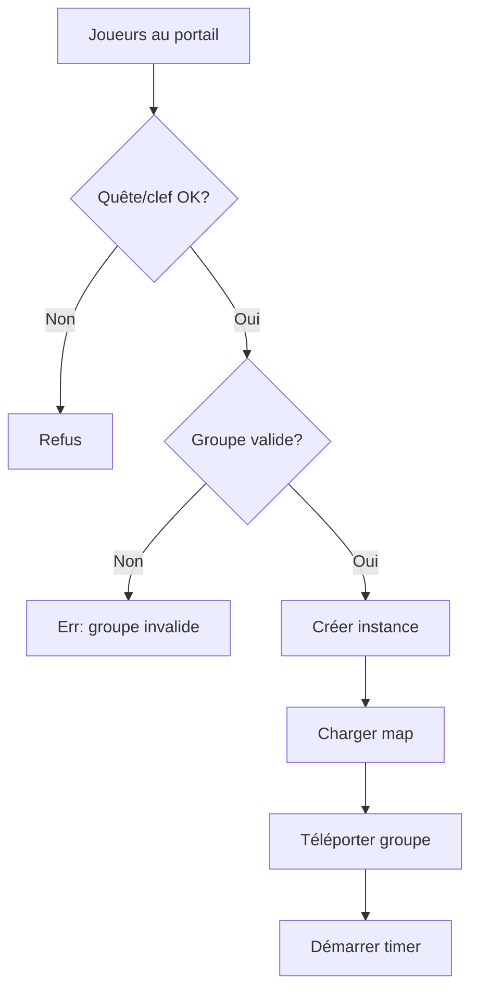
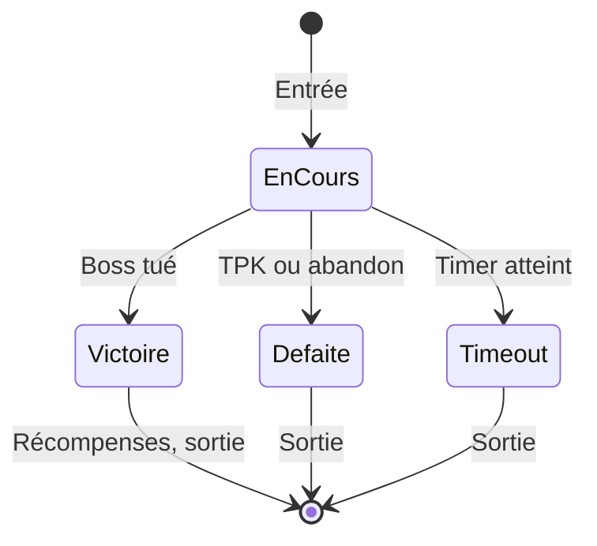
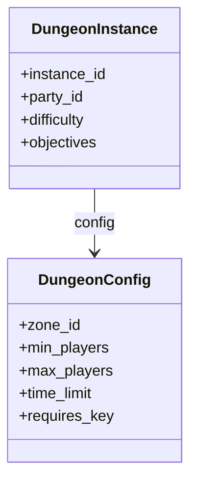

# Instances donjons

**Catégorie :** 4. Entités et monde  
**Description :** Zones isolées par groupe ; entrée/sortie ; difficultés ; clefs.

---

## En-tête et contexte

### Rôle dans le moteur

Les instances de donjon offrent une expérience PvE isolée : un groupe de joueurs entre dans une copie privée du donjon, affronte des ennemis et des boss, récupère du loot, et en sort (victoire, défaite ou abandon). Ce point spécifie l’entrée/sortie, les niveaux de difficulté, les clefs d’accès, et la durée des instances.

### Liens vers la référence commune

- `InstanceId`, `ZoneId` — voir [MGE - Référence Commune](../MGE%20-%20Reference%20Commune.md)
- [monde-persistant-instancie](monde-persistant-instancie.md) pour le modèle général

### Terminologie

| Terme | Définition |
|-------|------------|
| **Donjon** | Zone instanciée PvE avec objectifs (boss, objectifs) |
| **Clef** | Objet ou condition requise pour entrer |
| **Difficulté** | Normal, Hard, Nightmare — scaling des stats et du loot |
| **Portail** | Point d’entrée physique dans le monde |

---

## Spécifications techniques

### Contraintes

1. **Groupe** : 1–4 ou 1–8 joueurs selon le donjon
2. **Durée** : Timer configurable (ex. 30 min) ; à la fin, téléportation sortie
3. **Une instance par groupe** : Chaque groupe qui entre crée sa propre instance
4. **Clefs** : Optionnel ; certains donjons exigent un objet ou une quête

### Paramètres

| Paramètre | Valeur typique | Description |
|-----------|----------------|--------------|
| Taille groupe min/max | 1 / 4 ou 8 | Joueurs requis et max |
| Durée max | 30–60 min | Timeout |
| Difficultés | Normal, Hard, Nightmare | Scaling |
| Respawn mobs | 5–15 min | À l’intérieur de l’instance |
| Cooldown | 1 jour (temps jeu) | Ré-entrée limitée |

### Formules de scaling (difficulté)

- **PV des mobs** : `pv_normal * (1 + 0.5 * (difficulté - 1))`
- **Dégâts des mobs** : `dmg_normal * (1 + 0.3 * (difficulté - 1))`
- **Loot** : Multiplicateur de rareté par difficulté

### Références croisées

- **monde-persistant-instancie** : Modèle d’instance
- **raids** : Version grand groupe
- **respawn-dynamique** : Tables de spawn dans l’instance
- **spawn** : Création des mobs à l’entrée

---

## Modèle de données et API

### Structures Rust (pseudo-code)

```rust
#[derive(Clone, Copy, PartialEq, Eq)]
pub enum DungeonDifficulty {
    Normal,
    Hard,
    Nightmare,
}

pub struct DungeonConfig {
    pub zone_id: ZoneId,
    pub min_players: u8,
    pub max_players: u8,
    pub time_limit_sec: u32,
    pub requires_key: bool,
    pub key_item_id: Option<ItemId>,
    pub cooldown_sec: u32,
}

pub struct DungeonInstance {
    pub instance_id: InstanceId,
    pub config: DungeonConfig,
    pub difficulty: DungeonDifficulty,
    pub party_id: PartyId,
    pub entered_at: f64,
    pub objectives: Vec<DungeonObjective>,
}
```

### API

```rust
pub fn enter_dungeon(
    party_id: PartyId,
    dungeon_id: DungeonId,
    difficulty: DungeonDifficulty,
) -> Result<InstanceId, EnterDungeonError>;

pub fn leave_dungeon(instance_id: InstanceId) -> Result<(), LeaveError>;

pub fn check_key(player_id: PlayerId, dungeon_id: DungeonId) -> bool;

pub fn consume_key(player_id: PlayerId, dungeon_id: DungeonId) -> Result<(), NoKeyError>;
```

---

## Diagrammes

### Flux d’entrée



### États de l’instance



### Structure donjon



---

## Exemples et cas d’usage

### Cas 1 : Donjon « Mines de Fer »

Portail dans le monde persistant. Groupe de 2–4. Pas de clef. Difficulté sélectionnée au portail. Timer 45 min. Boss final : Géant de Fer.

### Cas 2 : Donjon « Sanctuaire interdit »

Nécessite la quête « Clé du Sanctuaire » et l’objet « Clé ancienne » (consommé à l’entrée). 1–8 joueurs. Difficulté Hard débloque du loot exclusif.

### Cas 3 : Donjon quotidien

Cooldown 24 h temps jeu. Une seule récompense bonus par jour ; ré-entrée possible mais sans bonus.

---

## Cas limites et tests

### Edge cases

| Cas | Comportement attendu | Validation |
|-----|----------------------|------------|
| Déco d’un joueur | Retour spawn monde ou attente 5 min | Configurable |
| Groupe dissous en instance | Instance continue ; joueurs restants peuvent finir | Ou fermeture |
| Timeout en combat boss | Téléport sortie malgré combat | Ou pause (design choice) |
| Clef manquante | Refus avec message | Pas de bypass |

### Critères de validation

1. **Isolation** : Aucune interférence entre instances
2. **Timer** : Fin à l’heure
3. **Objectifs** : Progression correcte (boss, coffres)

### Tests suggérés

```rust
#[test]
fn enter_without_key_fails() { /* ... */ }

#[test]
fn timeout_teleports_out() { /* ... */ }

#[test]
fn multiple_groups_separate_instances() { /* ... */ }
```

---

## Détails d'implémentation

### Chargement de la map

À l'entrée, le système charge la zone du donjon (tiles, collisions, points d'intérêt). Les entités statiques (décors) sont instanciées. Les mobs sont spawnés selon les tables de respawn. Le joueur (ou le groupe) est téléporté au point d'entrée.

### Gestion du timer

Un timer global pour l'instance. À l'expiration : annonce « Temps écoulé », téléportation de tous les joueurs à la sortie, destruction de l'instance. Optionnel : extension du temps si un boss est en cours (éviter frustration).

### Sauvegarde en cours de donjon

En général, les donjons ne sont pas sauvegardés en cours (état éphémère). Si le serveur redémarre, l'instance est perdue. Alternative : sauvegarder le checkpoint actuel pour permettre une reprise après crash.

---

## Mécaniques de clef

### Types de clefs

| Type | Description | Consommation |
|------|-------------|--------------|
| Objet | Item dans l'inventaire | Consommé à l'entrée |
| Quête | Quête complétée | Non consommé |
| Monnaie | Or ou monnaie spéciale | Déduit à l'entrée |
| Réputation | Rang faction suffisant | Non consommé |

### Vérification

Avant `enter_dungeon`, le système vérifie que le groupe (ou au moins le leader) possède la clef. Si objet consommable, il est retiré de l'inventaire au moment de l'entrée.

---

## Progression et objectifs

### Objectifs de donjon

- Tuer le boss final
- Récupérer un objet
- Survivre X minutes
- Protéger un PNJ

Le système d'objectifs peut déclencher des événements (ouverture de porte, spawn de boss) et déterminer la victoire.

### Récompenses

- XP et or
- Loot du boss (table dédiée)
- Objets de quête
- Progression (déblocage du mode suivant)

---

## Annexes

### Annexe A : Structure de données donjon

Un donjon est une Zone avec un type « Dungeon ». La config inclut : map_id, min/max players, time_limit, key_requirements, difficulty_levels, objectives, loot_tables. Chargée au démarrage ou à la demande.

### Annexe B : Donjon et respawn interne

Les mobs à l'intérieur du donjon respawn après un délai (ex. 5 min). Les tables de spawn sont spécifiques à la zone. À la destruction de l'instance, tous les timers de respawn sont annulés.

### Annexe C : Donjons à choix multiples

Certains donjons ont des embranchements (plusieurs chemins, plusieurs bosses). La progression peut être linéaire ou à choix. Les objectifs et la victoire s'adaptent (ex. tuer au moins 2 des 3 boss).

---

## Guide d'implémentation

1. Définir DungeonConfig (zone, players, time, key, difficulties). 2. enter_dungeon : vérifier la clef, le groupe, créer l'instance (ou rejoindre une existante si matchmaking). 3. Charger la map du donjon, spawn les mobs initiaux, démarrer le timer. 4. Pendant le donjon : gérer les objectifs, le respawn des mobs, les transitions (portes, boss). 5. À la victoire ou timeout : donner les récompenses, appliquer le cooldown, détruire l'instance, téléporter la sortie.

---

## FAQ et décisions de design

**Q : Clef consommable ou réutilisable ?**  
R : Souvent consommable (objet retiré à l'entrée) pour les donjons difficiles. Réutilisable pour les donjons de farm (clef = quête complétée).

**Q : Timer visible pour les joueurs ?**  
R : Oui, une UI affiche le temps restant. À 5 min, avertissement. À 0, téléportation automatique.

**Q : Récompenses à la victoire ou par boss ?**  
R : Les deux. Loot par boss (drop immédiat) + récompenses de fin (chest, XP bonus) à la victoire globale.

**Q : Donjon échec = rien ?**  
R : Souvent oui (pas de loot si échec). Certains donjons offrent une récompense partielle (objets ramassés avant la mort sont conservés).

**Q : Matchmaking pour les donjons ?**  
R : Optionnel. Les joueurs peuvent former un groupe manuellement ou utiliser une file d'attente (sélection de donjon, rôle). Le système crée l'instance quand le groupe est complet.

**Q : Difficulté choisie à l'entrée ou dans le donjon ?**  
R : À l'entrée (au portail). Une fois dedans, la difficulté est fixée.

**Q : Respawn des mobs pendant le donjon ?**  
R : Oui, après un délai (5–15 min). Permet le farm. À la destruction de l'instance, tous les timers sont annulés.

**Q : Donjon linéaire ou exploration ?**  
R : Les deux existent. Linéaire : un chemin principal. Exploration : plusieurs salles, chemins multiples, objectifs optionnels.

---

## Spécifications étendues

### DungeonDifficulty effets

| Difficulté | PV mobs | Dmg mobs | Loot |
|------------|---------|----------|------|
| Normal | 1.0 | 1.0 | 1.0 |
| Hard | 1.5 | 1.3 | 1.2 |
| Nightmare | 2.0 | 1.6 | 1.5 |

### Objectifs types

- KillBoss(boss_id)
- CollectItem(item_id, count)
- Survive(seconds)
- ProtectNpc(npc_id)

---

## Notes techniques complémentaires

### Donjon et matchmaking

Un système de file d'attente peut regrouper les joueurs par donjon souhaité et rôle. Quand un groupe est complet (2 tanks, 2 heals, 4 DPS par ex.), création automatique de l'instance.

### Donjon et progression

Certains donjons exigent un niveau minimum ou une quête préalable. Vérifier à l'entrée. Stocker la progression (donjons complétés) dans KindMother pour débloquer les difficultés suivantes.

### Donjon et scaling

Le niveau des mobs peut scale avec le niveau moyen du groupe. Formule : `mob_level = clamp(avg_party_level, zone_min_level, zone_max_level)`.

---

## Résumé et checklist

| Étape | Action |
|-------|--------|
| 1 | Définir DungeonConfig et difficultés |
| 2 | Vérifier clef/quête à l'entrée |
| 3 | Créer instance, charger map, spawn mobs |
| 4 | Démarrer timer, gérer objectifs |
| 5 | À victoire : récompenses, cooldown |
| 6 | À timeout/échec : sortie, destroy |
| 7 | Tester isolation (plusieurs groupes) |

---

## Références

| Document | Rôle |
|----------|------|
| [MGE - Référence Commune](../MGE%20-%20Reference%20Commune.md) | Types de base |
| [monde-persistant-instancie](monde-persistant-instancie.md) | Modèle instance |
| [raids](raids.md) | Raids |
| [respawn-dynamique](respawn-dynamique.md) | Spawn mobs |
| [_index 04](_index.md) | Index catégorie |
| [Index MGE](../_index.md) | Index global |
