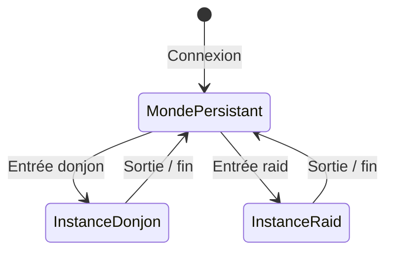
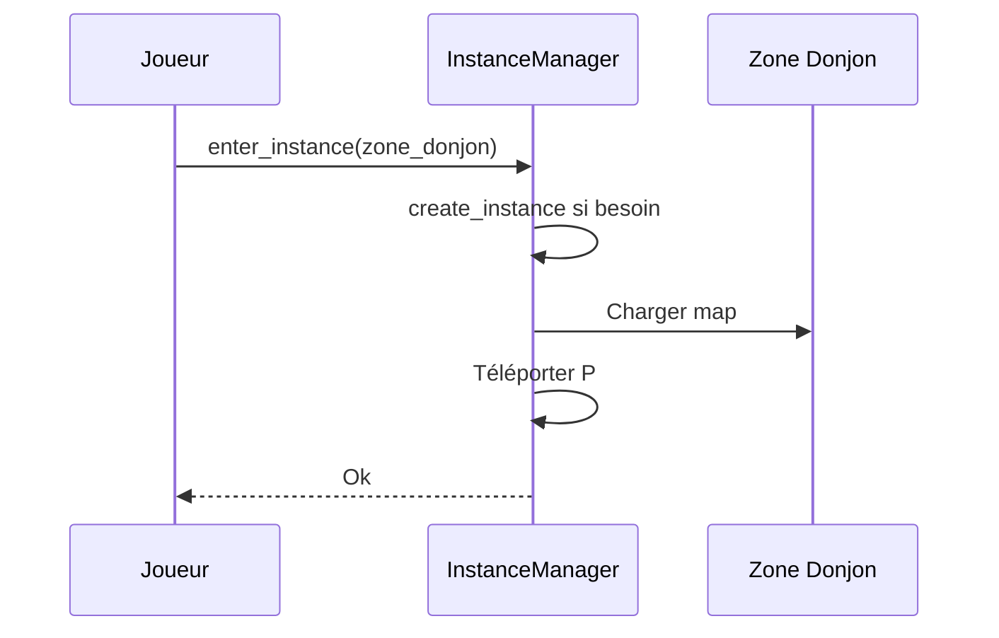
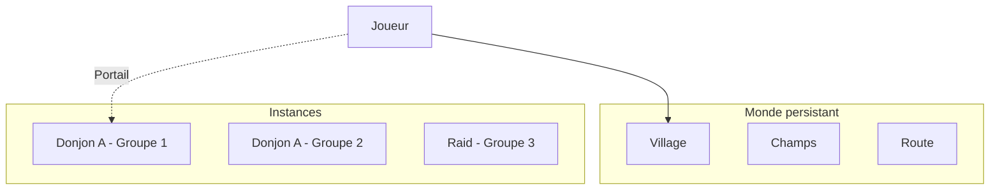

# Monde persistant vs instancié

**Catégorie :** 4. Entités et monde  
**Description :** Zones partagées vs privées par instance.

---

## En-tête et contexte

### Rôle dans le moteur

Le MGE distingue deux types d'espaces de jeu : le **monde persistant** (partagé par tous les joueurs d'un serveur ou shard) et les **zones instanciées** (privées par groupe ou joueur). Cette dualité permet le monde ouvert partagé (villages, champs, routes) et les expériences isolées (donjons, maisons, arènes).

### Liens vers la référence commune

- `InstanceId` — voir [MGE - Référence Commune](../MGE%20-%20Reference%20Commune.md)
- Glossaire : instance, zone, monde

### Terminologie

| Terme | Définition |
|-------|------------|
| **Monde persistant** | Zone partagée ; état commun à tous les joueurs ; respawn mondial |
| **Instance** | Copie privée d'une zone ; état isolé ; une par groupe/session |
| **InstanceId** | Identifiant unique d'une instance (0 = monde persistant) |
| **Zone** | Région logique (donjon, champ, ville) pouvant être persistant ou instancié |

---

## Spécifications techniques

### Contraintes

1. **InstanceId 0** : Réservé au monde persistant
2. **Isolation** : Les entités d'une instance ne voient pas celles d'une autre
3. **Transition** : Entrée/sortie d'instance via portail ou script
4. **Persistence** : Monde persistant sauvegardé globalement ; instances = durée de session (ou limite)

### Comparaison

| Aspect | Monde persistant | Instance |
|--------|------------------|----------|
| Joueurs | Tous (ou shard) | Groupe défini |
| État | Commun | Privé par instance |
| Respawn | Global, tables mondiales | Local à l'instance |
| Sauvegarde | KindMother global | Optionnel, temps limité |
| Création | Au démarrage serveur | À l'entrée (donjon, etc.) |

### Paramètres

| Paramètre | Valeur | Description |
|-----------|--------|-------------|
| Max instances simultanées | Configurable | Par type (donjon, raid) |
| Durée max instance | 30 min – 2 h | Donjons ; timeout si non terminé |
| Taille groupe instance | 1–8 (donjon), 8–24 (raid) | Dépend du type |

### Références croisées

- **instances-donjons** : Cas typique d'instance
- **raids** : Instances grand groupe
- **facets-shards** : Variantes de monde
- **gestion-chunks** : Chunks sont par instance

---

## Modèle de données et API

### Structures Rust (pseudo-code)

```rust
pub const PERSISTENT_WORLD_ID: InstanceId = InstanceId(0);

#[derive(Clone, Copy, PartialEq, Eq, Hash)]
pub struct InstanceId(pub u32);

pub enum InstanceType {
    Persistent,     // Monde ouvert
    Dungeon { max_players: u8, time_limit_sec: u32 },
    Raid { max_players: u8, phases: u8 },
    Housing { owner_id: PlayerId },
}

pub struct Instance {
    pub id: InstanceId,
    pub type_: InstanceType,
    pub zone_id: ZoneId,
    pub created_at: f64,
    pub players: HashSet<PlayerId>,
}

pub struct InstanceManager {
    instances: HashMap<InstanceId, Instance>,
    next_id: u32,
}
```

### API

```rust
impl InstanceManager {
    pub fn persistent_world(&self) -> InstanceId { PERSISTENT_WORLD_ID }
    
    pub fn create_instance(&mut self, type_: InstanceType, zone_id: ZoneId) -> InstanceId;
    
    pub fn destroy_instance(&mut self, id: InstanceId);
    
    pub fn enter_instance(&mut self, player_id: PlayerId, instance_id: InstanceId) -> Result<(), EnterError>;
    
    pub fn leave_instance(&mut self, player_id: PlayerId) -> Result<InstanceId, LeaveError>;
    
    pub fn instance_of(&self, player_id: PlayerId) -> InstanceId;
    
    pub fn is_persistent(&self, id: InstanceId) -> bool { id == PERSISTENT_WORLD_ID }
}
```

---

## Diagrammes

### Transition monde ↔ instance



### Flux d'entrée en instance



### Vue des zones



---

## Exemples et cas d'usage

### Cas 1 : Allumina – Village

Le village est en monde persistant. Tous les joueurs voient les mêmes PNJ, les mêmes objets au sol. Les mobs respawn selon les tables globales.

### Cas 2 : Donjon « Caverne des Gobelins »

Chaque groupe qui entre crée une instance. Groupe 1 et Groupe 2 ont chacun leur propre copie ; les boss et trésors sont indépendants.

### Cas 3 : Maison de joueur

Instance de type Housing ; seul le propriétaire (et invités) peut y entrer. Persistance via KindMother.

### Cas 4 : Arène PvP

Instance créée pour un match ; durée courte ; destruction à la fin du match.

---

## Cas limites et tests

### Edge cases

| Cas | Comportement attendu | Validation |
|-----|----------------------|------------|
| Déconnexion en instance | Retour au point d'entrée (monde persistant) ou en instance selon config | Pas de blocage |
| Instance pleine | Refus d'entrée | Err(InstanceFull) |
| Timeout instance | Téléportation sortie, destruction instance | Nettoyage propre |
| Transition pendant combat | Selon design : interdit ou pause | Spécifier |

### Critères de validation

1. **Isolation** : Pas de fuite d'état entre instances
2. **Persistence** : Monde persistant restauré correctement après redémarrage
3. **Transition** : Position correcte après entrée/sortie

### Tests suggérés

```rust
#[test]
fn persistent_world_is_instance_zero() { /* ... */ }

#[test]
fn instance_isolation() { /* ... */ }

#[test]
fn enter_leave_cycle() { /* ... */ }
```

---

## Détails d'implémentation

### Sauvegarde du monde persistant

Le monde persistant est sauvegardé périodiquement (ex. toutes les 5 min) et à l'arrêt du serveur. KindMother stocke : positions des objets au sol, état des portes, spawn des ressources (arbres, minerais). Les PNJ et mobs sont en général respawnés selon les tables, pas sauvegardés individuellement.

### Création d'instance

À l'appel `create_instance`, le système alloue un `InstanceId`, charge la zone (map), initialise les spawn points, et enregistre l'instance. Les joueurs sont ajoutés un par un via `enter_instance`.

### Destruction d'instance

`destroy_instance` : despawn de toutes les entités, libération de la map, suppression de l'entrée dans l'InstanceManager. Les joueurs doivent avoir été téléportés avant (ou sont kickés avec téléportation de secours).

---

## Cas hybrides

### Zone partagée avec sous-zones instanciées

Ex. : une ville persistant avec des maisons instanciées par joueur. La ville est en instance 0 ; chaque maison est une mini-instance (InstanceId dédié). Transition fluide via portail de maison.

### Donjon avec zones partagées

Un donjon peut avoir un hall d'entrée partagé (tous les groupes voient la même zone) et des salles de combat instanciées. Plus complexe à implémenter ; souvent on préfère tout instancier.

---

## Performance

| Métrique | Cible | Unité |
|----------|-------|-------|
| Transition entrée | < 2 s | Temps de chargement |
| Transition sortie | < 1 s | Téléportation |
| Instances simultanées | 100–1000 | Par serveur |

---

## Annexes

### Annexe A : Table des instances

Structure en mémoire : `HashMap<InstanceId, Instance>`. L'Instance contient : type, zone_id, joueurs, created_at, états optionnels (objectifs, timer). Pour retrouver l'instance d'un joueur : `HashMap<PlayerId, InstanceId>` ou champ dans les données joueur.

### Annexe B : Téléportation et position

À l'entrée en instance, la position du joueur est modifiée (téléportation). La position précédente (monde persistant) est sauvegardée pour le retour. Ou : point de sortie fixe (ex. entrée du donjon).

### Annexe C : Instance et réseau (MWS)

En multijoueur, l'instance est un concept serveur. Les clients reçoivent les mises à jour (joueurs présents, état) via le protocole. La création et destruction d'instance sont des opérations autoritaires côté serveur.

---

## Guide d'implémentation

1. InstanceId 0 = monde persistant. InstanceManager maintient une HashMap des instances actives. 2. create_instance : allouer un ID, charger la zone, créer l'entrée. 3. enter_instance : retirer le joueur du monde persistant (ou de son instance actuelle), l'ajouter à la nouvelle, téléporter. 4. leave_instance : téléporter au point de sortie, retirer de l'instance. 5. destroy_instance : pour les instances temporaires (donjon, raid), appeler à la fin ; despawn toutes les entités, libérer la zone.

---

## FAQ et décisions de design

**Q : Quand utiliser une instance vs le monde persistant ?**  
R : Donjons, raids, maisons de joueur, arènes = instance. Villes, champs, routes, world bosses = monde persistant.

**Q : Les instances partagent-elles des assets ?**  
R : Oui. La map (tiles, collisions) est chargée une fois en cache. Chaque instance a sa propre copie des données dynamiques (entités, état).

**Q : Comment gérer la déconnexion en instance ?**  
R : Option A : téléporter à la sortie (monde persistant). Option B : garder en instance, permettre la reconnexion (plus complexe, état à persister).

**Q : InstanceId 0 est-il toujours le monde persistant ?**  
R : Oui, par convention. Les systèmes doivent vérifier `instance_id == 0` pour le monde partagé.

**Q : Peut-on avoir des sous-instances (maison dans un donjon) ?**  
R : Oui, en créant une instance imbriquée ou une zone privée. La gestion devient plus complexe ; souvent on évite pour simplifier.

**Q : Combien d'instances simultanées par serveur ?**  
R : Dépend du hardware. Cible : 100–500 pour un serveur moyen. Monitorer la mémoire et le CPU.

**Q : Les PNJ en instance sont-ils les mêmes que dans le monde ?**  
R : Non. Chaque instance a ses propres entités. Les PNJ en instance sont des copies indépendantes (spawn au chargement).

**Q : Transition fluide ou écran de chargement ?**  
R : Les deux sont possibles. Monde→donjon : souvent un fade ou chargement car la map change. Instance→instance : peut être instantané si la map est pré-chargée.

---

## Spécifications étendues

### Table de correspondance InstanceId

| InstanceId | Type | Usage |
|------------|------|-------|
| 0 | Monde persistant | Villes, champs, world bosses |
| 1–10000 | Donjons | Instances par groupe |
| 10001–20000 | Raids | Instances raid |
| 20001–30000 | Housing | Maisons joueur |
| 30000+ | Divers | Arènes, zones temporaires |

### Événements InstanceManager

- `InstanceCreated { id, type, zone }`
- `PlayerEnteredInstance { player_id, instance_id }`
- `PlayerLeftInstance { player_id, instance_id, reason }`
- `InstanceDestroyed { id }`

### Configuration exemple

```yaml
instance_manager:
  persistent_world_id: 0
  max_instances_per_type:
    dungeon: 500
    raid: 100
    housing: 1000
  default_exit_position: [100, 100]
```

---

## Notes techniques complémentaires

### Instance et mémoire

Chaque instance consomme : map chargée (terrain), entités, état (objectifs, timers). Monitorer. Une instance de donjon typique : 5–20 MB. Un raid : 20–50 MB.

### Instance et réseau (MWS)

Le serveur est autoritaire. create_instance, enter_instance, leave_instance sont des RPC ou des commandes validées côté serveur. Les clients reçoivent les updates (qui est où).

### Monde persistant et persistance

Sauvegarde périodique (5 min) ou à des checkpoints (portail traversé, zone changée). Ne pas sauvegarder les mobs (respawn). Sauvegarder : objets au sol, portes, états des PNJ (quêtes), etc.

---

## Résumé et checklist

| Étape | Action |
|-------|--------|
| 1 | InstanceId 0 = monde persistant |
| 2 | InstanceManager : HashMap instances |
| 3 | create_instance, enter, leave, destroy |
| 4 | Téléportation, sauvegarde position sortie |
| 5 | Persistance monde : périodique ou checkpoint |
| 6 | Réseau : serveur autoritaire |
| 7 | Tester isolation (instances multiples) |

---

## Références

| Document | Rôle |
|----------|------|
| [MGE - Référence Commune](../MGE%20-%20Reference%20Commune.md) | InstanceId |
| [instances-donjons](instances-donjons.md) | Donjons |
| [raids](raids.md) | Raids |
| [facets-shards](facets-shards.md) | Mondes parallèles |
| [_index 04](_index.md) | Index catégorie |
| [Index MGE](../_index.md) | Index global |
