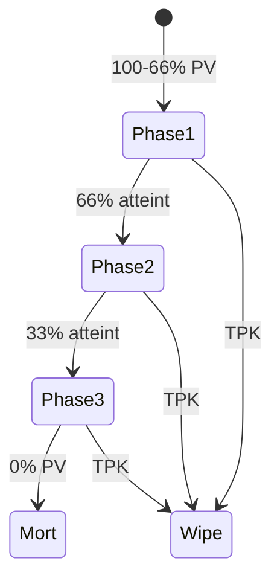
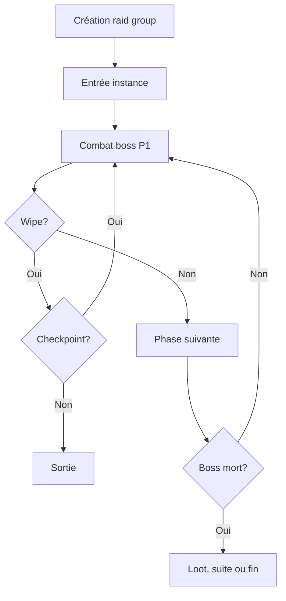
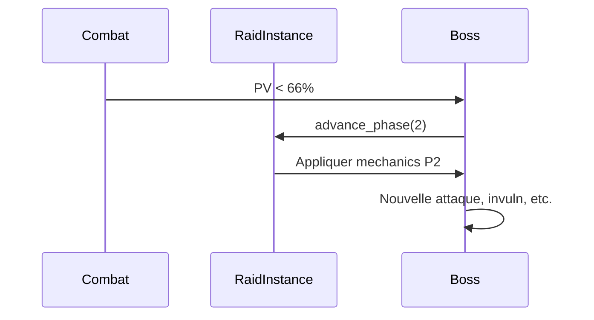

# Raids

**Catégorie :** 4. Entités et monde  
**Description :** Instances grand groupe ; bosses ; phases.

---

## En-tête et contexte

### Rôle dans le moteur

Les raids sont des instances PvE conçues pour de grands groupes (8–24 joueurs ou plus). Ils comportent des boss à plusieurs phases, des mécaniques de coopération, des objectifs intermédiaires, et un loot significatif. Ce point définit l’architecture des raids : composition, phases, gestion des wipes, et synchronisation.

### Liens vers la référence commune

- `InstanceId` — voir [MGE - Référence Commune](../MGE%20-%20Reference%20Commune.md)
- [instances-donjons](instances-donjons.md) pour la base commune

### Terminologie

| Terme | Définition |
|-------|------------|
| **Raid** | Instance grand groupe (typiquement 8–24 joueurs) |
| **Boss** | Ennemi principal avec plusieurs phases |
| **Phase** | Étape du combat (ex. 100–66 %, 66–33 %, 33–0 %) |
| **Wipe** | Mort du groupe ; retour au checkpoint ou sortie |
| **Raid group** | Composition officielle (tanks, DPS, soigneurs) |

---

## Spécifications techniques

### Contraintes

1. **Taille** : 8–24 joueurs (configurable)
2. **Phases** : Boss avec transitions (seuils de PV, timeouts)
3. **Rôles** : Tank, DPS, soigneur — composition recommandée
4. **Wipe** : Option checkpoint (recommencer la phase) ou sortie

### Paramètres

| Paramètre | Valeur typique | Description |
|-----------|----------------|-------------|
| Taille raid | 8, 16, 24 | Joueurs |
| Phases boss | 2–4 | Transitions |
| Durée max | 1–2 h | Timeout global |
| Checkpoints | 1–3 | Par instance |
| Lockout | 1 par semaine | Ou par jour |

### Formules

- **Scaling par taille** : Plus de joueurs → plus de PV du boss (linéaire ou sous-linéaire)
- **Seuils de phase** : Ex. 66 %, 33 % des PV totaux déclenchent un changement de phase

### Références croisées

- **instances-donjons** : Base technique
- **world-bosses-evenements** : Boss mondiaux (non instanciés)
- **aggro** : Gestion de la menace en raid
- **rôles** : Tank, DPS, soigneur

---

## Modèle de données et API

### Structures Rust (pseudo-code)

```rust
pub struct RaidConfig {
    pub zone_id: ZoneId,
    pub min_players: u8,
    pub max_players: u8,
    pub time_limit_sec: u32,
    pub bosses: Vec<BossPhaseConfig>,
    pub checkpoints: Vec<CheckpointId>,
}

pub struct BossPhaseConfig {
    pub boss_prefab_id: PrefabId,
    pub health_thresholds: Vec<f32>,  // 0.66, 0.33, 0.0
    pub phase_mechanics: Vec<PhaseMechanic>,
}

pub struct RaidInstance {
    pub instance_id: InstanceId,
    pub raid_group: RaidGroup,
    pub current_phase: u8,
    pub checkpoint: Option<CheckpointId>,
    pub wipe_count: u32,
}
```

### API

```rust
pub fn create_raid(raid_id: RaidId, raid_group: RaidGroup) -> Result<InstanceId, RaidError>;

pub fn enter_raid(instance_id: InstanceId, player_id: PlayerId) -> Result<(), EnterError>;

pub fn advance_phase(instance_id: InstanceId, new_phase: u8);

pub fn on_wipe(instance_id: InstanceId) -> WipeResult;  // Checkpoint ou sortie

pub fn get_raid_status(instance_id: InstanceId) -> RaidStatus;
```

---

## Diagrammes

### Phases d’un boss



### Flux d’un raid



### Séquence transition de phase



---

## Exemples et cas d’usage

### Cas 1 : Raid « Forteresse du Dragon »

3 boss. 16 joueurs. Chaque boss a 2–3 phases. Wipe = retour au dernier boss. Lockout hebdo.

### Cas 2 : Raid flexible

Le raid scale entre 8 et 24 : moins de joueurs = boss plus faible, plus de joueurs = boss plus fort (avec plafond).

### Cas 3 : Raid événement

Raid temporaire (saison, événement) ; loot exclusif ; une tentative par joueur par semaine.

---

## Cas limites et tests

### Edge cases

| Cas | Comportement attendu | Validation |
|-----|----------------------|------------|
| Déco du raid leader | Transfert du lead ou vote | Pas de blocage |
| Moins de joueurs que le min | Refus d’entrée ou scaling | Selon design |
| Phase transition pendant cast | Interrupt ou complétion | Spécifier |
| Timeout en combat | Wipe automatique | Nettoyage |

### Critères de validation

1. **Synchronisation** : Tous les joueurs voient la même phase
2. **Wipe** : Gestion correcte des checkpoints
3. **Loot** : Distribution selon les règles (roll, need/greed)

### Tests suggérés

```rust
#[test]
fn phase_transition_at_threshold() { /* ... */ }

#[test]
fn wipe_returns_to_checkpoint() { /* ... */ }

#[test]
fn raid_scaling_by_player_count() { /* ... */ }
```

---

## Détails d'implémentation

### Gestion des phases

Chaque transition de phase peut déclencher : changement de modèle/animations du boss, nouvelles capacités, invulnérabilité temporaire, spawn d'adds, changement de zone. Un script ou un state machine pilote ces effets.

### Synchronisation multijoueur

En mode MWS (réseau), la phase courante est une donnée serveur. Les clients reçoivent l'événement `advance_phase` et appliquent les changements visuels et mécaniques de façon identique.

### Lockout et progression

Le lockout (hebdo ou quotidien) est stocké par joueur dans KindMother. Une entrée en raid vérifie le lockout avant de créer ou rejoindre l'instance. La réinitialisation est déclenchée par un cron ou un événement temps réel.

---

## Mécaniques de raid détaillées

### Composition recommandée

| Rôle | Ratio | Rôle |
|------|-------|------|
| Tank | 2–3 | Main et off-tank |
| Soigneur | 2–4 | Soins, dispel |
| DPS | Reste | Mêlée et à distance |

Certains raids imposent un minimum par rôle ; d'autres sont flexibles.

### Gestion des wipes

**Checkpoint** : Les joueurs sont téléportés au dernier checkpoint (avant le boss actuel) avec les cooldowns réinitialisés. Le boss respawn à 100 % PV.

**Sortie** : Téléportation vers l'entrée du raid (monde persistant). L'instance est détruite ou conservée selon config.

**Rez** : En combat, résurrection limitée (skill, objet). Après wipe, tout le monde peut rez au checkpoint.

### Loot et distribution

- **Need / Greed** : Chaque joueur roll ; le plus haut gagne.
- **Master Loot** : Le raid leader distribue manuellement.
- **Personal Loot** : Chaque joueur reçoit un roll personnel (style Diablo).

Le loot peut être lié au lockout (une chance par semaine) ou cumulable.

---

## Scénarios Allumina

### Raid « Sanctuaire des Ombres »

3 boss, 16 joueurs, lockout hebdo. Boss 1 : phase unique. Boss 2 : 2 phases, adds à 50 %. Boss 3 : 3 phases, mécanique de déplacement. Checkpoints après chaque boss.

### Raid flexible (dynamic scaling)

Entre 8 et 24 joueurs. Les PV du boss scale : `pv_base * (1 + 0.05 * (n - 8))` pour n entre 8 et 24, plafonné. Le loot s'adapte (plus de drops si plus de joueurs, avec plafond).

---

## Performance et métriques

| Métrique | Cible | Unité |
|----------|-------|-------|
| Latence phase transition | < 100 ms | Réseau |
| Sync état raid | Fiable | Pas de désync |
| Max joueurs par raid | 24–40 | Selon design |

---

## Décisions de design

### Pourquoi des phases ?

Donner du rythme au combat, éviter la répétition, permettre des mécaniques progressivement plus complexes. Les phases permettent aussi des moments narratifs (dialogue, transformation).

### Raid vs donjon ?

Donjon : petit groupe (1–8), court (30 min). Raid : grand groupe (8–24+), long (1–2 h), boss plus complexes.

---

## Annexes

### Annexe A : Composition de raid type

Pour 16 joueurs : 2 tanks, 4 soigneurs, 10 DPS (mêlée + distance). Flexibilité : 1 tank peut être remplacé par un DPS avec capacité de mitigation si le boss le permet.

### Annexe B : Phases et mécaniques

Chaque phase peut définir : nouvelles attaques, spawn d'adds, zones dangereuses, objectifs (tuer les adds avant que le boss absorbe, etc.). Un script ou state machine pilote ces transitions.

### Annexe C : Logs et analytics

Enregistrer : durée du raid, wipes par boss, kills, loot distribué. Utile pour l'équilibrage et les statistiques communautaires.

---

## Guide d'implémentation étape par étape

### Étape 1 : Config raid

Définir la structure RaidConfig (zone, min/max players, bosses, checkpoints). Charger depuis des données (YAML, JSON) ou définir en code. Valider la cohérence (phases, seuils).

### Étape 2 : Création d'instance

`create_raid` : allouer un InstanceId, créer l'instance avec la zone chargée, enregistrer le raid group. Téléporter les joueurs à l'entrée. Démarrer le timer global.

### Étape 3 : Gestion des phases

Le système de combat (ou le boss lui-même) détecte les seuils de PV. À chaque transition, appeler `advance_phase`. Le boss applique ses nouvelles mécaniques (script, state machine). Tous les clients sont notifiés.

### Étape 4 : Wipe et checkpoint

À un wipe, vérifier s'il existe un checkpoint. Si oui, téléporter tout le monde, respawn le boss, reset les cooldowns. Si non, téléporter à la sortie et détruire l'instance.

### Étape 5 : Loot et lockout

À la mort du boss, distribuer le loot selon les règles (need/greed, personal, master). Enregistrer le lockout pour chaque joueur dans KindMother. Les récompenses sont ajoutées à l'inventaire.

---

## FAQ et décisions de design

**Q : Raid leader : transfert automatique ?**  
R : Si le leader déconnecte, transfert au second (ou vote). Éviter le blocage. Le lead peut aussi transférer manuellement.

**Q : Composition flexible ou stricte ?**  
R : Flexible = accepter 8–24 joueurs, scaling. Stricte = exiger 2 tanks, 4 heal, etc. Flexible pour l'accessibilité, stricte pour l'équilibrage.

**Q : Phases : seuils de PV ou timeouts ?**  
R : Les deux. Seuils de PV (66 %, 33 %) pour les transitions naturelles. Timeouts pour forcer une phase (ex. après 5 min en P1, passer en P2 même si le boss a encore des PV).

**Q : Wipe = tout perdre ?**  
R : Non. Les objets ramassés avant le wipe sont conservés. Les cooldowns sont reset. Le checkpoint permet de réessayer sans tout refaire.

**Q : Loot lockout : par joueur ou par groupe ?**  
R : Par joueur. Chaque joueur a son lockout. Rejoindre un autre groupe ne donne pas un nouveau lockout (éviter l'exploitation).

---

## Spécifications étendues

### États RaidStatus

- `Forming` : En cours de constitution
- `InProgress` : En cours, combat
- `Wiped` : Dernier wipe, choix checkpoint/sortie
- `Victory` : Tous les bosses tués
- `Timeout` : Temps écoulé

### Événements raid

- `RaidPhaseAdvanced { instance_id, phase }`
- `RaidWipe { instance_id }`
- `RaidVictory { instance_id }`
- `RaidPlayerJoined { instance_id, player_id }`

---

## Références

| Document | Rôle |
|----------|------|
| [MGE - Référence Commune](../MGE%20-%20Reference%20Commune.md) | Types de base |
| [instances-donjons](instances-donjons.md) | Base instances |
| [world-bosses-evenements](world-bosses-evenements.md) | Boss mondiaux |
| [_index 04](_index.md) | Index catégorie |
| [Index MGE](../_index.md) | Index global |
