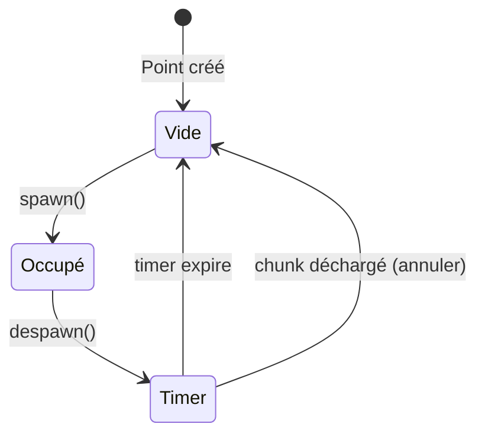
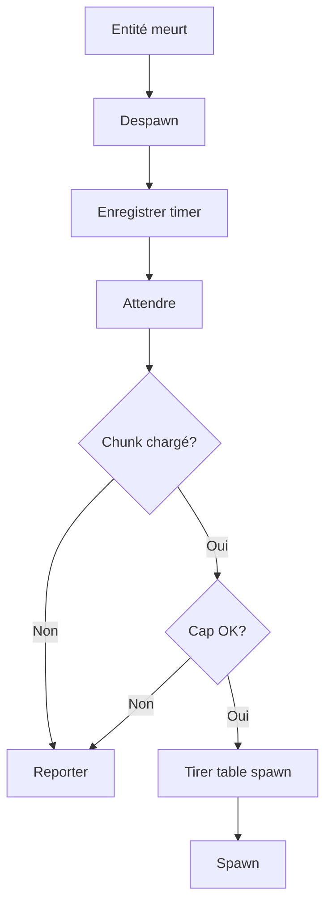
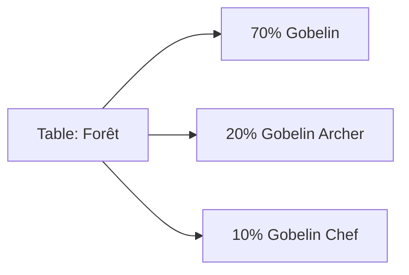

# Respawn dynamique

**Catégorie :** 4. Entités et monde  
**Description :** Points de spawn ; timers ; tables.

---

## En-tête et contexte

### Rôle dans le moteur

Le respawn dynamique contrôle la réapparition des mobs et objets dans le monde. Après la mort ou la disparition d'une entité, un timer démarre ; à l'expiration, une table de spawn détermine quel préfab faire apparaître et à quelle position. Ce système assure une population de monde cohérente et évite les zones vides.

### Liens vers la référence commune

- `Vec2`, `ChunkId` — voir [MGE - Référence Commune](../MGE%20-%20Reference%20Commune.md)
- [spawn](spawn.md) pour la création effective des entités

### Terminologie

| Terme | Définition |
|-------|------------|
| **Spawn point** | Position (et zone) où une entité peut apparaître |
| **Respawn timer** | Délai avant réapparition (fixe ou aléatoire) |
| **Table de spawn** | Liste de préfabs avec probabilités (ex. 70 % gobelin, 30 % gobelin archer) |
| **Cap** | Nombre max d'entités par point ou par zone |

---

## Spécifications techniques

### Contraintes

1. **Chunk actif** : Le respawn ne se produit que si le chunk contenant le point est chargé
2. **Cap** : Limiter le nombre d'entités simultanées par point/zone pour éviter la surpopulation
3. **Timer** : Min et max pour variabilité (ex. 60–120 s)
4. **Tables** : Probabilités normalisées (somme = 1 ou 100 %)

### Paramètres

| Paramètre | Valeur typique | Description |
|-----------|----------------|-------------|
| Respawn min | 30 s | Délai minimum |
| Respawn max | 120 s | Délai maximum |
| Cap par point | 1 | Une entité à la fois par point |
| Cap par zone | 10–50 | Par région (chunk ou zone logique) |
| Variance | ±20 % | Aléatoire autour de la valeur de base |

### Formules

- **Timer effectif** : `respawn_time = base * (1 + rng.range(-variance, +variance))`
- **Sélection table** : Roulette selon probabilités cumulées
- **Position** : Point fixe ou `center + random_offset` dans un rayon

### Références croisées

- **spawn** : Appel à spawn au moment du respawn
- **despawn** : Déclenche le timer (mort)
- **gestion-chunks** : Respawn uniquement si chunk chargé
- **world-bosses-evenements** : Spawns mondiaux avec timers longs

---

## Modèle de données et API

### Structures Rust (pseudo-code)

```rust
#[derive(Clone)]
pub struct SpawnPoint {
    pub id: SpawnPointId,
    pub position: Vec2,
    pub radius: f32,           // Zone de position aléatoire
    pub spawn_table: SpawnTable,
    pub respawn_min_sec: f32,
    pub respawn_max_sec: f32,
    pub cap: u32,
    pub chunk_id: ChunkId,
}

pub struct SpawnTable {
    pub entries: Vec<SpawnTableEntry>,
}

pub struct SpawnTableEntry {
    pub prefab_id: PrefabId,
    pub weight: f32,          // Probabilité relative
}

pub struct RespawnTimer {
    pub point_id: SpawnPointId,
    pub expires_at: f64,
    pub prefab_id: PrefabId,  // Déjà tiré de la table
}
```

### API

```rust
pub trait RespawnSystem {
    fn register_spawn_point(&mut self, point: SpawnPoint);
    
    fn on_entity_despawned(&mut self, point_id: SpawnPointId, entity_id: EntityId);
    
    fn update(&mut self, current_time: f64);
    
    fn get_active_timers(&self) -> &[RespawnTimer];
}
```

### Algorithme de mise à jour

```rust
fn update_respawn(current_time: f64) {
    for timer in timers.iter() {
        if timer.expires_at <= current_time {
            let point = get_point(timer.point_id);
            if chunk_loaded(point.chunk_id) && under_cap(point) {
                spawn(point, timer.prefab_id);
            }
            remove_timer(timer);
        }
    }
}
```

---

## Diagrammes

### Cycle de vie d'un spawn point



### Flux de respawn



### Table de spawn (exemple)



---

## Exemples et cas d'usage

### Cas 1 : Champ de gobelins (Allumina)

Points de spawn dans une clairière. Table : 70 % gobelin, 30 % gobelin archer. Respawn 90–150 s. Cap 1 par point. Quand un gobelin meurt, timer démarre.

### Cas 2 : Zone de ressources

Arbres et minerais ont des points de spawn. Respawn long (5–10 min) pour simuler la régénération. Pas de mobs, uniquement des objets interactifs.

### Cas 3 : Donjon

Dans une instance, les mobs respawn après 5 min pour permettre le farm. Cap par salle pour éviter l'overwhelm.

### Cas 4 : World boss

Point unique, table à une entrée (le boss). Timer long (2–4 h). Voir [world-bosses-evenements](world-bosses-evenements.md).

---

## Cas limites et tests

### Edge cases

| Cas | Comportement attendu | Validation |
|-----|----------------------|------------|
| Chunk déchargé pendant timer | Pas de spawn ; timer conservé ou annulé | Pas de spawn hors chunk |
| Cap atteint | Pas de spawn supplémentaire | Respect du cap |
| Plusieurs morts simultanées | Un timer par mort (ou fusion) | Pas de doublon |
| Table vide | Log warning, pas de spawn | Pas de crash |

### Critères de validation

1. **Respect du timer** : Respawn à la bonne heure
2. **Distribution** : Sur 100 spawns, proportions proches des weights
3. **Cap** : Jamais plus que le cap autorisé

### Tests suggérés

```rust
#[test]
fn respawn_after_timer() { /* ... */ }

#[test]
fn spawn_table_distribution() { /* ... */ }

#[test]
fn cap_prevents_overspawn() { /* ... */ }

#[test]
fn no_respawn_when_chunk_unloaded() { /* ... */ }
```

---

## Détails d'implémentation

### Timer et temps de jeu

Les timers utilisent le temps de jeu (game time) ou le temps réel selon la config. En temps réel : le respawn continue même si personne n'est dans la zone. En temps jeu : le monde « gèle » quand vide (économie de ressources).

### Tables de spawn avancées

- **Pondération par niveau** : Des mobs plus forts ont un weight plus faible
- **Spawn conditionnel** : Heure du jour, météo, quête en cours
- **Événements** : Double spawn pendant événement, ou mobs différents

### Intégration avec les chunks

Le `RespawnSystem` ne traite que les timers dont le `chunk_id` est dans `loaded_chunks`. Si un chunk est déchargé, les timers restent en attente ; à la rechargement, ils sont réévalués (certains peuvent avoir expiré depuis).

---

## Variantes de spawn points

| Variante | Description |
|----------|-------------|
| Point fixe | Une position exacte |
| Zone circulaire | Centre + rayon pour position aléatoire |
| Zone rectangulaire | AABB pour répartition |
| Chemin (path) | Points le long d'un chemin |
| Spawner mobile | Le point suit une entité (ex. chef gobelin) |

---

## Événements et hooks

- `OnRespawnScheduled` : Timer enregistré
- `OnRespawnTriggered` : Spawn effectué
- `OnRespawnCancelled` : Chunk déchargé avant spawn

Permet aux systèmes (UI, audio, analytics) de réagir.

---

## Annexes

### Annexe A : Format de spawn point (données)

```yaml
spawn_point:
  id: forest_goblins_1
  position: [320, 480]
  radius: 16
  spawn_table:
    - prefab: mobs/goblin
      weight: 0.7
    - prefab: mobs/goblin_archer
      weight: 0.3
  respawn_min: 90
  respawn_max: 150
  cap: 1
  chunk: [10, 15]
```

### Annexe B : Respawn et difficulté dynamique

Le temps de respawn peut varier selon le niveau du joueur ou la difficulté de la zone : zones difficiles = respawn plus long pour éviter l'overwhelm. Ou l'inverse pour le farm.

### Annexe C : Spawn points et éditeur

Dans l'éditeur de niveau, les spawn points sont des entités spéciales (gizmos) placées manuellement. À l'export, ils sont convertis en données pour le RespawnSystem.

---

## Guide d'implémentation

1. Enregistrer les spawn points au chargement de la zone (ou depuis les données). 2. À chaque despawn d'une entité liée à un spawn point, créer un RespawnTimer (expires_at = now + random(respawn_min, respawn_max)). 3. Chaque frame (ou à intervalle), parcourir les timers expirés. 4. Pour chaque timer : vérifier chunk chargé, cap, puis tirer la table de spawn et appeler spawn. 5. Retirer le timer. Gérer le temps de jeu vs temps réel selon la config.

---

## FAQ et décisions de design

**Q : Temps de jeu vs temps réel pour les timers ?**  
R : Temps réel = le respawn continue même si la zone est vide (monde « vit »). Temps jeu = le monde gèle quand vide (économie). Temps réel pour world bosses, temps jeu pour les mobs de zone.

**Q : Cap par point ou par zone ?**  
R : Les deux. Cap par point (1 par spawn point) pour éviter le spawn stacking. Cap par zone (ex. chunk) pour limiter la population totale.

**Q : Table de spawn : probabilités ou weights ?**  
R : Weights (poids relatifs). Normaliser : total = sum(weights), proba(i) = weight(i)/total. Plus flexible que les pourcentages fixes.

**Q : Respawn quand le chunk est déchargé ?**  
R : Non. Le timer peut continuer (temps réel) ou être gelé (temps jeu). Quand le chunk est rechargé, vérifier si le timer a expiré ; si oui, spawn immédiatement ou au prochain tick.

**Q : Position aléatoire dans la zone ?**  
R : Oui. center + random_offset dans le rayon. Éviter le spawn stacking au même pixel. Option : réessayer si la position est en collision.

**Q : Spawn conditionnel (heure, météo) ?**  
R : Possible. La table de spawn ou le spawn point peut avoir des conditions. Si non remplies, pas de spawn (ou table alternative).

**Q : Événement double respawn ?**  
R : Pendant un événement, modifier les poids ou le timer. Ex. : respawn 2x plus rapide, ou table avec mobs différents (invasion).

**Q : Respawn et difficulté du joueur ?**  
R : Optionnel. Zone difficile = respawn plus long. Ou l'inverse pour le farm. Adapter selon le game design.

---

## Spécifications étendues

### SpawnTableEntry étendu

```rust
struct SpawnTableEntry {
    prefab_id: PrefabId,
    weight: f32,
    min_level: Option<u32>,
    conditions: Vec<SpawnCondition>,
}
```

### Conditions de spawn

- TimeOfDay(start, end)
- Weather(weather_type)
- QuestActive(quest_id)
- PlayerCount(min, max)

---

## Notes techniques complémentaires

### Respawn et équilibrage

Ajuster les respawn times selon le feedback : si une zone est trop vide, réduire le timer. Si trop de farm, augmenter. Données d'analytics (temps moyen entre spawn et kill) pour guider.

### Respawn et événements temporels

Pendant un événement (double XP, invasion), modifier dynamiquement les tables ou timers. Un multiplicateur `respawn_speed = 0.5` pendant l'événement = respawn 2x plus rapide.

### Respawn et performance

Ne pas tick tous les timers chaque frame. Regrouper par seconde ou utiliser une heap de timers (min-heap par expiration). Ne traiter que les timers dont expires_at <= now.

---

## Résumé et checklist

| Étape | Action |
|-------|--------|
| 1 | Enregistrer spawn points (position, table, timer) |
| 2 | À despawn : créer RespawnTimer |
| 3 | Chaque tick : parcourir timers expirés |
| 4 | Vérifier chunk chargé, cap |
| 5 | Tirer table, spawn, retirer timer |
| 6 | Gérer temps jeu vs temps réel |
| 7 | Tester distribution (proportions weights) |

---

## Références

| Document | Rôle |
|----------|------|
| [MGE - Référence Commune](../MGE%20-%20Reference%20Commune.md) | Types Vec2, ChunkId |
| [spawn](spawn.md) | Création d'entités |
| [despawn](despawn.md) | Déclenchement du timer |
| [gestion-chunks](gestion-chunks.md) | Chunks chargés |
| [world-bosses-evenements](world-bosses-evenements.md) | Boss mondiaux |
| [_index 04](_index.md) | Index catégorie |
| [Index MGE](../_index.md) | Index global |
