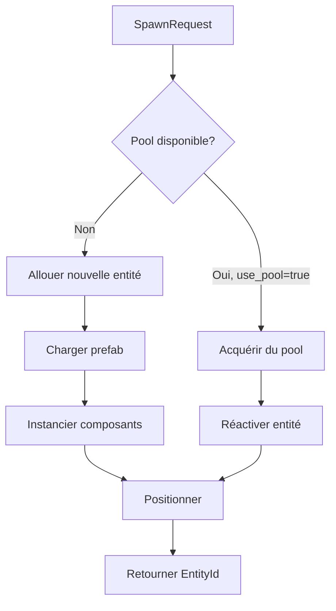
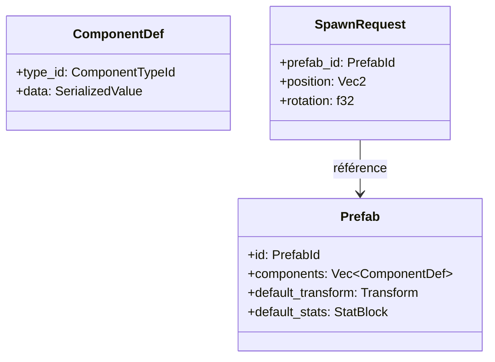
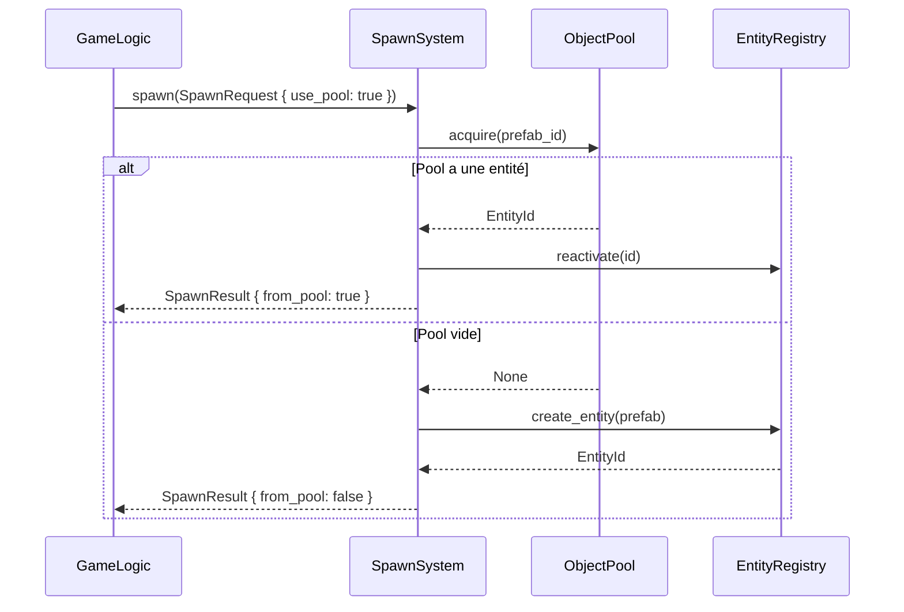

# Spawn

**Catégorie :** 4. Entités et monde  
**Description :** Création d'entités ; position ; préfab ; pool.

---

## En-tête et contexte

### Rôle dans le moteur

Le spawn est le point d'entrée de la création d'entités dans le monde MGE. Toute entité — joueur, PNJ, monstre, projectile, effet — passe par le système de spawn qui alloue un ID, instancie les composants à partir d'un préfab (prefab), positionne l'entité, et gère éventuellement le pool d'objets pour limiter les allocations.

### Liens vers la référence commune

- `Vec2`, `Rect`, `LayerId` — voir [MGE - Référence Commune](../MGE%20-%20Reference%20Commune.md)
- Système de coordonnées monde
- Glossaire MGE : sprite, chunk, entity, prefab

### Terminologie

| Terme | Définition |
|-------|------------|
| **Prefab** | Modèle prédéfini d'entité (composants, valeurs par défaut) |
| **Pool** | Réserve d'entités pré-instanciées, réutilisables pour éviter allocations |
| **Spawn point** | Position et paramètres (orientation, type) pour faire apparaître une entité |
| **Template** | Synonyme de prefab dans certains contextes |

---

## Spécifications techniques

### Contraintes de position

1. **Coordonnées monde** : La position de spawn est exprimée en unités monde (tiles ou pixels selon le mode)
2. **Validation** : La position doit être dans les limites du chunk/instance actif
3. **Collision** : Option de vérification de non-collision à la création (spawn « safe »)
4. **Alignement** : Possibilité d'aligner sur la grille (snap to grid) pour les entités tile-based

### Paramètres de spawn

| Paramètre | Type | Description |
|-----------|------|-------------|
| `prefab_id` | `PrefabId` | Référence au modèle d'entité |
| `position` | `Vec2` | Coordonnées monde |
| `rotation` | `f32` | Angle en radians (0 = droite) |
| `layer_id` | `LayerId` | Couche de rendu et de collision |
| `instance_id` | `InstanceId` | Instance cible (monde, donjon) |
| `variants` | `Option<SpawnVariants>` | Overrides (couleur, stats, nom) |
| `from_pool` | `bool` | Utiliser le pool si disponible |

### Formules

- **Position aléatoire dans une zone** : `position = center + Vec2::new(rng.range(-w/2, w/2), rng.range(-h/2, h/2))`
- **Coût mémoire estimé** : `sizeof(EntityData) + sum(composants)` ; typiquement 200–800 octets par entité selon les composants

### Références croisées

- **unicite-entites** : Allocation de l'EntityId lors du spawn
- **despawn** : Libération et retour au pool
- **respawn-dynamique** : Points de spawn, timers, tables
- **hitbox** : Création de la hitbox selon le prefab

---

## Modèle de données et API

### Structures Rust (pseudo-code)

```rust
/// Identifiant de prefab (chemin ou hash)
#[derive(Clone, Copy, PartialEq, Eq, Hash)]
pub struct PrefabId(pub u32);

/// Demande de spawn
pub struct SpawnRequest {
    pub prefab_id: PrefabId,
    pub position: Vec2,
    pub rotation: f32,
    pub layer_id: LayerId,
    pub instance_id: InstanceId,
    pub variants: Option<SpawnVariants>,
    pub use_pool: bool,
}

pub struct SpawnVariants {
    pub scale: Option<f32>,
    pub tint: Option<Color>,
    pub custom_name: Option<String>,
    pub stat_overrides: Option<StatBlock>,
}

/// Résultat du spawn
pub struct SpawnResult {
    pub entity_id: EntityId,
    pub success: bool,
    pub from_pool: bool,
}
```

### API principale

```rust
pub trait SpawnSystem {
    /// Spawn une entité à la position donnée
    fn spawn(&mut self, request: SpawnRequest) -> Result<SpawnResult, SpawnError>;
    
    /// Spawn multiple (batch)
    fn spawn_batch(&mut self, requests: &[SpawnRequest]) -> Vec<Result<SpawnResult, SpawnError>>;
    
    /// Spawn à partir d'un point de spawn nommé
    fn spawn_at_point(&mut self, point_id: SpawnPointId, prefab_id: PrefabId) 
        -> Result<SpawnResult, SpawnError>;
    
    /// Préchauffer le pool pour un prefab
    fn warm_pool(&mut self, prefab_id: PrefabId, count: usize);
}
```

### Pool d'objets

```rust
pub struct ObjectPool {
    /// Entités désactivées, prêtes à être réutilisées
    inactive: HashMap<PrefabId, Vec<EntityId>>,
    /// Taille max par prefab (0 = illimité)
    max_per_prefab: HashMap<PrefabId, usize>,
}

impl ObjectPool {
    pub fn acquire(&mut self, prefab_id: PrefabId, registry: &mut EntityRegistry) 
        -> Option<EntityId>;
    pub fn release(&mut self, prefab_id: PrefabId, entity_id: EntityId);
}
```

---

## Diagrammes

### Flux de spawn



### Structure prefab



### Séquence spawn avec pool



---

## Exemples et cas d'usage

### Cas 1 : Spawn d'un ennemi (Allumina)

```rust
spawn_system.spawn(SpawnRequest {
    prefab_id: PrefabId::from("mobs/goblin"),
    position: spawn_point.world_position(),
    rotation: 0.0,
    layer_id: LayerId::World,
    instance_id: current_instance(),
    variants: None,
    use_pool: true,
})?;
```

### Cas 2 : Projectile

Les projectiles sont typiquement poolés. À chaque tir, `spawn` avec `use_pool: true` ; au hit ou timeout, `despawn` renvoie l'entité au pool.

### Cas 3 : Joueur (reconnexion)

Le joueur est spawné à sa dernière position sauvegardée (KindMother). `SpawnRequest` inclut des `variants` avec les stats restaurées.

### Cas 4 : Pré-chauffage du pool

Avant une vague d'ennemis, le système appelle `warm_pool("mobs/skeleton", 50)` pour éviter les stutters à l'apparition des mobs.

---

## Cas limites et tests

### Edge cases

| Cas | Comportement attendu | Validation |
|-----|----------------------|------------|
| Prefab inconnu | Err(UnknownPrefab) | Ne pas panic |
| Position hors limites | Err(OutOfBounds) ou clamp | Dépend du mode |
| Pool saturé | Créer nouvelle entité ou Err | Configurable |
| Spawn dans mur | Option « no collision check » | Si activé : échec |
| Spawn 0,0 | Valide si dans monde | Cas trivial |

### Critères de validation

1. **Position correcte** : Vérifier que l'entité spawn à la position demandée
2. **Composants instanciés** : Tous les composants du prefab sont présents
3. **Pool** : Après despawn, réutilisation effective ; pas de corruption
4. **Performance** : Spawn de 1000 entités en < 50 ms (objectif)

### Tests suggérés

```rust
#[test]
fn spawn_creates_valid_entity() { /* ... */ }

#[test]
fn pool_reuse_after_despawn() { /* ... */ }

#[test]
fn spawn_batch_all_succeed() { /* ... */ }

#[test]
fn spawn_at_invalid_position_fails() { /* ... */ }
```

---

## Détails d'implémentation

### Chargement des prefabs

Les prefabs sont chargés à partir d'assets (fichiers JSON, binaire, ou définis en code). Un cache garde les prefabs en mémoire. Le premier spawn d'un prefab déclenche le chargement ; les suivants utilisent le cache.

### Variants et overrides

`SpawnVariants` permet de modifier des propriétés sans créer un nouveau prefab : scale, couleur (teinte), nom personnalisé, stats. Utile pour les variantes de mobs (gobelin chef = gobelin + scale 1.2, +50 % PV).

### Validation de position

Avant de spawn, on peut vérifier : pas de collision avec un mur, pas de chevauchement avec une autre entité (optionnel), dans les limites du chunk/instance. En cas d'échec, réessayer avec un offset ou retourner une erreur.

---

## Pool et mémoire

### Taille du pool

Configurable par prefab. Ex. : projectiles = 100, mobs = 20 par type. Un pool saturé : soit bloquer le spawn, soit allouer une nouvelle entité (bypass pool). Recommandation : prévoir une taille suffisante pour les pics.

### Réinitialisation au release

Quand une entité retourne au pool, ses composants sont réinitialisés (position à 0, velocity à 0, etc.) pour éviter tout état résiduel au prochain acquire.

---

## Annexes

### Annexe A : Format de prefab (JSON exemple)

```json
{
  "id": "mobs/goblin",
  "components": [
    { "type": "Transform", "position": [0, 0], "scale": 1.0 },
    { "type": "Sprite", "atlas": "mobs", "rect": [0, 0, 32, 32] },
    { "type": "Hitbox", "shape": "AABB", "size": [24, 28] },
    { "type": "Health", "max": 50 },
    { "type": "AI", "behavior": "wander" }
  ]
}
```

### Annexe B : Spawn en batch optimisé

Pour spawner N entités du même prefab, une version batch évite N appels séparés : `spawn_batch(requests)`. Le système peut optimiser (pré-charger le prefab une fois, allouer les IDs en bloc).

### Annexe C : Intégration éditeur

Un éditeur de niveau peut placer des « spawn points » visuellement. À l'export, ces points deviennent des entrées dans le système de respawn ou des triggers de spawn scriptés.

---

## Guide d'implémentation étape par étape

### Étape 1 : Charger les prefabs

Créer un `PrefabLoader` qui lit les fichiers (JSON, etc.) et les stocke dans un cache. Chaque prefab est une structure avec la liste des composants à instancier.

### Étape 2 : Implémenter spawn

Pour chaque composant du prefab, créer une instance et l'attacher à la nouvelle entité. Appliquer les variants (scale, tint). Positionner l'entité. Retourner l'EntityId.

### Étape 3 : Intégrer le pool

Avant d'allouer une nouvelle entité, vérifier le pool pour ce prefab. Si une entité est disponible, la réactiver (reset + reposition) et la retourner. Sinon, créer une nouvelle entité et optionnellement l'ajouter au pool après despawn.

### Étape 4 : Validation

Vérifier la position (dans les limites), le prefab (existe), et les quotas (pool, cap par zone). Retourner des erreurs explicites.

### Étape 5 : Optimisation

Batch loading des prefabs fréquents. Pré-warm du pool aux moments de transition (chargement de niveau). Profiling pour identifier les goulots d'étranglement.

---

## FAQ et décisions de design

**Q : Prefab = fichier ou ID ?**  
R : Les deux. PrefabId référence un prefab (chargé depuis fichier ou défini en code). Le cache associe PrefabId → données du prefab.

**Q : Pool : taille fixe ou dynamique ?**  
R : Fixe avec cap (ex. 100 projectiles). Au-delà : bloquer ou bypass pool. Dynamique = risque de croissance illimitée.

**Q : Variants à la volée ou prefabs dérivés ?**  
R : Variants à la volée (scale, tint) = flexible. Prefabs dérivés (gobelin_chef) = plus de prefabs mais réutilisables. Combiner : variant pour overrides simples.

**Q : Spawn en position occupée ?**  
R : Réessayer avec offset aléatoire, ou échouer. Éviter le spawn dans un mur (vérifier collision avant).

**Q : Réseau : qui autorise le spawn ?**  
R : Serveur. Le client demande (ex. tir projectile) ; le serveur valide et spawn. Broadcast aux clients. Pas de spawn client-side autoritaire pour les entités partagées.

---

## Spécifications étendues

### Erreurs SpawnError

- `UnknownPrefab(PrefabId)`
- `OutOfBounds(Vec2)`
- `PoolExhausted(PrefabId)`
- `InvalidPosition` (collision, hors limites)
- `InstanceFull(InstanceId)`

### Événements

- `EntitySpawned { entity_id, prefab_id, position }`
- `PoolAcquired { entity_id, prefab_id }`
- `PoolReleased { entity_id, prefab_id }`

---

## Références

| Document | Rôle |
|----------|------|
| [MGE - Référence Commune](../MGE%20-%20Reference%20Commune.md) | Types Vec2, Rect, LayerId |
| [unicite-entites](unicite-entites.md) | Allocation EntityId |
| [despawn](despawn.md) | Destruction et retour au pool |
| [respawn-dynamique](respawn-dynamique.md) | Points de spawn |
| [_index 04](_index.md) | Index catégorie |
| [Index MGE](../_index.md) | Index global |
