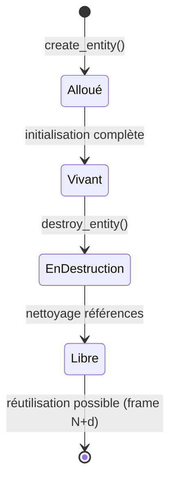
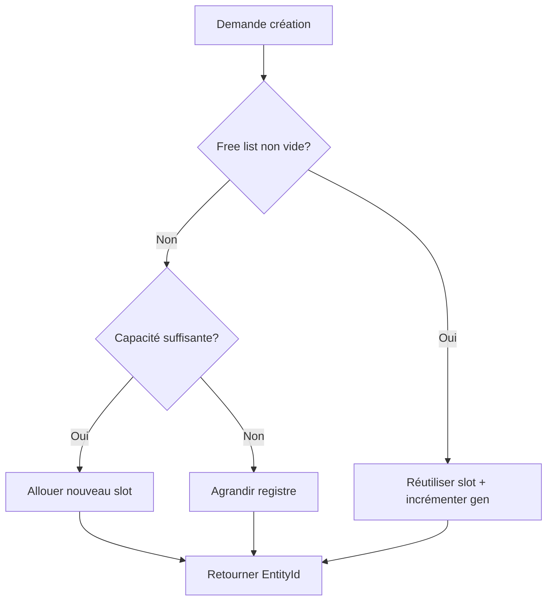
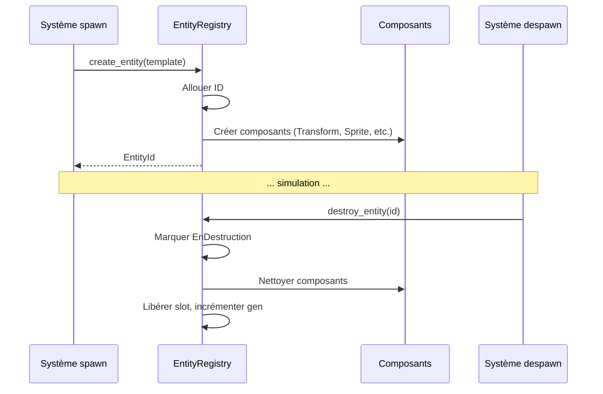

# Unicité des entités

**Catégorie :** 4. Entités et monde  
**Description :** ID unique ; registre ; lifecycle.

---

## En-tête et contexte

### Rôle dans le moteur

L'unicité des entités est le pilier de l'architecture ECS (Entity Component System) du MGE. Chaque entité — joueur, PNJ, monstre, objet interactif, projectile — possède un identifiant unique au sein de son contexte (monde, instance, chunk). Ce point définit les mécanismes garantissant l'unicité, le registre central, et le cycle de vie (lifecycle) des entités.

### Liens vers la référence commune

- Types de base : `EntityId`, `ChunkId`, `InstanceId` — voir [MGE - Référence Commune](../MGE%20-%20Reference%20Commune.md)
- Système de coordonnées monde/écran — référencé pour le positionnement des entités
- Cycle de rendu et pipeline — intégration avec le culling et le traitement par chunk

### Terminologie

| Terme | Définition |
|-------|------------|
| **Entity** | Objet simulé dans le monde (personnage, PNJ, créature, objet) |
| **EntityId** | Identifiant unique 64 bits (ou UUID selon le contexte réseau) |
| **Registre** | Structure indexée assurant O(1) lookup par ID |
| **Lifecycle** | États : Création → Vivant → En cours de destruction → Détruit |

---

## Spécifications techniques

### Contraintes d'unicité

1. **Unicité stricte** : Deux entités actives ne partagent jamais le même ID
2. **Réutilisation différée** : Un ID libéré ne peut être réattribué qu'après un délai minimal (éviter les références fantômes)
3. **Isolation par contexte** : Dans une instance de donjon, les IDs sont locaux ; un `EntityId` n'est valide que dans son instance
4. **Persistence** : Les entités persistantes (KindMother) utilisent un ID stable entre sessions

### Formules et paramètres

| Paramètre | Valeur | Unité | Description |
|-----------|--------|-------|-------------|
| Taille EntityId | 64 bits | bits | Suffisant pour 10^19 entités uniques |
| Délai réutilisation | 1–3 frames | frames | Évite les collisions post-despawn |
| Taille bloc allocation | 1024 | IDs | Batch d'IDs alloués en une fois |
| Profondeur génération | 16 bits | bits | Partie « génération » pour détecter les IDs périmés |

### Structure de l'EntityId (proposition)

```
EntityId = [InstancePart:16][ChunkPart:16][Index:24][Generation:8]
```

- **InstancePart** : Identifie l'instance (monde persistant = 0, donjons = 1..N)
- **ChunkPart** : Chunk d'origine (optionnel, pour optimisations spatiales)
- **Index** : Index dans le registre local (16M entités max par instance)
- **Generation** : Incrémenté à chaque réutilisation ; permet de détecter les références invalides

### Références croisées

- ** hitbox** : Chaque entité possède une hitbox ; la position est stockée dans les composants
- **spawn** : Création d'entité → allocation d'ID
- **despawn** : Destruction → libération d'ID, incrément de génération
- **collision** : Détection utilise les IDs pour identifier les paires en collision

---

## Modèle de données et API

### Structures Rust (pseudo-code)

```rust
/// Identifiant unique d'entité. Opaque, pas d'arithmétique.
#[repr(C)]
#[derive(Clone, Copy, PartialEq, Eq, Hash)]
pub struct EntityId(u64);

impl EntityId {
    pub fn is_valid(&self) -> bool {
        self.0 != 0 && (self.0 != u64::MAX)
    }
    
    pub fn from_parts(instance: u16, chunk: u16, index: u32, gen: u8) -> Self {
        let v = (instance as u64) << 48
            | (chunk as u64) << 32
            | (index as u64) << 8
            | (gen as u64);
        Self(v)
    }
}

/// Registre des entités. Accès O(1) par ID.
pub struct EntityRegistry {
    /// Entités actives, indexées par (instance, index)
    entities: SlotMap<EntitySlot, EntityData>,
    /// File des IDs libérés (pour réutilisation)
    free_list: VecDeque<EntitySlot>,
    /// Génération courante par slot
    generations: Vec<u8>,
}

pub struct EntityData {
    pub id: EntityId,
    pub position: Vec2,  // Réf. Référence Commune
    pub layer_id: LayerId,
    pub flags: EntityFlags,
    pub spawn_time: f64,
}

pub struct EntityFlags {
    pub persistent: bool,   // Sauvegardé dans KindMother
    pub networked: bool,    // Synchronisé via MWS
    pub static_entity: bool,// Ne bouge pas (décors)
}
```

### Signatures principales

```rust
impl EntityRegistry {
    pub fn create_entity(&mut self, instance_id: u16, template: &EntityTemplate) 
        -> Result<EntityId, RegistryError>;
    
    pub fn destroy_entity(&mut self, id: EntityId) -> Result<(), RegistryError>;
    
    pub fn get(&self, id: EntityId) -> Option<&EntityData>;
    
    pub fn get_mut(&mut self, id: EntityId) -> Option<&mut EntityData>;
    
    pub fn contains(&self, id: EntityId) -> bool;
    
    pub fn iter(&self) -> impl Iterator<Item = &EntityData>;
    
    pub fn iter_instance(&self, instance_id: u16) -> impl Iterator<Item = &EntityData>;
}
```

### Lifecycle hooks

```rust
pub enum EntityLifecycleEvent {
    Created { id: EntityId, template: EntityTemplateId },
    Destroyed { id: EntityId, reason: DestroyReason },
}

pub enum DestroyReason {
    Despawn,
    OutOfBounds,
    Timeout,
    Scripted,
}
```

---

## Diagrammes

### Cycle de vie d'une entité



### Flux d'allocation d'ID



### Séquence création → destruction



---

## Exemples et cas d'usage

### Cas 1 : Spawn d'un mob Allumina

Un gobelin apparaît à un point de spawn. Le système de respawn dynamique appelle `create_entity` avec le préfab « gobelin ». L'ID retourné est utilisé pour le ciblage, l'agro, et le loot.

### Cas 2 : Entité persistante (KindMother)

Le personnage du joueur a `flags.persistent = true`. À la sauvegarde, KindMother sérialise les données indexées par `EntityId`. Au chargement, le même ID (ou un ID stable mappé) est restauré pour maintenir les références (inventaire, quêtes).

### Cas 3 : Instance de donjon

Chaque instance a un `InstanceId` unique. Les entités créées dans l'instance reçoivent des IDs dont la partie instance = `InstanceId`. À la destruction de l'instance, tous les slots de cette instance sont libérés en batch.

### Cas 4 : Vérification de validité

Un script ou un système de combat garde une référence `EntityId` vers une cible. Avant d'utiliser cette référence, il appelle `registry.contains(id)`. Si l'entité a été despawn entre-temps, la référence est invalide et le comportement peut s'adapter (choisir une nouvelle cible).

---

## Cas limites et tests

### Edge cases

| Cas | Comportement attendu | Validation |
|-----|----------------------|------------|
| Double destroy | Ignorer ou erreur douce ; pas de crash | `destroy_entity(id)` sur entité déjà détruite → No-op ou Err |
| Référence après destroy | `get(id)` retourne `None` | Génération invalide détectée |
| Overflow d'IDs | Erreur explicite ou agrandissement | Si 16M entités atteint dans une instance → Err ou grow |
| Entité sans composants | Interdit | `create_entity` exige au moins Transform |
| ID 0 ou MAX | Réservé / invalide | Jamais alloué comme ID valide |

### Critères de validation

1. **Unicité** : Stress test : créer 100 000 entités, vérifier que tous les IDs sont distincts
2. **Pas de fuite** : Créer puis détruire 50 000 entités ; la mémoire du registre doit rester bornée
3. **Réutilisation** : Après despawn massif, de nouveaux spawns réutilisent les slots
4. **Persistence** : Sauvegarder avec une entité persistante, recharger ; l'ID est cohérent

### Tests unitaires suggérés

```rust
#[test]
fn entity_id_uniqueness() { /* ... */ }

#[test]
fn destroy_invalidates_reference() { /* ... */ }

#[test]
fn free_list_reuse_after_despawn() { /* ... */ }

#[test]
fn instance_isolation() { /* ... */ }
```

---

## Détails d'implémentation

### Gestion de la génération

La génération (8 bits) est incrémentée à chaque réutilisation du slot. Une tentative d'accès avec une génération périmée peut être détectée et renvoie une erreur ou `None` sans panic. Cela évite les use-after-free subtils.

### Réseau et MWS

Pour le multijoueur (MWS), les EntityIds peuvent être synchronisés entre clients et serveur. Deux stratégies : IDs générés serveur (autorité), ou IDs locaux avec mapping. La persistance KindMother stocke les IDs stables pour les entités sauvegardées.

### Contexte d'exécution

Dans un ECS, le registre est typiquement une ressource globale ou injectée. Les systèmes reçoivent des `EntityId` et accèdent aux composants via le registre. L'EntityId ne contient pas de pointeur pour éviter l'invalidité.

---

## Scénarios Allumina

### Personnage joueur

EntityId persistant, sauvegardé dans KindMother. Au chargement, le même ID est restauré pour maintenir les références (inventaire, quêtes en cours, position).

### Mob temporaire

ID du pool ou allocation fraîche. À la mort, despawn libère l'ID. Le respawn dynamique en crée un nouveau avec un ID différent.

### Projectile

ID du pool exclusivement. Durée de vie courte ; retour au pool après impact ou timeout.

---

## Performance et métriques

| Métrique | Cible | Unité |
|---------|-------|-------|
| Lookup par ID | < 100 ns | Par accès |
| Création entité | < 1 µs | Par entité |
| Itération registre | O(n) | n = entités actives |
| Mémoire par entité | ~50–100 B | Données de base |

### Optimisations

- SlotMap ou table dense pour accès O(1)
- Itération cache-friendly (arrays contigus)
- Pré-allocation de blocs pour éviter les allocations par entité

---

## Décisions de design

### Pourquoi 64 bits ?

Suffisant pour des milliards d'entités ; permet d'encoder instance, chunk, index et génération dans un seul entier. Pas d'arithmétique pointer pour la portabilité.

### Pourquoi différer la réutilisation ?

Éviter qu'une référence gardée par un système obsolète pointe accidentellement vers une nouvelle entité. Une frame de délai est un compromis sécurité/performance.

### Registre par instance ou global ?

Recommandation : registre global avec filtre par `InstanceId` pour l'itération. Les instances (donjons) peuvent avoir un registre dédié pour une destruction en batch plus simple.

---

## Annexes

### Annexe A : Comparaison avec ECS courants

| ECS | Entité | Registre |
|-----|--------|----------|
| Bevy | Entity (u32) | Archetype-based |
| Legion | Entity | Sparse set |
| Specs | Entity | Storage par composant |
| MGE | EntityId | SlotMap ou dense |

Le MGE peut s'inspirer de Legion ou d'architectures ECS pour l'EntityId. L'EntityId 64 bits permet plus de métadonnées que le u32 classique.

### Annexe B : Migration d'IDs

Lors d'un chargement de sauvegarde, les IDs peuvent changer (nouvelle instance). Un mapping `old_id -> new_id` permet de mettre à jour les références dans les composants (inventaire, quêtes, etc.). À faire avant la première frame de jeu.

### Annexe C : Debug et outils

- **Inspector** : Afficher l'EntityId au survol d'une entité
- **Log** : Lors de create/destroy, log avec ID pour tracer les fuites
- **Validation** : En mode debug, vérifier qu'aucune référence orpheline n'existe après un despawn

---

## Guide d'implémentation étape par étape

### Étape 1 : Définir le type EntityId

Choisir la structure (64 bits, champs Instance/Chunk/Index/Gen). Implémenter `From`/`Into` si besoin de conversion. Définir les constantes `INVALID` (0) et `MAX` (u64::MAX) comme réservées.

### Étape 2 : Implémenter le registre

Utiliser une structure à accès O(1) : `Vec` avec index = partie Index de l'ID, ou `SlotMap`. Stocker les générations pour la validation. Implémenter `create`, `destroy`, `get`, `contains`, `iter`.

### Étape 3 : Intégrer au spawn et despawn

Le SpawnSystem appelle `registry.create_entity` et retourne l'EntityId. Le DespawnSystem appelle `registry.destroy_entity`. S'assurer que les deux sont cohérents (pas de double free, pas d'ID orphelin).

### Étape 4 : Tests

Écrire les tests d'unicité, de réutilisation, d'invalidation. Vérifier les fuites mémoire avec un test de 100k create/destroy.

### Étape 5 : Persistence (optionnel)

Pour les entités persistantes, sérialiser l'EntityId (ou un ID stable dérivé) dans KindMother. Au chargement, restaurer ou mapper vers le nouvel ID.

---

## FAQ et décisions de design

**Q : EntityId 32 vs 64 bits ?**  
R : 64 bits permet d'encoder instance, chunk, index, génération. 32 bits suffit pour des millions d'entités mais limite les métadonnées. Recommandation : 64 pour MGE.

**Q : Génération : 8 ou 16 bits ?**  
R : 8 bits = 256 réutilisations avant wrap. Suffisant avec délai de réutilisation. 16 bits si paranoia. Le wrap peut être géré (comparaison circulaire).

**Q : Registre global ou par système ?**  
R : Global. Un seul registre, les systèmes y accèdent. Évite la duplication et les désynchronisations.

**Q : Réutilisation immédiate ou différée ?**  
R : Différée (1–3 frames). Évite les use-after-free si un système garde une référence une frame de plus.

**Q : EntityId dans les messages réseau ?**  
R : Oui, si le serveur est autoritaire. Les clients reçoivent les IDs. Pour la persistance, utiliser un ID stable (UUID) si les IDs changent entre sessions.

---

## Spécifications étendues

### Layout EntityId 64 bits (proposition)

| Bits | Champ | Description |
|------|-------|-------------|
| 0–15 | Instance | InstanceId (16 bits) |
| 16–31 | Chunk | ChunkId partie (16 bits) |
| 32–55 | Index | Index dans registre (24 bits) |
| 56–63 | Generation | Génération (8 bits) |

### Constantes

- `ENTITY_ID_NONE` = 0
- `ENTITY_ID_INVALID` = u64::MAX
- `GENERATION_MAX` = 255

### Métriques de debug

- Nombre d'entités actives
- Taille du free list
- Nombre de créations/destructions par frame

---

## Références

| Document | Rôle |
|----------|------|
| [MGE - Référence Commune](../MGE%20-%20Reference%20Commune.md) | Types communs (Vec2, Rect, LayerId) |
| [MGE - Référence technique](../MGE%20-%20Miyukini%20Game%20Engine%20-%20Reference%20Technique.md) | Vue d'ensemble MGE |
| [spawn](spawn.md) | Création d'entités |
| [despawn](despawn.md) | Destruction d'entités |
| [gestion-chunks](gestion-chunks.md) | Chunks et chargement |
| [_index 04](_index.md) | Index catégorie entités monde |
| [Index MGE](../_index.md) | Index global points |
