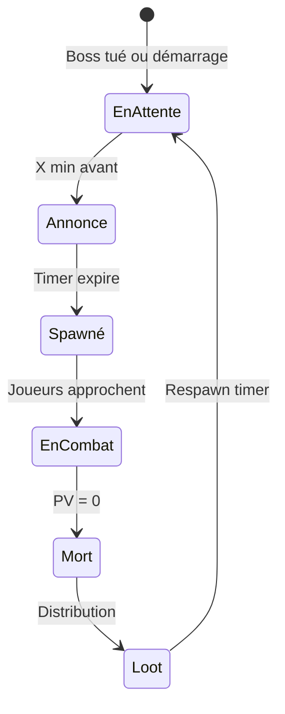
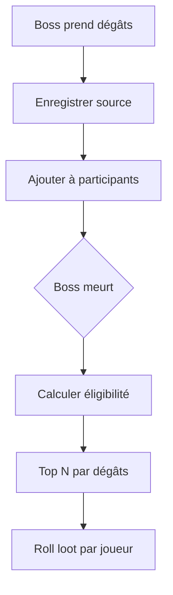
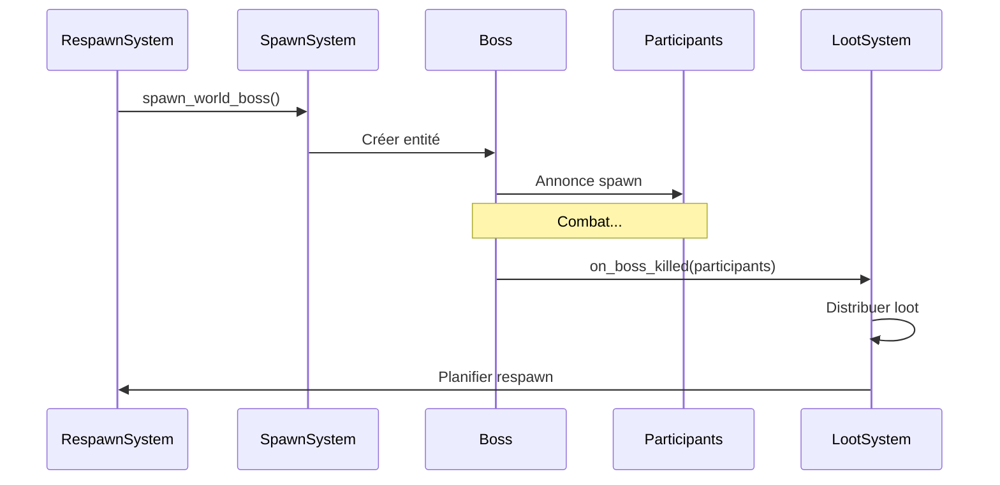

# World bosses et événements

**Catégorie :** 4. Entités et monde  
**Description :** Spawns mondiaux ; participation multi-joueurs.

---

## En-tête et contexte

### Rôle dans le moteur

Les world bosses et événements mondiaux sont des rencontres PvE qui se déroulent dans le **monde persistant** (pas en instance). Un boss ou un événement apparaît à un endroit fixe ou prédéfini ; tous les joueurs présents peuvent y participer. Le loot et les récompenses sont distribués selon des règles (premier coup, participation, etc.).

### Liens vers la référence commune

- `InstanceId` = 0 (monde persistant) — voir [MGE - Référence Commune](../MGE%20-%20Reference%20Commune.md)
- [respawn-dynamique](respawn-dynamique.md) pour les timers de spawn
- [monde-persistant-instancie](monde-persistant-instancie.md)

### Terminologie

| Terme | Définition |
|-------|------------|
| **World boss** | Boss spawné dans le monde persistant ; visible par tous |
| **Événement mondial** | Script/spawn temporaire (invasion, météo spéciale) |
| **Participation** | Contribution au combat (dégâts, soins) pour droit au loot |
| **Annonce** | Notification globale du spawn (et éventuellement du kill) |

---

## Spécifications techniques

### Contraintes

1. **Monde persistant uniquement** : Pas d'instance
2. **Spawn unique** : Un seul exemplaire du boss à la fois (par shard/serveur)
3. **Multi-joueurs** : Pas de limite de participants ; scaling ou cap selon design
4. **Annonce** : Les joueurs sont prévenus du spawn (et optionnellement du countdown)

### Paramètres

| Paramètre | Valeur typique | Description |
|-----------|----------------|-------------|
| Respawn | 2–8 h | Timer long (temps réel ou jeu) |
| Annonce | 5–15 min avant | Optionnel |
| Zone participation | Rayon 50–100 m | Pour compter les dégâts |
| Seuil participation | 1 % des dégâts | Minimum pour loot |
| Max looters | 20–50 | Joueurs pouvant recevoir du loot |

### Formules

- **Droits de loot** : Premier touché, dernier touché, ou top N par dégâts
- **Scaling PV** : `pv_base + n_players * pv_per_player` (avec cap)
- **Distribution** : Chaque participant éligible a un roll indépendant sur la table de loot

### Références croisées

- **respawn-dynamique** : Timer de respawn
- **raids** : Pour comparaison (instance vs monde)
- **loot** : Tables, droits de loot
- **aggro** : Gestion de la menace sur le boss

---

## Modèle de données et API

### Structures Rust (pseudo-code)

```rust
pub struct WorldBossConfig {
    pub boss_prefab_id: PrefabId,
    pub spawn_position: Vec2,
    pub respawn_interval_sec: f64,
    pub announce_before_sec: Option<f64>,
    pub participation_radius: f32,
    pub min_participation_pct: f32,
    pub max_looters: u32,
}

pub struct WorldBossInstance {
    pub entity_id: EntityId,
    pub config: WorldBossConfig,
    pub spawned_at: f64,
    pub participants: HashMap<PlayerId, Participation>,
}

pub struct Participation {
    pub damage_dealt: f32,
    pub heals_given: f32,
    pub is_eligible: bool,
}
```

### API

```rust
pub fn spawn_world_boss(boss_id: WorldBossId) -> Result<EntityId, SpawnError>;

pub fn on_boss_damaged(boss_id: EntityId, player_id: PlayerId, damage: f32);

pub fn on_boss_killed(boss_id: EntityId) -> Vec<PlayerId>;  // Participants éligibles

pub fn announce_boss_spawn(boss_id: WorldBossId, in_sec: f64);

pub fn get_active_world_bosses() -> Vec<WorldBossInstance>;
```

---

## Diagrammes

### Cycle world boss



### Flux de participation



### Séquence spawn → kill



---

## Exemples et cas d'usage

### Cas 1 : Dragon ancien (Allumina)

Spawn toutes les 4 h à la montagne. Annonce 10 min avant. Rayon participation 80 m. Top 30 par dégâts ont droit au loot. Boss scale légèrement avec le nombre de joueurs.

### Cas 2 : Invasion de squelettes

Événement : vagues de squelettes spawnent pendant 15 min. Chaque joueur qui participe reçoit des points ; échange contre récompenses. Pas de boss unique.

### Cas 3 : Météo / environnement

Événement passif : brouillard ou pluie acide pendant 1 h. Effets sur le gameplay (visibilité, dégâts). Pas de boss, mais participation possible à des objectifs.

---

## Cas limites et tests

### Edge cases

| Cas | Comportement attendu | Validation |
|-----|----------------------|------------|
| Boss spawn alors qu'un est déjà vivant | Interdit (un seul à la fois) | Erreur ou ignore |
| Joueur déconnecte pendant combat | Participation conservée ou perdue | Spécifier |
| Kill en 1 hit | Tous ceux qui ont touché sont éligibles | Seuil minimum ? |
| Zone vide | Boss reste jusqu'au timer | Ou despawn si aucun joueur proche (optionnel) |

### Critères de validation

1. **Unicité** : Un seul boss actif par type
2. **Participation** : Comptage correct des dégâts
3. **Loot** : Distribution selon les règles

### Tests suggérés

```rust
#[test]
fn only_one_boss_active() { /* ... */ }

#[test]
fn participation_tracking() { /* ... */ }

#[test]
fn loot_only_for_eligible() { /* ... */ }
```

---

## Détails d'implémentation

### Système de participation

À chaque dégât infligé au boss, le système enregistre `(player_id, damage)`. Les soins donnés aux joueurs qui ont participé peuvent aussi compter. Au kill, on calcule le total des dégâts par joueur, on trie, et on prend le top N. Un seuil minimum (ex. 1 % des PV du boss) évite les « taggers » qui ne font qu'un coup.

### Annonces et notifications

L'annonce peut être : broadcast global (tous les joueurs), ou limitée aux joueurs dans la zone/région. Le format : « Le Dragon Ancien apparaîtra dans 10 minutes à la Montagne de Feu. » Avec lien waypoint optionnel.

### Scaling dynamique

`pv_total = pv_base + min(n_players, max_players) * pv_per_player`. Ex. : 100k base + 5k par joueur, cap 30 joueurs = 250k PV max. Évite que 100 joueurs rendent le boss trivial.

---

## Types d'événements mondiaux

| Type | Durée | Participants | Exemple |
|------|-------|--------------|---------|
| World boss | Jusqu'au kill | Illimité (cap loot) | Dragon, Titan |
| Invasion | 15–30 min | Illimité | Vagues de mobs |
| Météo | 1–2 h | Passif | Brouillard, pluie |
| Capture zone | Variable | Deux factions | PvP objectif |
| Récolte bonus | 1 h | Tous | XP/resource x2 |

---

## Scénarios Allumina

### Dragon Ancien

Spawn toutes les 4 h. Annonce 10 min avant. Position fixe (sommet). Top 30 par dégâts, seuil 2 % pour être éligible. Loot : équipement rare, matériaux de craft.

### Invasion de créatures

Événement déclenché à heure fixe. 5 vagues de 2 min. Chaque kill donne des points. À la fin, échange contre récompenses. Pas de boss unique.

---

## Performance et synchronisation

En monde persistant, le boss est une entité serveur. Les clients voient les mises à jour (PV, position) via le MWS. La participation est calculée côté serveur pour éviter le cheat.

---

## Annexes

### Annexe A : Configuration d'un world boss (exemple)

```yaml
world_boss:
  id: dragon_ancien
  prefab: bosses/dragon_ancien
  spawn: { x: 1200, y: 800 }
  respawn_hours: 4
  announce_minutes: 10
  participation_radius: 80
  min_participation_pct: 2
  max_looters: 30
  scaling: { base_hp: 100000, hp_per_player: 5000, max_players: 30 }
```

### Annexe B : Événements sans boss

Les événements « invasion » ou « météo » sont des systèmes séparés : un scheduler déclenche un script qui spawn des vagues ou modifie l'état global (météo). Pas d'entité boss unique.

### Annexe C : Annonces et UI

L'annonce peut être : toast à l'écran, message dans le chat global, son, notification push (mobile). Un waypoint cliquable ouvre la carte vers la zone du boss.

---

## Guide d'implémentation

1. WorldBossConfig définit les paramètres (respawn, participation, scaling). 2. RespawnSystem planifie le spawn (timer long). Optionnel : annonce X min avant. 3. À l'expiration : spawn le boss à la position fixée. Enregistrer dans la liste des bosses actifs. 4. À chaque dégât : on_boss_damaged enregistre (player_id, damage). 5. À la mort : calculer les participants éligibles (top N, seuil), distribuer le loot, planifier le prochain respawn. Retirer le boss de la liste active.

---

## FAQ et décisions de design

**Q : Un seul boss actif à la fois par type ?**  
R : Oui. Un seul Dragon Ancien, un seul Titan, etc. par shard. Évite la dilution du défi et du loot.

**Q : Participation : dégâts uniquement ou soins aussi ?**  
R : Les deux peuvent compter. Les soins aux joueurs qui ont infligé des dégâts sont parfois pris en compte (éviter l'exclusion des soigneurs).

**Q : Kill en 1 hit par un joueur overgeared ?**  
R : Seuil minimum (ex. 2 % des PV) pour être éligible. Ou : tous ceux qui ont touché sont éligibles, avec un roll commun (le loot va à un random parmi eux).

**Q : Annonce à tous les joueurs ou zone uniquement ?**  
R : Souvent à tous (broadcast) pour maximiser la participation. Alternative : joueurs dans la région ou abonnés aux événements.

**Q : Boss reste si personne ne vient ?**  
R : Oui, jusqu'à ce qu'il soit tué. Optionnel : despawn après un délai (ex. 2 h) si aucun joueur n'est dans la zone (économie de ressources).

**Q : Événements sans boss (invasion) ?**  
R : Système séparé. Un script spawn des vagues à des positions. Les joueurs tuent, accumulent des points. Pas d'entité boss unique, juste des mobs.

**Q : Scaling avec le nombre de joueurs ?**  
R : Oui, pour éviter le trivial. Formule : pv_base + min(n, max) * pv_per_player. Cap pour ne pas rendre le boss impossible avec 100 joueurs.

**Q : Loot personnel ou partagé ?**  
R : Personnel : chaque éligible roll indépendamment. Partagé : need/greed entre les éligibles. Personnel est plus simple et évite les conflits.

---

## Spécifications étendues

### Participation scoring

```
score = damage_dealt * 1.0 + heals_given * 0.5
eligible = score >= total_damage * min_participation_pct
top_n = sort_by_score_desc(participants).take(max_looters)
```

### Événements world boss

- `WorldBossSpawning { boss_id, in_seconds }`
- `WorldBossSpawned { boss_id, entity_id }`
- `WorldBossKilled { boss_id, killers: Vec<PlayerId> }`

---

## Notes techniques complémentaires

### World boss et scaling dynamique

Au moment du spawn, compter le nombre de joueurs dans la zone ou sur le shard. Ajuster les PV initiaux : `hp = base + min(player_count, cap) * hp_per_player`. Éviter le spawn avec 0 joueur = boss trivial si quelqu'un arrive après.

### World boss et annonce multi-canal

L'annonce peut aller sur : chat global, notification in-game, email (optionnel), push mobile. Chaque canal a sa propre configuration (activé/désactivé).

### Événements sans entité boss

Les invasions : un script spawn des vagues à des intervalles. Chaque vague = N mobs à des positions. Les joueurs tuent, gagnent des points. Table de récompenses par points. Pas d'entité « boss » unique.

---

## Résumé et checklist

| Étape | Action |
|-------|--------|
| 1 | Config WorldBossConfig (respawn, participation) |
| 2 | Planifier spawn (timer long, optionnel annonce) |
| 3 | À spawn : créer entité, enregistrer participants |
| 4 | À dégâts : enregistrer (player_id, damage) |
| 5 | À mort : top N éligibles, distribuer loot |
| 6 | Planifier prochain respawn |
| 7 | Tester unicité (un seul boss actif) |

---

## Références

| Document | Rôle |
|----------|------|
| [MGE - Référence Commune](../MGE%20-%20Reference%20Commune.md) | Types de base |
| [respawn-dynamique](respawn-dynamique.md) | Timers de spawn |
| [raids](raids.md) | Comparaison instances |
| [monde-persistant-instancie](monde-persistant-instancie.md) | Monde partagé |
| [_index 04](_index.md) | Index catégorie |
| [Index MGE](../_index.md) | Index global |
