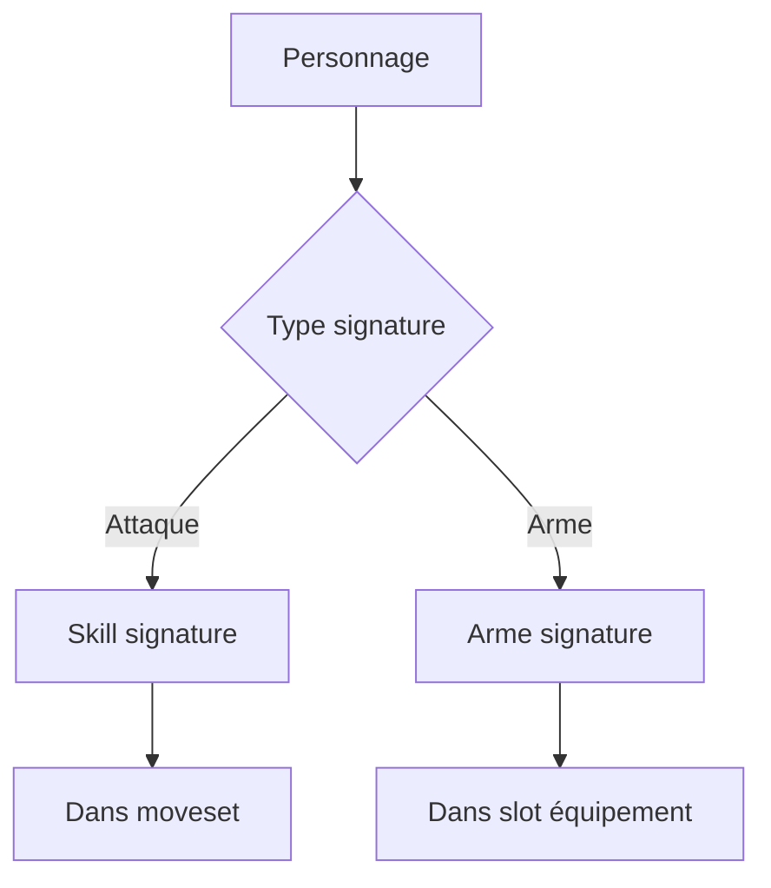

# Arme unique signature

**Catégorie :** 05. Joueur et personnage  
**Description :** Arme ou attaque spécifique au personnage.

## Contexte

Point de la référence technique MGE. L'arme unique ou signature est l'attaque ou l'arme distinctive d'un personnage jouable. Elle le différencie des autres (ex. ultime de personnage, arme légendaire liée à l'histoire).

Ce point complète le [moveset personnage](moveset-personnage.md) et s'intègre au [combat](../../07-combat/action.md). Les types communs sont dans la [Référence Commune](../MGE%20-%20Reference%20Commune.md).

### Rôle dans le moteur

- **Identification visuelle** : l'attaque signature est reconnaissable
- **Gameplay** : capacité unique, souvent puissante ou à fort cooldown
- **Narratif** : lien avec l'histoire du personnage

### Liens

- [Moveset personnage](moveset-personnage.md)
- [Action combat](../../07-combat/action.md)
- [Slots équipement](slots-equipement.md) — si arme physique

---

## Portée

- Définition de l'arme/attaque signature
- Un par personnage (règle typique)
- Intégration combat et moveset

---

## Spécifications techniques

### Deux implémentations possibles

1. **Attaque signature** : compétence spéciale dans le moveset, marquée `is_signature`
2. **Arme signature** : objet équipable unique au personnage (slot main_hand ou off_hand)

### Contraintes

| Contrainte | Valeur |
|------------|--------|
| Nombre par personnage | 1 (signature) |
| Cooldown typique | Élevé (30–120 s) |
| Remplaçable | Non (fixe au personnage) |

### Règles

- Chaque personnage a au plus une signature.
- La signature peut être une attaque OU une arme, pas les deux.
- Si arme : elle ne peut pas être droppée ou vendue (ou avec confirmation spéciale).

---

## Modèle de données et API

### Structures Rust (pseudo-code)

```rust
#[derive(Serialize, Deserialize)]
pub enum SignatureType {
    Skill(String),   // skill_id
    Weapon(ItemId), // item_id de l'arme
}

#[derive(Serialize, Deserialize)]
pub struct CharacterSignature {
    pub character_template_id: String,
    pub signature: SignatureType,
}

pub trait SignatureService {
    fn get_signature(&self, character_id: CharacterId) -> Option<CharacterSignature>;
}
```

---

## Diagrammes

### Hiérarchie signature



---

## Exemples et cas d'usage

### Allumina — Attaque signature

- Guerrier : "Frappe héroïque" — coup à zone, 60 s cooldown
- Mage : "Météore" — AOE dégâts feu, 90 s cooldown

### Jeu de type MOBA / Fighter

- Chaque personnage a une ultime signature (R, Y, etc.)
- Animation et effet visuel distinctifs

---

## Cas limites et tests

### Cas limites

| Cas | Comportement attendu |
|-----|----------------------|
| Personnage sans signature | Optionnel, pas d'erreur |
| Signature désactivée (CC) | Comportement normal du combat |
| Arme signature équipée par erreur | Impossible (objet lié au personnage) |

### Critères de validation

- [ ] Signature correctement associée au personnage
- [ ] Exécution combat conforme

### Tests unitaires suggérés

```rust
#[test]
fn test_signature_skill_executable() {
    let char_id = create_warrior();
    let sig = get_signature(char_id).unwrap();
    assert!(matches!(sig, SignatureType::Skill(_)));
    let skill_id = sig.skill_id();
    assert!(combat_can_execute(char_id, skill_id));
}

#[test]
fn test_signature_weapon_bound() {
    let char_id = create_hero_with_signature_weapon();
    let weapon = get_signature_weapon(char_id).unwrap();
    assert!(!weapon.can_drop);
    assert!(!weapon.can_sell);
}
```

---

## Annexes

### Attaque vs arme — Choix de design

| Critère | Attaque signature | Arme signature |
|---------|-------------------|----------------|
| Remplaçable | Non | Non (liée au personnage) |
| Équipement | N/A (dans moveset) | Slot main_hand ou off_hand |
| Stats | Fixes (définies dans skill) | Définies dans l'objet (peut scale avec niveau) |
| Visuel | Animation + effet | Modèle 3D ou sprite de l'arme |
| Évolution | Amélioration par niveau/talent | Renforcement, enchantement |

### Animation et feedback visuel

- **Attaque signature** : animation dédiée, plus longue et spectaculaire
- **Effet visuel** : particules, screen shake, flash
- **Audio** : son distinctif, voix du personnage (si doublage)
- **UI** : icône spéciale, bordure dorée ou effet de glow sur la barre de compétences

### Équilibrage

- Les signatures sont souvent les compétences les plus puissantes ou à fort impact
- Cooldown élevé pour éviter le spam
- Coût en ressources (mana/endurance) significatif
- Dégâts ou utilité (CC, heal, buff) à la hauteur du cooldown

### Exemples par type de jeu

- **Action RPG** : ultime par personnage (Allumina)
- **MOBA** : compétence R (ultime) unique par champion
- **Fighter** : move signature ou "super" par personnage
- **JRPG** : limite break, overdrive, ou attaque spéciale de fin de combo

### Implémentation — Attaque signature

- Marquer la compétence dans le moveset : `is_signature: true`
- Le moteur de combat traite les signatures comme des compétences normales (même pipeline)
- Différences possibles : cooldown plus long, animation dédiée, icône spéciale, feedback sonore
- Pas de logique spéciale obligatoire : le "signature" est une étiquette pour le game design et l'UI

### Implémentation — Arme signature

- L'arme est un objet avec le flag `is_signature: true` et `bound_to_character: character_id`
- Elle ne peut pas être droppée, vendue ou transférée (ou avec confirmation "Détruire définitivement")
- Elle peut être améliorée (renforcement, enchantement) comme une arme normale
- Elle occupe le slot main_hand ou off_hand selon le type
- Si le personnage change de classe et n'utilise plus cette arme : elle reste en inventaire ou en stash, mais ne peut pas être équipée par un autre personnage

### Évolution de la signature

- **Niveau** : la signature peut gagner en puissance avec le niveau du personnage
- **Talents** : des points de talent peuvent améliorer la signature (réduction cooldown, + dégâts)
- **Quêtes** : une quête peut "libérer" le potentiel de la signature (upgrade)
- **Évolution narrative** : dans une histoire linéaire, la signature évolue avec l'intrigue

### Animation et VFX

- **Animation** : piste d'animation dédiée (plus longue, plus dynamique)
- **Effets** : particules, trails, impact au sol
- **Caméra** : léger zoom ou shake lors de l'exécution (optionnel)
- **Audio** : son distinctif, réplique du personnage ("Frappe héroïque !")

### Tests

```rust
#[test]
fn test_signature_skill_in_moveset() {
    let moveset = get_moveset_for_template("warrior");
    let sig_skill = moveset.skills.iter().find(|s| s.is_signature);
    assert!(sig_skill.is_some());
}

#[test]
fn test_signature_weapon_cannot_drop() {
    let weapon = get_signature_weapon(character_id).unwrap();
    assert!(!inventory.can_drop(weapon.instance_id));
}

#[test]
fn test_signature_cooldown_respected() {
    execute_signature(character_id);
    assert!(!can_execute_signature(character_id));
    advance_time(signature_cooldown_ms);
    assert!(can_execute_signature(character_id));
}
```

### Relation avec le lore

- L'arme ou l'attaque signature peut être liée à l'histoire du personnage
- **Exemple** : l'épée familiale transmise de génération en génération
- **Narratif** : quêtes, cutscenes qui mettent en valeur la signature
- Documentation séparée pour le lore ; le moteur traite la signature comme une mécanique

### Variantes et skins de signature

- Une signature peut avoir des skins (apparences alternatives)
- Déblocage : achievement, achat, événement
- Stats identiques ; seul le visuel change
- Stockage : `signature_skin_id` dans les données du personnage

### Équilibrage PvP

En PvP, les signatures sont souvent très puissantes. Considérations :

- **Cooldown** : suffisamment long pour éviter le spam
- **Counterplay** : possibilité d'esquiver, d'interrompre, de parer
- **Telegraph** : délai ou indication visuelle pour que l'adversaire puisse réagir
- **Récompense du skill** : plus difficile à placer = plus satisfaisant

### Documentation pour les modders

Si le moteur supporte les mods :

- Format de définition de signature (JSON, script)
- Comment ajouter une nouvelle attaque signature pour un personnage custom
- Restrictions : assets requis, hooks disponibles

### Format de données — Attaque signature (JSON)

```json
{
  "character_template_id": "warrior",
  "signature_type": "skill",
  "skill_id": "heroic_strike",
  "description": "Frappe dévastatrice infligeant 250% des dégâts en zone."
}
```

### Format de données — Arme signature (JSON)

```json
{
  "character_template_id": "knight",
  "signature_type": "weapon",
  "item_id": "knight_sword_legendary",
  "bound": true,
  "cannot_drop": true,
  "cannot_sell": true,
  "description": "Épée transmise par la lignée des chevaliers."
}
```

### Conditions de déblocage de la signature

La signature peut être débloquée progressivement :

- **Niveau** : disponible au niveau 1 (innée) ou débloquée au niveau 10
- **Quête** : une quête spéciale débloque la "vraie" signature (upgrade)
- **Histoire** : déblocage après un événement narratif (cutscene, boss)
- Stockage : `signature_unlocked_at` ou `signature_upgrade_level` dans les données personnage

### Combos avec la signature

- La signature peut être le finisher d'un combo (ex. A-A-B-B = signature)
- Ou elle peut être utilisée librement avec son cooldown
- Le système de combat gère l'état du combo ; la signature est une skill comme les autres une fois le combo atteint

### Feedback utilisateur

- **Icône** : bordure dorée ou glow sur la barre de compétences
- **Cooldown** : affichage du temps restant (nombre ou barre circulaire)
- **Prêt** : effet visuel quand le cooldown est terminé (pulsation, son)
- **Exécution** : animation plein écran ou zoom pour renforcer l'impact

### Intégration avec les achievements

- "Exécuter 100 signatures" : compteur de type achievement
- "Tuer un boss avec la signature" : objectif spécifique
- Les achievements peuvent récompenser des skins de signature

### Liste de vérification pour l'implémentation

- [ ] La signature est correctement associée au template de personnage
- [ ] Le moveset ou l'équipement reflète la signature
- [ ] Les cooldowns et coûts sont appliqués
- [ ] L'animation et les VFX sont joués
- [ ] L'UI affiche le statut (prêt / cooldown)
- [ ] Les tests unitaires couvrent les cas principaux
- [ ] La documentation game design décrit l'équilibrage

### Chargement de la signature

- Au chargement du personnage : lecture de `CharacterSignature` depuis le template ou les données
- Si type Skill : la skill est déjà dans le moveset (marquée is_signature)
- Si type Weapon : l'objet est créé ou récupéré ; vérification qu'il est équipé ou en inventaire
- Cache : la signature est chargée une fois et conservée en mémoire

### Signature et progression narrative

Dans un jeu narratif, la signature peut évoluer avec l'histoire :

- **Acte 1** : signature basique (niveau 1)
- **Acte 2** : après un événement, signature améliorée (niveau 2, plus de dégâts)
- **Acte 3** : forme ultime (niveau 3, effet visuel majeur)
- Stockage : `signature_level` ou `signature_upgrade` dans les données de progression

### Intégration avec le système de compétences

- La signature (si skill) utilise le même pipeline que les autres compétences
- Cooldown, coût, ciblage, dégâts : tout est dans SkillDefinition
- La seule différence : étiquette "signature" pour l'UI et le game design
- Pas de branche spéciale dans le code de combat (sauf pour les effets visuels optionnels)

### Arme signature — Gestion du cycle de vie

- **Création** : à la création du personnage ou lors d'une quête
- **Équipement** : automatique ou manuel selon le design
- **Perte** : jamais (bound) ou lors d'un événement narratif exceptionnel
- **Destruction** : impossible en conditions normales
- **Transfert** : jamais vers un autre personnage

### Tests supplémentaires

```rust
#[test]
fn test_signature_skill_deals_more_damage() {
    let base_skill = get_skill("basic_slash");
    let sig_skill = get_signature_skill("warrior");
    let damage_base = calculate_damage(base_skill, attacker, target);
    let damage_sig = calculate_damage(sig_skill, attacker, target);
    assert!(damage_sig > damage_base);
}

#[test]
fn test_signature_weapon_retains_on_death() {
    let char_id = create_hero_with_signature_weapon();
    let weapon = get_equipped_weapon(char_id).unwrap();
    kill_character(char_id);
    let inv = get_corpse_inventory(char_id);
    assert!(!inv.contains(weapon.instance_id));
    let char_inv = get_character_inventory(char_id);
    assert!(char_inv.contains(weapon.instance_id));
}
```

### Références croisées

La signature (attaque) est définie dans le [moveset personnage](moveset-personnage.md) avec `is_signature: true`. La signature (arme) est un objet équipable spécial, géré par les [slots équipement](slots-equipement.md). L'exécution suit le [combat](../../07-combat/action.md). Les achievements peuvent récompenser des skins de signature. Chaque personnage a au plus une signature (attaque ou arme). L'animation et les VFX de la signature sont distinctifs pour renforcer l'identité du personnage. En PvP, le cooldown élevé et le counterplay assurent l'équilibrage.

### Résumé technique

| Aspect | Attaque signature | Arme signature |
|--------|-------------------|----------------|
| Stockage | Moveset (is_signature: true) | Objet (bound, cannot_drop) |
| Exécution | Pipeline combat standard | Équipement + attaque normale |
| Remplaçable | Non | Non |
| Évolution | Niveau, talents, quêtes | Renforcement, enchantement |
| Visuel | Animation + VFX dédiés | Modèle sprite/3D de l'arme |

### Intégration avec le système de progression

Les compétences de type signature peuvent bénéficier de la progression comme les autres :

- **Niveau de skill** : si le jeu utilise des skills par usage, la signature monte aussi
- **Points de talent** : des talents dédiés améliorent la signature (dégâts, cooldown, zone)
- **Quête d'upgrade** : une quête spéciale débloque une version améliorée

### Checklist pour un nouveau personnage

Lors de l'ajout d'un personnage jouable au jeu :

1. Définir le moveset avec au moins une compétence marquée `is_signature`
2. Ou définir une arme signature dans CharacterSignature
3. Créer l'animation et les VFX distinctifs
4. Configurer le cooldown et le coût (mana/endurance)
5. Tester l'équilibrage en combat
6. Documenter dans le guide du joueur

### Synthèse pour Allumina

Dans Allumina, chaque personnage jouable a une attaque signature (compétence ultime) plutôt qu'une arme signature. Les signatures sont des skills du moveset avec `is_signature: true`, cooldown 60–90 secondes, et des animations/VFX dédiés. L'équilibrage PvE et PvP est assuré par le cooldown et la telegraph visuelle.

### Tableau récapitulatif des implémentations

| Implémentation | Type | Stockage | Remplaçable |
|----------------|------|----------|-------------|
| Skill dans moveset | Attaque | Moveset JSON | Non |
| Objet bound | Arme | Inventory + flag | Non |
| Les deux | Mixte | N/A (un seul) | N/A |

La signature est une caractéristique distinctive du personnage. Elle doit être mémorable pour le joueur et reconnaissable pour les adversaires en PvP. L'animation et le feedback sonore contribuent à l'impact perçu. Les skins de signature offrent une personnalisation cosmétique sans affecter l'équilibrage.

### Checklist d'équilibrage

- Cooldown suffisant pour éviter le spam (60 s minimum recommandé)
- Dégâts ou utilité proportionnels au cooldown
- Telegraph visible en PvP (0.5–1 s d'indication avant l'impact)
- Possibilité de contre-jouer (esquive, interrupt, CC)
- Récompense satisfaisante quand la signature touche (feedback visuel/sonore fort)

### Intégration avec le système d'achievements

Achievements possibles : "Exécuter 10/100/1000 signatures", "Tuer un boss avec la signature", "Signature critique sur un joueur en PvP". Les achievements peuvent débloquer des skins de signature. Compteur stocké dans les données de progression du personnage.

### Documentation design

Pour chaque personnage, documenter : nom de la signature, description courte, cooldown, coût, type de cible, formule de dégâts, effet secondaire (CC, buff, etc.). Cette doc est la source de vérité pour les designers et permet la cohérence entre code et contenus. Format suggéré : fiche par personnage avec screenshot de l'animation, tableau des valeurs (cooldown, dégâts, zone), et notes de balance passées (patches).

---

## Références

- [Référence Commune MGE](../MGE%20-%20Reference%20Commune.md)
- [Moveset personnage](moveset-personnage.md)
- [Action combat](../../07-combat/action.md)
- [Index catégorie 05](_index.md)
- [Index MGE](../_index.md)
