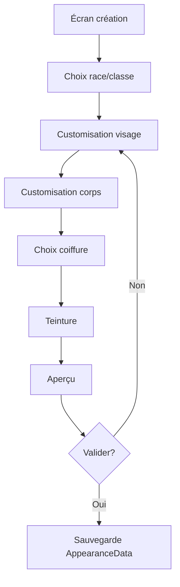
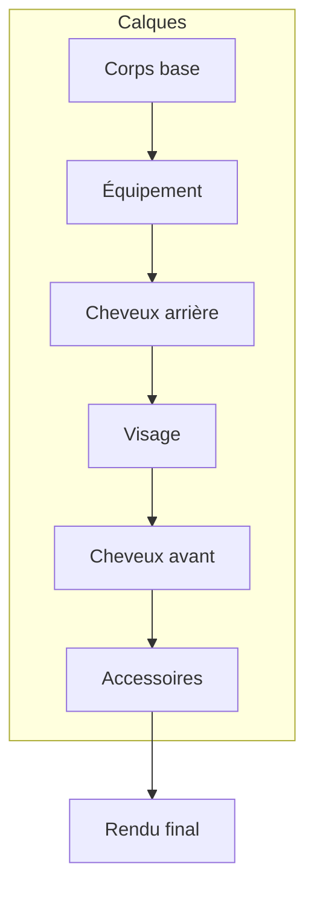

# Customisation

**Catégorie :** 05. Joueur et personnage  
**Description :** Visage, corps ; coiffures ; teinture ; costumes.

## Contexte

Point de la référence technique MGE. La customisation définit l'apparence visuelle du personnage : visage, corps, coiffures, teintures, costumes et skins. Ces données sont persistées avec les [données joueur](donnees-joueur.md) via KindMother et utilisées pour le rendu (sprites, animations).

Le glossaire Miyukini utilise les termes **Opérateur** et **KindMother** ; la customisation fait partie des données gérées par le Core de persistance. Les types communs sont dans la [Référence Commune](../MGE%20-%20Reference%20Commune.md).

### Rôle dans le moteur

- **Personnalisation** : le joueur définit l'apparence de son personnage
- **Rendu** : assemblage des sprites (corps, tête, cheveux, équipement)
- **Z-order** : ordre des calques (corps, vêtements, cheveux, accessoires)
- **Persistance** : apparence sauvegardée entre les sessions

### Liens

- [Données joueur](donnees-joueur.md) — persistance
- [Slots équipement](slots-equipement.md) — transmog, apparence d'équipement
- [Gestion sprites](../../01-affichage-rendu/gestion-sprites.md) — assemblage visuel
- [Animations sprites](../../01-affichage-rendu/animations-sprites.md) — directions, états

---

## Portée

- **Visage** : forme, traits (sliders ou presets)
- **Corps** : taille, corpulence, proportions
- **Coiffures** : type, couleur, longueur
- **Teinture** : couleur de peau, yeux, etc.
- **Costumes** : vêtements cosmétiques (non liés aux stats)
- **Skins** : variantes complètes (optionnel)
- Persistance et sérialisation

---

## Spécifications techniques

### Contraintes

| Contrainte | Valeur |
|------------|--------|
| Encodage couleur | RGBA u8 ou hex |
| Nombre de sliders | 5–15 par catégorie (configurable) |
| Plages de valeurs | 0–100 ou -1 à 1 (normalisé) |
| Nombre de presets | Illimité (limité par stockage) |
| Taille données appareance | < 2 Ko sérialisées |

### Systèmes de customisation

#### Sliders (continu)

- **Visage** : largeur, hauteur, nez, bouche, yeux.
- **Corps** : taille, largeur épaules, longueur bras.
- Valeurs typiquement en `[0, 100]` ou normalisées `[-1, 1]`.

#### Presets (discret)

- **Coiffures** : liste d’IDs (hairstyle_001, hairstyle_002, …).
- **Couleurs** : palette prédéfinie ou teinte HSV.
- **Costumes** : IDs d’objets cosmétiques.

#### Teinture

- **Couleur de peau** : palette ou RGB.
- **Couleur des cheveux** : palette (base + mèches optionnelles).
- **Couleur des yeux** : palette.

### Z-order des calques (rendu)

Ordre de dessin typique (de bas en haut) :

1. Corps (base)
2. Sous-vêtements / maillot
3. Équipement (jambes, torse, pieds, mains, tête)
4. Cape / dos
5. Cheveux (arrière)
6. Visage (yeux, bouche)
7. Cheveux (avant)
8. Accessoires (chapeau, lunettes)
9. Effets (particules, aura)

---

## Modèle de données et API

### Structures Rust (pseudo-code)

```rust
#[derive(Serialize, Deserialize)]
pub struct AppearanceData {
    pub version: u32,
    pub body: BodyAppearance,
    pub face: FaceAppearance,
    pub hair: HairAppearance,
    pub colors: ColorScheme,
    pub costume_overrides: Option<CostumeOverrides>,  // Cosmétiques
}

#[derive(Serialize, Deserialize)]
pub struct BodyAppearance {
    pub height: u8,       // 0–100
    pub build: u8,        // 0–100 (mince → musclé)
    pub shoulder_width: u8,
}

#[derive(Serialize, Deserialize)]
pub struct FaceAppearance {
    pub preset_id: Option<String>,
    pub face_width: u8,
    pub eye_size: u8,
    pub eye_spacing: u8,
    pub nose_size: u8,
    pub mouth_size: u8,
}

#[derive(Serialize, Deserialize)]
pub struct HairAppearance {
    pub style_id: String,
    pub length: u8,       // 0–100
    pub bangs: Option<String>,  // Frange séparée
}

#[derive(Serialize, Deserialize)]
pub struct ColorScheme {
    pub skin: Color,
    pub hair: Color,
    pub eyes: Color,
}

#[derive(Serialize, Deserialize)]
pub struct Color {
    pub r: u8,
    pub g: u8,
    pub b: u8,
    pub a: u8,
}
```

### API

```rust
pub trait AppearanceService {
    fn get_appearance(&self, character_id: CharacterId) -> Result<AppearanceData, DbError>;
    fn set_appearance(&self, character_id: CharacterId, data: AppearanceData) -> Result<(), DbError>;
    fn get_available_hair_styles(&self, race_id: &str) -> Vec<HairStyleInfo>;
    fn get_available_costumes(&self, character_id: CharacterId) -> Vec<CostumeInfo>;
}
```

---

## Diagrammes

### Flux de création d'apparence



### Assemblage visuel (calques)



---

## Exemples et cas d'usage

### Allumina — Écran de création

- **Étape 1** : choix race (Humain, Elfe, Nain).
- **Étape 2** : sliders visage (5–8 paramètres selon race).
- **Étape 3** : coiffure (liste déroulante ou grille).
- **Étape 4** : couleurs (peau, cheveux, yeux).
- **Étape 5** : aperçu 360° ou animations.
- Validation → création du personnage avec `AppearanceData`.

### Costumes cosmétiques

- Achats boutique ou récompenses : déblocage de costumes.
- Costume = apparence de remplacement (sans stats).
- Stockage : `costume_overrides` dans `AppearanceData` ou table séparée.

### Changement en jeu (coiffeur, miroir)

- PNJ "Coiffeur" : modification coiffure et teinture.
- Coût en or ou ressource.
- Application immédiate, persistance via `set_appearance`.

---

## Cas limites et tests

### Cas limites

| Cas | Comportement attendu |
|-----|----------------------|
| Coiffure inexistante | Fallback sur défaut ou erreur |
| Couleur hors palette | Clamp ou rejet |
| Données corrompues | Chargement avec valeurs par défaut |
| Race incompatible avec coiffure | Liste filtrée par race |

### Critères de validation

- [ ] Apparence persistée correctement
- [ ] Rendu conforme aux paramètres
- [ ] Changement en jeu persistant

### Tests unitaires suggérés

```rust
#[test]
fn test_appearance_serialization_roundtrip() {
    let data = create_test_appearance_data();
    let json = serde_json::to_string(&data).unwrap();
    let restored: AppearanceData = serde_json::from_str(&json).unwrap();
    assert_eq!(restored.hair.style_id, data.hair.style_id);
}

#[test]
fn test_default_appearance_for_race() {
    let default = get_default_appearance("human");
    assert!(!default.hair.style_id.is_empty());
    assert!(default.colors.skin.r > 0);
}
```

---

## Annexes

### Palette de couleurs prédéfinie

Pour les jeux utilisant des palettes fixes (style pixel art ou ressources limitées) :

| ID | Usage | Exemple hex |
|----|-------|-------------|
| skin_light | Peau claire | #F5D0C5 |
| skin_medium | Peau moyenne | #C68642 |
| skin_dark | Peau sombre | #8D5524 |
| hair_blonde | Cheveux blonds | #D4A84B |
| hair_brown | Cheveux bruns | #6B4423 |
| hair_black | Cheveux noirs | #2C1810 |

### Mapping sprite par race

Chaque race peut avoir des chemins de sprites différents :

- `humain` : `sprites/characters/human/body.png`
- `elfe` : `sprites/characters/elf/body.png`
- Les sliders d'apparence modifient l'offset ou la sélection de sous-sprites

### Compatibilité avec le transmog

La customisation et le transmog (slots équipement) interagissent :

- **Cosmétiques** : costumes dans `AppearanceData` s'affichent par-dessus le corps
- **Transmog** : remplace l'apparence d'un équipement réel
- **Priorité** : Transmog > Costume cosmétique > Équipement réel

### Système de sliders — Implémentation

- **Valeurs** : u8 (0–255) ou f32 (0.0–1.0) pour plus de précision
- **Interpolation** : pour le corps, les sliders peuvent piloter une morphologie (blend shapes, bones)
- **Presets** : sauvegarde de configurations entières (ex. "Visage A", "Visage B") pour permettre au joueur de revenir en arrière
- **Aperçu temps réel** : le personnage 3D ou 2D se met à jour en direct lors des modifications

### Coiffures et variantes

- **Style de base** : ID unique (ex. `hair_short_01`)
- **Variantes** : couleurs prédéfinies ou choix libre (HSL)
- **Longueur** : slider 0–100 ou presets (court, mi-long, long)
- **Frange** : élément séparé avec son propre style (ex. `bangs_straight`, `bangs_side`)
- **Animations** : les cheveux peuvent avoir des bones pour le mouvement (vent, course)

### Corps — Différences par race

- Chaque race a un mesh ou sprite de base différent
- Les sliders s'appliquent dans les limites de la race (ex. Elfes plus élancés, Nains plus trapus)
- **Bounds** : les valeurs de sliders peuvent être clampées différemment par race
- **Incompatibilités** : une coiffure humaine peut ne pas exister pour les Nains (liste filtrée)

### Teinture — Modèles de couleur

- **RGB** : valeurs 0–255 par canal
- **HSV** : Teinte (0–360), Saturation (0–100), Valeur (0–100) — plus intuitif pour le joueur
- **Palette prédéfinie** : carrés de couleur cliquables (comme dans beaucoup de jeux)
- **Couleurs débloquées** : certaines teintes peuvent être des récompenses (achat, quête)

### Costumes cosmétiques — Intégration boutique

- Les costumes peuvent être achetés (monnaie premium, or) ou débloqués
- **Table** : `cosmetic_unlocks(character_id, costume_id, unlocked_at)`
- **Affichage** : le costume s'applique en plus ou à la place de l'équipement visuel
- **Pas de stats** : purement esthétique

### Export / import d'apparence

- **Code de partage** : sérialisation courte (base64) de l'apparence pour partager des créations
- **Import** : le joueur colle un code et l'apparence est appliquée (si les assets sont disponibles)
- **Usage** : communautés, guides de création, événements

### Tests

```rust
#[test]
fn test_appearance_valid_for_race() {
    let human_appearance = get_default_appearance("human");
    assert!(is_valid_appearance(&human_appearance, "human"));
    let elf_appearance = human_appearance.with_hair("hair_elf_01");
    assert!(is_valid_appearance(&elf_appearance, "elf"));
}
```

### Assets et chemins

- Structure des dossiers : `assets/characters/{race}/body/`, `assets/characters/{race}/hair/`
- Noms de fichiers : `{race}_{part}_{variant}.png` (ex. `human_body_male_01.png`)
- Chargement : au besoin (lazy) ou au démarrage de l'écran de création

### Limites techniques

- **Nombre de sliders** : trop de sliders = UX confuse ; 5–10 par catégorie suffisent
- **Combinaisons** : avec 10 coiffures × 20 couleurs = 200 variantes ; gérable
- **Taille des textures** : atlases pour réduire les draw calls

### Réutilisabilité des presets

- Les presets peuvent être partagés entre races si les assets sont compatibles
- Un preset "Visage A" peut avoir des valeurs différentes selon la race (mapping)
- Export/import : le code contient les IDs ; les assets doivent exister côté récepteur

### Intégration avec l'écran de personnage (in-game)

- En jeu, le joueur peut ouvrir un miroir ou un menu "Apparence" pour modifier certains éléments (coiffure, teinture) sans recommencer
- Coût possible : or, objet rare, ou gratuit selon le design
- Les modifications sont persistées immédiatement

### Schéma de données AppearanceData (complet)

```rust
#[derive(Serialize, Deserialize)]
pub struct AppearanceData {
    pub version: u32,
    pub body: BodyAppearance,
    pub face: FaceAppearance,
    pub hair: HairAppearance,
    pub colors: ColorScheme,
    pub costume_overrides: Option<CostumeOverrides>,
    pub skin_overrides: Option<String>,  // ID du skin débloqué
}

#[derive(Serialize, Deserialize)]
pub struct BodyAppearance {
    pub preset_id: Option<String>,
    pub height: u8,
    pub build: u8,
    pub shoulder_width: u8,
    pub arm_length: u8,
    pub leg_length: u8,
}

#[derive(Serialize, Deserialize)]
pub struct FaceAppearance {
    pub preset_id: Option<String>,
    pub face_width: u8,
    pub eye_size: u8,
    pub eye_spacing: u8,
    pub eye_height: u8,
    pub nose_size: u8,
    pub nose_length: u8,
    pub mouth_size: u8,
    pub chin_width: u8,
}

#[derive(Serialize, Deserialize)]
pub struct HairAppearance {
    pub style_id: String,
    pub bangs_id: Option<String>,
    pub length: u8,
    pub volume: u8,
}

#[derive(Serialize, Deserialize)]
pub struct ColorScheme {
    pub skin: Color,
    pub skin_tone: Option<u8>,  // Teinte secondaire
    pub hair: Color,
    pub hair_highlight: Option<Color>,
    pub eyes: Color,
    pub eyebrows: Color,
}

#[derive(Serialize, Deserialize)]
pub struct Color {
    pub r: u8,
    pub g: u8,
    pub b: u8,
    pub a: u8,
}
```

### Validation des données d'apparence

- Chaque champ a des bornes (0–255 pour u8)
- Les IDs de coiffure, preset doivent exister dans les assets
- Les couleurs doivent être dans la palette autorisée (si palette utilisée)
- Race et apparence doivent être compatibles

### Rendu — Ordre des calques (détail)

| Ordre | Calque | Source |
|-------|--------|--------|
| 1 | Corps base | body preset + sliders |
| 2 | Sous-vêtements | costume ou défaut |
| 3 | Jambes | équipement |
| 4 | Torse | équipement |
| 5 | Pieds | équipement |
| 6 | Mains | équipement |
| 7 | Dos / cape | équipement |
| 8 | Cheveux arrière | hair |
| 9 | Tête / casque | équipement |
| 10 | Visage | face preset + sliders |
| 11 | Cheveux avant | hair |
| 12 | Accessoires | équipement ou cosmétique |
| 13 | Effets | particules, aura |

### Liste de vérification

- [ ] Tous les champs sont sérialisables et persistés
- [ ] La validation rejette les données invalides
- [ ] Le rendu respecte l'ordre des calques
- [ ] Les assets sont chargés correctement par race
- [ ] L'écran de création permet toutes les options
- [ ] L'export/import fonctionne (si implémenté)

### API AppearanceService (détail)

```rust
pub trait AppearanceService {
    fn get_appearance(&self, character_id: CharacterId) -> Result<AppearanceData, DbError>;
    fn set_appearance(&self, character_id: CharacterId, data: AppearanceData) -> Result<(), DbError>;
    fn get_available_hair_styles(&self, race_id: &str) -> Vec<HairStyleInfo>;
    fn get_available_costumes(&self, character_id: CharacterId) -> Vec<CostumeInfo>;
    fn unlock_costume(&self, character_id: CharacterId, costume_id: &str) -> Result<(), DbError>;
    fn get_default_appearance(&self, race_id: &str) -> AppearanceData;
    fn validate_appearance(&self, data: &AppearanceData, race_id: &str) -> Result<(), ValidationError>;
}
```

### Préchargement des assets de création

Pour un chargement fluide de l'écran de création :

- Charger les sprites/meshes de toutes les races en arrière-plan
- Ou : charger uniquement la race sélectionnée
- Barre de progression pendant le chargement
- Cache des assets pour éviter les rechargements

### Références croisées

L'apparence est utilisée par le rendu, l'écran de création et les slots équipement (transmog). Les données sont stockées dans PlayerData.character_sheet.appearance. Les assets (sprites, meshes) sont chargés selon la race et les choix du joueur.

### Points d'extension futurs

- Système de tatouages et marques
- Voix du personnage (sélection parmi des samples)
- Taille adaptable (petit, grand) avec impact sur la hitbox
- Couleur des vêtements teintables (Hue picker)

---

## Références

Documents liés à la customisation :

- [Référence Commune MGE](../MGE%20-%20Reference%20Commune.md)
- [Données joueur](donnees-joueur.md)
- [Slots équipement](slots-equipement.md)
- [Gestion sprites](../../01-affichage-rendu/gestion-sprites.md)
- [Index catégorie 05](_index.md)
- [Index MGE](../_index.md)
