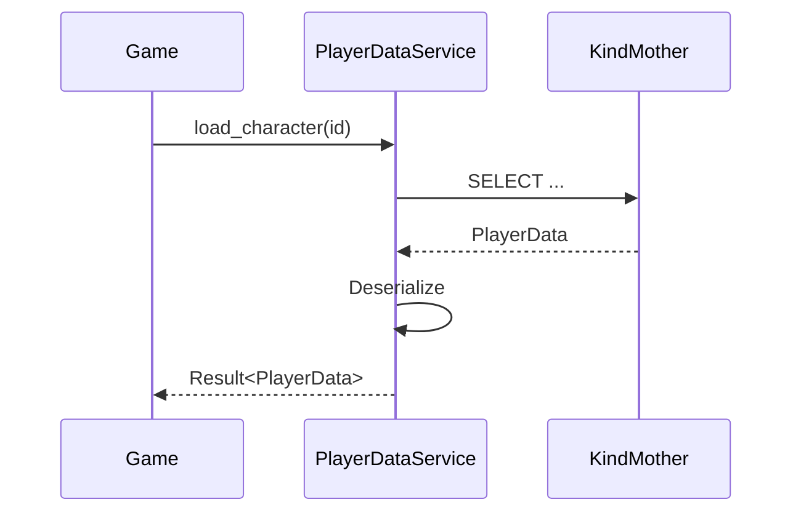
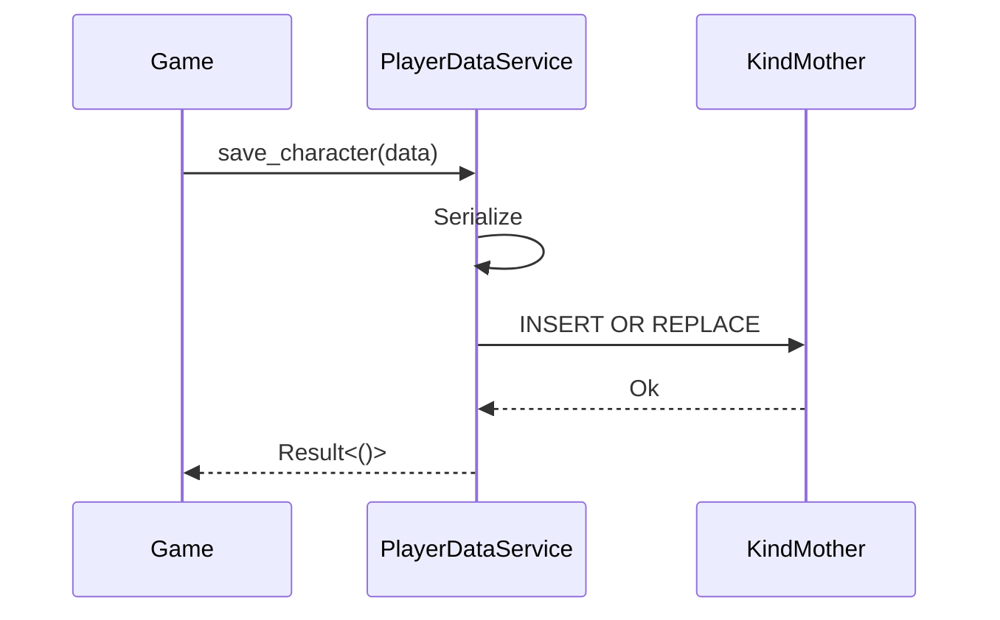
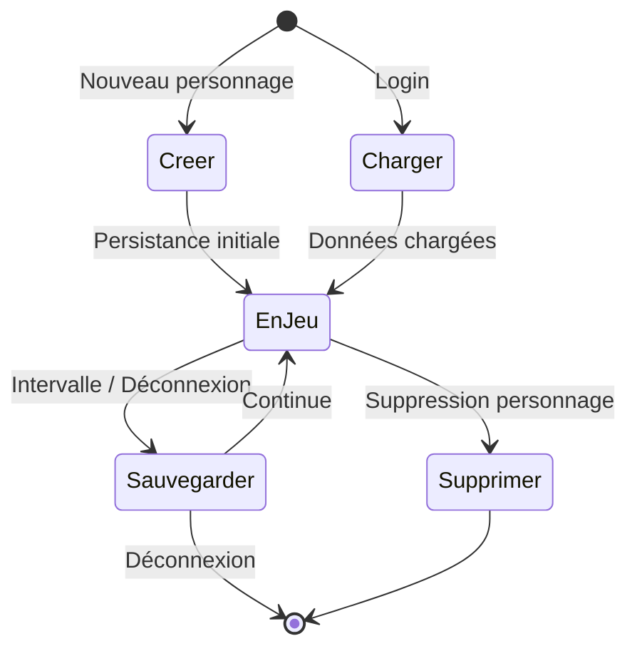
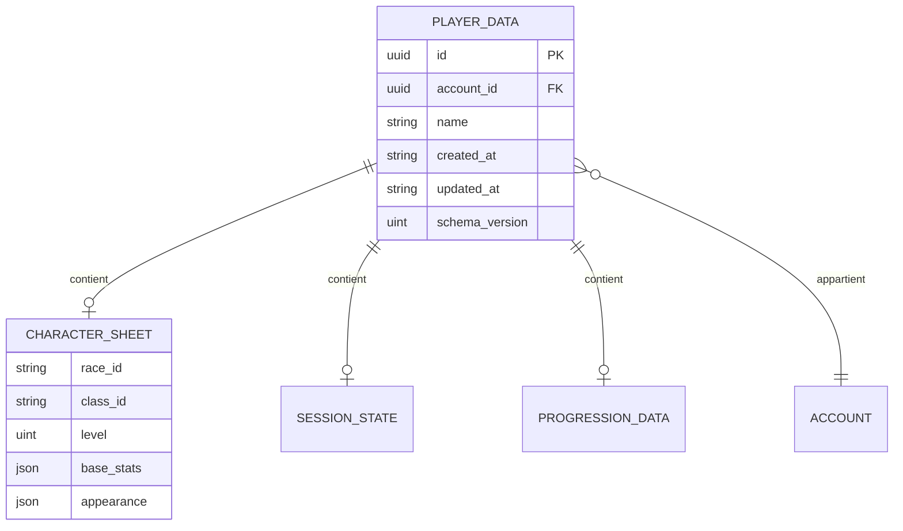

# Données joueur

**Catégorie :** 05. Joueur et personnage  
**Description :** Caractéristiques ; état ; persistance (KindMother).

## Contexte

Point de la référence technique MGE. Les données du joueur représentent l'état complet d'un personnage jouable : caractéristiques, position, inventaire, progression, et toute information devant survivre entre les sessions. La persistance est déléguée à **KindMother** (Core Strate 4 — données et persistance), conformément au glossaire Miyukini.

Ce document décrit les structures de données, le modèle de persistance via KindMother, la sérialisation et les flux de sauvegarde/chargement. Les types communs (`Vec2`, `Rect`, etc.) sont définis dans la [Référence Commune](../MGE%20-%20Reference%20Commune.md).

### Rôle dans le moteur

- **Source de vérité** pour l'état du personnage en jeu
- **Bridge** avec KindMother pour toute persistance
- **Sérialisation** compatible réseau et sauvegarde locale

### Liens

- [Référence Commune](../MGE%20-%20Reference%20Commune.md) — types et glossaire MGE
- [Multi-personnages](multi-personnages.md) — plusieurs personnages par compte
- [Slots d'équipement](slots-equipement.md) — armure, armes
- [Stats](stats.md) — attaque, défense, vitesse, précision

---

## Portée

- Caractéristiques de base (nom, race, classe, niveau)
- État de session (position, direction, zone, instance)
- Stats dérivées et temporaires
- Inventaire et équipement (références)
- Progression (XP, compétences, quêtes)
- Persistance via KindMother (Core Strate 4)
- Sérialisation et désérialisation

---

## Spécifications techniques

### Contraintes

| Contrainte | Valeur |
|------------|--------|
| Encodage identifiant personnage | UUID v4 |
| Unité de position | Tuiles (monde tile-based) |
| Timestamp | RFC3339 ou ISO 8601 |
| Taille max nom | 24 caractères UTF-8 |
| Version de schéma | Entier positif, migration supportée |

### Formules liées

- **Position** : coordonnées en tuiles (`Vec2<i32>` ou équivalent). Voir [Référence Commune](../MGE%20-%20Reference%20Commune.md).
- **Stats dérivées** : calculées à partir des stats de base + équipement. Voir [Stats](stats.md).
- **Timestamp** : `now_rfc3339()` ou `now_local_iso()` via `kindmother-db-adapter`.

### Paramètres de persistance

| Paramètre | Description |
|-----------|-------------|
| `instance_type` | Toujours `Daughter` pour une instance locale (KindMother) |
| `db_name` | Nom logique de la base (ex. `player_data`) |
| `encryption` | Optionnel via `db-encryption` (SQLCipher) |
| `backup_interval` | Intervalle entre sauvegardes automatiques (secondes) |

### Cycle de vie des données

1. **Création** : nouveau personnage → enregistrement initial
2. **Chargement** : au login → lecture depuis KindMother
3. **Mise à jour** : pendant le jeu → écritures différées ou immédiates
4. **Sauvegarde** : à intervalle régulier + à la déconnexion
5. **Suppression** : si le joueur supprime un personnage (soft delete ou hard delete selon politique)

---

## Modèle de données et API

### Structures Rust (pseudo-code)

```rust
/// Identifiant unique du personnage (UUID v4)
pub type CharacterId = Uuid;

/// Données persistantes du joueur (KindMother)
#[derive(Serialize, Deserialize)]
pub struct PlayerData {
    pub id: CharacterId,
    pub account_id: Uuid,
    pub name: String,
    pub created_at: String,      // RFC3339
    pub updated_at: String,      // RFC3339
    pub schema_version: u32,

    // Caractéristiques de base
    pub character_sheet: CharacterSheet,

    // État de session (dernier connu)
    pub last_session: SessionState,

    // Progression
    pub progression: ProgressionData,

    // Références (IDs vers inventaire, équipement)
    pub inventory_id: Option<Uuid>,
    pub equipment_ids: Vec<Uuid>,
}

#[derive(Serialize, Deserialize)]
pub struct CharacterSheet {
    pub race_id: String,
    pub class_id: String,
    pub level: u32,
    pub base_stats: BaseStats,
    pub appearance: AppearanceData,  // Voir customisation
}

#[derive(Serialize, Deserialize)]
pub struct SessionState {
    pub zone_id: String,
    pub instance_id: Option<Uuid>,
    pub position: Vec2<i32>,     // En tuiles
    pub direction: Direction,    // 8 directions
    pub timestamp: String,
}

#[derive(Serialize, Deserialize)]
pub struct BaseStats {
    pub strength: i32,
    pub agility: i32,
    pub vitality: i32,
    pub intelligence: i32,
    pub wisdom: i32,
    pub luck: i32,
}

#[derive(Serialize, Deserialize)]
pub struct ProgressionData {
    pub xp: u64,
    pub xp_to_next: u64,
    pub skill_levels: HashMap<String, u32>,
    pub quest_progress: Vec<QuestProgress>,
}
```

### API principale

```rust
/// Service de persistance des données joueur (KindMother)
pub trait PlayerDataService {
    /// Charge les données d'un personnage
    fn load_character(&self, id: CharacterId) -> Result<PlayerData, DbError>;

    /// Sauvegarde les données (upsert)
    fn save_character(&self, data: &PlayerData) -> Result<(), DbError>;

    /// Liste les personnages d'un compte
    fn list_characters(&self, account_id: Uuid) -> Result<Vec<PlayerDataSummary>, DbError>;

    /// Supprime un personnage (soft ou hard selon configuration)
    fn delete_character(&self, id: CharacterId) -> Result<(), DbError>;
}

/// Résumé pour la sélection au login
pub struct PlayerDataSummary {
    pub id: CharacterId,
    pub name: String,
    pub level: u32,
    pub class_id: String,
    pub last_played: String,
}
```

### Intégration KindMother

Conformément au skill KindMother :

- **ServiceDb** : structure avec `conn: Mutex<Connection>` ou `client: Arc<KindMotherClient>`
- **InstanceIdentity** : `InstanceType::Daughter` pour toute instance locale
- **Feature flags** : `legacy-sqlite` ou `kindmother-only`, `db-encryption`
- **Utilitaires** : `new_uuid()`, `now_rfc3339()` depuis `kindmother-db-adapter`

---

## Diagrammes

### Flux de chargement



### Flux de sauvegarde



### États du cycle de vie



### Schéma de tables (KindMother)



---

## Exemples et cas d'usage

### Allumina — Création d'un personnage

1. Le joueur choisit nom, race, classe et apparence dans l'écran de création.
2. Le jeu instancie `PlayerData` avec `new_uuid()` pour l'ID.
3. `CharacterSheet` est rempli avec les choix du joueur.
4. `SessionState` initial : zone de départ, position par défaut.
5. `PlayerDataService::save_character()` persiste via KindMother.
6. Redirection vers l'écran de sélection ou directement en jeu.

### Chargement au login

1. L'utilisateur sélectionne un personnage dans la liste.
2. `PlayerDataService::load_character(character_id)` est appelé.
3. Les données sont désérialisées et chargées en mémoire.
4. Le moteur restaure la scène : zone, position, entité joueur.
5. Les sous-systèmes (inventaire, équipement, quêtes) reçoivent les IDs et chargent leurs données.

### Sauvegarde automatique

- **Intervalle** : toutes les 5 minutes (configurable).
- **Événements déclencheurs** : changement de zone, fin de combat, découverte d'un point.
- **Déconnexion** : sauvegarde synchrone avant fermeture.

### Sérialisation pour le réseau (MWS)

Pour un jeu multijoueur via le MWS, un sous-ensemble des données est envoyé aux autres clients :

- `id`, `name`, `position`, `direction`, `appearance`
- Pas d'envoi des stats brutes ni de l'inventaire complet (sécurité)

---

## Cas limites et tests

### Cas limites

| Cas | Comportement attendu |
|-----|----------------------|
| Chargement d'un personnage inexistant | `Err(DbError::NotFound)` |
| Nom vide ou invalide | Validation à la création ; rejet |
| Schéma obsolète | Migration automatique si `schema_version` < courant |
| Connexion KindMother indisponible | Retry avec backoff ; fallback local si mode offline |
| Données corrompues | Log + `Err` ; proposition de chargement backup |
| Taille de données excessive | Limite configurable ; avertissement si proche |

### Critères de validation

- [ ] Création d'un personnage → persistance correcte
- [ ] Chargement retourne les mêmes données que la dernière sauvegarde
- [ ] Suppression retire bien les données (ou les marque supprimées)
- [ ] Migration de schéma préserve les champs existants
- [ ] Concurrence : deux sauvegardes simultanées ne corrompent pas la DB
- [ ] Performance : chargement < 500 ms pour un personnage standard

### Tests unitaires suggérés

```rust
#[test]
fn test_create_and_load_character() {
    let db = setup_test_db();
    let data = create_test_player_data();
    db.save_character(&data).unwrap();
    let loaded = db.load_character(data.id).unwrap();
    assert_eq!(loaded.name, data.name);
}

#[test]
fn test_schema_migration() {
    let db = setup_test_db_with_old_schema();
    let loaded = db.load_character(old_character_id).unwrap();
    assert_eq!(loaded.schema_version, CURRENT_SCHEMA_VERSION);
}
```

---

## Annexes

### Format de sérialisation JSON (exemple)

```json
{
  "id": "550e8400-e29b-41d4-a716-446655440000",
  "account_id": "6ba7b810-9dad-11d1-80b4-00c04fd430c8",
  "name": "Allumina_Hero",
  "created_at": "2026-02-18T10:00:00Z",
  "updated_at": "2026-02-18T14:30:00Z",
  "schema_version": 1,
  "character_sheet": {
    "race_id": "human",
    "class_id": "warrior",
    "level": 5,
    "base_stats": {
      "strength": 12,
      "agility": 8,
      "vitality": 10,
      "intelligence": 6,
      "wisdom": 6,
      "luck": 8
    }
  },
  "last_session": {
    "zone_id": "plains_01",
    "position": { "x": 42, "y": 18 },
    "direction": "south",
    "timestamp": "2026-02-18T14:30:00Z"
  },
  "progression": {
    "xp": 1250,
    "xp_to_next": 2000
  }
}
```

### Migrations de schéma

Lors d'une mise à jour du moteur, le champ `schema_version` permet d'appliquer des migrations :

- `v1 → v2` : ajout d'un champ `title_id` → valeur par défaut `null`
- `v2 → v3` : restructuration de `progression` → conversion des anciennes clés
- Échec de migration → log + chargement en mode dégradé ou erreur

### Intégration avec le système d'événements

Les changements de données joueur peuvent émettre des événements pour les autres systèmes :

- `CharacterLoaded` : personnage chargé, prêt pour initialisation des sous-systèmes
- `CharacterSaved` : sauvegarde terminée (pour UI de feedback)
- `CharacterStatsChanged` : recalcul des stats (équipement, buffs)

### Tables KindMother détaillées

```sql
CREATE TABLE IF NOT EXISTS player_data (
    id TEXT PRIMARY KEY,
    account_id TEXT NOT NULL,
    name TEXT NOT NULL,
    created_at TEXT NOT NULL,
    updated_at TEXT NOT NULL,
    schema_version INTEGER NOT NULL,
    character_sheet_json TEXT NOT NULL,
    last_session_json TEXT NOT NULL,
    progression_json TEXT NOT NULL,
    inventory_id TEXT,
    equipment_ids_json TEXT
);

CREATE INDEX idx_player_data_account ON player_data(account_id);
```

### Stratégie de sauvegarde différée

Pour éviter les écritures excessives sur disque :

- **Dirty flag** : les données modifiées sont marquées
- **Intervalle** : sauvegarde toutes les N secondes (ex. 300 s)
- **Événements** : sauvegarde immédiate sur changement de zone, déconnexion, pause
- **Batching** : regroupement des écritures dans une même transaction

### Compression optionnelle

Pour les personnages avec beaucoup de données (inventaire, quêtes) :

- Sérialisation JSON → compression gzip ou zstd avant stockage
- Colonne `data_compressed` BLOB ; décompression au chargement
- Gain d'espace disque ; léger coût CPU au chargement

### Cohérence et transactions

- Toute modification de `PlayerData` dans une transaction
- En cas d'échec : rollback complet
- Backup avant migration de schéma

### Dépendances et chargement à la demande

Les `PlayerData` peuvent contenir des IDs vers d'autres données (inventaire, équipement, quêtes). Stratégies :

- **Eager loading** : tout charger en une fois (simple, peut être lent)
- **Lazy loading** : charger les sous-systèmes à la demande (inventaire au premier accès)
- **Référence par ID** : éviter les données dupliquées ; chaque sous-système gère sa propre table

### Versioning et compatibilité

- `schema_version` incrémenté à chaque changement de structure
- Les anciennes sauvegardes restent lisibles grâce aux migrations
- Lecture tolérante : champs inconnus ignorés ; champs manquants = valeur par défaut
- Écriture : toujours avec le schéma courant

### Performances — Index et requêtes

- Index sur `account_id` pour la liste multi-personnages
- Index sur `updated_at` pour les tri chronologiques
- Éviter `SELECT *` si seuls quelques champs sont nécessaires
- Pour le résumé (liste) : requête dédiée avec colonnes limitées

### Sauvegarde cloud et synchronisation

Pour une expérience multi-appareils (PC + mobile, ou plusieurs PC) :

- **Stratégie** : sauvegarde sur serveur central (MWS ou service dédié)
- **Conflits** : last-write-wins ou merge manuel (complexe)
- **Offline** : KindMother local stocke les changements ; sync à la reconnexion
- **Sécurité** : chiffrement côté client avant envoi, authentification

### Champs étendus (PlayerData complet)

Pour référence, liste des champs pouvant être inclus selon le périmètre du jeu :

- `id`, `account_id`, `name`, `created_at`, `updated_at`, `schema_version`
- `character_sheet` (race, class, level, base_stats, appearance)
- `last_session` (zone, instance, position, direction, timestamp)
- `progression` (xp, skills, quest_progress)
- `inventory_id`, `equipment_ids` (références)
- `hotbar_config` (assignation des compétences)
- `keybind_config` (raccourcis personnalisés)
- `title_id` (titre affiché)
- `guild_id` (si appartenance à une guilde)
- `achievements` (IDs débloqués)
- `settings` (préférences gameplay : son, UI, etc.)

### Références croisées

Ce point est central pour la catégorie 05. Il fournit les structures de base utilisées par tous les autres points (multi-personnages, équipement, stats, customisation, moveset, relation). La persistance KindMother assure la cohérence et la durabilité des données entre les sessions.

---

## Références

Documents liés :

- [Référence Commune MGE](../MGE%20-%20Reference%20Commune.md) — types Vec2, Rect, conventions
- [Index catégorie 05](_index.md)
- [Index MGE](../_index.md)
- [Multi-personnages](multi-personnages.md)
- [Slots équipement](slots-equipement.md)
- [Stats](stats.md)
- [Sauvegarde / chargement](../../23-systeme/sauvegarde-chargement.md)
- Skill KindMother : `.cursor/skills/miyukini-kindmother-db/SKILL.md`
- Glossaire Miyukini : KindMother, Opérateur
