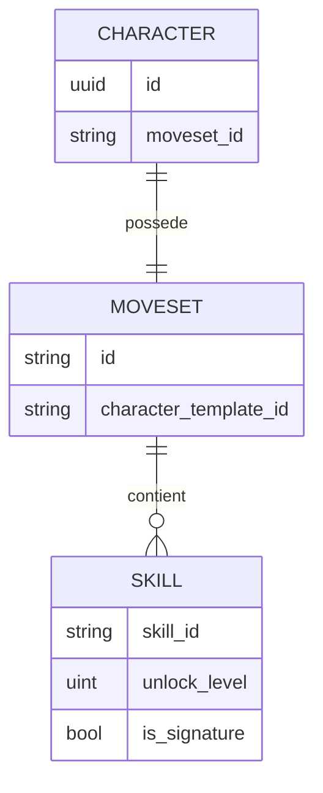
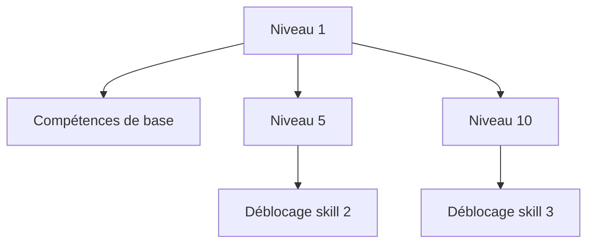

# Moveset personnage

**Catégorie :** 05. Joueur et personnage  
**Description :** Arsenal d'attaques propre à chaque personnage.

## Contexte

Point de la référence technique MGE. Le moveset désigne l'ensemble des attaques et compétences disponibles pour un personnage jouable. Chaque personnage possède son propre arsenal (moveset) distinct, contrairement à un système où tous partagent les mêmes compétences.

Ce point est lié à l'[arme unique signature](arme-unique-signature.md) (attaque ou arme spécifique) et au [combat](../../07-combat/action.md). Les types communs sont dans la [Référence Commune](../MGE%20-%20Reference%20Commune.md).

### Rôle dans le moteur

- **Identification** : chaque personnage a un moveset défini (ID ou clé)
- **Liste d'attaques** : compétences de base + compétences spéciales
- **Progression** : déblocage ou amélioration des compétences
- **Combat** : sélection et exécution des attaques

### Liens

- [Arme unique signature](arme-unique-signature.md)
- [Action combat](../../07-combat/action.md)
- [Données joueur](donnees-joueur.md) — progression des compétences

---

## Portée

- Définition du moveset par personnage
- Liste des attaques (IDs, cooldowns, coûts)
- Progression et déblocage
- Intégration avec le système de combat

---

## Spécifications techniques

### Structure du moveset

Un moveset est une collection d'attaques identifiées par :

- `skill_id` : identifiant unique de la compétence
- `unlock_level` : niveau requis pour débloquer
- `slot` : emplacement dans la barre de compétences (optionnel)
- `is_signature` : attaque signature du personnage (voir [arme-unique-signature](arme-unique-signature.md))

### Contraintes

| Contrainte | Valeur |
|------------|--------|
| Nombre max d'attaques par moveset | 10–30 (configurable) |
| Compétences de base | Toujours disponibles |
| Compétences débloquées | Selon niveau ou quête |
| Cooldown global | Par compétence (secondes) |

### Règles

1. Chaque personnage a exactement un moveset assigné.
2. Le moveset est défini par l'ID du personnage (ou template).
3. Les compétences peuvent être partagées entre personnages (réutilisation d'IDs).

---

## Modèle de données et API

### Structures Rust (pseudo-code)

```rust
pub type MovesetId = String;  // ex. "warrior_default", "mage_fire"

#[derive(Serialize, Deserialize)]
pub struct Moveset {
    pub id: MovesetId,
    pub character_template_id: String,
    pub skills: Vec<MovesetSkill>,
}

#[derive(Serialize, Deserialize)]
pub struct MovesetSkill {
    pub skill_id: String,
    pub unlock_level: u32,
    pub slot_index: Option<u8>,
    pub is_signature: bool,
}

pub trait MovesetService {
    fn get_moveset(&self, character_id: CharacterId) -> Result<Moveset, DbError>;
    fn get_available_skills(&self, character_id: CharacterId) -> Result<Vec<SkillInfo>, DbError>;
}
```

---

## Diagrammes

### Relation personnage / moveset



### Déblocage progressif



---

## Exemples et cas d'usage

### Allumina — Guerrier

- Moveset : `warrior_sword`
- Compétences : Coup de base, Frappe puissante, Tourbillon, Parade, Cri de guerre
- Signature : Frappe héroïque (niveau 15)

### Mages — Éléments différents

- Mage Feu : moveset `mage_fire` — Boule de feu, Météore, Mur de flammes
- Mage Glace : moveset `mage_ice` — Gel, Blizzard, Armure de glace

---

## Cas limites et tests

### Cas limites

| Cas | Comportement attendu |
|-----|----------------------|
| Personnage sans moveset | Moveset par défaut ou erreur |
| Compétence non débloquée | Non sélectionnable, grisée |
| Deux personnages même moveset | Autorisé (ex. deux guerriers) |

### Critères de validation

- [ ] Moveset chargé correctement pour le personnage
- [ ] Déblocage selon niveau
- [ ] Intégration combat OK

### Tests unitaires suggérés

```rust
#[test]
fn test_moveset_load_for_character() {
    let svc = setup_moveset_service();
    let char_id = create_warrior_character();
    let moveset = svc.get_moveset(char_id).unwrap();
    assert_eq!(moveset.character_template_id, "warrior");
    assert!(moveset.skills.len() >= 3);
}

#[test]
fn test_signature_skill_identified() {
    let moveset = load_moveset("warrior_sword");
    let sig = moveset.skills.iter().find(|s| s.is_signature).unwrap();
    assert_eq!(sig.skill_id, "heroic_strike");
}
```

---

## Annexes

### Format de données moveset (JSON)

```json
{
  "id": "warrior_sword",
  "character_template_id": "warrior",
  "skills": [
    { "skill_id": "basic_slash", "unlock_level": 1, "slot_index": 0, "is_signature": false },
    { "skill_id": "power_strike", "unlock_level": 3, "slot_index": 1, "is_signature": false },
    { "skill_id": "whirlwind", "unlock_level": 8, "slot_index": 2, "is_signature": false },
    { "skill_id": "heroic_strike", "unlock_level": 15, "slot_index": 3, "is_signature": true }
  ]
}
```

### Barre de compétences (hotbar)

- Slots 0–9 (ou 12) mappés aux touches 1–9, 0, -, =
- Chaque slot peut être lié à une compétence du moveset ou à un objet (potion)
- Configuration sauvegardée par personnage dans les données joueur
- Les compétences non débloquées sont grisées et non exécutables

### Compétences partagées entre movesets

Plusieurs personnages peuvent partager les mêmes IDs de compétences (ex. "basic_slash") :

- Définition des compétences dans une table globale (skill_definitions)
- Le moveset référence les IDs
- Réutilisation d'assets (animations, effets) et d'équilibrage

### Déblocage par quête

Au-delà du niveau, certaines compétences peuvent être débloquées par quête :

- Champ `unlock_quest_id` dans `MovesetSkill`
- Si défini : la compétence reste verrouillée jusqu'à complétion de la quête
- Combiné avec `unlock_level` : les deux conditions doivent être remplies

### Intégration avec le système d'action

- Le moteur de combat consulte le moveset pour savoir quelles actions sont disponibles
- Ciblage : compétences en zone, cône, single-target, self
- Ressources : mana, endurance, charges (pour compétences à charges)
- Cooldowns : par compétence, stockés dans l'état de combat

### Définition des compétences (skill_definitions)

Chaque compétence référencée dans un moveset est définie dans une table globale :

```rust
pub struct SkillDefinition {
    pub id: String,
    pub name: String,
    pub description: String,
    pub target_type: TargetType,  // Single, AOE, Self, Cone
    pub range: f32,
    pub cast_time_ms: u32,
    pub cooldown_ms: u32,
    pub cost_mana: Option<u32>,
    pub cost_endurance: Option<u32>,
    pub damage_formula: Option<String>,
    pub effects: Vec<EffectDefinition>,
}
```

### Progression des compétences (skills par usage)

Certains jeux font monter les compétences à l'utilisation. Voir [Skills par usage](../../06-progression/skills-par-usage.md). Le moveset définit quelles compétences sont disponibles ; leur niveau peut évoluer indépendamment.

### Combos et chaînes

- **Combo** : séquence d'attaques (ex. A → A → B = attaque spéciale)
- **Chaîne** : chaque coup de la chaîne débloque le suivant si exécuté à temps
- Le moveset peut inclure des références à des "combo finishers" ou des "chain skills"
- Gestion dans le système de combat, pas dans le moveset lui-même (le moveset liste les skills ; le combat gère l'état de la chaîne)

### Assignation des slots (hotbar)

- Le joueur assigne des compétences aux slots 0–9 (ou plus)
- Stockage : `hotbar_config: [(slot_index, skill_id_or_item_id)]` dans les données joueur
- Les compétences non débloquées ne peuvent pas être assignées
- Les objets (potions) peuvent aussi occuper des slots

### Changement de moveset (changement de classe)

- Si le jeu permet un changement de classe (job change), le moveset change
- **Remplacement** : l'ancien moveset est remplacé par le nouveau
- **Conservation** : certains jeux conservent les deux et permettent de basculer (ex. FF14)
- **Perte de niveau** : selon design (retour niveau 1 ou conservation partielle)

### Exemples de movesets par archétype

| Archétype | Moveset ID | Compétences typiques |
|-----------|------------|----------------------|
| Guerrier | warrior_sword | Coup de base, Frappe, Tourbillon, Parade, Cri |
| Mage feu | mage_fire | Boule de feu, Météore, Mur de flammes, Phoenix |
| Soigneur | healer_light | Soin, Soin de groupe, Résurrection, Bouclier |
| Voleur | rogue_dagger | Coup de poignard, Dos, Furtivité, Poison |
| Archer | archer_bow | Flèche, Multiflèche, Piège, Oeil de faucon |

### Tests d'intégration combat

```rust
#[test]
fn test_moveset_skills_available_in_combat() {
    let char_id = create_warrior_level_10();
    let moveset = get_moveset(char_id).unwrap();
    let available = get_available_skills(char_id).unwrap();
    assert!(available.iter().any(|s| s.skill_id == "power_strike"));
    assert!(!available.iter().any(|s| s.skill_id == "heroic_strike"));
}

#[test]
fn test_signature_in_moveset() {
    let moveset = load_moveset("warrior_sword");
    let sig = moveset.skills.iter().find(|s| s.is_signature);
    assert!(sig.is_some());
    assert_eq!(sig.unwrap().skill_id, "heroic_strike");
}
```

### Ressources et coûts

Chaque compétence peut consommer des ressources :

- **Mana** : régénération lente, pool partagée
- **Endurance** : utilisée pour les attaques physiques, régénération rapide
- **Charges** : un nombre limité d'utilisations avant cooldown long (ex. 3 charges, recharge 1/30s)
- **Rage / énergie** : système spécifique (accumulation par coup reçu/donné, dépense pour skills)

Le moveset référence les skills ; les coûts sont dans `SkillDefinition`.

### Interruptions et canalisation

- **Cast time** : délai avant l'effet (barre de cast)
- **Interruption** : un coup reçu peut annuler la canalisation
- **After-cast delay** : temps pendant lequel le personnage ne peut pas agir après le cast
- Ces propriétés sont dans `SkillDefinition`, pas dans le moveset

### Animation et feedback

- Chaque skill a une animation associée (ID ou chemin)
- Le système d'animation reçoit l'ordre "jouer animation X" quand la skill est exécutée
- Feedback visuel : particules, effet de zone, indicateur de ciblage
- Le moveset ne contient pas ces données ; il référence le skill_id qui les contient

### Équilibrage et données externes

- Les valeurs (dégâts, cooldown, coût) sont dans des fichiers de données (JSON, YAML) ou en base
- Modifications sans recompilation
- Outils de tuning : éditeurs, scripts de batch pour tester des variantes

### Structure SkillDefinition complète

```rust
pub struct SkillDefinition {
    pub id: String,
    pub name: String,
    pub description: String,
    pub icon_path: String,
    pub target_type: TargetType,
    pub range: f32,
    pub aoe_radius: Option<f32>,
    pub cast_time_ms: u32,
    pub cooldown_ms: u32,
    pub cost_mana: Option<u32>,
    pub cost_endurance: Option<u32>,
    pub cost_charges: Option<u32>,
    pub damage_formula: Option<String>,
    pub healing_formula: Option<String>,
    pub effects: Vec<EffectDefinition>,
    pub animation_id: String,
    pub vfx_id: Option<String>,
    pub sfx_id: Option<String>,
}
```

### Chargement des movesets

- Au chargement du personnage : récupération du `moveset_id` depuis le template
- Chargement du fichier ou requête DB pour le moveset
- Chargement des SkillDefinitions référencées (batch ou à la demande)
- Cache : les movesets et skills sont mis en cache pour éviter les rechargements

### Localisation des noms de compétences

- Les `name` et `description` dans SkillDefinition sont des clés i18n
- Exemple : `"skill.power_strike.name"` → "Frappe puissante"
- Voir [Localisation](../../23-systeme/localisation-i18n.md)

### Hotbar — Sérialisation

```json
{
  "slots": [
    { "index": 0, "type": "skill", "id": "basic_slash" },
    { "index": 1, "type": "skill", "id": "power_strike" },
    { "index": 2, "type": "item", "id": "potion_hp_001" }
  ]
}
```

Stocké dans `PlayerData` ou dans une table séparée `hotbar_config`.

### Liste de vérification implémentation

- [ ] Moveset chargé pour chaque personnage
- [ ] Compétences filtrées par niveau et quêtes
- [ ] Barre de compétences assignable et persistée
- [ ] Intégration combat : exécution, cooldowns, ressources
- [ ] UI : affichage des compétences, cooldowns, coûts
- [ ] Signature identifiée et traitée (visuel, feedback)

### Dépendances entre compétences

Certaines compétences peuvent avoir des prérequis dans le moveset :

- **Prérequis skill** : "Tourbillon" nécessite "Frappe" niveau 5
- **Prérequis talent** : compétence débloquée par un point de talent
- Le moveset liste les skills ; les prérequis sont dans SkillDefinition ou une table de progression

### Compétences passives

En plus des compétences actives, un personnage peut avoir des passives :

- **Auras** : bonus permanent tant que le personnage est vivant
- **Maîtrises** : +10 % dégâts avec les épées
- Les passives peuvent être dans une section séparée du moveset : `moveset.passive_skills`
- Elles n'apparaissent pas dans la barre de compétences mais modifient les stats ou les effets

### Multiclasse et movesets multiples

Pour les jeux avec multiclasse (ex. 2 classes actives) :

- Le personnage a 2 movesets (un par classe)
- Bascule entre les deux selon la "classe active" ou l'arme équipée
- Ou : fusion des movesets avec limites (ex. 4 skills de la classe A + 4 de la classe B)

### Performance — Cache

- Les movesets sont chargés une fois par session
- Cache global : `HashMap<MovesetId, Moveset>`
- Les SkillDefinitions sont chargées à la demande ou en batch au démarrage
- Invalidation : uniquement au rechargement du jeu (les movesets ne changent pas en runtime)

### Références croisées

Le moveset est chargé avec les [données joueur](donnees-joueur.md). Il référence l'[arme unique signature](arme-unique-signature.md) pour le skill ou l'arme distinctive. L'exécution des compétences est gérée par le [système de combat](../../07-combat/action.md). Les compétences sont définies dans des SkillDefinitions globales ; le moveset ne fait que référencer les IDs. La barre de compétences (hotbar) permet d'assigner les skills aux touches 1-9.

### Synthèse pour Allumina

Chaque classe (Guerrier, Mage, Archer, etc.) a un moveset dédié avec 5–8 compétences actives. Une compétence signature (ultime) par personnage. Déblocage progressif par niveau. Les skills consomment mana ou endurance selon le type. La hotbar a 8 slots assignables. Les SkillDefinitions sont en JSON pour faciliter l'équilibrage.

### Fichiers de données (structure)

```
data/
├── movesets/
│   ├── warrior_sword.json
│   ├── mage_fire.json
│   └── ...
├── skills/
│   ├── basic_slash.json
│   ├── heroic_strike.json
│   └── ...
```

Chargement au démarrage ou à la demande. Les movesets sont assignés par character_template_id. Les compétences communes (basic_slash) peuvent être réutilisées dans plusieurs movesets. Les cooldowns et ressources sont gérés par le moteur de combat.

### Validation des movesets

À l'édition des données, valider que tous les skill_id référencés existent dans SkillDefinitions, que les unlock_level sont cohérents, et qu'au plus une compétence a is_signature: true. Les tools d'édition peuvent intégrer ces vérifications.

### Hotreload en développement

En mode dev, permettre le rechargement des movesets et SkillDefinitions sans redémarrer le jeu. Utile pour itérer rapidement sur l'équilibrage. Fichier watcher ou commande console "reload_movesets". En production, les données sont chargées une fois au démarrage et ne changent pas (sauf mise à jour du jeu).

---

## Références

- [Référence Commune MGE](../MGE%20-%20Reference%20Commune.md)
- [Arme unique signature](arme-unique-signature.md)
- [Action combat](../../07-combat/action.md)
- [Index catégorie 05](_index.md)
- [Index MGE](../_index.md)
