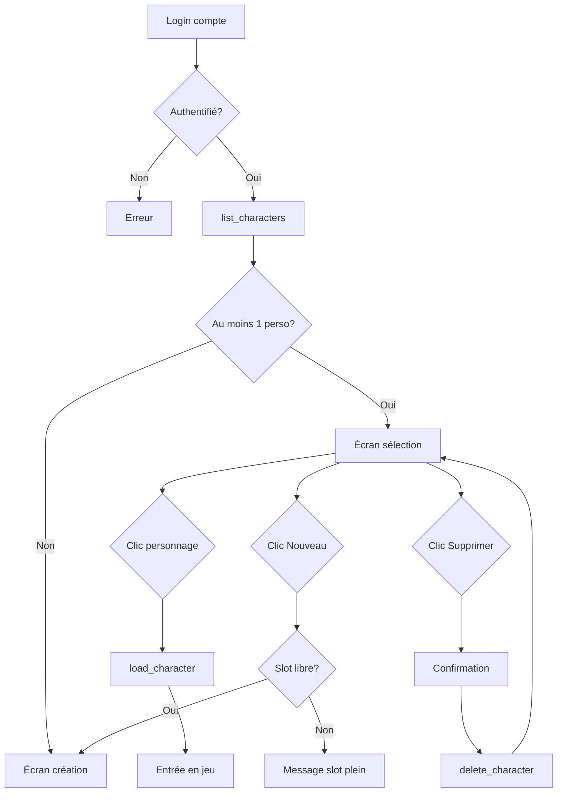
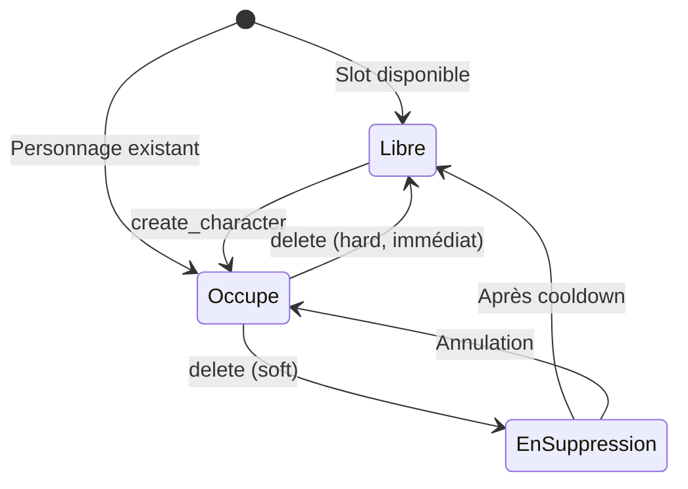
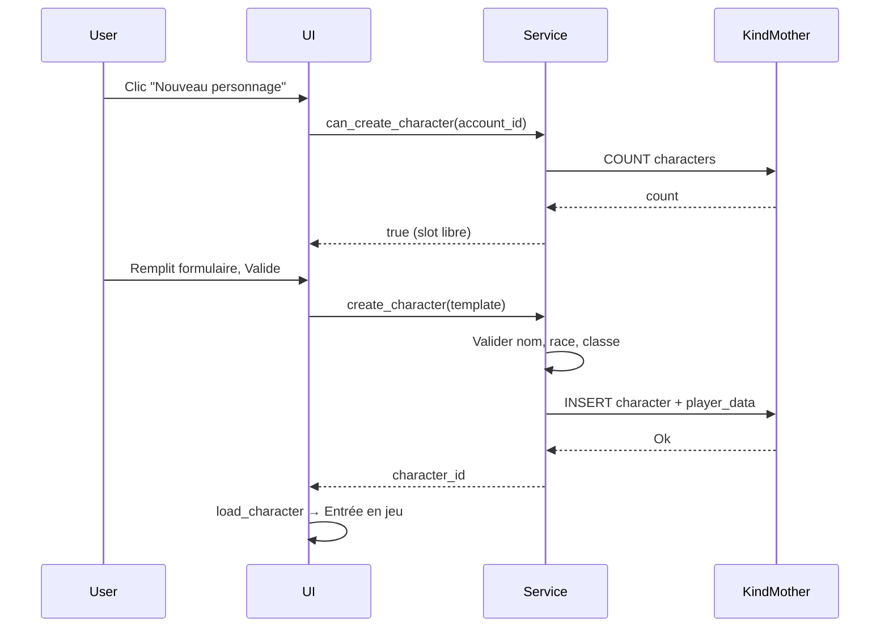

# Multi personnages

**Catégorie :** 05. Joueur et personnage  
**Description :** Plusieurs personnages par compte ; sélection au login.

## Contexte

Point de la référence technique MGE. Le système multi-personnages permet à un compte joueur de posséder plusieurs personnages distincts, chacun avec ses propres données, progression et apparence. Au login, l'utilisateur choisit quel personnage incarner pour la session.

Ce point décrit les contraintes (nombre de slots, limites), le flux de sélection au login, et l'intégration avec les [données joueur](donnees-joueur.md) et KindMother. Les types communs sont définis dans la [Référence Commune](../MGE%20-%20Reference%20Commune.md).

### Rôle dans le moteur

- **Séparation** des états entre personnages (un seul actif à la fois)
- **Écran de sélection** au login (liste, création, suppression)
- **Limitation** du nombre de personnages par compte (slots)

### Liens

- [Données joueur](donnees-joueur.md) — persistance KindMother
- [Customisation](customisation.md) — apparence par personnage
- [Référence Commune](../MGE%20-%20Reference%20Commune.md)

---

## Portée

- Nombre de slots par compte (configurable)
- Écran de sélection des personnages
- Création d'un nouveau personnage (si slot libre)
- Suppression d'un personnage (libération de slot)
- Ordre / tri des personnages dans la liste
- Données partagées vs spécifiques (stockage partagé, monnaie, etc.)

---

## Spécifications techniques

### Contraintes

| Contrainte | Valeur | Notes |
|------------|--------|-------|
| Slots max par compte | 4–12 | Configurable par jeu (Allumina : 6) |
| Slots min | 1 | Au moins un personnage requis |
| Caractères uniques par nom | Par serveur/zone | Ou global selon politique |
| Cooldown suppression | 7–30 jours | Optionnel, évite suppression impulsive |
| Taille liste affichée | Pagination si > 8 | UX |

### Règles métier

1. **Un seul personnage actif** à la fois par session.
2. **Changement de personnage** = déconnexion puis reconnexion (ou écran de sélection en jeu si supporté).
3. **Stockage partagé** : certains jeux offrent un coffre partagé entre personnages du même compte.
4. **Monnaie partagée** : optionnel (ex. or de compte vs or de personnage).

### Flux de sélection

```text
Login compte → Authentification → Écran sélection personnages
  → Liste des personnages (load via KindMother)
  → Clic sur un personnage → load_character(id) → Entrée en jeu
  → Ou : bouton "Nouveau" → Écran création (si slot libre)
  → Ou : bouton "Supprimer" → Confirmation → delete_character(id)
```

### Paramètres de configuration

| Paramètre | Type | Description |
|-----------|------|-------------|
| `max_characters_per_account` | u32 | Nombre max de personnages |
| `shared_storage_enabled` | bool | Coffre partagé entre personnages |
| `shared_currency_enabled` | bool | Monnaie de compte vs personnage |
| `delete_cooldown_days` | u32 | Jours avant suppression définitive (0 = immédiat) |
| `allow_character_transfer` | bool | Transfert entre serveurs (si multijoueur) |

---

## Modèle de données et API

### Structures Rust (pseudo-code)

```rust
/// Compte joueur (authentification externe)
pub type AccountId = Uuid;

/// Résumé d'un personnage pour la liste de sélection
#[derive(Serialize, Deserialize)]
pub struct CharacterSummary {
    pub id: CharacterId,
    pub name: String,
    pub level: u32,
    pub class_id: String,
    pub race_id: String,
    pub last_played: String,
    pub play_time_minutes: u64,
    pub zone_name: Option<String>,
    pub appearance_preview: Option<AppearancePreview>,  // Miniature
}

/// Réponse de la liste des personnages
#[derive(Serialize, Deserialize)]
pub struct CharacterListResponse {
    pub characters: Vec<CharacterSummary>,
    pub slot_count: u32,
    pub slot_max: u32,
}

/// Service multi-personnages
pub trait MultiCharacterService {
    /// Liste tous les personnages d'un compte
    fn list_characters(&self, account_id: AccountId) -> Result<CharacterListResponse, DbError>;

    /// Vérifie si un slot est disponible
    fn can_create_character(&self, account_id: AccountId) -> Result<bool, DbError>;

    /// Crée un nouveau personnage (réduit les slots libres)
    fn create_character(&self, account_id: AccountId, template: CharacterCreationTemplate)
        -> Result<CharacterId, DbError>;

    /// Marque un personnage pour suppression (soft delete) ou supprime (hard)
    fn delete_character(&self, account_id: AccountId, character_id: CharacterId)
        -> Result<DeleteResult, DbError>;

    /// Récupère l'ordre des personnages (préférence utilisateur)
    fn get_character_order(&self, account_id: AccountId) -> Result<Vec<CharacterId>, DbError>;

    /// Met à jour l'ordre des personnages
    fn set_character_order(&self, account_id: AccountId, order: Vec<CharacterId>)
        -> Result<(), DbError>;
}

#[derive(Serialize, Deserialize)]
pub struct CharacterCreationTemplate {
    pub name: String,
    pub race_id: String,
    pub class_id: String,
    pub appearance: AppearanceData,
}
```

### Tables KindMother

```sql
-- Table des comptes (simplifiée)
CREATE TABLE IF NOT EXISTS accounts (
    id TEXT PRIMARY KEY,
    created_at TEXT,
    updated_at TEXT
);

-- Table des personnages (liée à donnees-joueur)
CREATE TABLE IF NOT EXISTS characters (
    id TEXT PRIMARY KEY,
    account_id TEXT NOT NULL REFERENCES accounts(id),
    slot_index INTEGER,  -- Ordre d'affichage
    created_at TEXT,
    updated_at TEXT,
    deleted_at TEXT  -- NULL = actif ; date = soft delete
);

-- Index pour liste rapide
CREATE INDEX idx_characters_account ON characters(account_id);
CREATE INDEX idx_characters_account_active ON characters(account_id) WHERE deleted_at IS NULL;
```

---

## Diagrammes

### Flux de sélection au login



### États des slots



### Séquence création



---

## Exemples et cas d'usage

### Allumina — 6 slots par compte

- Slots : 6 personnages max.
- Chaque personnage : progression indépendante, inventaire séparé.
- Stockage partagé : coffre de guilde ou stash partagé (optionnel).
- Ordre : l'utilisateur peut réordonner la liste (glisser-déposer).

### Écran de sélection

- **Disposition** : grille ou liste verticale.
- **Par personnage** : miniature (apparence), nom, niveau, classe, zone, dernière connexion.
- **Actions** : Jouer, Créer, Supprimer.
- **Création** : si slot libre, redirection vers l'écran de création (nom, race, classe, customisation).

### Suppression avec cooldown

1. Joueur clique "Supprimer" → confirmation avec avertissement.
2. `delete_character` avec `soft_delete = true` → `deleted_at = now + 7 jours`.
3. Pendant 7 jours : personnage visible mais grisé, option "Restaurer".
4. Après 7 jours : suppression définitive (ou exécution par job batch).

### Jeu solo — un seul slot

- `max_characters_per_account = 1` : pas d'écran de sélection.
- Login → chargement direct du personnage unique.
- Création remplace le personnage existant (avec confirmation).

---

## Cas limites et tests

### Cas limites

| Cas | Comportement attendu |
|-----|----------------------|
| Compte sans personnage | Redirection vers écran création (obligatoire) |
| Tous les slots occupés | Bouton "Nouveau" désactivé, message explicite |
| Nom déjà pris | Validation à la création, erreur si doublon |
| Suppression du dernier personnage | Interdit ou création obligatoire immédiate |
| Compte inexistant | Erreur auth, pas d'accès à la liste |
| Liste vide après filtre | Message "Aucun personnage" |

### Critères de validation

- [ ] Liste retourne uniquement les personnages du compte
- [ ] Création incrémente le nombre de personnages
- [ ] Suppression libère le slot
- [ ] Ordre persistant après réordonnancement
- [ ] Soft delete : personnage exclu de la liste sauf écran "Restaurer"

### Tests unitaires suggérés

```rust
#[test]
fn test_max_slots_enforced() {
    let svc = setup_service();
    let account_id = create_test_account();
    for _ in 0..MAX_SLOTS {
        create_test_character(&svc, account_id);
    }
    assert!(!svc.can_create_character(account_id).unwrap());
}

#[test]
fn test_delete_frees_slot() {
    let svc = setup_service();
    let (account_id, char_id) = create_full_account(&svc);
    svc.delete_character(account_id, char_id).unwrap();
    assert!(svc.can_create_character(account_id).unwrap());
}
```

---

## Annexes

### UI de l'écran de sélection

- **Layout** : grille 2x3 ou 3x2, ou liste verticale scrollable
- **Carte personnage** : miniature (sprite ou rendu 3D), nom, niveau, classe, zone, dernière connexion
- **Actions** : bouton "Jouer" (principal), "Supprimer" (secondaire, confirmation)
- **Bouton "Nouveau"** : visible uniquement si slot libre, placé en dernière position
- **Tri** : par dernière connexion, par niveau, par nom (configurable)
- **Réordonnancement** : glisser-déposer pour changer l'ordre des slots

### Stockage partagé entre personnages

Si `shared_storage_enabled` :

- Une table ou zone de stockage dédiée par `account_id`
- Tous les personnages du compte y accèdent
- Utilisation typique : stash, coffre familial, objets de quête partagés
- Les objets dans le stockage partagé ne comptent pas dans l'inventaire personnel

### Migration de compte

En cas de fusion de comptes ou changement de fournisseur d'authentification :

- Mapping `old_account_id` → `new_account_id`
- Mise à jour de tous les `characters.account_id`
- Conservation des données personnages (IDs, progression)
- Procédure à documenter séparément (sauvegarde, rollback)

### Intégration réseau (MWS)

Pour un jeu multijoueur :

- La liste des personnages peut être chargée depuis un serveur central
- Sélection du personnage → chargement des données depuis la base distante
- Synchronisation des sauvegardes : KindMother locale vs serveur (stratégie offline-first ou serveur authoritative)

### Limites par type de jeu

| Type | Slots suggérés | Raison |
|------|----------------|--------|
| Solo / narratif | 1–3 | Un personnage par histoire |
| Action RPG | 4–6 | Rejouabilité, builds différents |
| MMO léger | 6–12 | Comptes avec plusieurs "mains" |
| MMO complet | 8–16 | Professions, classes, rôles |

### Gestion des conflits de noms

- **Serveur unique** : unicité du nom par zone ou globale
- **Vérification** : à la création, requête `SELECT name FROM characters WHERE name = ?`
- **Casse** : normalisation (trim, lowercase pour comparaison) selon politique
- **Caractères spéciaux** : whitelist (alphanum, espaces, tirets, accents selon langue)

### Préchargement des données pour la liste

Pour éviter des requêtes multiples au chargement de l'écran de sélection :

- Une requête unique `SELECT id, name, level, class_id, last_played, ...` pour tous les personnages du compte
- Pas de chargement complet de `PlayerData` tant que le joueur n'a pas cliqué "Jouer"
- Miniatures : générées à la volée ou pré-calculées et stockées (thumbnail blob)

### Accessibilité et UX

- **Raccourcis clavier** : Entrée sur le personnage sélectionné = Jouer
- **Confirmation suppression** : double confirmation (case à cocher "Je comprends") pour éviter les suppressions accidentelles
- **Restauration** : pendant le cooldown, bouton "Annuler la suppression" visible et accessible

### Tests d'intégration

```rust
#[test]
fn test_full_flow_create_play_delete() {
    let svc = setup_service();
    let account_id = create_account();
    let char_id = svc.create_character(account_id, template).unwrap();
    let list = svc.list_characters(account_id).unwrap();
    assert_eq!(list.characters.len(), 1);
    let data = load_character(char_id).unwrap();
    assert_eq!(data.name, template.name);
    svc.delete_character(account_id, char_id).unwrap();
    let list2 = svc.list_characters(account_id).unwrap();
    assert_eq!(list2.characters.len(), 0);
}
```

### Localisation des textes

- "Créer un personnage", "Supprimer", "Jouer", "Slots : X / Y" — toutes les chaînes doivent être externalisées (i18n)
- Voir [Localisation](../../23-systeme/localisation-i18n.md)
- Les noms de personnages sont saisis par le joueur ; pas de traduction

### Accessibilité — Contrôle au clavier

- Navigation au clavier dans la liste (flèches, Tab)
- Entrée = Jouer sur le personnage sélectionné
- N = Nouveau (si slot libre)
- Suppr = Supprimer (avec confirmation)
- Échap = Retour au menu principal

### Logs et audit

Pour le debugging et la modération :

- Log de création : `character_created(account_id, character_id, name, timestamp)`
- Log de suppression : `character_deleted(account_id, character_id, reason?)`
- Log de sélection : `character_selected(account_id, character_id)` — optionnel, peut être volumineux

### Table characters (détail)

```sql
CREATE TABLE IF NOT EXISTS characters (
    id TEXT PRIMARY KEY,
    account_id TEXT NOT NULL,
    slot_index INTEGER NOT NULL DEFAULT 0,
    created_at TEXT NOT NULL,
    updated_at TEXT NOT NULL,
    deleted_at TEXT,
    FOREIGN KEY (account_id) REFERENCES accounts(id)
);

CREATE INDEX idx_characters_account ON characters(account_id);
CREATE INDEX idx_characters_account_active ON characters(account_id) WHERE deleted_at IS NULL;
```

### Comptage des slots

- `slot_count = SELECT COUNT(*) FROM characters WHERE account_id = ? AND deleted_at IS NULL`
- `can_create = slot_count < max_slots`
- Optimisation : cache du slot_count si les créations/suppressions sont rares

### Restauration pendant le cooldown

- Si soft delete avec cooldown : le personnage apparaît dans une section "Personnages supprimés"
- Bouton "Restaurer" : `UPDATE characters SET deleted_at = NULL WHERE id = ?`
- Après restauration : le personnage réapparaît dans la liste principale

### Liste de vérification

- [ ] Liste des personnages chargée correctement
- [ ] Création respecte la limite de slots
- [ ] Suppression libère le slot (soft ou hard)
- [ ] Ordre persistant et modifiable
- [ ] Stockage partagé fonctionnel (si activé)
- [ ] UI réactive et accessible
- [ ] Tests E2E du flux complet

### Nommage des personnages — Règles

- Longueur : 3–24 caractères (configurable)
- Caractères autorisés : alphanumériques, espaces, tirets, accents (UTF-8)
- Interdits : mots réservés (GM, Admin, etc.), caractères de formatage
- Unicité : par serveur ou global selon configuration multijoueur
- Filtres : liste de mots bannis pour la modération

### Migration de compte — Procédure

1. Export des données du compte source (backup)
2. Création ou identification du compte cible
3. Mapping des character_id vers le nouveau account_id
4. Mise à jour des références (player_data, inventory, etc.)
5. Suppression ou archivage du compte source
6. Vérification de l'intégrité des données
7. Notification à l'utilisateur

### Références croisées

Ce point dépend des [données joueur](donnees-joueur.md) pour le chargement et la persistance. Il alimente l'écran de sélection et la création de personnage. La [customisation](customisation.md) est utilisée lors de la création. Les limites de slots et les règles de suppression sont configurables par le jeu (Allumina : 6 slots).

### Synthèse pour Allumina

6 personnages maximum par compte. Écran de sélection au login avec miniature, nom, niveau, classe, zone et dernière connexion. Création si slot libre. Suppression avec confirmation ; pas de cooldown de restauration (suppression définitive). Stockage partagé optionnel pour le stash. Ordre des personnages modifiable par glisser-déposer.

### Configuration (exemple)

```yaml
multi_characters:
  max_slots: 6
  shared_storage: false
  delete_cooldown_days: 0
  min_name_length: 3
  max_name_length: 24
```

Voir aussi les règles de nommage dans la section "Gestion des conflits de noms".

---

## Références

- [Référence Commune MGE](../MGE%20-%20Reference%20Commune.md)
- [Données joueur](donnees-joueur.md)
- [Customisation](customisation.md)
- [Index catégorie 05](_index.md)
- [Index MGE](../_index.md)
