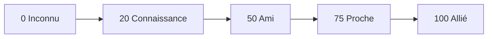
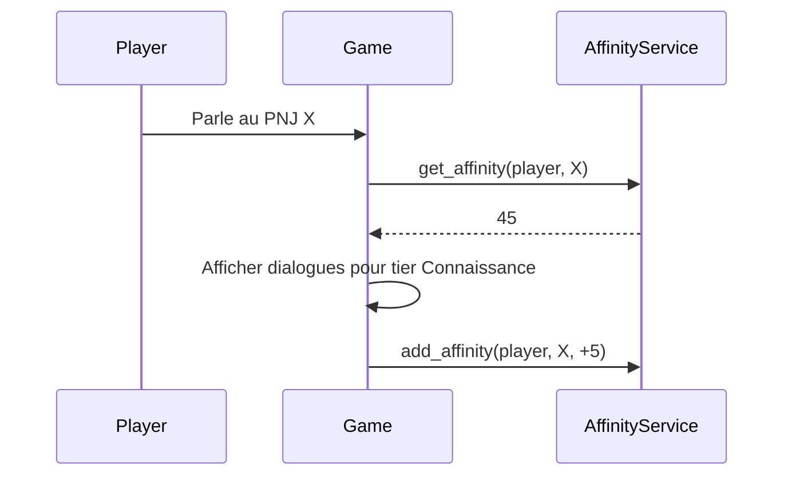

# Relation affinité

**Catégorie :** 05. Joueur et personnage  
**Description :** Liens entre personnages ; dialogues ; bonus.

## Contexte

Point de la référence technique MGE. Le système de relation et d'affinité gère les liens entre le personnage joueur et les PNJ (ou autres personnages). Il influence les dialogues, les quêtes disponibles et peut octroyer des bonus (stats, objets, compétences).

Les types communs sont dans la [Référence Commune](../MGE%20-%20Reference%20Commune.md). La persistance utilise KindMother.

### Rôle dans le moteur

- **Dialogues** : lignes de dialogue débloquées selon le niveau d'affinité
- **Quêtes** : quêtes liées à un PNJ requièrent une affinité minimale
- **Bonus** : récompenses (objets, titres, compétences) à certains paliers
- **Évolution** : l'affinité augmente par les interactions (dialogues, quêtes, cadeaux)

### Liens

- [Données joueur](donnees-joueur.md) — persistance
- [Quêtes](../../19-quetes-missions/quetes.md) — objectifs liés à l'affinité

---

## Portée

- Niveaux d'affinité (0–100 ou paliers discrets)
- Moyens d'augmentation (dialogues, quêtes, cadeaux)
- Déblocage de contenu (dialogues, quêtes, bonus)
- Persistance

---

## Spécifications techniques

### Contraintes

| Contrainte | Valeur |
|------------|--------|
| Échelle affinité | 0–100 ou 5–10 paliers |
| Persistance | Par paire (joueur, PNJ) |
| Décroissance | Optionnelle (affinité baisse si ignoré) |
| Max relations actives | Illimité ou limité (configurable) |

### Paliers typiques

| Palier | Affinité | Effets |
|--------|----------|--------|
| Inconnu | 0 | Dialogue basique |
| Connaissance | 20 | Quelques infos |
| Ami | 50 | Quêtes secondaires |
| Proche | 75 | Quêtes exclusives |
| Allié | 100 | Bonus permanents |

### Moyens d'augmentation

- **Dialogue** : +1 à +5 par interaction
- **Quête complétée** : +10 à +30 selon importance
- **Cadeau** : selon objet (type et rareté)
- **Événement** : choix narratif, +20

---

## Modèle de données et API

### Structures Rust (pseudo-code)

```rust
#[derive(Serialize, Deserialize)]
pub struct AffinityRecord {
    pub character_id: CharacterId,
    pub npc_id: NpcId,
    pub value: u32,
    pub last_interaction: String,
}

pub trait AffinityService {
    fn get_affinity(&self, character_id: CharacterId, npc_id: NpcId) -> Result<u32, DbError>;
    fn add_affinity(&self, character_id: CharacterId, npc_id: NpcId, delta: i32) -> Result<u32, DbError>;
    fn get_affinity_tier(&self, value: u32) -> AffinityTier;
}
```

---

## Diagrammes

### Progression affinité



### Flux d'interaction



---

## Exemples et cas d'usage

### Allumina — Marchand du village

- Affinité 0 : "Bien le bonjour."
- Affinité 30 : propose des rabais
- Affinité 70 : quête "Livraison secrète"
- Affinité 100 : objet unique "Amulette de gratitude"

### Cadeaux

- Fleurs : +3 affinité
- Objet de quête : +15
- Objet précieux : +25 (une fois par PNJ)

---

## Cas limites et tests

### Cas limites

| Cas | Comportement attendu |
|-----|----------------------|
| Affinité > 100 | Clamp à 100 |
| Affinité < 0 | Clamp à 0 |
| PNJ inexistant | Erreur |
| Cadeau déjà donné (limit 1) | Pas de bonus supplémentaire |

### Critères de validation

- [ ] Affinité persistée correctement
- [ ] Paliers débloquent le bon contenu
- [ ] Performance : requête < 10 ms

### Tests unitaires suggérés

```rust
#[test]
fn test_affinity_increases_on_gift() {
    let svc = setup_affinity_service();
    let (char_id, npc_id) = setup_test_pair();
    let before = svc.get_affinity(char_id, npc_id).unwrap();
    svc.add_affinity(char_id, npc_id, 10).unwrap();
    let after = svc.get_affinity(char_id, npc_id).unwrap();
    assert_eq!(after, before + 10);
}

#[test]
fn test_affinity_clamped_at_100() {
    let svc = setup_affinity_service();
    let (char_id, npc_id) = setup_pair_at_95();
    svc.add_affinity(char_id, npc_id, 20).unwrap();
    assert_eq!(svc.get_affinity(char_id, npc_id).unwrap(), 100);
}
```

---

## Annexes

### Table de compatibilité cadeaux

Chaque PNJ peut avoir des préférences par type d'objet :

| Type objet | PNJ Marchand | PNJ Forgeron | PNJ Mage |
|------------|--------------|--------------|----------|
| Armes | +5 | +15 | +2 |
| Minerais | +10 | +20 | +3 |
| Livres | +3 | +5 | +15 |
| Fleurs | +5 | +2 | +8 |

- Cadeau "aimé" : bonus x1.5
- Cadeau "détesté" : bonus 0 ou négatif
- Une fois par jour par PNJ (éviter le farm)

### Décroissance optionnelle

Certains jeux font décroître l'affinité si le joueur n'interagit pas :

- Mécanisme : -1 par jour réel (ou jour de jeu) en dessous d'un seuil
- Seuil : par exemple, pas de décroissance si affinité < 50
- Évite la stagnation sans punir trop lourdement
- Paramètre `decay_enabled`, `decay_rate`, `decay_threshold` dans la config

### Quêtes liées à l'affinité

- Condition de déblocage : `affinity >= 50` pour la quête "Aide le forgeron"
- Récompense : boost d'affinité + objet
- Quêtes en chaîne : quête 2 nécessite affinité 75 et complétion quête 1
- Journal de quêtes : afficher les conditions d'affinité pour les quêtes verrouillées

### Réputation vs affinité

- **Affinité** : relation personnelle (joueur ↔ PNJ individuel)
- **Réputation** : relation avec une faction (groupe de PNJ)
- Les deux peuvent coexister : un PNJ membre d'une faction peut avoir une affinité personnelle + la réputation de sa faction influe sur le dialogue
- Réputation : voir point [Réputation / factions](../../13-social-groupes/reputation-factions.md)

### Dialogues conditionnels

Les lignes de dialogue sont associées à des conditions d'affinité :

```rust
pub struct DialogueLine {
    pub npc_id: NpcId,
    pub affinity_min: Option<u32>,
    pub affinity_max: Option<u32>,
    pub text: String,
    pub next_line_id: Option<String>,
}
```

- Si `affinity_min` défini : la ligne n'est montrée que si affinité >= min
- Si `affinity_max` défini : la ligne n'est montrée que si affinité <= max (pour des répliques "avant de nous connaître")
- **Priorité** : en cas de chevauchement, la ligne avec la condition la plus restrictive l'emporte

### Quêtes liées à l'affinité — Conditions

- Condition dans la définition de quête : `required_affinity: { npc_id: X, min_value: 50 }`
- Déblocage : la quête apparaît dans le journal ou chez le PNJ quand l'affinité est atteinte
- **Quêtes en chaîne** : quête B nécessite quête A + affinité 75 avec le PNJ donneur

### Événements spéciaux

- **Cadeau d'anniversaire** : le PNJ offre un objet au joueur à une date fixe (si affinité >= 80)
- **Dialogue secret** : à 100 d'affinité, dialogue spécial (backstory, secret)
- **Recrutable** : dans certains jeux, un PNJ peut rejoindre l'équipe (mercenaire, compagnon) si affinité 100

### Table de persistance

```sql
CREATE TABLE IF NOT EXISTS affinity (
    character_id TEXT NOT NULL,
    npc_id TEXT NOT NULL,
    value INTEGER NOT NULL DEFAULT 0,
    last_interaction TEXT,
    PRIMARY KEY (character_id, npc_id),
    CHECK (value >= 0 AND value <= 100)
);

CREATE INDEX idx_affinity_character ON affinity(character_id);
CREATE INDEX idx_affinity_npc ON affinity(npc_id);
```

### Tests d'intégration

```rust
#[test]
fn test_affinity_unlocks_dialogue() {
    let (char_id, npc_id) = setup_pair();
    set_affinity(char_id, npc_id, 30);
    let dialogue = get_available_dialogues(char_id, npc_id).unwrap();
    assert!(dialogue.iter().any(|d| d.affinity_min <= 30));
}

#[test]
fn test_affinity_unlocks_quest() {
    let (char_id, npc_id) = setup_pair();
    set_affinity(char_id, npc_id, 50);
    let quests = get_available_quests(char_id, npc_id).unwrap();
    assert!(quests.iter().any(|q| q.required_affinity == 50));
}
```

### Affichage dans l'UI

- **Indicateur** : barre ou icône montrant le niveau d'affinité avec le PNJ ciblé
- **Texte** : "Ami", "Proche", "Allié" selon le palier
- **Couleur** : dégradé du gris (inconnu) au doré (allié)
- **Tooltip** : "Affinité avec Marchand : 45 / 100 (Ami)"

### Limite journalière de gains

Pour éviter le farm intensif :

- **Cadeaux** : max 5 cadeaux par PNJ et par jour réel
- **Dialogues** : max 3 gains d'affinité par dialogue et par jour
- **Quêtes** : pas de limite (les quêtes sont des contenus structurés)
- Paramètres configurables dans la config du jeu

### PNJ hostiles et affinité négative

Certains jeux ont une affinité pouvant aller en négatif (ennemis) :

- **Échelle** : -100 à +100 au lieu de 0 à 100
- **Effets** : à -50, le PNJ peut refuser de parler ou attaquer
- **Rédemption** : quêtes ou actions pour remonter l'affinité
- MGE : optionnel, à activer si le design le requiert

### Intégration avec le système de quêtes

- Les objectifs de quête peuvent demander "Atteindre 50 d'affinité avec X"
- Complétion : vérification `get_affinity(char_id, npc_id) >= 50`
- Les quêtes peuvent aussi octroyer de l'affinité en récompense

### Performance — Cache des affinités

- Les affinités sont lues souvent (à chaque dialogue)
- Cache en mémoire : `HashMap<(CharacterId, NpcId), u32>`
- Invalidation : à chaque `add_affinity`
- Pour un monde ouvert avec beaucoup de PNJ : chargement à la demande (lazy)

### Configuration des paliers (JSON)

```json
{
  "tiers": [
    { "name": "Inconnu", "min": 0, "max": 19 },
    { "name": "Connaissance", "min": 20, "max": 49 },
    { "name": "Ami", "min": 50, "max": 74 },
    { "name": "Proche", "min": 75, "max": 99 },
    { "name": "Allié", "min": 100, "max": 100 }
  ]
}
```

### Cadeaux — Table des préférences par PNJ

| NPC ID | Objet aimé | Bonus | Objet détesté | Malus |
|--------|------------|-------|---------------|-------|
| merchant_01 | Minerais | +15 | Armes | 0 |
| blacksmith_01 | Fer | +20 | Fleurs | +2 |
| mage_01 | Livres | +15 | Alcool | -5 |

### Décroissance — Paramètres

```json
{
  "decay_enabled": true,
  "decay_rate_per_day": 1,
  "decay_threshold": 50,
  "decay_only_if_no_interaction_days": 7
}
```

### Intégration avec le système de dialogue

Le moteur de dialogue consulte l'affinité avant d'afficher une branche :

- `if affinity >= 50 : show_branch("friend_dialogue")`
- Fallback sur la branche par défaut si condition non remplie
- Les variables de dialogue peuvent inclure `{affinity_tier}` pour personnaliser le texte

### API AffinityService (détail)

```rust
pub trait AffinityService {
    fn get_affinity(&self, character_id: CharacterId, npc_id: NpcId) -> Result<u32, DbError>;
    fn add_affinity(&self, character_id: CharacterId, npc_id: NpcId, delta: i32) -> Result<u32, DbError>;
    fn get_affinity_tier(&self, value: u32) -> AffinityTier;
    fn get_all_affinities(&self, character_id: CharacterId) -> Result<HashMap<NpcId, u32>, DbError>;
    fn get_npcs_by_tier(&self, character_id: CharacterId, tier: AffinityTier) -> Vec<NpcId>;
    fn can_give_gift_today(&self, character_id: CharacterId, npc_id: NpcId) -> bool;
    fn record_gift_given(&self, character_id: CharacterId, npc_id: NpcId) -> Result<(), DbError>;
}
```

### Gifts — Limite journalière

- Table `gift_log(character_id, npc_id, date, item_id)` pour tracer les cadeaux
- À chaque cadeau : `SELECT COUNT(*) FROM gift_log WHERE character_id = ? AND npc_id = ? AND date = today`
- Si count >= max_gifts_per_day : refus avec message

### Affinité et réputation — Interaction

Un PNJ peut appartenir à une faction. Exemple :

- Réputation "Guild of Merchants" = 50 (neutre)
- Affinité personnelle avec "Marchand Jean" = 80 (ami)
- Dialogue : le PNJ peut faire référence aux deux ("La Guilde t'apprécie, et moi aussi personnellement")

### Liste de vérification

- [ ] Affinité persistée par paire (character, npc)
- [ ] Paliers configurés et appliqués
- [ ] Dialogues conditionnels fonctionnels
- [ ] Quêtes débloquées selon affinité
- [ ] Cadeaux avec préférences et limites
- [ ] Décroissance optionnelle (si activée)
- [ ] UI affiche le niveau d'affinité
- [ ] Tests unitaires et d'intégration

### Références croisées

L'affinité est persistée comme les [données joueur](donnees-joueur.md) (KindMother). Elle conditionne les [quêtes](../../19-quetes-missions/quetes.md) et les dialogues. La [réputation](../../13-social-groupes/reputation-factions.md) est un concept distinct (faction vs PNJ individuel). L'UI doit afficher le niveau d'affinité dans les écrans de dialogue et de quêtes. Les cadeaux augmentent l'affinité selon les préférences de chaque PNJ ; une limite journalière évite le farm. La décroissance optionnelle fait baisser l'affinité si le joueur n'interagit pas pendant longtemps.

### Structure des données NPC pour l'affinité

Chaque PNJ peut avoir des métadonnées liées à l'affinité :

```rust
pub struct NpcAffinityConfig {
    pub npc_id: NpcId,
    pub gift_preferences: HashMap<ItemId, i32>,  // item -> bonus (négatif si détesté)
    pub dialogue_branches: Vec<DialogueBranch>,   // conditioned by affinity
    pub quest_unlocks: Vec<(u32, QuestId)>,      // (min_affinity, quest_id)
    pub max_gifts_per_day: u32,
}
```

### Scénarios de test manuel

- Parler à un PNJ avec affinité 0 → dialogue basique
- Donner un cadeau aimé → affinité augmente
- Atteindre 50 → nouveau dialogue et quête disponible
- Ne pas parler pendant 30 jours (avec decay) → affinité baisse
- Donner 6 cadeaux en un jour → le 6e refusé (limite)

### Documentation pour les scénaristes

Les scénaristes doivent savoir :

- Quels paliers débloquent quel contenu
- Quels objets chaque PNJ apprécie ou déteste
- Quelles quêtes sont gated par l'affinité
- Le ton des dialogues à chaque palier (formel → amical → intime)

### Synthèse pour Allumina

Allumina utilise un système d'affinité classique : 5 paliers (Inconnu à Allié), gains par dialogue, quête et cadeaux. Chaque PNJ marchand ou quêteur a des préférences de cadeaux. Les quêtes secondaires se débloquent à 50 d'affinité. À 100, le PNJ peut offrir un objet unique ou une quête exclusive. Pas de décroissance pour simplifier le design.

### Matrice de contenu par palier

| Paliers | Dialogues | Quêtes | Bonus |
|---------|-----------|--------|-------|
| 0-19 | Basique | Aucune | Aucun |
| 20-49 | Enrichi | Secondaires | Rabais |
| 50-74 | Amical | Principales | Objets |
| 75-99 | Confidentiel | Exclusives | Quêtes spéciales |
| 100 | Allié | Toutes | Objet unique |

L'implémentation requiert une table affinity(character_id, npc_id, value), une config des paliers, et l'intégration avec le système de dialogue et de quêtes. Les cadeaux sont traités via add_affinity avec un delta selon les préférences du PNJ.

### Optimisation des requêtes

Pour les mondes avec des centaines de PNJ, éviter de charger toutes les affinités au démarrage. Charger à la demande quand le joueur interagit avec un PNJ. Mettre en cache les affinités récemment consultées. Invalider le cache à chaque add_affinity pour ce PNJ.

### Tests de charge

Avec 100 PNJ et 1000 joueurs : 100 000 paires potentelles. Les requêtes doivent être indexées (character_id, npc_id). La charge est répartie (lectures à l'interaction, pas de préchargement massif). Les backups incluent la table affinity. La migration de personnage ou de compte doit préserver les affinités (character_id et npc_id restent valides).

---

## Références

- [Référence Commune MGE](../MGE%20-%20Reference%20Commune.md)
- [Données joueur](donnees-joueur.md)
- [Quêtes](../../19-quetes-missions/quetes.md)
- [Index catégorie 05](_index.md)
- [Index MGE](../_index.md)
