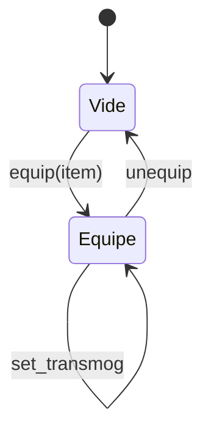
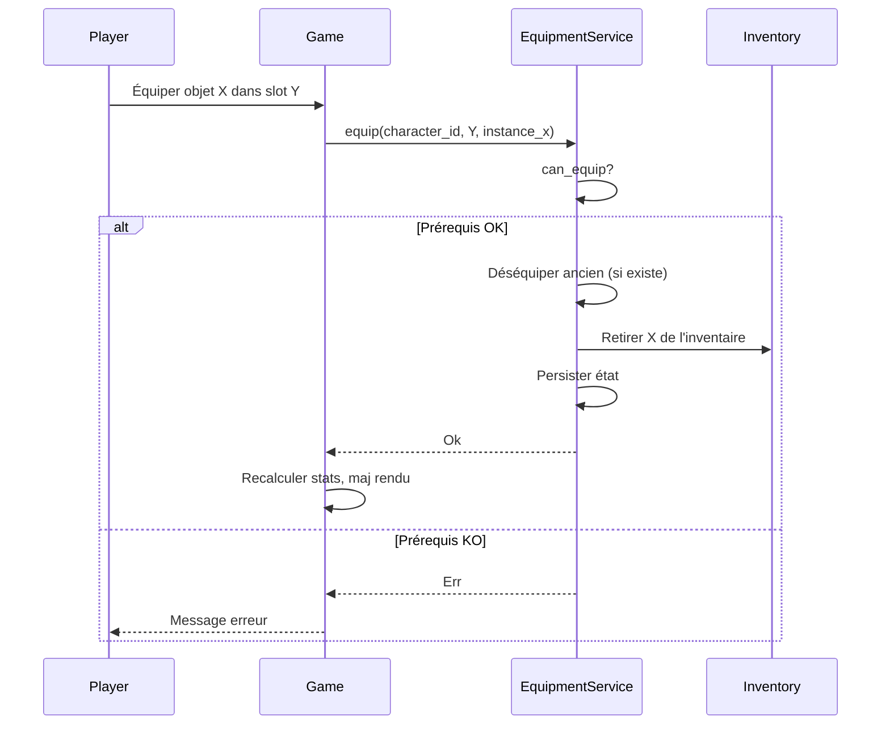
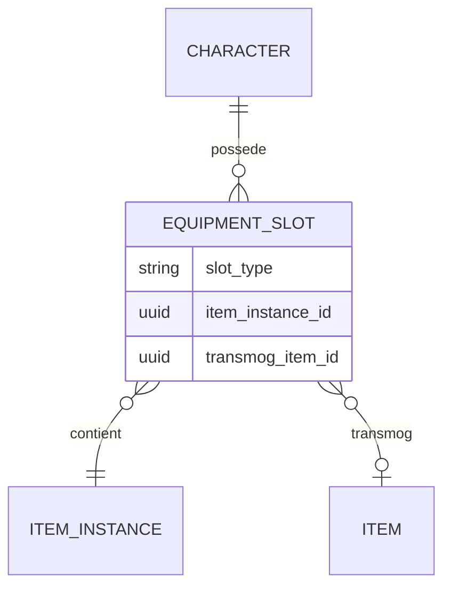

# Slots d'équipement

**Catégorie :** 05. Joueur et personnage  
**Description :** Armure, armes ; stats ; transmog optionnel.

## Contexte

Point de la référence technique MGE. Les slots d'équipement définissent les emplacements où le personnage peut porter des objets (armure, armes, accessoires). Chaque slot influence les [stats](stats.md) du personnage et peut être lié à un système de transmog (apparence visuelle différente de l'objet équipé).

Les types communs (`Rect`, identifiants) sont définis dans la [Référence Commune](../MGE%20-%20Reference%20Commune.md). Les hitbox et collisions pour l'affichage des armes sont traités dans les points [hitbox](../../02-physique-collisions/hitbox.md) et [collision](../../02-physique-collisions/collision.md).

### Rôle dans le moteur

- **Mapping** objet → slot (un objet par slot typiquement)
- **Calcul des stats** : base + bonus équipement
- **Rendu** : sprite d'équipement superposé au personnage
- **Transmog** : apparence optionnelle (cosmétique)

### Liens

- [Stats](stats.md) — impact des équipements sur les statistiques
- [Données joueur](donnees-joueur.md) — persistance des équipements
- [Inventaire](../../11-inventaire-objets/inventaire.md) — source des objets
- [Hitbox](../../02-physique-collisions/hitbox.md) — alignement sprite

---

## Portée

- Liste des slots (tête, torse, jambes, arme principale, secondaire, etc.)
- Règles d'équipement (prérequis, niveau, classe)
- Bonus de stats par slot
- Transmog (apparence de remplacement)
- Persistance (KindMother)

---

## Spécifications techniques

### Liste standard des slots

| Slot | Clé | Description | Types d'objets |
|------|-----|-------------|----------------|
| Tête | `head` | Casque, chapeau, bandeau | Armure légère/moyenne/lourde |
| Torse | `chest` | Plastron, robe | Armure |
| Jambes | `legs` | Jambières, pantalon | Armure |
| Pieds | `feet` | Bottes, sandales | Armure |
| Mains | `hands` | Gantelets, gants | Armure |
| Dos | `back` | Cape, ailes | Cosmétique / stats |
| Arme principale | `main_hand` | Épée, arc, bâton | Arme 1 main ou 2 mains |
| Arme secondaire | `off_hand` | Bouclier, dague, focus | Bouclier / arme / accessoire |
| Anneau 1 | `ring_1` | Anneau | Accessoire |
| Anneau 2 | `ring_2` | Anneau | Accessoire |
| Collier | `amulet` | Amulette | Accessoire |
| Ceinture | `belt` | Ceinture | Accessoire |

### Règles d'équipement

1. **Un objet par slot** (sauf anneaux, 2 slots).
2. **Prérequis** : niveau, stats, classe, race (selon l'objet).
3. **Arme 2 mains** : occupe `main_hand` et `off_hand` (bloque les deux).
4. **Arme 1 main** : `main_hand` uniquement ; `off_hand` libre pour bouclier ou seconde arme.

### Formules de bonus

- **Stats** : chaque pièce d'équipement a des modificateurs (ex. `+10 DEF`, `+5% vitesse`).
- **Total équipement** = somme des bonus de chaque slot.
- **Stats finales** = stats de base + bonus équipement + buffs. Voir [Stats](stats.md).

### Transmog

- **Apparence de remplacement** : le personnage affiche visuellement un autre objet.
- **Persistance** : par slot, stockage de l'ID de l'objet transmog (ou `null` = apparence réelle).
- **Contraintes** : l'objet transmog doit avoir été possédé et débloqué dans la collection.

---

## Modèle de données et API

### Structures Rust (pseudo-code)

```rust
/// Identifiant de slot (enum ou string)
#[derive(Clone, Copy, PartialEq, Eq, Hash)]
pub enum EquipmentSlot {
    Head,
    Chest,
    Legs,
    Feet,
    Hands,
    Back,
    MainHand,
    OffHand,
    Ring1,
    Ring2,
    Amulet,
    Belt,
}

/// État d'équipement d'un personnage
#[derive(Serialize, Deserialize)]
pub struct EquipmentState {
    pub character_id: CharacterId,
    pub slots: HashMap<EquipmentSlot, EquippedItem>,
    pub transmog_overrides: HashMap<EquipmentSlot, ItemId>,  // apparence optionnelle
}

#[derive(Serialize, Deserialize)]
pub struct EquippedItem {
    pub instance_id: ItemInstanceId,  // Référence instance unique
    pub item_id: ItemId,
    pub durability: Option<u32>,      // Si durabilité activée
}

/// Service d'équipement
pub trait EquipmentService {
    /// Récupère l'équipement d'un personnage
    fn get_equipment(&self, character_id: CharacterId) -> Result<EquipmentState, DbError>;

    /// Équipe un objet (vérifie prérequis, déséquipe l'ancien)
    fn equip(&self, character_id: CharacterId, slot: EquipmentSlot, instance_id: ItemInstanceId)
        -> Result<(), DbError>;

    /// Déséquipe un slot (objet retourne à l'inventaire)
    fn unequip(&self, character_id: CharacterId, slot: EquipmentSlot)
        -> Result<(), DbError>;

    /// Applique un transmog (apparence)
    fn set_transmog(&self, character_id: CharacterId, slot: EquipmentSlot, item_id: Option<ItemId>)
        -> Result<(), DbError>;
}
```

### Vérification des prérequis

```rust
pub fn can_equip(item: &Item, character: &CharacterSheet, slot: EquipmentSlot) -> Result<(), EquipError> {
    if item.slot != slot { return Err(EquipError::WrongSlot); }
    if character.level < item.required_level { return Err(EquipError::LevelTooLow); }
    if !item.allowed_classes.contains(&character.class_id) { return Err(EquipError::ClassMismatch); }
    // Vérifier stats requises...
    Ok(())
}
```

---

## Diagrammes

### États d'un slot



### Flux d'équipement



### Relation slots / objets



---

## Exemples et cas d'usage

### Allumina — Équipement classique

- Slots : tête, torse, jambes, pieds, mains, dos, main_hand, off_hand, 2 anneaux, amulette, ceinture.
- Arme 2 mains : occupe main_hand + off_hand, déséquipe automatiquement bouclier.
- Transmog : déblocage en possédant l'objet ; collection persistante.

### Équiper une épée 2 mains

1. Joueur a une épée 2 mains dans l'inventaire.
2. Clic droit → Équiper (slot main_hand suggéré).
3. Si off_hand avait un bouclier : déséquipement auto du bouclier → inventaire.
4. Épée équipée en main_hand ; off_hand marqué "bloqué par arme 2 mains".

### Transmog

1. Joueur équipe une épée puissante mais laide.
2. Ouvre le menu transmog → sélectionne une épée esthétique déjà possédée.
3. En jeu : affichage de l'épée esthétique, stats de l'épée réelle.

---

## Cas limites et tests

### Cas limites

| Cas | Comportement attendu |
|-----|----------------------|
| Équiper dans un slot déjà occupé | Remplace l'ancien, ancien → inventaire |
| Inventaire plein lors du remplacement | Échec ou zone temporaire |
| Objet non équipable dans ce slot | Erreur "Mauvais slot" |
| Niveau insuffisant | Erreur "Niveau requis : X" |
| Arme 2 mains avec off_hand occupé | Déséquipement automatique de off_hand |
| Transmog d'un objet jamais possédé | Erreur ou désactivation transmog |
| Durabilité à 0 | Objet ne peut pas être équipé ou bonus annulés |

### Critères de validation

- [ ] Un seul objet par slot (sauf anneaux x2)
- [ ] Stats recalculées après tout changement
- [ ] Transmog n'affecte que l'apparence
- [ ] Arme 2 mains bloque off_hand

### Tests unitaires suggérés

```rust
#[test]
fn test_equip_replaces_previous() {
    let svc = setup_equipment_service();
    let (char_id, slot) = setup_character_with_item();
    let item2 = create_test_item();
    svc.equip(char_id, slot, item2.instance_id).unwrap();
    let eq = svc.get_equipment(char_id).unwrap();
    assert_eq!(eq.slots[slot].item_id, item2.id);
}

#[test]
fn test_two_hand_blocks_off_hand() {
    let svc = setup_equipment_service();
    let (char_id, _) = setup_character_with_shield();
    let two_hand = create_two_hand_weapon();
    svc.equip(char_id, MainHand, two_hand.instance_id).unwrap();
    let eq = svc.get_equipment(char_id).unwrap();
    assert!(eq.slots[OffHand].is_none() || eq.slots[OffHand].is_blocked());
}
```

---

## Annexes

### Bonus de stats par type d'équipement

| Slot | Stats typiques |
|------|----------------|
| Tête | DEF, INT, WIS |
| Torse | DEF, VIT |
| Jambes | DEF, AGI |
| Pieds | DEF, SPD |
| Mains | DEF, STR, PREC |
| Arme | ATK, PREC, CRIT |
| Bouclier | DEF, blocage |
| Anneaux | Variable (ATK, DEF, résistances) |
| Amulette | Résistances, régen |
| Ceinture | Poids max, VIT |

### Transmog — Règles de déblocage

- **Possession** : l'objet doit avoir été équipé ou possédé au moins une fois
- **Collection** : table `transmog_collection(character_id, item_id)` pour tracer les déblocages
- **Restrictions** : certains objets ne peuvent pas être transmog (objets légendaires, uniques de quête)
- **Coût** : optionnel — certains jeux facturent une ressource pour appliquer un transmog

### Durabilité et équipement

Si le système de durabilité est activé :

- Chaque coup ou minute de combat réduit la durabilité
- À 0 : bonus annulés ou objet cassé (selon config)
- Réparation : via marchand ou objet consommable
- L'équipement reste dans le slot mais n'octroie plus de bonus jusqu'à réparation

### Prérequis avancés

Au-delà du niveau et de la classe :

- **Race** : certaines armures réservées aux Elfes ou Nains
- **Quête** : objet débloqué après une quête spécifique
- **Réputation** : rang de faction requis
- **Alignement** : objets bénis/maudits selon karma
- **Genre** : restriction optionnelle (à éviter pour inclusivité)

### Rendu des équipements

- Chaque slot a un ou plusieurs sprites associés (corps, bras, jambes selon animation)
- **Z-order** : voir [Customisation](customisation.md) pour l'ordre des calques
- **Animation** : les sprites d'équipement suivent les os ou frames du personnage
- **Transmog** : le sprite affiché est celui de l'objet transmog, pas de l'objet réel
- **Couleur teintable** : certains équipements supportent une teinte (RGBA) pour personnalisation

### Équipement et collision

- Les équipements n'affectent généralement pas la hitbox du personnage
- Exception : bouclier peut étendre la hitbox de parade
- Les armes ont leur propre hitbox pour la détection des coups (voir [Combat](../../07-combat/action.md))

### Inventaire et équipement — Flux complet

1. Joueur a un objet dans l'inventaire
2. Clic droit → "Équiper" (ou glisser vers le slot)
3. Vérification `can_equip` (slot, prérequis)
4. Retrait de l'objet de l'inventaire (ou référence conservée selon implémentation)
5. Ancien objet du slot → inventaire (si slot occupé)
6. Mise à jour de l'état d'équipement
7. Recalcul des stats (StatsService)
8. Mise à jour du rendu (sprite équipement)
9. Persistance (KindMother)

### Tests d'intégration équipement

```rust
#[test]
fn test_equip_flow_inventory_to_slot() {
    let (char_id, inv) = setup_character_with_inventory();
    let item = inv.get_item_at(0).unwrap();
    equipment_svc.equip(char_id, MainHand, item.instance_id).unwrap();
    assert!(inv.get_item_at(0).is_none());
    let eq = equipment_svc.get_equipment(char_id).unwrap();
    assert!(eq.slots[MainHand].is_some());
}
```

### Objets Set et équipement

Les [Objets Set](../../11-inventaire-objets/objets-set.md) fournissent des bonus selon le nombre de pièces équipées. Le service d'équipement doit :

- Détecter les changements d'équipement
- Recalculer les bonus Set (2 pièces, 4 pièces, 6 pièces, etc.)
- Notifier le système de stats pour application des bonus

### Équipement et classes

- **Restriction par classe** : un Mage ne peut pas équiper une armure lourde (ou avec malus)
- **Armes** : classe détermine les types d'armes équipables (épée, bâton, arc, etc.)
- **Hybride** : certaines classes (Paladin) peuvent équiper armure ET bâton
- Vérification dans `can_equip` avant toute opération

### Swap rapide (armures de rôle)

Certains jeux permettent de basculer entre deux configurations d'équipement (tank ↔ DPS) :

- **Armures de rôle** : sauvegarde de N configurations (ex. 2)
- **Swap** : un clic remplace tout l'équipement par la config sauvegardée
- Stockage : les objets de l'ancienne config vont dans l'inventaire ; ceux de la nouvelle sont équipés
- Prérequis : inventaire avec assez de place pour stocker les pièces déséquipées

### UI — Tooltips et comparaison

- Au survol d'un objet dans l'inventaire : tooltip avec stats, prérequis, comparaison avec l'objet actuellement équipé dans le slot cible
- Affichage : "+10 ATK (actuellement +5)" en vert, "-5 DEF" en rouge
- Aide à la décision du joueur

### Table de persistance equipment

```sql
CREATE TABLE IF NOT EXISTS equipment (
    character_id TEXT NOT NULL,
    slot TEXT NOT NULL,
    item_instance_id TEXT NOT NULL,
    transmog_item_id TEXT,
    equipped_at TEXT,
    PRIMARY KEY (character_id, slot),
    FOREIGN KEY (character_id) REFERENCES characters(id)
);

CREATE INDEX idx_equipment_character ON equipment(character_id);
```

### Événements émis

- `EquipmentChanged` : (character_id, slot, old_item, new_item)
- Utilisé par : StatsService (recalcul), DefenceService (résistances), UIRenderer (mise à jour sprite)

### Conflits — Inventaire plein

Quand on équipe un nouvel objet et que le slot était occupé :

- L'ancien objet doit retourner dans l'inventaire
- Si inventaire plein : échec de l'équipement avec message "Inventaire plein"
- Alternative : zone temporaire "équipement retiré" qui force le joueur à faire de la place

### Liste de vérification

- [ ] Tous les slots définis et mappés
- [ ] Prérequis vérifiés avant équipement
- [ ] Arme 2 mains gère off_hand
- [ ] Transmog appliqué correctement au rendu
- [ ] Stats recalculées après changement
- [ ] Persistance KindMother OK
- [ ] Tests unitaires et d'intégration

### Équipement automatique

- **Auto-equip** : option pour équiper automatiquement le meilleur objet par slot (selon un critère : ATK, DEF, score composite)
- **Suggestion** : "Vous avez des objets meilleurs dans l'inventaire" avec lien vers les slots
- **Tri** : dans l'inventaire, afficher les objets équipables par slot pour faciliter la comparaison

### Gemmes et insertions

Si le jeu supporte les [Slots et insertions](../../11-inventaire-objets/slots-insertions.md) :

- Certains équipements ont des sockets pour gemmes
- Les gemmes ajoutent des bonus (stats, résistances)
- L'équipement doit exposer les sockets et les bonus des gemmes insérées
- Recalcul des stats : équipement + gemmes

### Objets maudits et bénis

- **Maudits** : ne peuvent pas être déséquipés facilement (ou avec quête/cure)
- **Bénis** : ne tombent pas à la mort (protection)
- Vérification lors de l'équipement : avertissement si objet maudit
- Voir [Objets maudits/bénis](../../11-inventaire-objets/objets-maudits.md)

### Références croisées

L'équipement modifie les [stats](stats.md) du personnage. Les données sont persistées avec les [données joueur](donnees-joueur.md). Le transmog (section Transmog) affecte uniquement l'apparence visuelle. Les objets proviennent de l'[inventaire](../../11-inventaire-objets/inventaire.md). Les règles d'arme 2 mains et de prérequis (niveau, classe, race) sont vérifiées avant tout équipement.

### Synthèse pour Allumina

12 slots : tête, torse, jambes, pieds, mains, dos, main_hand, off_hand, 2 anneaux, amulette, ceinture. Arme 2 mains bloque off_hand. Transmog pour personnaliser l'apparence. Prérequis par niveau et classe. Bonus de stats appliqués automatiquement. Objets Set avec bonus multi-pièces. Durabilité optionnelle. Persistance KindMother.

### Slots par défaut (liste complète)

head, chest, legs, feet, hands, back, main_hand, off_hand, ring_1, ring_2, amulet, belt. Configuration extensible via le fichier de données du jeu. Les slots ring_1 et ring_2 permettent deux anneaux simultanés. Le slot back est souvent utilisé pour des capes ou ailes cosmétiques. La ceinture peut augmenter la capacité de charge (poids max).

### Gestion des conflits de slots

Si deux pièces d'équipement sont incompatibles (ex. deux casques qui couvrent la tête différemment), le moteur doit définir une règle : dernier équipé gagne, ou refus avec message. Les combinaisons valides (ex. casque + cape) sont testées lors de l'équipement.

### Notification UI

À chaque équipement réussi : toast ou message "Équipé : [nom objet]". Si bonus de set activé : "Bonus Set (2 pièces) : +50 HP". Ces notifications améliorent le feedback utilisateur et la compréhension des mécaniques. L'UI d'inventaire peut afficher une icône "équipable" ou "meilleur" sur les objets pour guider le joueur vers les améliorations potentielles.

---

## Références

- [Référence Commune MGE](../MGE%20-%20Reference%20Commune.md)
- [Stats](stats.md)
- [Données joueur](donnees-joueur.md)
- [Inventaire](../../11-inventaire-objets/inventaire.md)
- [Hitbox](../../02-physique-collisions/hitbox.md)
- [Index catégorie 05](_index.md)
- [Index MGE](../_index.md)
