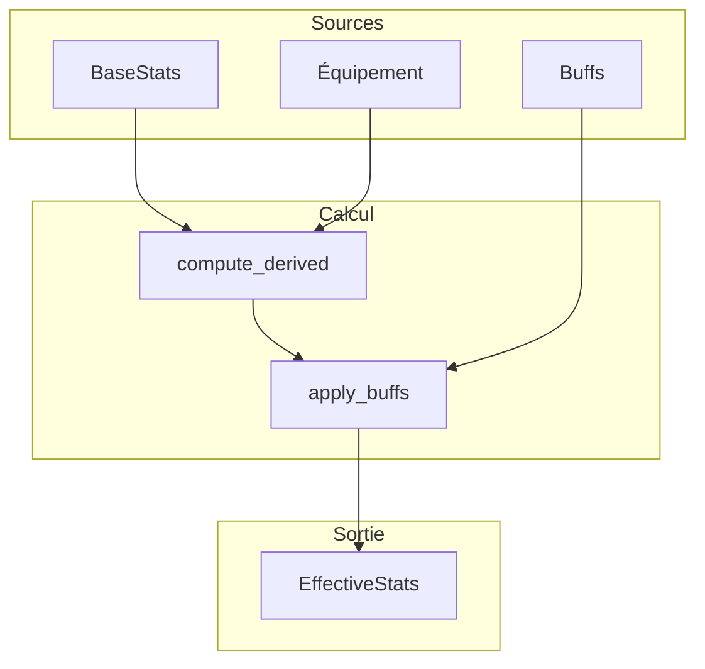

# Stats

**Catégorie :** 05. Joueur et personnage  
**Description :** Attaque, défense, vitesse, précision ; impact sur dégâts, esquive.

## Contexte

Point de la référence technique MGE. Les stats (statistiques) définissent les capacités numériques du personnage : attaque, défense, vitesse, précision, et leur impact sur les formules de combat (dégâts infligés, dégâts reçus, chance de toucher, esquive).

Ce document décrit les stats de base, les stats dérivées, les formules de calcul et l'intégration avec l'[équipement](slots-equipement.md) et le [combat](../../07-combat/action.md). Les types communs sont dans la [Référence Commune](../MGE%20-%20Reference%20Commune.md).

### Rôle dans le moteur

- **Calcul des capacités** : dégâts, résistance, vitesse d'action
- **Formules de combat** : chance de toucher, esquive, critique
- **Évolution** : stats de base + bonus équipement + buffs

### Liens

- [Slots équipement](slots-equipement.md) — bonus des équipements
- [Données joueur](donnees-joueur.md) — persistance des stats de base
- [Chance de toucher](../../07-combat/chance-toucher.md) — formule précision vs esquive
- [Action combat](../../07-combat/action.md) — utilisation des ressources

---

## Portée

- Stats de base (Force, Agilité, Vitalité, etc.)
- Stats dérivées (ATK, DEF, SPD, PREC, EVA)
- Formules de dégâts et réduction
- Formules de chance de toucher et esquive
- Impact des buffs et debuffs

---

## Spécifications techniques

### Stats de base (primary)

| Stat | Clé | Influence |
|------|-----|-----------|
| Force | `str` | Dégâts physiques, poids porté |
| Agilité | `agi` | Vitesse, esquive, précision |
| Vitalité | `vit` | HP max, régen HP |
| Intelligence | `int` | Dégâts magiques, mana max |
| Sagesse | `wis` | Résistances magiques, régen mana |
| Chance | `luck` | Critique, loot, esquive |

### Stats dérivées (secondary)

| Stat | Clé | Formule (exemple) |
|------|-----|-------------------|
| Attaque | `atk` | base + str * k1 + équipement |
| Défense | `def` | base + vit * k2 + équipement |
| Vitesse | `spd` | base + agi * k3 + équipement |
| Précision | `prec` | base + agi * k4 + équipement |
| Esquive | `eva` | base + agi * k5 + luck * k6 |
| Critique | `crit` | base + luck * k7 |
| HP max | `hp_max` | base + vit * k8 + niveau * k9 |
| Mana max | `mp_max` | base + int * k10 + niveau * k11 |

Les coefficients `k1`–`k11` sont des paramètres de game design (fichier de config ou constantes).

### Formules de combat (référence)

#### Dégâts physiques

```text
dégâts_bruts = ATK_attaquant - DEF_cible * facteur_reduction
dégâts_finaux = max(1, dégâts_bruts * modificateurs)
```

`facteur_reduction` typiquement entre 0.3 et 0.8 (éviter invulnérabilité totale).

#### Chance de toucher

```text
hit_chance = PREC_attaquant / (PREC_attaquant + EVA_cible)
```

Ou formule différentielle : `hit_chance = base + (PREC - EVA) * facteur`.

#### Esquive

```text
dodge_chance = EVA_cible / (EVA_cible + PREC_attaquant)
```

#### Critique

```text
crit_chance = CRIT_attaquant / 100  (ou formule plus complexe)
crit_multiplier = 1.5 à 2.0
```

---

## Modèle de données et API

### Structures Rust (pseudo-code)

```rust
#[derive(Clone, Serialize, Deserialize)]
pub struct BaseStats {
    pub str: i32,
    pub agi: i32,
    pub vit: i32,
    pub int: i32,
    pub wis: i32,
    pub luck: i32,
}

#[derive(Clone, Serialize, Deserialize)]
pub struct DerivedStats {
    pub atk: i32,
    pub def: i32,
    pub spd: i32,
    pub prec: i32,
    pub eva: i32,
    pub crit: i32,
    pub hp_max: u32,
    pub mp_max: u32,
}

#[derive(Clone)]
pub struct EffectiveStats {
    pub derived: DerivedStats,
    pub buffs: Vec<StatModifier>,
}

impl EffectiveStats {
    pub fn atk(&self) -> i32 {
        self.apply_modifiers(self.derived.atk, StatType::Atk)
    }
    // ...
}

pub struct StatModifier {
    pub stat_type: StatType,
    pub value: i32,       // Valeur absolue
    pub percent: f32,     // Pourcentage
    pub duration_secs: Option<u32>,
}
```

### API

```rust
pub trait StatsService {
    fn compute_derived(&self, base: &BaseStats, equipment_bonus: &EquipmentBonus, level: u32)
        -> DerivedStats;
    fn apply_buffs(&self, derived: &DerivedStats, buffs: &[StatModifier]) -> EffectiveStats;
}
```

---

## Diagrammes

### Calcul des stats effectives


### Dépendances



---

## Exemples et cas d'usage

### Allumina — Guerrier niveau 10

- Base : STR 15, AGI 8, VIT 12, INT 5, WIS 5, LUCK 7
- Équipement : épée +10 ATK, plastron +15 DEF
- Dérivées : ATK 45, DEF 38, HP 420

### Buff "Berserker"

- +20 % ATK, -10 % DEF pendant 15 secondes
- `StatModifier { stat_type: Atk, percent: 0.2, ... }`

### Formule chance de toucher (simplifiée)

- Attaquant PREC 50, Cible EVA 25
- hit_chance = 50 / (50 + 25) = 66.7 %

---

## Cas limites et tests

### Cas limites

| Cas | Comportement attendu |
|-----|----------------------|
| Stats négatives | Clamp à 0 (ou 1 pour dégâts min) |
| Buff empilable | Politique : dernier écrasé ou cumul (configurable) |
| Niveau 0 | Stats de base uniquement |
| Équipement sans bonus | Pas d'impact |

### Critères de validation

- [ ] Stats dérivées cohérentes avec formules
- [ ] Buffs appliqués correctement
- [ ] Performance : recalcul < 1 ms

### Tests unitaires suggérés

```rust
#[test]
fn test_derived_stats_formula() {
    let base = BaseStats { str: 10, agi: 10, vit: 10, int: 10, wis: 10, luck: 10 };
    let bonus = EquipmentBonus::default();
    let derived = compute_derived(&base, &bonus, 5);
    assert!(derived.atk >= 0);
    assert!(derived.hp_max > 0);
}

#[test]
fn test_buff_stack_and_expiry() {
    let mut effective = EffectiveStats::from_derived(derived);
    effective.add_buff(StatModifier::atk_percent(0.2, 10));
    effective.add_buff(StatModifier::atk_percent(0.1, 5));
    assert!(effective.atk() > derived.atk);
    // Après 6 sec, un buff expiré → recalcul
}
```

---

## Annexes

### Fichier de configuration des formules

Les coefficients peuvent être externalisés dans un fichier (JSON, YAML) :

```json
{
  "derived_formulas": {
    "atk": { "base": 10, "str_mult": 2.0, "level_mult": 0.5 },
    "def": { "base": 5, "vit_mult": 1.5, "level_mult": 0.3 },
    "hp_max": { "base": 100, "vit_mult": 10, "level_mult": 5 }
  }
}
```

### Modificateurs de pourcentage vs absolu

- **Absolu** : `+10 ATK` → addition directe
- **Pourcentage** : `+20 % ATK` → appliqué sur la valeur de base (avant autres buffs) ou sur la valeur courante (après équipement)
- **Ordre d'application** : base → équipement → buffs % (base) → buffs absolus → buffs % (total)
- Documentation du moteur doit préciser l'ordre canonique

### Stats temporaires en combat

- **Buffs** : durée limitée, stack ou dernier écrasé
- **Debuffs** : réductions (ex. -20 % DEF)
- **Dispel** : suppression des buffs (ennemi) ou debuffs (allié)
- Stockage : `Vec<StatModifier>` avec `expires_at` pour nettoyage automatique

### Réduction des dégâts — Formule détaillée

Formule alternative pour éviter les valeurs négatives ou infinies :

```text
reduction = DEF / (DEF + k)
dégâts_reçus = dégâts_bruts * (1 - reduction)
```

Avec `k` constante (ex. 100) : DEF 50 → ~33 % réduction ; DEF 200 → ~67 % réduction. Asymptotique, jamais 100 %.

### Réseau — Synchronisation des stats

En multijoueur (MWS), les stats effectives sont calculées côté serveur (autorité). Le client peut afficher une prévision locale pour le feedback immédiat, mais la valeur finale vient du serveur après validation.

### Résistances élémentaires

En complément des stats de combat, les résistances (feu, froid, éclair, etc.) sont souvent stockées séparément :

- Voir [Résistances](../../08-degats-resistances/resistances.md)
- Les résistances peuvent être dérivées de WIS ou de stats de base
- L'équipement ajoute des bonus de résistance par élément

### Régénération HP / Mana

- **HP regen** : souvent dérivé de VIT ou pourcentage de HP max par seconde
- **MP regen** : dérivé de WIS ou INT
- **Hors combat** : bonus de regen (x2, x5) pour accélérer la récupération
- **En combat** : regen réduite ou nulle selon le design

### Ordre d'application des modificateurs — Spécification

1. Stats de base (du personnage)
2. Bonus de niveau (par level up)
3. Bonus d'équipement (somme des bonus de chaque pièce)
4. Buffs % sur base (multiplicateurs appliqués sur base + équipement)
5. Buffs absolus
6. Buffs % sur total (optionnel, souvent évité pour éviter les combos explosifs)
7. Clamp final (min 0 ou 1 selon la stat)

### Table de coefficients exemple (Allumina)

| Stat dérivée | Base | str | agi | vit | int | wis | luck | level |
|--------------|------|-----|-----|-----|-----|-----|------|-------|
| ATK | 10 | 2.0 | 0.5 | 0 | 0 | 0 | 0.3 | 1.0 |
| DEF | 5 | 0 | 0.5 | 1.5 | 0 | 0.5 | 0 | 0.5 |
| SPD | 50 | 0 | 2.0 | 0 | 0 | 0 | 0.5 | 1.0 |
| HP max | 80 | 0 | 0 | 12 | 0 | 0 | 0 | 8 |

### Tests de régression

```rust
#[test]
fn test_formula_consistency() {
    let base = BaseStats { str: 15, agi: 10, vit: 12, ..default() };
    let derived = compute_derived(&base, &EquipmentBonus::default(), 10);
    assert!((derived.atk - 45).abs() < 5);
    assert!(derived.hp_max > 200);
}

#[test]
fn test_buff_expiry_removes_modifier() {
    let mut effective = EffectiveStats::new(derived);
    effective.add_buff(StatModifier::atk_flat(10, Some(5)));
    assert_eq!(effective.atk(), derived.atk + 10);
    advance_time(6);
    effective.update_buffs();
    assert_eq!(effective.atk(), derived.atk);
}
```

### Interface StatsService — Détail

```rust
pub trait StatsService {
    fn get_base_stats(&self, character_id: CharacterId) -> Result<BaseStats, DbError>;
    fn get_equipment_bonus(&self, character_id: CharacterId) -> Result<EquipmentBonus, DbError>;
    fn get_active_buffs(&self, character_id: CharacterId) -> Vec<StatModifier>;
    fn compute_effective_stats(&self, character_id: CharacterId) -> Result<EffectiveStats, DbError>;
}
```

### Débogage et affichage

- Overlay debug : affichage des stats effectives en temps réel (ATK, DEF, etc.)
- Comparaison avant/après buff : pour diagnostiquer les effets
- Log des applications de modificateurs : optionnel, pour tracer les calculs

### Documentation des formules pour le game design

Un document séparé ou une section dans la doc technique doit lister toutes les formules avec leurs paramètres afin que les designers puissent ajuster l'équilibrage sans toucher au code.

### Exemple de fichier de configuration (YAML)

```yaml
derived_formulas:
  atk:
    base: 10
    str_mult: 2.0
    agi_mult: 0.5
    level_mult: 1.0
  def:
    base: 5
    vit_mult: 1.5
    level_mult: 0.3
  hp_max:
    base: 80
    vit_mult: 12
    level_mult: 8

damage_reduction:
  formula: "def / (def + k)"
  k: 100
```

### Buffs — Types de modificateurs

- **Flat** : +10 ATK (addition directe)
- **Percent base** : +20% sur (base + équipement)
- **Percent total** : +10% sur la valeur courante (attention aux stacks)
- **Multiplicateur** : x1.5 (équivalent à +50%)

### Résistances — Intégration

Les résistances (feu, froid, etc.) peuvent être des stats dérivées :

- `resist_fire = base + wis * k + equipment_fire_resist`
- Les dégâts élémentaires sont réduits par la résistance correspondante
- Voir [Résistances](../../08-degats-resistances/resistances.md)

### Liste de vérification implémentation

- [ ] BaseStats persistées et chargées
- [ ] EquipmentBonus calculé depuis l'équipement
- [ ] Buffs appliqués avec durée et expiration
- [ ] Formules conformes à la spec
- [ ] Stats effectives utilisées dans le combat
- [ ] Performance : recalcul < 1 ms
- [ ] Tests unitaires pour les formules

### Cas particuliers — Stats à 0

- **ATK 0** : dégâts minimum (1) ou échec d'attaque selon le design
- **DEF très élevé** : formule asymptotique évite l'invulnérabilité
- **SPD 0** : personnage incapable de bouger (stun, root)
- **PREC 0** : attaques toujours manquées

### Synchronisation réseau — Résumé

- **Client** : affiche une estimation pour le feedback
- **Serveur** : calcule et valide les stats effectives
- **Délai** : le client peut appliquer les buffs localement avant la confirmation serveur ; réconciliation si divergence

### Événements StatsChanged

Quand les stats effectives changent (équipement, buff) :

- Émission de `StatsChanged { character_id, old_stats, new_stats }`
- Abonnés : UI (mise à jour des barres), combat (recalcul des dégâts), logs

### Références croisées

Les stats sont calculées à partir des [données joueur](donnees-joueur.md) (base) et des [slots équipement](slots-equipement.md) (bonus). Elles alimentent le [combat](../../07-combat/action.md) pour les formules de dégâts, chance de toucher et esquive. Les [résistances](../../08-degats-resistances/resistances.md) en sont un prolongement. Les formules sont externalisables (config) pour faciliter l'équilibrage par les designers.

### Synthèse pour Allumina

6 stats de base (STR, AGI, VIT, INT, WIS, LUCK). Stats dérivées : ATK, DEF, SPD, PREC, EVA, CRIT, HP max, MP max. Formules dans un fichier YAML. Buffs avec durée et expiration. Équipement ajoute des bonus. Réduction des dégâts : DEF/(DEF+k). Chance de toucher : PREC/(PREC+EVA). Les designers ajustent les coefficients sans toucher au code.

### Fichier de config (extrait)

```yaml
stats:
  derived:
    atk: { base: 10, str_mult: 2.0, level_mult: 1.0 }
    def: { base: 5, vit_mult: 1.5 }
  damage_reduction_k: 100
```

Les buffs et debuffs sont gérés par le système d'effets de statut (voir [Effets de statut](../../08-degats-resistances/effets-statut.md)). Les résistances élémentaires complètent les stats de combat pour les dégâts magiques.

### Performance du recalcul

Le recalcul des stats effectives doit être rapide (< 1 ms) car il est déclenché à chaque changement d'équipement ou de buff. Optimisations : cache des stats dérivées avec invalidation sur événement EquipmentChanged ou BuffChanged ; calcul incrémental si possible ; éviter les allocations dans la boucle chaude.

### Exemple de calcul effectif (pseudo-code)

```
effective_atk = base_atk + equipment_atk
for buff in buffs:
    if buff.type == PercentBase:
        effective_atk += base_atk * buff.value
    elif buff.type == Flat:
        effective_atk += buff.value
effective_atk = max(1, effective_atk)
```

Les buffs temporaires expirent après leur durée ; le système de combat appelle `update_buffs()` pour nettoyer les buffs expirés et recalculer les stats effectives.

---

## Références

- [Référence Commune MGE](../MGE%20-%20Reference%20Commune.md)
- [Slots équipement](slots-equipement.md)
- [Données joueur](donnees-joueur.md)
- [Chance de toucher](../../07-combat/chance-toucher.md)
- [Index catégorie 05](_index.md)
- [Index MGE](../_index.md)
