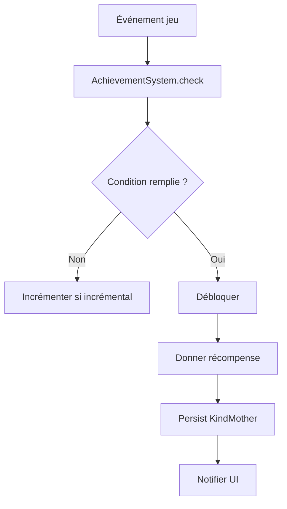

# Achievements et succès

**Catégorie :** 06. Progression  
**Description :** Objectifs ; récompenses ; progression affichée.

## Contexte

Le système d'achievements (succès) permet de récompenser le joueur pour des actions spécifiques ou des objectifs atteints. Chaque succès débloqué peut offrir des récompenses (titre, cosmétique, XP bonus) et afficher la progression. Lié aux [titres](titres.md) et au [système de niveau](systeme-niveau.md).

**Rôle dans le moteur :** Engagement long terme, objectifs secondaires, collection, rétention. Voir [MGE - Référence technique](../MGE%20-%20Miyukini%20Game%20Engine%20-%20Reference%20Technique.md).

---

## Spécifications techniques

### Types d'achievements

| Type | Description | Exemple |
|------|-------------|---------|
| One-shot | Une fois débloqué, c'est fait | "Tuer 1 boss" |
| Incrémental | Progression (0/10, 1/10, …) | "Tuer 10 boss" |
| Secret | Caché jusqu'à déblocage | "Découvrir la zone secrète" |
| Saisonnier | Limité à une saison | Voir [saisons-battle-pass](saisons-battle-pass.md) |

### Catégories

| Catégorie | Exemples |
|-----------|----------|
| Combat | Kills, bosses, donjons |
| Exploration | Zones découvertes, secrets |
| Social | Groupe, guildes, échanges |
| Collectible | Objets, montures, titres |
| Crafting | Recettes, créations |
| Quêtes | Complétions, chaînes |

### Déclencheurs

- **Événements in-game** : Kill, loot, zone visitée, quête complétée
- **Métriques** : Compteurs (nombre de X)
- **Conditions composites** : AND, OR de sous-objectifs

### Récompenses

| Récompense | Description |
|------------|-------------|
| Titre | Débloqué pour affichage ; voir [titres](titres.md) |
| Points | Monnaie achievements (boutique, exchange) |
| Cosmétique | Skin, monture, effet |
| XP / or | Bonus progression |
| Rien | Prestige uniquement |

---

## Modèle de données / API

```rust
pub struct AchievementDefinition {
    pub id: AchievementId,
    pub name: String,
    pub description: String,
    pub category: AchievementCategory,
    pub trigger: AchievementTrigger,
    pub reward: Option<AchievementReward>,
    pub hidden: bool,
}

pub enum AchievementTrigger {
    Count { target: u32, event: EventType },
    OneShot { condition: Box<dyn Condition> },
}

pub struct CharacterAchievement {
    pub achievement_id: AchievementId,
    pub unlocked_at: DateTime,
    pub progress: Option<u32>,  // pour incrémental
}
```

---

## Diagrammes



---

## Exemples

- **"Premier sang"** : Tuer 1 monstre. Récompense : 10 XP.
- **"Explorateur"** : Découvrir 50 zones. Incrémental, récompense : titre "Explorateur".
- **"Légende"** : Niveau 99. Récompense : titre "Légende", monture exclusive.

---

## Cas limites

- Déblocage simultané de plusieurs : traiter dans l'ordre, notifications séquentielles
- Achievement supprimé du jeu : garder le statut débloqué pour les joueurs existants
- Récompense échoue (inventaire plein) : mettre en file, retry ou mailbox

---

## Références

- [Index 06](_index.md)
- [Titres](titres.md)
- [Saisons battle pass](saisons-battle-pass.md)
