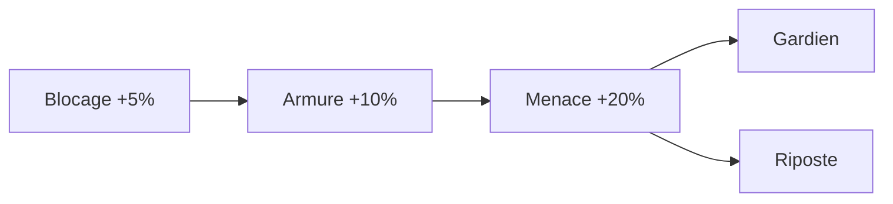
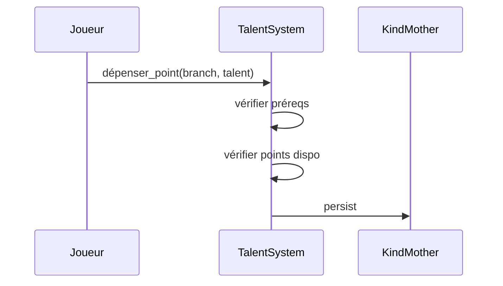

# Arbres de talents

**Catégorie :** 06. Progression  
**Description :** Points de talent ; branches ; reset.

## Contexte

Les arbres de talents permettent au joueur de personnaliser son personnage en dépensant des points de talent dans des branches spécialisées. Chaque point placé débloque ou renforce des capacités. Ce système complète le [système de niveau](systeme-niveau.md) et le [gain de compétences](gain-competences-aptitudes.md).

**Rôle dans le moteur :** Offrir des choix de build (tank, DPS, support) et de la rejouabilité. Voir [MGE - Référence technique](../MGE%20-%20Miyukini%20Game%20Engine%20-%20Reference%20Technique.md).

---

## Spécifications techniques

### Attribution des points

| Moment | Points gagnés |
|--------|---------------|
| Level up | +1 pt tous les niveaux (ou tous les N niveaux) |
| Quêtes | Récompenses ponctuelles |
| Achievements | Certains succès donnent des points |
| Reset | Récupération des points (voir reset) |

### Structure d'un arbre

- **Branches** : 2 à 4 branches par classe (ex. Offensif, Défensif, Utilité)
- **Rang** : Chaque branche a des rangs (1 à 5+)
- **Prérequis** : X points dans la branche pour débloquer le rang suivant
- **Choix exclusifs** : Certains talents sont mutuellement exclusifs (un seul des deux)

### Types de talents

| Type | Description |
|------|-------------|
| Passif | Bonus permanent (ex. +5 % dégâts) |
| Amélioration | Modifie une compétence existante |
| Nouvelle capacité | Débloque une action |
| Seuil | Déclenche un effet sous condition |

### Reset de talents

| Option | Coût | Effet |
|--------|------|-------|
| Partiel | Or/ressources | Reset une branche |
| Total | Or + cooldown | Tous les points récupérés |
| Gratuit limité | 1x par saison | Reset complet sans coût |

---

## Modèle de données / API

```rust
pub struct TalentTree {
    pub branches: Vec<TalentBranch>,
}

pub struct TalentBranch {
    pub id: BranchId,
    pub name: String,
    pub talents: Vec<TalentDefinition>,
}

pub struct TalentDefinition {
    pub id: TalentId,
    pub rank: u32,
    pub prereq_points_in_branch: u32,
    pub mutually_exclusive_with: Option<TalentId>,
}

pub struct CharacterTalents {
    pub points_spent: HashMap<BranchId, u32>,
    pub talents: HashSet<TalentId>,
}
```

---

## Diagrammes

### Exemple branche Tank



### Flux dépense point



---

## Exemples et cas d'usage

- **Allumina** : 3 branches par classe (Dégâts, Survie, Contrôle). 1 pt/niveau. Reset gratuit 1x/semaine.
- **Build Tank** : Max branche Défensif, quelques points Utilité.
- **Respec** : Joueur change de DPS à heal → reset total, re-spend.

---

## Cas limites

- Dépenser le dernier point d'une branche : validation préreq
- Reset pendant combat : interdit
- Conflit mutuellement exclusif : dernier dépensé prioritaire

---

## Détails techniques

### Formule coût en points par rang

Chaque talent a un coût en points. Souvent : 1 pt par talent de base, 2-3 pts pour les talents avancés. Le prérequis "X points dans la branche" assure une progression linéaire.

### Persistance KindMother

```sql
CREATE TABLE character_talents (
    character_id INTEGER NOT NULL,
    branch_id TEXT NOT NULL,
    talent_id TEXT NOT NULL,
    PRIMARY KEY (character_id, talent_id)
);
```

### Références

- [Index 06](_index.md)
- [Système niveau](systeme-niveau.md)
- [Cap total skills](cap-total-skills.md)
