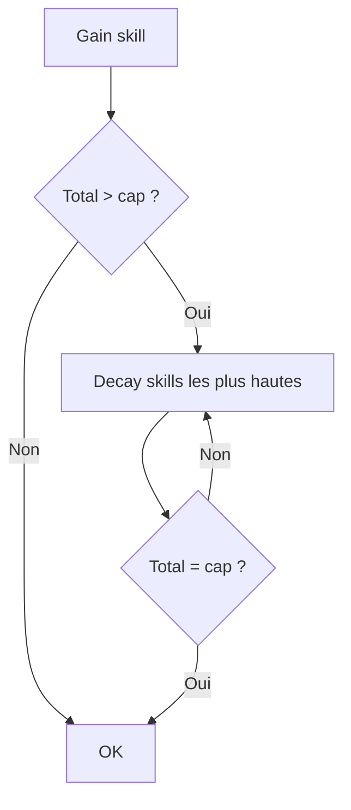

# Cap total des skills

**Catégorie :** 06. Progression  
**Description :** Plafond global réparti entre toutes les compétences.

## Contexte

Le cap total des skills impose une limite globale sur la somme des niveaux (ou points) de toutes les compétences d'un personnage. Le joueur doit faire des choix : spécialiser dans quelques compétences ou disperser. Combiné avec [skills-usage](skills-usage.md) et [skill-gains-degressifs](skill-gains-degressifs.md), ce système crée une progression à somme constante.

**Rôle dans le moteur :** Éviter les personnages « parfaits » ; forcer la spécialisation. Voir [MGE - Référence technique](../MGE%20-%20Miyukini%20Game%20Engine%20-%20Reference%20Technique.md).

---

## Spécifications techniques

### Définition du cap

| Paramètre | Description | Exemple |
|-----------|-------------|---------|
| Cap global | Somme max des niveaux de compétences | 700 pts |
| Compétences concernées | Liste ou filtres (combat, craft, etc.) | Toutes ou sous-ensembles |
| Dépassement | Comportement si > cap | Decay des plus hautes |

### Formule

```
total = sum(skill_level(i) pour toute skill i)
si total > cap : appliquer decay jusqu'à total = cap
```

### Répartition libre vs contraintes

Voir [repartition-libre](repartition-libre.md) : le joueur choisit où investir. Le cap est le plafond de ce qu'il peut « dépenser » au total.

### Interaction avec skill gains dégressifs

Voir [skill-gains-degressifs](skill-gains-degressifs.md) : plus une skill est haute, plus les gains sont lents. Combiné au cap, cela rend la max d'une skill très coûteuse en « budget » global.

---

## Modèle de données / API

```rust
pub struct SkillCapConfig {
    pub global_cap: u32,
    pub skill_ids: Vec<SkillId>,  // compétences comptées
}

fn total_skill_points(character: &Character, config: &SkillCapConfig) -> u32;
fn is_at_cap(character: &Character, config: &SkillCapConfig) -> bool;
fn apply_decay_if_over_cap(character: &mut Character, config: &SkillCapConfig);
```

---

## Diagrammes



---

## Exemples

**Ultima Online** : 700 points max, 7 compétences × 100. Dépenser dans une nouvelle skill peut faire baisser une existante (ou choix manuel).

**Allumina** : Option simplifiée : pas de decay, mais blocage des gains une fois le cap atteint. Le joueur doit « désinvestir » via reset pour réallouer.

---

## Cas limites

| Cas | Comportement |
|-----|--------------|
| Cap 0 | Invalide |
| Ajout nouvelle compétence au jeu | Migration : inclure ou exclure du cap |
| Reset partiel | Total diminue, gains à nouveau possibles |

---

## Références

- [Index 06](_index.md)
- [Skills usage](skills-usage.md)
- [Skill gains dégressifs](skill-gains-degressifs.md)
- [Répartition libre](repartition-libre.md)
