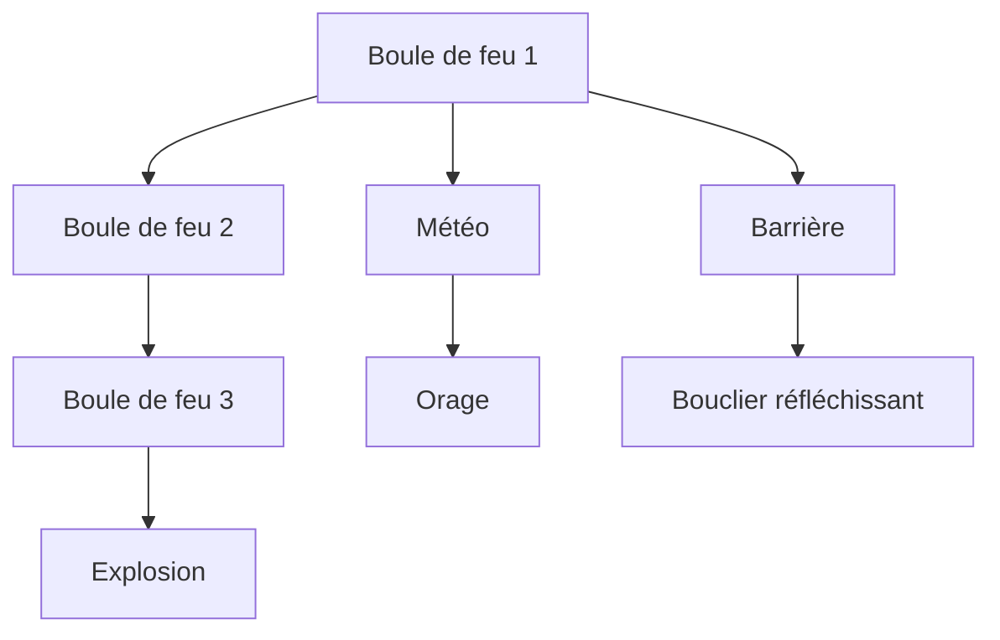
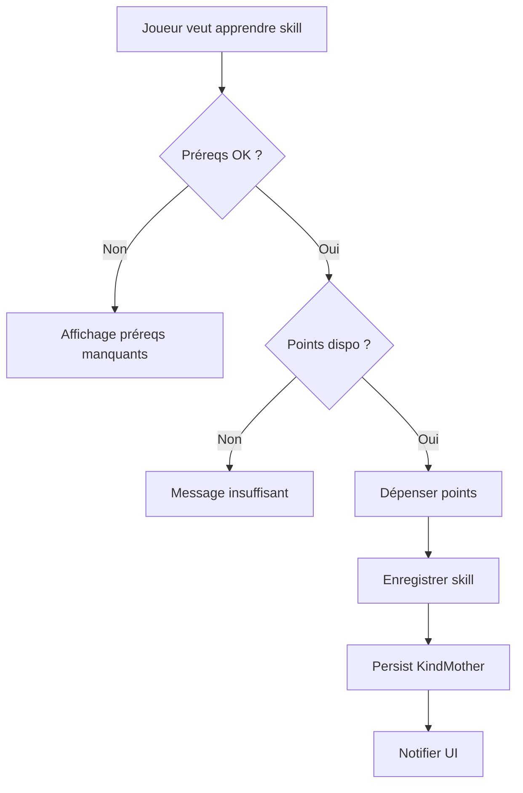
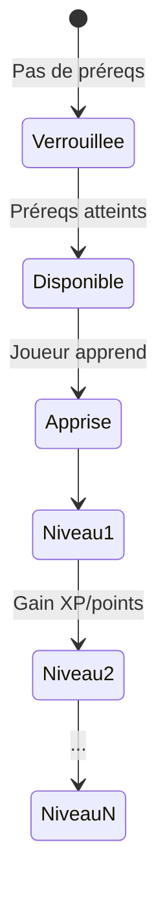

# Gain de compétences et aptitudes

**Catégorie :** 06. Progression  
**Description :** Progression ; arbres de compétences.

## Contexte

Le système de gain de compétences et aptitudes définit comment les personnages acquièrent et font évoluer leurs capacités (skills) au-delà du simple niveau. Il inclut les arbres de compétences, les mécanismes d'acquisition et les prérequis. Ce point est distinct des [arbres de talents](arbres-talents.md) (points dépensables) et du [système de niveau](systeme-niveau.md) (XP global).

**Rôle dans le moteur :** Fournir une progression de compétences flexible, adaptée aux jeux de type RPG (Allumina). Voir [MGE - Référence technique](../MGE%20-%20Miyukini%20Game%20Engine%20-%20Reference%20Technique.md).

---

## Spécifications techniques

### Types de compétences

| Type | Description | Exemple |
|------|-------------|---------|
| Active | Utilisée volontairement, cooldown/cast | Boule de feu |
| Passive | Effet permanent une fois acquise | Bonus dégâts critique |
| Aura | Zone autour du joueur | Régénération groupe |
| Maîtrise | Améliore une catégorie d'actions | Maîtrise épée |

### Mécanismes d'acquisition

| Mécanisme | Description |
|-----------|-------------|
| Montée par niveau | Déblocage automatique au niveau X |
| Quête | Récompense de quête ou chain quest |
| Maître/PNJ | Achat ou formation auprès d'un instructeur |
| Objet consumable | Livre de sorts, parchemin |
| Utilisation (skill usage) | Les compétences montent à l'usage ; voir [skills-usage](skills-usage.md) |
| Arbre de talents | Points dépensables ; voir [arbres-talents](arbres-talents.md) |

### Arbres de compétences

Un arbre de compétences est un graphe orienté où :
- **Nœuds** : compétences individuelles
- **Arêtes** : prérequis (compétence A requise pour débloquer B)
- **Racine** : compétences de base accessibles dès le début
- **Profondeur max** : 3 à 5 niveaux typiquement

### Prérequis par compétence

| Prérequis | Exemple |
|-----------|---------|
| Niveau personnage | Niveau 10 |
| Compétence parent | "Coup de base" niveau 5 |
| Stat minimale | INT >= 20 |
| Classe/Job | Mage uniquement |
| Quête | "Le secret du feu" complétée |

### Progression intra-compétence

Certaines compétences ont des niveaux (1 à 10) :
- Chaque niveau augmente l'efficacité (dégâts, durée, etc.)
- Coût en points de compétence ou XP d'utilisation

---

## Modèle de données / API

### Structures Rust

```rust
/// Définition d'une compétence dans un arbre
#[derive(Debug, Clone)]
pub struct SkillDefinition {
    pub id: SkillId,
    pub name: String,
    pub skill_type: SkillType,
    pub max_level: u32,
    pub prereqs: Vec<SkillPrereq>,
}

#[derive(Debug, Clone)]
pub enum SkillPrereq {
    Level(u32),
    SkillLevel(SkillId, u32),
    StatMin(StatId, u32),
    Class(ClassId),
    Quest(QuestId),
}

/// État d'une compétence pour un personnage
#[derive(Debug, Clone, Serialize, Deserialize)]
pub struct CharacterSkill {
    pub skill_id: SkillId,
    pub level: u32,
    pub xp_in_skill: u64,  // si skill usage
}
```

### Signatures principales

```rust
fn can_learn_skill(character: &Character, skill: &SkillDefinition) -> bool;
fn learn_skill(character: &mut Character, skill_id: SkillId) -> Result<(), SkillError>;
fn get_available_skills(character: &Character, tree: &SkillTree) -> Vec<SkillId>;
fn skill_level(character: &Character, skill_id: SkillId) -> u32;
```

---

## Diagrammes

### Arbre de compétences exemple (Mage)



### Flux d'acquisition



### États d'une compétence



---

## Exemples et cas d'usage

### Exemple Allumina : arbre guerrier

- **Niveau 1** : Coup de base, Parade (débloqués)
- **Niveau 5** : Coup puissant (réq: Coup base 3)
- **Niveau 10** : Roue de feu (réq: Coup puissant 2, STR 15)
- **Niveau 15** : Charge (réq: Coup puissant 3, VIT 20)

### Scénario : changement de classe

Avec [jobs-changement-classe](jobs-changement-classe.md), le joueur peut changer de classe. Les compétences de l'ancienne classe restent en mémoire mais sont désactivées. Réactivation si retour à la classe.

### Scénario : multi-classe

Si le moteur supporte le multi-classing :
- Arbres séparés par classe
- Points de compétence partagés ou dédiés
- Limite de compétences actives équipables

---

## Cas limites et tests

| Cas | Comportement |
|-----|--------------|
| Réapprendre une skill déjà connue | Ignorer ou reset ? (spécifique au design) |
| Oubli de skill | Si mécanique prévue : coût, quête |
| Préreq circulaire | Validation au chargement : erreur fatale |
| Suppression d'une skill du template | Migration : garder l'ancienne ou reset |

### Intégration KindMother

Les compétences apprises sont persistées dans la base du personnage. Schéma typique :

```sql
CREATE TABLE character_skills (
    character_id INTEGER NOT NULL,
    skill_id INTEGER NOT NULL,
    level INTEGER NOT NULL DEFAULT 1,
    PRIMARY KEY (character_id, skill_id)
);
```

### Configuration YAML exemple

```yaml
skill_trees:
  warrior:
    - id: coup_base
      max_level: 10
      prereqs: []
    - id: coup_puissant
      max_level: 5
      prereqs:
        - { skill: coup_base, level: 3 }
```

---

## Références

- [Index catégorie 06](_index.md)
- [Index MGE](../_index.md)
- [Système de niveau](systeme-niveau.md)
- [Arbres de talents](arbres-talents.md)
- [Skills usage](skills-usage.md)
- [Jobs changement classe](jobs-changement-classe.md)
