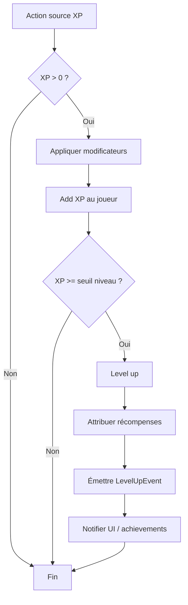
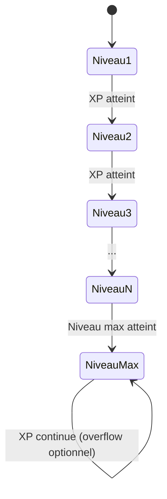
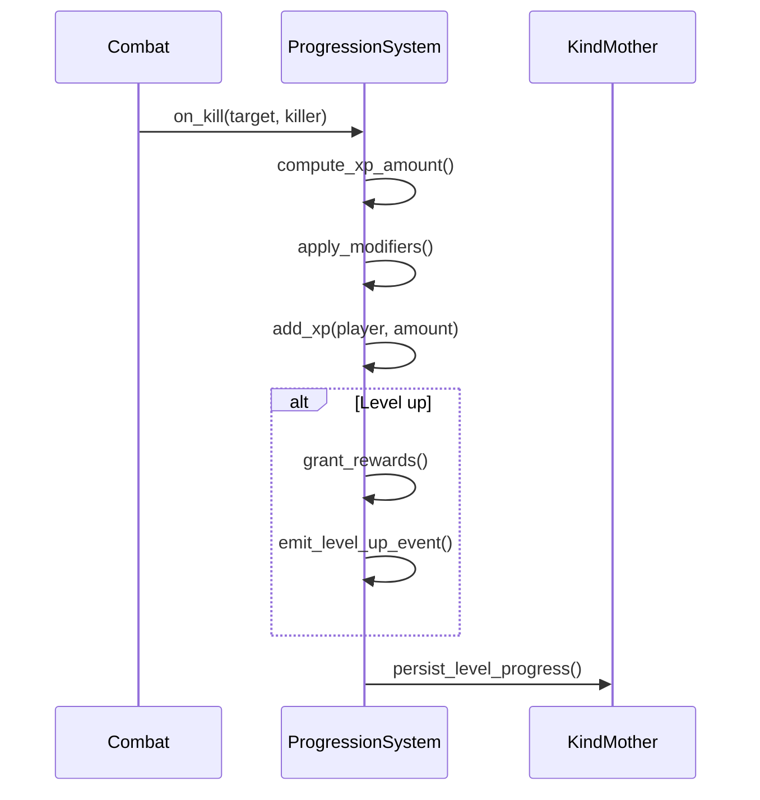

# Système de niveau

**Catégorie :** 06. Progression  
**Description :** XP ; paliers ; récompenses par niveau.

## Contexte

Le système de niveau (leveling system) est un pilier fondamental de la progression dans le MGE. Il définit comment les personnages gagnent de l'expérience (XP), franchissent des paliers et obtiennent des récompenses associées. Ce point est référencé par les systèmes de compétences, d'inventaire (prérequis de niveau), de quêtes et de combat.

**Rôle dans le moteur :** Fournir une courbe de progression claire et équilibrée, intégrée à la persistance KindMother. Voir [MGE - Référence technique](../MGE%20-%20Miyukini%20Game%20Engine%20-%20Reference%20Technique.md) pour le contexte global.

---

## Spécifications techniques

### Sources d'XP

| Source | Description | Facteurs modificateurs |
|--------|-------------|------------------------|
| Combat | XP par kill de monstre | Niveau relatif cible/joueur, bonus groupe |
| Quêtes | XP fixe ou variable | Objectifs, difficulté |
| Découverte | Zones, secrets | Bonus première visite |
| Crafting | Réussite de recettes | Niveau recette, qualité |
| Événements | World bosses, raids | Participation, contribution |

### Formule de base XP par kill

```
xp_base = xp_cible * (1 + bonus_groupe) * modificateur_niveau
modificateur_niveau = f(niveau_cible - niveau_joueur)
```

- **Cible de même niveau :** 100 % XP
- **Cible plus faible :** Réduction progressive (ex. -10 % par niveau en dessous)
- **Cible plus forte :** Bonus progressif (ex. +15 % par niveau au-dessus, plafonné à +50 %)
- **Seuil minimum :** Pas d'XP si écart > 10 niveaux (configurable)

### Courbe XP par niveau

La quantité totale d'XP requise pour atteindre le niveau N suit une courbe exponentielle ou polynomiale :

```
xp_requis(N) = base * N^exposant + offset
```

**Paramètres typiques :**
- Base : 100–500
- Exposant : 1.5–2.2 (plus élevé = progression plus lente en fin de jeu)
- Niveau max : 99, 150 ou 255 selon le jeu
- XP total niveau 99 : ordre de grandeur 10^6 à 10^8

### Paliers et seuils

| Concept | Description |
|---------|-------------|
| Palier | Chaque niveau = 1 palier franchi |
| Seuil | XP cumulé minimum pour le niveau suivant |
| Milestone | Niveaux spéciaux (25, 50, 99) déclenchant événements |

### Récompenses par niveau

| Type | Exemple |
|------|---------|
| Points de compétence | +1 pt par niveau |
| Points de talent | +1 pt tous les 5 niveaux |
| Attributs | +2 STR, +1 VIT (selon classe) |
| Déblocages | Nouveaux sorts, emplacements d'équipement |
| Titres | "Héros niveau 50" |
| Visuels | Effet de particules, aura |

### Niveau effectif (downscaling)

Pour le contenu groupé ou les instances :
- Niveau affiché (réel) vs niveau effectif (plafonné)
- Exemple : Donjon niveau 20, joueur niveau 80 → niveau effectif 25
- Maximise le challenge tout en gardant les capacités débloquées

---

## Modèle de données / API

### Structures Rust principales

```rust
/// Données de progression de niveau d'un personnage
#[derive(Debug, Clone, Serialize, Deserialize)]
pub struct LevelProgress {
    pub level: u32,
    pub xp_current: u64,
    pub xp_required_for_next: u64,
}

/// Configuration de la courbe XP (KindMother, table config)
#[derive(Debug, Clone)]
pub struct LevelCurveConfig {
    pub base_xp: u64,
    pub exponent: f32,
    pub max_level: u32,
}

/// Événement émis à chaque gain de niveau
pub struct LevelUpEvent {
    pub entity_id: EntityId,
    pub old_level: u32,
    pub new_level: u32,
}
```

### Signatures principales

```rust
/// Calcule l'XP total requis pour atteindre un niveau
fn xp_required_for_level(config: &LevelCurveConfig, level: u32) -> u64;

/// Applique un gain d'XP, retourne true si level-up
fn add_xp(progress: &mut LevelProgress, amount: u64, config: &LevelCurveConfig) -> bool;

/// Calcule le modificateur XP selon l'écart de niveau
fn level_gap_xp_modifier(player_level: u32, target_level: u32) -> f32;
```

### Persistance KindMother

La progression niveau est stockée dans la base du personnage (KindMother). Colonnes typiques :
- `level` (INTEGER)
- `xp_current` (INTEGER/BIGINT)
- `xp_total_earned` (pour statistiques)
- `last_level_up_at` (timestamp, optionnel)

---

## Diagrammes

### Flux de gain d'XP



### États de progression



### Séquence gain XP combat



---

## Exemples et cas d'usage

### Exemple Allumina

Dans Allumina (Action RPG Miyukini) :
- Courbe : base 150, exposant 1.8, max niveau 99
- XP par kill : `monstre.xp_base * mod_niveau * (1 + 0.1 * (taille_groupe - 1))`
- Récompenses : +2 pts stats libres, +1 pts talent tous les 5 niveaux
- Niveau 25 : déblocage sous-classe ; niveau 50 : monture ; niveau 99 : titre légendaire

### Scénario : Joueur solo vs groupe

- **Solo** : Tue un monstre niveau 10, joueur niveau 10 → 100 % XP (ex. 120 XP)
- **Groupe 4** : Même kill → 120 * (1 + 0.3) = 156 XP répartis (bonus groupe 30 %)
- **Monstre 5 niveaux en dessous** : 120 * 0.5 = 60 XP (pénalité)

### Scénario : Rush niveau 50

Objectif : Atteindre niveau 50 pour débloquer la monture. Stratégies :
- Zones avec monstres +2–3 niveaux pour bonus XP
- Quêtes principales (gros bursts d'XP)
- Éviter les zones trop faibles (pénalité)

---

## Cas limites et tests

### Edge cases

| Cas | Comportement attendu |
|-----|----------------------|
| XP négatif (bug, rollback) | Clamp à 0, ne jamais descendre de niveau |
| Overflow XP (niveau max) | Option : stocker overflow pour conversion (objets, titres) ou ignorer |
| Niveau 0 ou 1 | Niveau minimum = 1 |
| Mort avec perte d'XP | Voir point [09-mort-resurrection](09-mort-resurrection/perte-xp.md) |
| Plusieurs level-up en une action | Traiter séquentiellement, un event par level-up |

### Critères de validation

- [ ] La courbe XP est monotone croissante
- [ ] Level-up déclenche bien toutes les récompenses
- [ ] Persistance KindMother : rechargement correct après restart
- [ ] Pas de régression de niveau (sauf mécanique explicite perte XP)
- [ ] UI affiche niveau, XP courant, barre de progression

### Détails des formules XP

**Modificateur niveau (écart cible - joueur) :**

```
si ecart >= 0 : mod = 1 + min(ecart * 0.15, 0.50)
si ecart < 0  : mod = max(1 + ecart * 0.10, 0.05)
```

**Bonus groupe :** Pour un groupe de taille T :
- T=1 : 0 %
- T=2 : 10 %
- T=3 : 20 %
- T=4 : 30 %
- T=5+ : 40 % (cap)
L'XP est divisée équitablement entre les membres participant au combat.

**Répartition XP en raid :** En mode raid (6+ joueurs), la répartition peut être différente :
- Tous reçoivent une part minimale
- Contribution au dégâts/heal influence la part
- Ou répartition égale pour simplicité

### Intégration avec les autres systèmes

| Système | Interaction |
|---------|-------------|
| [Données joueur](../05-joueur-personnage/donnees-joueur.md) | Le niveau est une propriété persistante du personnage |
| [Prérequis](../11-inventaire-objets/prerequis.md) | Les objets/équipements requièrent un niveau minimum |
| [Quêtes](../19-quetes-missions/quetes.md) | Certaines quêtes sont débloquées par niveau |
| [Instances](../04-entites-monde/instances-donjons.md) | Niveau minimum/maximum pour entrer |
| [Stats](../05-joueur-personnage/stats.md) | Le niveau peut influencer les stats de base |

### Configuration et tuning

Fichier de configuration typique (YAML ou TOML) :

```yaml
level_curve:
  base_xp: 150
  exponent: 1.8
  max_level: 99

xp_modifiers:
  level_gap_bonus_per_level: 0.15
  level_gap_penalty_per_level: 0.10
  level_gap_max_bonus: 0.50
  level_gap_min_mod: 0.05

group_bonus:
  size_2: 0.10
  size_3: 0.20
  size_4: 0.30
  size_5_plus: 0.40
```

### Tests unitaires suggérés

```rust
#[cfg(test)]
mod tests {
    #[test]
    fn xp_curve_monotonic() { ... }

    #[test]
    fn level_up_grants_rewards() { ... }

    #[test]
    fn xp_overflow_at_max_level() { ... }

    #[test]
    fn level_gap_modifier_symmetric() { ... }
}
```

---

## Références

- [Index catégorie 06. Progression](_index.md)
- [Index MGE](../_index.md)
- [MGE - Référence technique](../MGE%20-%20Miyukini%20Game%20Engine%20-%20Reference%20Technique.md)
- [Gain compétences / aptitudes](gain-competences-aptitudes.md)
- [Arbres de talents](arbres-talents.md)
- [Achievements / succès](achievements-succes.md)
- KindMother (glossaire Miyukini) : persistance des données
