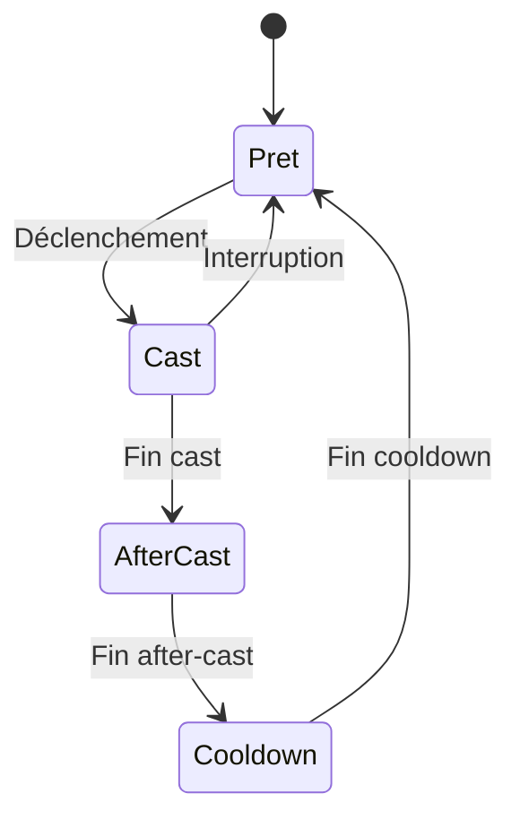

# Action (compétences, cooldowns, cast)

**Catégorie :** 07. Combat  
**Description :** Compétences ; cooldowns ; cast time ; after-cast ; mana, endurance.

## Contexte

Le système d'actions de combat gère les compétences utilisables : cooldowns, cast time (canalisation), after-cast delay, et la consommation de ressources (mana, endurance). C'est le cœur du loop de combat. Lié à la [barre de cast](../20-interface/barre-cast.md), aux [projectiles](projectiles.md) et aux [effets de statut](../08-degats-resistances-effets/effets-statut.md).

**Rôle dans le moteur :** Contrôler le rythme du combat et les coûts en ressources. Voir [MGE - Référence technique](../MGE%20-%20Miyukini%20Game%20Engine%20-%20Reference%20Technique.md).

---

## Spécifications techniques

### Cooldown (recharge)

| Paramètre | Description |
|-----------|-------------|
| Cooldown global | Toutes les compétences partagent un délai (GCD) |
| Cooldown par skill | Délai spécifique à chaque compétence |
| Réduction | Objets, talents peuvent réduire les cooldowns |

### Cast time (temps de canalisation)

| Valeur | Signification |
|--------|---------------|
| 0 | Instantané |
| > 0 | Canalisation (interruptible) |

### After-cast delay

Délai après la fin du cast pendant lequel le personnage ne peut pas agir (pour éviter l'animation-canceling abusif).

### Ressources

| Ressource | Utilisation |
|-----------|-------------|
| Mana | Sorts, compétences magiques |
| Endurance | Compétences physiques, dash |

---

## Modèle de données / API

```rust
pub struct ActionDefinition {
    pub id: ActionId,
    pub cooldown_ms: u32,
    pub cast_time_ms: u32,
    pub after_cast_ms: u32,
    pub cost_mana: Option<u32>,
    pub cost_endurance: Option<u32>,
}
```

---

## Diagrammes



---

## Références

- [Index 07](_index.md)
- [Barre cast](../20-interface/barre-cast.md)
- [Vitesse attaque ASPD](vitesse-attaque-aspd.md)
