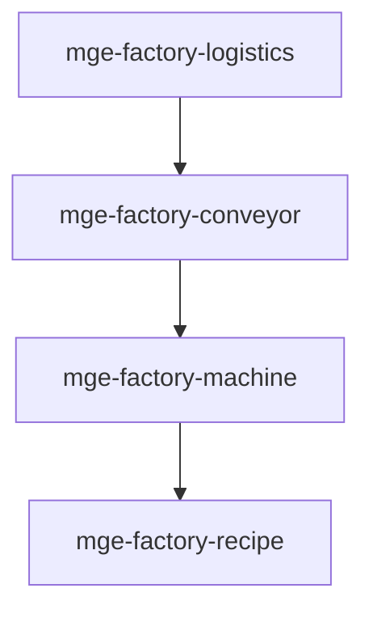

# MGE — Pack Factory

## Contexte

Le Pack Factory modélise les jeux de type factory/automation : convoyeurs, machines, recettes et logistique. Il est autonome et s'oriente vers des jeux du type Factorio, Satisfactory.

## Portée / Scope

- **Applicable à :** Jeux d'automation, factory, logistique.
- **Audience :** Développeurs moteur, designers.
- **Dépendances :** Core Universal Pack.

---

## Crates et responsabilités

| Crate | Responsabilité |
|-------|----------------|
| `mge-factory-conveyor` | Convoyeurs, flux, direction |
| `mge-factory-machine` | Machines, traitement, input/output |
| `mge-factory-recipe` | Recettes, ingrédients, produits |
| `mge-factory-logistics` | Stockage, distribution, priorités |

---

## Graphe de dépendances intra-pack



---

## Composants principaux

- **Conveyor :** `Conveyor`, `ConveyorSegment`, `FlowDirection`, `ItemOnBelt`
- **Machine :** `Machine`, `InputSlot`, `OutputSlot`, `ProcessingState`
- **Recipe :** `Recipe`, `Ingredient`, `Output`, `CraftTime`
- **Logistics :** `Storage`, `Sorter`, `Priority`, `DistributionRule`

---

## Systèmes principaux

- Déplacement items sur convoyeurs
- Exécution recettes, input/output machines
- Gestion stocks, distribution
- Priorités, splitters, mergers

---

## Exemples d'utilisation

```rust
engine.add_plugin(MgeFactoryConveyorPlugin);
engine.add_plugin(MgeFactoryRecipePlugin);
engine.add_plugin(MgeFactoryMachinePlugin);
engine.add_plugin(MgeFactoryLogisticsPlugin);
```

---

**Document** : MGE — Pack Factory  
**Version** : 1.0  
**Statut** : Spécification
