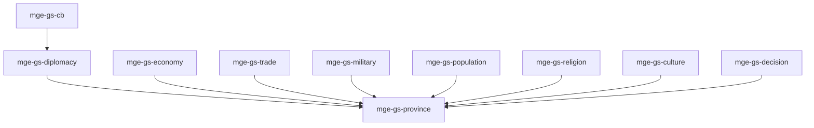

# MGE — Pack Grand Strategy

## Contexte

Le Pack Grand Strategy modélise les mécaniques de jeux 4X et grand strategy : provinces, diplomatie, économie, commerce, population, culture, religion, militaire et décisions. Il combine Pack RPG et Pack Social pour une simulation riche.

## Portée / Scope

- **Applicable à :** Jeux type Europa Universalis, Crusader Kings.
- **Audience :** Développeurs moteur, designers.
- **Dépendances :** Core Universal Pack, Pack Social Simulation, Pack RPG.

---

## Crates et responsabilités

| Crate | Responsabilité |
|-------|----------------|
| `mge-gs-province` | Régions, frontières, contrôle territorial |
| `mge-gs-diplomacy` | Alliances, guerres, traités, vassaux |
| `mge-gs-economy` | Revenus, impôts, dépenses, trésorerie |
| `mge-gs-trade` | Routes commerciales, marchandises |
| `mge-gs-military` | Armées, recrutement, maintenance |
| `mge-gs-population` | POP, démographie, migration |
| `mge-gs-religion` | Religions, conversion, intégrité |
| `mge-gs-culture` | Cultures, assimilation |
| `mge-gs-decision` | Décisions nationales, conditions |
| `mge-gs-cb` | Casus belli, justification guerre |

---

## Graphe de dépendances intra-pack



---

## Composants principaux

- **Province :** `Province`, `Border`, `Owner`
- **Diplomacy :** `Alliance`, `War`, `Treaty`, `Vassalage`
- **Economy :** `Treasury`, `Income`, `Expense`, `TaxRate`
- **Trade :** `TradeRoute`, `Commodity`, `Market`
- **Military :** `Army`, `Regiment`, `Recruitment`
- **Population :** `Population`, `PopType`, `Migration`
- **Religion :** `Religion`, `Conversion`, `Tolerance`
- **Culture :** `Culture`, `Assimilation`
- **Decision :** `Decision`, `DecisionCondition`, `DecisionEffect`
- **CB :** `CasusBelli`, `WarGoal`

---

## Systèmes principaux

- Gestion provinces, transfert contrôle
- Négociations, déclarations guerre
- Calcul revenus, dépenses, budget
- Flux marchandises, prix
- Recrutement, maintenance armées
- Démographie, migration
- Conversion religion, intégrité
- Assimilation culturelle
- Validation/application décisions
- Calcul validité CB, déclaration guerre

---

## Exemples d'utilisation

```rust
engine.add_plugin(MgeSocialFactionPlugin);
engine.add_plugin(MgeRpgStatsPlugin);
engine.add_plugin(MgeGsProvincePlugin);
engine.add_plugin(MgeGsDiplomacyPlugin);
engine.add_plugin(MgeGsEconomyPlugin);
engine.add_plugin(MgeGsTradePlugin);
engine.add_plugin(MgeGsMilitaryPlugin);
engine.add_plugin(MgeGsPopulationPlugin);
engine.add_plugin(MgeGsReligionPlugin);
engine.add_plugin(MgeGsCulturePlugin);
engine.add_plugin(MgeGsDecisionPlugin);
engine.add_plugin(MgeGsCbPlugin);
```

---

**Document** : MGE — Pack Grand Strategy  
**Version** : 1.0  
**Statut** : Spécification
