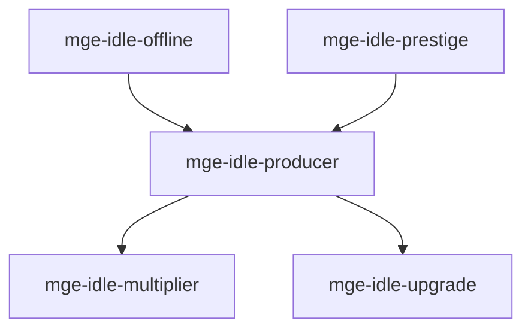

# MGE — Pack Idle

## Contexte

Le Pack Idle modélise les mécaniques des jeux idle/incremental : producteurs, multiplicateurs, upgrades, prestige et progression hors-ligne. Il est léger et s'intègre facilement avec d'autres packs.

## Portée / Scope

- **Applicable à :** Clicker, idle games, incrementals.
- **Audience :** Développeurs moteur, designers.
- **Dépendances :** Core Universal Pack.

---

## Crates et responsabilités

| Crate | Responsabilité |
|-------|----------------|
| `mge-idle-producer` | Producteurs automatiques, génération ressources |
| `mge-idle-multiplier` | Multiplicateurs, bonus |
| `mge-idle-upgrade` | Upgrades achetables, effets |
| `mge-idle-offline` | Progression hors-ligne, temps écoulé |
| `mge-idle-prestige` | Prestige, reset avec bonus permanent |

---

## Graphe de dépendances intra-pack



---

## Composants principaux

- **Producer :** `Producer`, `ProductionRate`, `ResourceOutput`
- **Multiplier :** `Multiplier`, `MultiplierStack`, `BonusSource`
- **Upgrade :** `Upgrade`, `UpgradeCondition`, `UpgradeEffect`
- **Offline :** `LastPlayed`, `OfflineEarnings`, `MaxOfflineTime`
- **Prestige :** `PrestigeCount`, `PrestigeCurrency`, `PermanentBonus`

---

## Systèmes principaux

- Tick producteurs, accumulation ressources
- Application multiplicateurs
- Validation achat upgrades, application effets
- Calcul gains hors-ligne au retour
- Reset prestige, attribution bonus permanent

---

## Exemples d'utilisation

```rust
engine.add_plugin(MgeIdleProducerPlugin);
engine.add_plugin(MgeIdleMultiplierPlugin);
engine.add_plugin(MgeIdleUpgradePlugin);
engine.add_plugin(MgeIdleOfflinePlugin);
engine.add_plugin(MgeIdlePrestigePlugin);
```

---

**Document** : MGE — Pack Idle  
**Version** : 1.0  
**Statut** : Spécification
