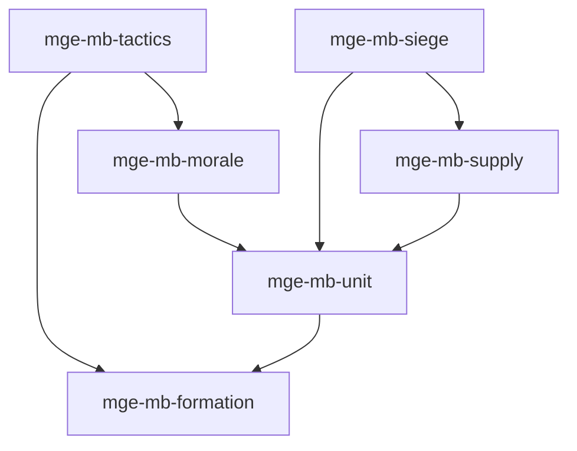

# MGE — Pack Massive Battle

## Contexte

Le Pack Massive Battle gère les combats à grande échelle : formations, unités de groupe, moral, tactiques, approvisionnement et sièges. Il s'appuie sur le Pack RPG pour les stats et le combat individuel, et sur le Core Universal Pack pour le spatial et la physique.

## Portée / Scope

- **Applicable à :** Jeux de guerre tactique, batailles en masse (Total War, Mount & Blade).
- **Audience :** Développeurs moteur, designers.
- **Dépendances :** Core Universal Pack, Pack RPG.

---

## Crates et responsabilités

| Crate | Responsabilité |
|-------|----------------|
| `mge-mb-formation` | Rangs, colonnes, formations (ligne, carré, coin) |
| `mge-mb-unit` | Regroupement soldats, cohésion, ordres de groupe |
| `mge-mb-morale` | Moral, panique, brisure, routage |
| `mge-mb-tactics` | Flancs, charge, retraite, manœuvres |
| `mge-mb-supply` | Logistique, munitions, ravitaillement |
| `mge-mb-siege` | Assiégants, défenseurs, murs, engins |

---

## Graphe de dépendances intra-pack



---

## Composants principaux

- **Formation :** `FormationShape`, `FormationSlot`, `FormationOrder`
- **Unité :** `Squad`, `SquadMember`, `Cohesion`, `GroupOrder`
- **Moral :** `Morale`, `PanicState`, `RoutThreshold`
- **Tactiques :** `FlankBonus`, `ChargeBonus`, `TacticalStance`
- **Supply :** `Ammunition`, `SupplyLine`, `Depot`
- **Siège :** `SiegeAttacker`, `SiegeDefender`, `WallSection`, `SiegeEngine`

---

## Systèmes principaux

- Calcul positions formation, maintien cohésion
- Mise à jour moral, déclenchement panique/routage
- Application bonus tactiques, flancs
- Consommation munitions, ravitaillement
- Gestion siège, dégâts murs, assaut

---

## Exemples d'utilisation

```rust
engine.add_plugin(MgeRpgStatsPlugin);
engine.add_plugin(MgeRpgCombatPlugin);
engine.add_plugin(MgeMbFormationPlugin);
engine.add_plugin(MgeMbUnitPlugin);
engine.add_plugin(MgeMbMoralePlugin);
engine.add_plugin(MgeMbTacticsPlugin);
engine.add_plugin(MgeMbSupplyPlugin);
engine.add_plugin(MgeMbSiegePlugin);
```

---

**Document** : MGE — Pack Massive Battle  
**Version** : 1.0  
**Statut** : Spécification
