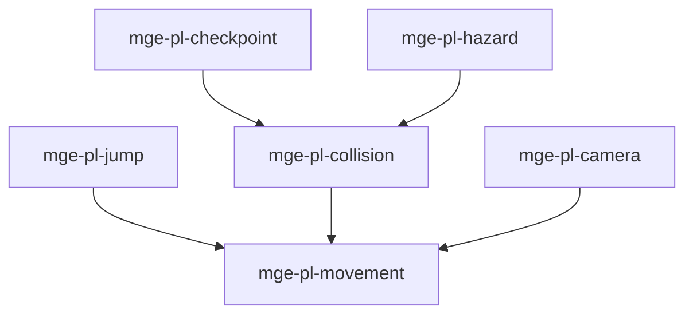

# MGE — Pack Platformer

## Contexte

Le Pack Platformer fournit les mécaniques fondamentales des plateformes 2D : mouvement, saut, collisions plateforme, caméra, checkpoints et dangers (pics, lave).

## Portée / Scope

- **Applicable à :** Jeux de plateforme 2D (Mario, Celeste).
- **Audience :** Développeurs moteur, designers.
- **Dépendances :** Core Universal Pack (spatial, basic-physics, render-2d).

---

## Crates et responsabilités

| Crate | Responsabilité |
|-------|----------------|
| `mge-pl-movement` | Déplacement horizontal, accélération, friction |
| `mge-pl-jump` | Saut, double saut, coyote time |
| `mge-pl-collision` | Collisions plateforme, one-way, pentes |
| `mge-pl-camera` | Suivi caméra, dead zone, limites |
| `mge-pl-checkpoint` | Points de sauvegarde, respawn |
| `mge-pl-hazard` | Zones mortelles, dégâts environnement |

---

## Graphe de dépendances intra-pack



---

## Composants principaux

- **Movement :** `PlatformerMovement`, `GroundState`, `Direction`
- **Jump :** `JumpCount`, `JumpForce`, `CoyoteTime`
- **Collision :** `Platform`, `OneWayPlatform`, `Slope`
- **Camera :** `CameraTarget`, `CameraBounds`, `FollowMode`
- **Checkpoint :** `Checkpoint`, `LastCheckpoint`, `RespawnPosition`
- **Hazard :** `HazardZone`, `HazardDamage`, `InstantKill`

---

## Systèmes principaux

- Application vélocité horizontale, friction
- Gestion saut, coyote time, air control
- Résolution collisions plateforme, pentes
- Suivi caméra joueur, limites niveau
- Enregistrement checkpoint, respawn
- Détection zone danger, application dégâts

---

## Exemples d'utilisation

```rust
engine.add_plugin(MgePluginSpatial::default());
engine.add_plugin(MgePluginBasicPhysics::default());
engine.add_plugin(MgePluginRender2d::default());
engine.add_plugin(MgePlMovementPlugin);
engine.add_plugin(MgePlJumpPlugin);
engine.add_plugin(MgePlCollisionPlugin);
engine.add_plugin(MgePlCameraPlugin);
engine.add_plugin(MgePlCheckpointPlugin);
engine.add_plugin(MgePlHazardPlugin);
```

---

**Document** : MGE — Pack Platformer  
**Version** : 1.0  
**Statut** : Spécification
