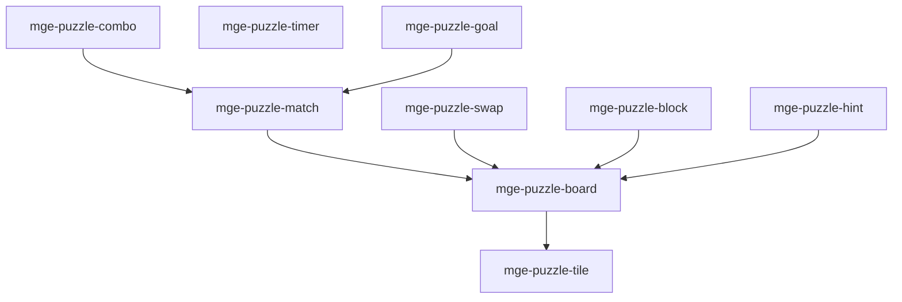

# MGE — Pack Puzzle

## Contexte

Le Pack Puzzle fournit les briques communes des jeux de puzzle : tuiles, match-3, swap, combo, timer, hints, plateau, blocs et objectifs. Il est autonome par rapport aux autres packs genre.

## Portée / Scope

- **Applicable à :** Match-3, Tetris-like, puzzle games.
- **Audience :** Développeurs moteur, designers.
- **Dépendances :** Core Universal Pack.

---

## Crates et responsabilités

| Crate | Responsabilité |
|-------|----------------|
| `mge-puzzle-tile` | Tuiles, types, état |
| `mge-puzzle-board` | Grille, dimensions, cases |
| `mge-puzzle-match` | Détection match (ligne, 3+), scoring |
| `mge-puzzle-swap` | Swap tuiles, validation mouvement |
| `mge-puzzle-combo` | Chaînes combo, multiplicateur |
| `mge-puzzle-timer` | Limite temps, décompte |
| `mge-puzzle-hint` | Suggestions coup, highlight |
| `mge-puzzle-goal` | Objectifs niveau, conditions victoire |
| `mge-puzzle-block` | Blocs, gravité, chute |

---

## Graphe de dépendances intra-pack



---

## Composants principaux

- **Tile :** `Tile`, `TileType`, `TileState`
- **Board :** `Board`, `Grid`, `Cell`
- **Match :** `MatchResult`, `MatchGroup`, `Score`
- **Swap :** `SwapAction`, `SwapValidation`
- **Combo :** `ComboChain`, `ComboMultiplier`
- **Timer :** `PuzzleTimer`, `TimeLimit`
- **Hint :** `Hint`, `HintableMove`
- **Goal :** `Goal`, `GoalCondition`, `GoalProgress`
- **Block :** `Block`, `Gravity`, `FallState`

---

## Systèmes principaux

- Détection match, suppression tuiles
- Validation swap, exécution
- Calcul combo, multiplicateur score
- Décompte timer, game over
- Génération hints
- Vérification objectifs
- Application gravité, chute blocs

---

## Exemples d'utilisation

```rust
engine.add_plugin(MgePuzzleBoardPlugin);
engine.add_plugin(MgePuzzleTilePlugin);
engine.add_plugin(MgePuzzleMatchPlugin);
engine.add_plugin(MgePuzzleSwapPlugin);
engine.add_plugin(MgePuzzleComboPlugin);
engine.add_plugin(MgePuzzleTimerPlugin);
engine.add_plugin(MgePuzzleHintPlugin);
engine.add_plugin(MgePuzzleGoalPlugin);
engine.add_plugin(MgePuzzleBlockPlugin);
```

---

**Document** : MGE — Pack Puzzle  
**Version** : 1.0  
**Statut** : Spécification
