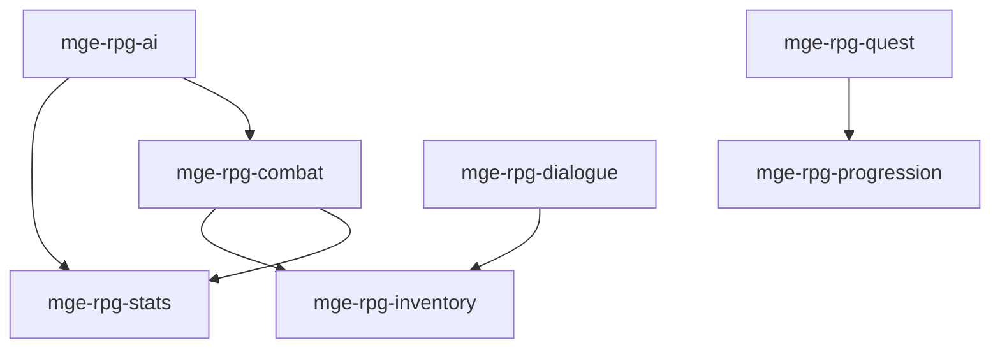

# MGE — Pack RPG

## Contexte

Le Pack RPG fournit les capacités essentielles pour les jeux de rôle : combat, statistiques, inventaire, quêtes, progression, dialogue et IA de PNJ. Il est le pack de base le plus mature du MGE, utilisé par Allumina et comme dépendance par plusieurs autres packs (Massive Battle, Grand Strategy).

## Portée / Scope

- **Applicable à :** Jeux type Action RPG, J-RPG, dungeon crawler.
- **Audience :** Développeurs moteur, développeurs de contenu.
- **Dépendances :** Core Universal Pack (spatial, input, render-2d, basic-physics, event).

---

## Crates et responsabilités

| Crate | Responsabilité |
|-------|----------------|
| `mge-rpg-combat` | Tour par tour ou temps réel, dégâts, compétences, ciblage |
| `mge-rpg-stats` | HP, mana, stamina, attributs, résistances, buffs/debuffs |
| `mge-rpg-inventory` | Slots, équipement, objets, stack, conteneurs |
| `mge-rpg-quest` | Objectifs, tracking, récompenses, journal |
| `mge-rpg-progression` | Niveaux, XP, compétences débloquables |
| `mge-rpg-dialogue` | Arbres de conversation, choix, conditions |
| `mge-rpg-ai` | Comportements PNJ, ciblage, tactiques de combat |

---

## Graphe de dépendances intra-pack



---

## Composants principaux

- **Combat :** `Combatant`, `Skill`, `Target`, `DamageEvent`
- **Stats :** `Health`, `Mana`, `Attributes`, `Resistances`, `Buff`
- **Inventaire :** `Inventory`, `EquipmentSlot`, `ItemStack`, `Container`
- **Quête :** `QuestState`, `Objective`, `QuestProgress`
- **Progression :** `Level`, `Experience`, `SkillTree`
- **Dialogue :** `DialogueNode`, `DialogueChoice`, `DialogueState`
- **IA :** `AIBehavior`, `AIGoal`, `CombatStance`

---

## Systèmes principaux

- Tour de combat, résolution dégâts, application buffs
- Mise à jour HP/mana, calcul attributs dérivés
- Gestion slots, équipement, ramassage
- Tracking objectifs, validation conditions
- Gain XP, montée de niveau, déblocage
- Arbre conversationnel, branches conditionnelles
- Décision IA, pathfinding combat, ciblage

---

## Exemples d'utilisation

```rust
// Assemblage typique pour un Action RPG
engine.add_plugin(MgePluginSpatial::default());
engine.add_plugin(MgePluginInput::default());
engine.add_plugin(MgePluginBasicPhysics::default());
engine.add_plugin(MgeRpgStatsPlugin);
engine.add_plugin(MgeRpgInventoryPlugin);
engine.add_plugin(MgeRpgCombatPlugin);
engine.add_plugin(MgeRpgQuestPlugin);
engine.add_plugin(MgeRpgProgressionPlugin);
engine.add_plugin(MgeRpgDialoguePlugin);
engine.add_plugin(MgeRpgAiPlugin);
```

---

**Document** : MGE — Pack RPG  
**Version** : 1.0  
**Statut** : Spécification
