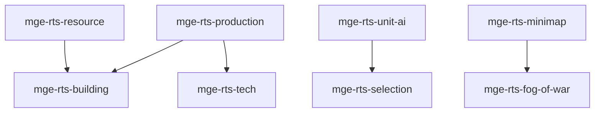

# MGE — Pack RTS

## Contexte

Le Pack RTS couvre les mécaniques essentielles des jeux de stratégie en temps réel : sélection, production, ressources, bâtiments, IA d'unités, minimap et brouillard de guerre. Il dépend du Pack Social pour les relations entre factions.

## Portée / Scope

- **Applicable à :** Jeux RTS (StarCraft, Age of Empires).
- **Audience :** Développeurs moteur, designers.
- **Dépendances :** Core Universal Pack, Pack Social Simulation.

---

## Crates et responsabilités

| Crate | Responsabilité |
|-------|----------------|
| `mge-rts-selection` | Sélection multiple, box, groupements |
| `mge-rts-production` | Files d'attente, temps de build |
| `mge-rts-resource` | Récolte, dépôts, stockage |
| `mge-rts-building` | Placage, construction, démolition |
| `mge-rts-unit-ai` | Ordres, pathfinding groupe, micro |
| `mge-rts-minimap` | Vue réduite, icônes, clics |
| `mge-rts-fog-of-war` | Visibilité, exploré, guerre de brouillard |
| `mge-rts-tech` | Arbre technologique, recherches |

---

## Graphe de dépendances intra-pack



---

## Composants principaux

- **Selection :** `Selected`, `SelectionGroup`, `SelectionBox`
- **Production :** `ProductionQueue`, `BuildProgress`, `Producer`
- **Resource :** `ResourceNode`, `ResourceAmount`, `Gatherer`, `Depot`
- **Building :** `Building`, `ConstructionState`, `PlacementGhost`
- **Unit AI :** `UnitOrder`, `Waypoint`, `FormationOrder`
- **Minimap :** `MinimapMarker`, `MinimapVisibility`
- **Fog :** `FogOfWar`, `Visibility`, `Explored`
- **Tech :** `TechTree`, `TechProgress`, `Unlockable`

---

## Systèmes principaux

- Box selection, gestion groupes
- Avancement production, spawn unités
- Récolte, dépôt ressources
- Placement, construction, démolition
- Exécution ordres, pathfinding
- Rendu minimap, mise à jour visibilité
- Calcul brouillard de guerre
- Recherche technologie, déblocage

---

## Exemples d'utilisation

```rust
engine.add_plugin(MgeSocialFactionPlugin);
engine.add_plugin(MgeRtsSelectionPlugin);
engine.add_plugin(MgeRtsProductionPlugin);
engine.add_plugin(MgeRtsResourcePlugin);
engine.add_plugin(MgeRtsBuildingPlugin);
engine.add_plugin(MgeRtsUnitAiPlugin);
engine.add_plugin(MgeRtsMinimapPlugin);
engine.add_plugin(MgeRtsFogOfWarPlugin);
engine.add_plugin(MgeRtsTechPlugin);
```

---

**Document** : MGE — Pack RTS  
**Version** : 1.0  
**Statut** : Spécification
