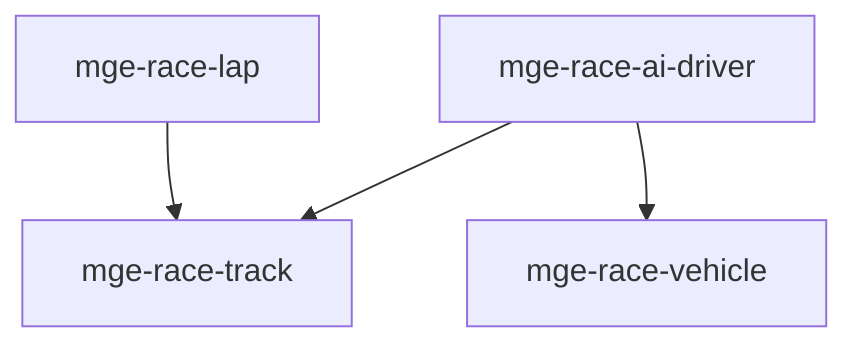

# MGE — Pack Racing

## Contexte

Le Pack Racing fournit les mécaniques de course 2D : véhicules, circuits, tours et IA conducteur. Il s'appuie sur le spatial et la physique du Core Universal Pack.

## Portée / Scope

- **Applicable à :** Racing 2D, top-down, kart-like.
- **Audience :** Développeurs moteur, designers.
- **Dépendances :** Core Universal Pack (spatial, basic-physics).

---

## Crates et responsabilités

| Crate | Responsabilité |
|-------|----------------|
| `mge-race-vehicle` | Véhicule, vitesse, contrôle |
| `mge-race-track` | Circuit, checkpoints, voie |
| `mge-race-lap` | Tours, classement, chrono |
| `mge-race-ai-driver` | IA conducteur, trajectoire |

---

## Graphe de dépendances intra-pack



---

## Composants principaux

- **Vehicle :** `Vehicle`, `Speed`, `Steering`, `Acceleration`
- **Track :** `Track`, `Checkpoint`, `Lane`
- **Lap :** `LapCount`, `LapTime`, `Position`, `Leaderboard`
- **AI Driver :** `AIDriver`, `RacingLine`, `OvertakeIntent`

---

## Systèmes principaux

- Physique véhicule, accélération, virage
- Validation passage checkpoints
- Calcul classement, tours, chrono
- Décision IA, suivi trajectoire

---

## Exemples d'utilisation

```rust
engine.add_plugin(MgePluginSpatial::default());
engine.add_plugin(MgePluginBasicPhysics::default());
engine.add_plugin(MgeRaceVehiclePlugin);
engine.add_plugin(MgeRaceTrackPlugin);
engine.add_plugin(MgeRaceLapPlugin);
engine.add_plugin(MgeRaceAiDriverPlugin);
```

---

**Document** : MGE — Pack Racing  
**Version** : 1.0  
**Statut** : Spécification
