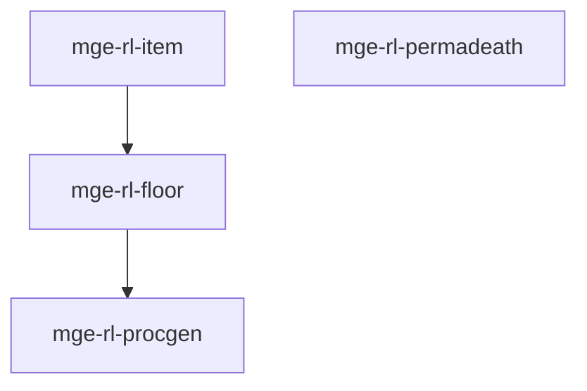

# MGE — Pack Roguelike

## Contexte

Le Pack Roguelike fournit les fondations des roguelikes : génération procédurale, gestion objets/sol, permadeath et étages (floors). Il est minimal et s'associe au Pack RPG pour le combat et l'inventaire.

## Portée / Scope

- **Applicable à :** Roguelikes, roguelites, dungeon crawlers.
- **Audience :** Développeurs moteur, designers.
- **Dépendances :** Core Universal Pack, Pack RPG (optionnel).

---

## Crates et responsabilités

| Crate | Responsabilité |
|-------|----------------|
| `mge-rl-procgen` | Génération donjons, salles, couloirs |
| `mge-rl-item` | Objets au sol, ramassage |
| `mge-rl-permadeath` | Mort permanente, meta-progression |
| `mge-rl-floor` | Étages, descente, changement niveau |

---

## Graphe de dépendances intra-pack



---

## Composants principaux

- **Procgen :** `DungeonLayout`, `Room`, `Corridor`, `GenerationSeed`
- **Item :** `GroundItem`, `ItemPickup`, `DropTable`
- **Permadeath :** `PermadeathState`, `RunHistory`, `MetaProgression`
- **Floor :** `Floor`, `FloorExit`, `FloorTransition`

---

## Systèmes principaux

- Génération donjon (BSP, cellular, etc.)
- Spawn objets au sol, ramassage
- Gestion mort, reset run
- Transition étages, chargement nouveau niveau

---

## Exemples d'utilisation

```rust
engine.add_plugin(MgeRpgInventoryPlugin);
engine.add_plugin(MgeRlProcgenPlugin);
engine.add_plugin(MgeRlItemPlugin);
engine.add_plugin(MgeRlPermadeathPlugin);
engine.add_plugin(MgeRlFloorPlugin);
```

---

**Document** : MGE — Pack Roguelike  
**Version** : 1.0  
**Statut** : Spécification
