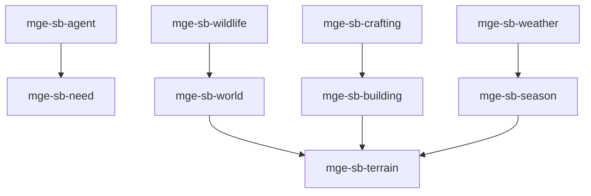

# MGE — Pack Sandbox

## Contexte

Le Pack Sandbox modélise les mondes ouverts et simulations de vie : agents autonomes, besoins, monde persistant, crafting, construction, terrain, faune, saisons et météo. Il s'appuie sur le Pack Social pour les besoins et relations.

## Portée / Scope

- **Applicable à :** Survival, crafting, simulation de vie (Minecraft, Stardew Valley).
- **Audience :** Développeurs moteur, designers.
- **Dépendances :** Core Universal Pack, Pack Social Simulation.

---

## Crates et responsabilités

| Crate | Responsabilité |
|-------|----------------|
| `mge-sb-agent` | Agents autonomes, routines, décisions |
| `mge-sb-need` | Besoins (faim, soif, confort), survie |
| `mge-sb-world` | Monde, chunks, persistance, génération |
| `mge-sb-crafting` | Recettes, fabrication, ateliers |
| `mge-sb-building` | Placement, construction, démolition |
| `mge-sb-terrain` | Tiles terrain, modification |
| `mge-sb-wildlife` | Faune, comportements, spawn |
| `mge-sb-season` | Saisons, cycle annuel, effets |
| `mge-sb-weather` | Météo, pluie, neige, température |

---

## Graphe de dépendances intra-pack



---

## Composants principaux

- **Agent :** `Agent`, `AgentState`, `Routine`, `Decision`
- **Need :** `Hunger`, `Thirst`, `Comfort`, `Shelter`
- **World :** `Chunk`, `WorldState`, `PersistentData`
- **Crafting :** `Recipe`, `CraftingStation`, `CraftProgress`
- **Building :** `PlacedBuilding`, `Blueprint`, `Construction`
- **Terrain :** `TerrainTile`, `TileType`, `Modification`
- **Wildlife :** `Wildlife`, `SpawnZone`, `Behavior`
- **Season :** `Season`, `SeasonEffect`, `GrowthModifier`
- **Weather :** `Weather`, `Temperature`, `Precipitation`

---

## Systèmes principaux

- Exécution routines agent, prise décision
- Mise à jour besoins, survie
- Gestion chunks, sauvegarde
- Validation recettes, crafting
- Placement, construction bâtiments
- Modification terrain, terrassement
- Spawn faune, comportements
- Avancement saisons, effets
- Mise à jour météo, effets environnement

---

## Exemples d'utilisation

```rust
engine.add_plugin(MgeSocialNeedPlugin);
engine.add_plugin(MgeSbAgentPlugin);
engine.add_plugin(MgeSbNeedPlugin);
engine.add_plugin(MgeSbWorldPlugin);
engine.add_plugin(MgeSbCraftingPlugin);
engine.add_plugin(MgeSbBuildingPlugin);
engine.add_plugin(MgeSbTerrainPlugin);
engine.add_plugin(MgeSbWildlifePlugin);
engine.add_plugin(MgeSbSeasonPlugin);
engine.add_plugin(MgeSbWeatherPlugin);
```

---

**Document** : MGE — Pack Sandbox  
**Version** : 1.0  
**Statut** : Spécification
