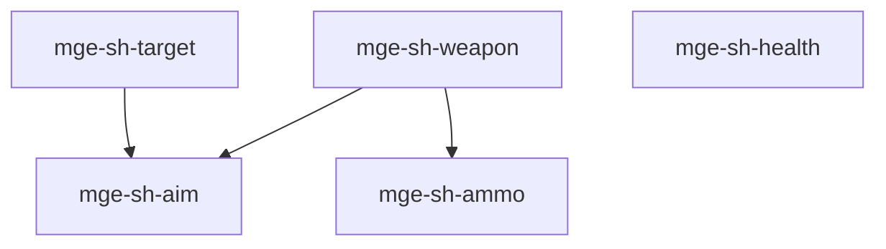

# MGE — Pack Shooter

## Contexte

Le Pack Shooter couvre les mécaniques de tir 2D : armes, visée, munitions, ciblage et santé. Il est léger et complémentaire du Pack RPG ou utilisé standalone pour des shooters top-down.

## Portée / Scope

- **Applicable à :** Top-down shooter, twin-stick, bullet hell.
- **Audience :** Développeurs moteur, designers.
- **Dépendances :** Core Universal Pack (spatial, input, basic-physics).

---

## Crates et responsabilités

| Crate | Responsabilité |
|-------|----------------|
| `mge-sh-weapon` | Armes, types, cadence, dégâts |
| `mge-sh-aim` | Visée, direction tir, angle |
| `mge-sh-ammo` | Munitions, rechargement |
| `mge-sh-target` | Ciblage auto, lock-on |
| `mge-sh-health` | Santé, dégâts, mort |

---

## Graphe de dépendances intra-pack



---

## Composants principaux

- **Weapon :** `Weapon`, `WeaponType`, `FireRate`, `Damage`
- **Aim :** `AimDirection`, `AimMode`, `Spread`
- **Ammo :** `Ammo`, `Magazine`, `ReloadState`
- **Target :** `Target`, `LockOn`, `TargetPriority`
- **Health :** `Health`, `DamageEvent`, `DeathState`

---

## Systèmes principaux

- Tir, cadence, cooldown
- Mise à jour direction visée
- Consommation munitions, rechargement
- Sélection cible, lock-on
- Application dégâts, mort

---

## Exemples d'utilisation

```rust
engine.add_plugin(MgePluginSpatial::default());
engine.add_plugin(MgePluginInput::default());
engine.add_plugin(MgePluginBasicPhysics::default());
engine.add_plugin(MgeShWeaponPlugin);
engine.add_plugin(MgeShAimPlugin);
engine.add_plugin(MgeShAmmoPlugin);
engine.add_plugin(MgeShTargetPlugin);
engine.add_plugin(MgeShHealthPlugin);
```

---

**Document** : MGE — Pack Shooter  
**Version** : 1.0  
**Statut** : Spécification
