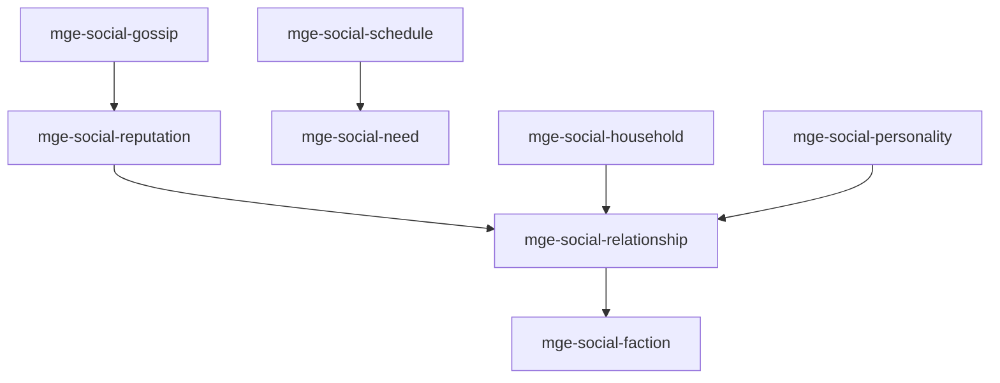

# MGE — Pack Social Simulation

## Contexte

Le Pack Social Simulation modélise les relations entre entités (PNJ, factions), la réputation, les besoins, les emplois du temps et la personnalité. Il est central pour les jeux de vie sociale, simulation de vie ou jeux de stratégie avec dimension sociale.

## Portée / Scope

- **Applicable à :** Sims-like, jeux de gestion sociale, stratégie avec diplomatie.
- **Audience :** Développeurs moteur, designers.
- **Dépendances :** Core Universal Pack.

---

## Crates et responsabilités

| Crate | Responsabilité |
|-------|----------------|
| `mge-social-relationship` | Liens entre entités, affinité, relation |
| `mge-social-faction` | Factions, alliés, ennemis, neutralité |
| `mge-social-reputation` | Notoriété, renommée, karma |
| `mge-social-need` | Besoins (faim, sommeil, social), satisfaction |
| `mge-social-schedule` | Emploi du temps, activités, routines |
| `mge-social-personality` | Traits, préférences, réactions |
| `mge-social-gossip` | Rumeurs, propagation, réputation indirecte |
| `mge-social-household` | Foyers, ménages, partage de ressources |

---

## Graphe de dépendances intra-pack



---

## Composants principaux

- **Relation :** `Relationship`, `Affinity`, `RelationshipType`
- **Faction :** `Faction`, `FactionStanding`, `Allegiance`
- **Réputation :** `Reputation`, `ReputationSource`, `Karma`
- **Besoins :** `Need`, `NeedLevel`, `Satisfaction`
- **Schedule :** `Schedule`, `ActivitySlot`, `Routine`
- **Personnalité :** `PersonalityTraits`, `Preference`, `ReactionProfile`
- **Gossip :** `GossipEntry`, `SpreadChance`, `Decay`
- **Household :** `Household`, `Member`, `SharedResources`

---

## Systèmes principaux

- Mise à jour relations, calcul affinité
- Application standings faction, conflits
- Propagation réputation, rumeurs
- Décrément besoins, satisfaction activités
- Exécution schedule, choix activité
- Influence personnalité sur réactions
- Gestion ménages, partage

---

## Exemples d'utilisation

```rust
engine.add_plugin(MgeSocialRelationshipPlugin);
engine.add_plugin(MgeSocialFactionPlugin);
engine.add_plugin(MgeSocialReputationPlugin);
engine.add_plugin(MgeSocialNeedPlugin);
engine.add_plugin(MgeSocialSchedulePlugin);
engine.add_plugin(MgeSocialPersonalityPlugin);
engine.add_plugin(MgeSocialGossipPlugin);
engine.add_plugin(MgeSocialHouseholdPlugin);
```

---

**Document** : MGE — Pack Social Simulation  
**Version** : 1.0  
**Statut** : Spécification
