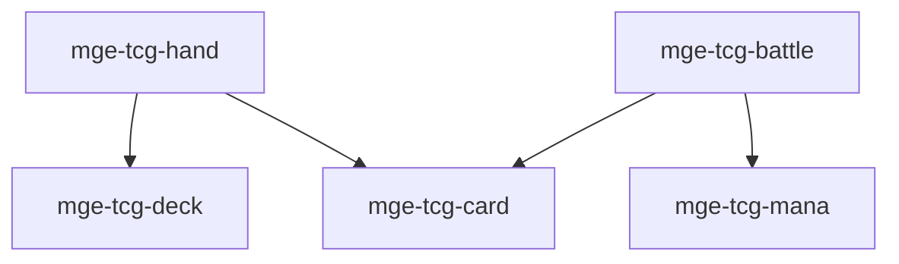

# MGE — Pack TCG

## Contexte

Le Pack TCG (Trading Card Game) modélise les jeux de cartes : deck, main, cartes, combat et mana. Il couvre les mécaniques de base des TCG/CCG (Hearthstone, Magic) en format 2D.

## Portée / Scope

- **Applicable à :** TCG, CCG, deck-builders.
- **Audience :** Développeurs moteur, designers.
- **Dépendances :** Core Universal Pack.

---

## Crates et responsabilités

| Crate | Responsabilité |
|-------|----------------|
| `mge-tcg-deck` | Deck, pioche, mélange |
| `mge-tcg-hand` | Main, cartes en main, limite |
| `mge-tcg-card` | Carte, effet, coût |
| `mge-tcg-mana` | Mana, ressources, régénération |
| `mge-tcg-battle` | Zone de combat, placement, résolution |

---

## Graphe de dépendances intra-pack



---

## Composants principaux

- **Deck :** `Deck`, `DeckList`, `DrawPile`, `ShuffleState`
- **Hand :** `Hand`, `HandLimit`, `CardsInHand`
- **Card :** `Card`, `CardEffect`, `Cost`, `Stats`
- **Mana :** `ManaPool`, `ManaRegen`, `ManaType`
- **Battle :** `Battlefield`, `CardSlot`, `CombatResolution`

---

## Systèmes principaux

- Pioche, mélange deck
- Gestion main, jouer carte
- Application effets carte
- Consommation/régénération mana
- Résolution combat, interactions cartes

---

## Exemples d'utilisation

```rust
engine.add_plugin(MgeTcgDeckPlugin);
engine.add_plugin(MgeTcgCardPlugin);
engine.add_plugin(MgeTcgHandPlugin);
engine.add_plugin(MgeTcgManaPlugin);
engine.add_plugin(MgeTcgBattlePlugin);
```

---

**Document** : MGE — Pack TCG  
**Version** : 1.0  
**Statut** : Spécification
