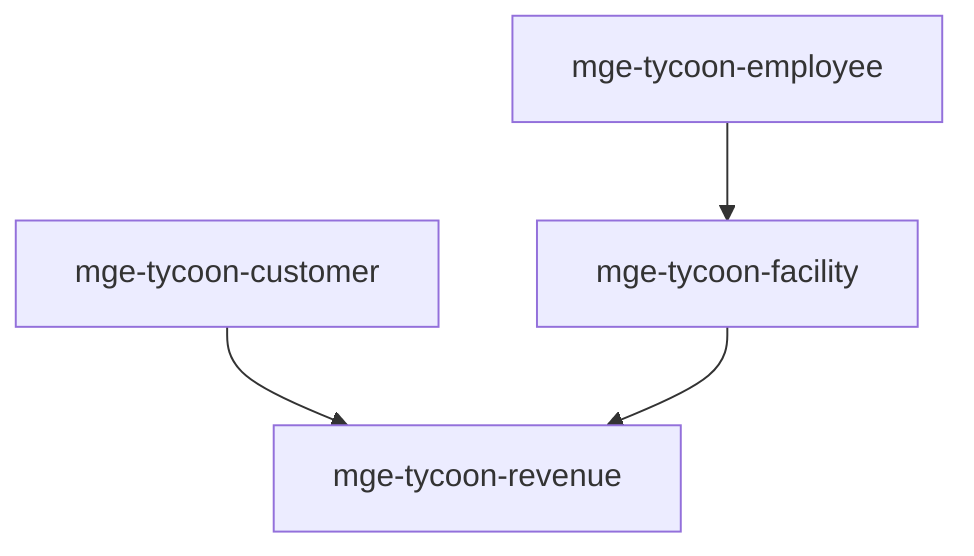

# MGE — Pack Tycoon

## Contexte

Le Pack Tycoon couvre les mécaniques des jeux de gestion/tycoon : clients, employés, installations et revenus. Il s'associe au Pack Social pour les relations et au Pack Idle pour la simulation temporelle.

## Portée / Scope

- **Applicable à :** Jeux de gestion, tycoon, simulation économique.
- **Audience :** Développeurs moteur, designers.
- **Dépendances :** Core Universal Pack.

---

## Crates et responsabilités

| Crate | Responsabilité |
|-------|----------------|
| `mge-tycoon-customer` | Clients, arrivée, satisfaction, dépenses |
| `mge-tycoon-employee` | Employés, compétences, salaire |
| `mge-tycoon-facility` | Installations, capacité, maintenance |
| `mge-tycoon-revenue` | Revenus, coûts, profit |

---

## Graphe de dépendances intra-pack



---

## Composants principaux

- **Customer :** `Customer`, `ArrivalTime`, `Satisfaction`, `Spending`
- **Employee :** `Employee`, `Skill`, `Wage`, `Efficiency`
- **Facility :** `Facility`, `Capacity`, `MaintenanceCost`, `Upgrade`
- **Revenue :** `Revenue`, `Cost`, `Profit`, `Transaction`

---

## Systèmes principaux

- Spawn clients, simulation visite
- Gestion employés, affectation
- Mise à jour installations, maintenance
- Calcul revenus, coûts, profit

---

## Exemples d'utilisation

```rust
engine.add_plugin(MgeTycoonCustomerPlugin);
engine.add_plugin(MgeTycoonEmployeePlugin);
engine.add_plugin(MgeTycoonFacilityPlugin);
engine.add_plugin(MgeTycoonRevenuePlugin);
```

---

**Document** : MGE — Pack Tycoon  
**Version** : 1.0  
**Statut** : Spécification
