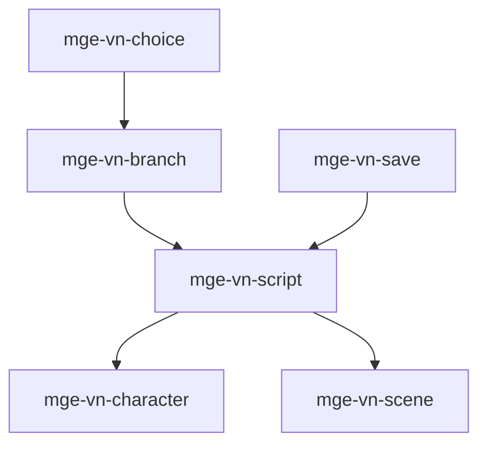

# MGE — Pack Visual Novel

## Contexte

Le Pack Visual Novel fournit les capacités narratives : scripts, personnages, scènes, branches, choix et sauvegarde. Il est orienté jeux narratifs et s'associe au Pack RPG pour le dialogue si nécessaire.

## Portée / Scope

- **Applicable à :** Visual novels, jeux narratifs, dating sims.
- **Audience :** Développeurs moteur, scénaristes.
- **Dépendances :** Core Universal Pack (event, save-load).

---

## Crates et responsabilités

| Crate | Responsabilité |
|-------|----------------|
| `mge-vn-script` | Script dialogue, balises, commandes |
| `mge-vn-character` | Personnages, sprites, expressions |
| `mge-vn-scene` | Scènes, fond, transitions |
| `mge-vn-choice` | Choix joueur, branches |
| `mge-vn-branch` | Arbres de branchement, flags |
| `mge-vn-save` | Sauvegarde narrative, position script |

---

## Graphe de dépendances intra-pack



---

## Composants principaux

- **Script :** `ScriptLine`, `ScriptCommand`, `ScriptPosition`
- **Character :** `VNCharacter`, `Expression`, `SpriteRef`
- **Scene :** `Scene`, `Background`, `Transition`
- **Choice :** `Choice`, `ChoiceOption`, `ChoiceResult`
- **Branch :** `BranchPoint`, `Flag`, `Condition`
- **Save :** `SaveState`, `Checkpoint`, `Variables`

---

## Systèmes principaux

- Avancement script, exécution commandes
- Affichage personnages, expressions
- Gestion scènes, transitions
- Présentation choix, validation
- Évaluation branches, flags
- Sauvegarde/chargement position narrative

---

## Exemples d'utilisation

```rust
engine.add_plugin(MgePluginSaveLoad::default());
engine.add_plugin(MgeVnScriptPlugin);
engine.add_plugin(MgeVnCharacterPlugin);
engine.add_plugin(MgeVnScenePlugin);
engine.add_plugin(MgeVnChoicePlugin);
engine.add_plugin(MgeVnBranchPlugin);
engine.add_plugin(MgeVnSavePlugin);
```

---

**Document** : MGE — Pack Visual Novel  
**Version** : 1.0  
**Statut** : Spécification
