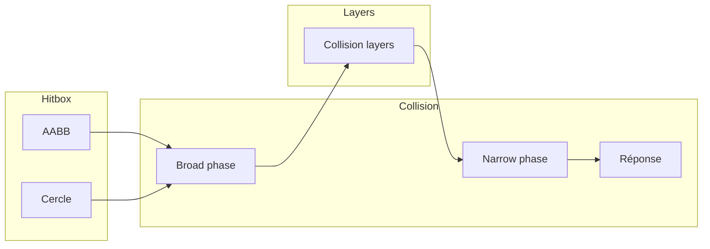

# MGE — Hitbox et collisions
## Référence consolidée

Document de référence centralisant les concepts de hitbox et de collision du MGE. Les spécifications détaillées sont dans les points [hitbox](points/02-physique-collisions/hitbox.md), [collision](points/02-physique-collisions/collision.md) et [collision-layers](points/02-physique-collisions/collision-layers.md).

---

## Contexte

- **Hitbox** : Zone géométrique de détection de collision d'une entité.
- **Collision** : Processus de détection des chevauchements et de réponse (blocage, rebond, notification).
- **Chaîne** : hitbox (forme) → collision (détection + réponse) → collision-layers (filtrage des paires).

Référence des types : [MGE - Référence Commune](MGE%20-%20Reference%20Commune.md) — `Vec2`, `Rect`, coordonnées.

---

# 1. Hitbox

## 1.1 Formes supportées

| Forme | Définition | Usage typique |
|-------|------------|---------------|
| **AABB** | Rectangle aligné axes (`Rect`) | Personnages, murs, tuiles |
| **Cercle** | Centre + rayon | Projectiles, zones AOE, PNJ ronds |
| **Polygone** | Sommets ordonnés (convexe) | Post-MVP, formes complexes |

## 1.2 Alignement

- **Ancre** : Point de référence de l'entité (souvent centre-bas du sprite).
- **Offset** : Décalage de la hitbox par rapport à l'ancre (coordonnées locales).
- **World bounds** : Rectangle englobant en coordonnées monde (pour la broad phase).

**Exemple personnage :** AABB offset (-10, -40), size (20, 40) → zone torse, centrée sous l'ancre.

## 1.3 Usages

| Usage | Rôle |
|-------|------|
| **Collision** | Blocage, obstacle — empêche le chevauchement |
| **Hit** | Zone de dégâts, détection d'attaque — domaine combat |

## 1.4 Contraintes

| Contrainte | Valeur |
|------------|--------|
| Rayon cercle min | > 0 |
| Taille AABB min | 1×1 px |
| Taille AABB max | 4096×4096 px |
| Polygone max sommets | 3–16 |

---

# 2. Collision

## 2.1 Pipeline en deux phases

```
Broad phase → Filtrage layers → Narrow phase → Réponse
```

### Broad phase

- **Objectif** : Réduire les paires à tester.
- **Méthode** : Grille spatiale ou spatial hashing ; entités dans les mêmes cellules = paires candidates.
- **Complexité** : O(n) en moyenne.

### Narrow phase

- **Objectif** : Détecter le chevauchement et calculer MTV, normale, pénétration.
- **Formes** : AABB-AABB, cercle-cercle, AABB-cercle.

### Collision layers

Avant la narrow phase : filtrer les paires selon les masques. Une paire (A, B) est testée si `A.mask` contient le layer de B **et** `B.mask` contient le layer de A.

---

## 2.2 Formules de détection

### AABB-AABB

```
intersect = (A.x < B.x + B.w) & (B.x < A.x + A.w) &
            (A.y < B.y + B.h) & (B.y < A.y + A.h)
```

### Cercle-cercle

```
intersect = distance(C1, C2) < r1 + r2
```

Optimisation : `(dx² + dy²) < (r1 + r2)²` pour éviter √.

### AABB-cercle

```
P.x = clamp(C.x, A.x, A.x + A.w)
P.y = clamp(C.y, A.y, A.y + A.h)
intersect = distance(C, P) < radius
```

---

## 2.3 Réponses

| Type | Comportement |
|------|--------------|
| **Block** | Repousser l'entité selon le MTV jusqu'à séparation |
| **Bounce** | Inverser la composante de vitesse le long de la normale ; restitution 0..1 |
| **Trigger** | Aucun déplacement ; événements `CollisionEnter` / `CollisionExit` |

### MTV (Minimum Translation Vector)

- Vecteur de plus courte longueur qui sépare les deux formes.
- **AABB-AABB** : overlap sur X ou Y selon la plus petite pénétration.
- **Cercle-cercle** : `normalisée(C2 - C1) * (r1 + r2 - distance)`.

### Rebond

```
v_new = v - (1 + restitution) * dot(v, normal) * normal
```

---

## 2.4 Paramètres

| Paramètre | Plage | Défaut |
|-----------|-------|--------|
| Restitution | 0..1 | 0 |
| Friction | 0..1 | 0.5 |
| Itérations MTV | 1..8 | 4 |
| Tolérance pénétration | 0.001..0.1 | 0.01 |

---

# 3. Intégration boucle de jeu

1. Mise à jour des positions
2. Broad phase : paires candidates
3. Filtrage collision-layers
4. Narrow phase : test par paire
5. Réponse : Block / Bounce / Trigger
6. Événements pour triggers et gameplay

---

# 4. Cas d'usage

| Cas | Hitbox | Réponse |
|-----|--------|---------|
| Joueur contre mur | AABB vs AABB | Block |
| Projectile contre mur | Cercle vs AABB | Bounce ou destruction |
| Zone de dialogue | Cercle vs AABB | Trigger |
| Zone AOE (dégâts) | Cercle vs cercles/AABB | Trigger (détection cibles) |
| Objet ramassable | Cercle trigger | Trigger (pickup) |
| Coin de mur | Double AABB | Itérations MTV |

---

# 5. Tunneling (vitesse élevée)

Une entité rapide peut traverser un mur entre deux frames. Solutions :
- **Swept collision** : Tester le segment (pos_old, pos_new)
- **Subdivision** : Plusieurs sous-steps si vitesse excessive
- **CCD** : Raycast ou capsule pour projectiles

---

# 6. Diagramme synthèse



---

# 7. Références

| Document | Rôle |
|----------|------|
| [hitbox](points/02-physique-collisions/hitbox.md) | Spécifications complètes, formes, API |
| [collision](points/02-physique-collisions/collision.md) | Détection, formules, réponses, événements |
| [collision-layers](points/02-physique-collisions/collision-layers.md) | Masques, configuration par type |
| [MGE - Référence Commune](MGE%20-%20Reference%20Commune.md) | Vec2, Rect, types de base |
| [MGE - Pathfinding Collisions - Guide Entités Groupes](MGE%20-%20Pathfinding%20Collisions%20-%20Guide%20Entites%20Groupes.md) | Hitbox et collisions selon échelle (foules, RTS) |

---

**Document** : MGE — Hitbox et collisions — Référence  
**Version** : 1.0  
**Date** : 2026-02-18
