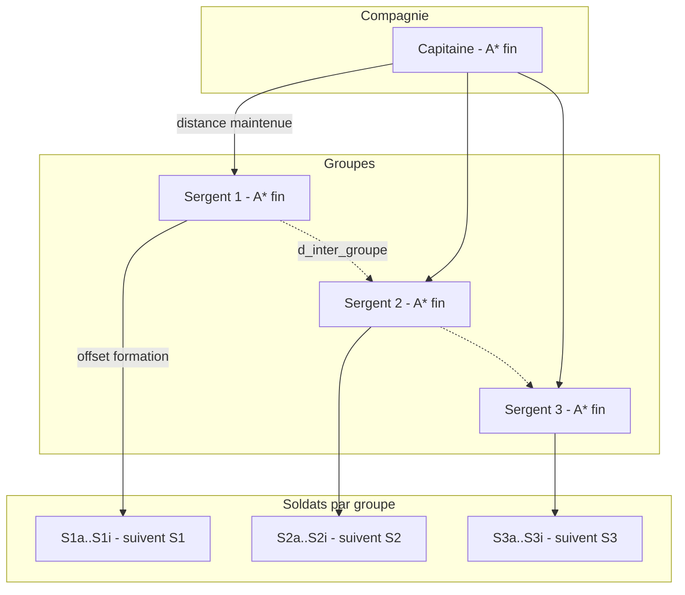
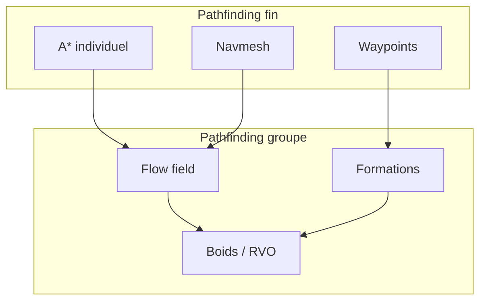
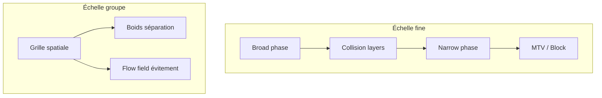

# MGE — Pathfinding, coût de déplacement, hitbox et collisions
## Guide transversal : entités individuelles → groupes et batailles à grande échelle

Document synthétique couvrant le spectre du pathfinding fin (entités individuelles) au pathfinding de groupes (batailles type RTS, Dynasty Warriors). Définit les liens entre pathfinding, coût de déplacement, hitbox et collisions selon l'échelle.

**Contexte :** Les points détaillés ([pathfinding](points/03-deplacement-locomotion/pathfinding.md), [hitbox](points/02-physique-collisions/hitbox.md), [collision](points/02-physique-collisions/collision.md)) fournissent les spécifications canoniques. Ce guide explique comment les utiliser et les adapter selon le type de jeu.

---

## Contexte et portée

### Objectif

- **Pathfinding fin** : Une entité (joueur, PNJ) cherche un chemin optimal vers une cible — A*, navmesh, waypoints précis.
- **Pathfinding groupe** : Des dizaines à des centaines d'unités se déplacent ensemble — flow fields, formations, évitement local, RTS / musou.

### Spectre d'échelle

| Échelle | Nombre d'entités | Type de jeu | Pathfinding principal | Collision |
|---------|------------------|-------------|----------------------|-----------|
| **Fin** | 1–10 | RPG (Allumina), aventure | A* / navmesh individuel | Hitbox AABB/cercle, MTV |
| **Moyen** | 10–50 | Donjon, petit groupe | A* partagé + évitement local | Boids, RVO |
| **Grande** | 50–500+ | RTS, musou (Dynasty Warriors) | Flow field, formations | Boids, grille densité |

### Références centralisées

- Types `Vec2`, `Rect`, `IVec2`, coordonnées : [MGE - Référence Commune](MGE%20-%20Reference%20Commune.md)
- Glossaire : [Miyukini Conceptual References - Glossaire](../reference/Miyukini%20Conceptual%20References%20-%20Glossaire.md) — KindMother, MWS, termes normatifs

---

# 1. Pathfinding

## 1.1 Pathfinding fin (entités individuelles)

### Principe

Une entité calcule un chemin optimal (A* ou Dijkstra) sur une grille ou un navmesh. Chaque waypoint est suivi par le composant de locomotion. Voir [pathfinding](points/03-deplacement-locomotion/pathfinding.md).

**Caractéristiques :**
- Algorithme : A* sur grille 4/8 directions ou graphe navmesh
- Recalcul : périodique (0.5–2 s) si obstacles dynamiques, ou à la demande
- Coût : distance ou coût de terrain (herbe=1, sable=1.5, eau=∞)
- Obstacles : hitbox des entités statiques (murs) et optionnellement dynamiques (autres PNJ)

### Contraintes typiques

| Paramètre | Valeur | Raison |
|-----------|--------|--------|
| Taille grille max | 1024×1024 | Mémoire et CPU |
| Longueur chemin max | 200–500 tiles | Limite boucles |
| Recalcul période | 0.5–2 s | Réactivité vs coût |
| Heuristique | Euclidienne ou Chebyshev | 8 directions |

### Intégration hitbox

Les obstacles du pathfinding sont dérivés des **hitbox** des entités. Une tuile est bloquante si une hitbox AABB ou cercle la recouvre (ou la traverse). Pour des unités de taille tile (1×1), la grille suffit ; pour des unités plus larges, voir [§2.2 Clearance](#22-hitbox-et-clearance-pour-groupes).

---

## 1.2 Coût de déplacement (détaillé)

### Définition

Le **coût de déplacement** (movement cost) est la valeur associée à traverser une cellule ou une arête du graphe. A* minimise la somme des coûts. Les types `Vec2`, `Rect` et coordonnées sont dans la [Référence Commune](MGE%20-%20Reference%20Commune.md).

### Coût par type de terrain

| Terrain | Coût | Traversabilité |
|---------|------|----------------|
| Herbe, sol | 1.0 | Walkable |
| Sable, gravier | 1.2–1.5 | Walkable |
| Marécage, boue | 2.0–3.0 | Walkable lent |
| Eau peu profonde | 2.5–5.0 | Walkable (ralentissement) |
| Eau profonde | ∞ | Obstacle (sauf bateau) |
| Mur, rocher | ∞ | Obstacle |
| Porte fermée | ∞ | Obstacle |

### Coût diagonal

- **Mouvement 4 directions** : pas de diagonales
- **Mouvement 8 directions** : coût diagonal = √2 ≈ 1.414 (ou 1.0 selon design)
- **Chebyshev** : diagonale = 1 pour heuristique cohérente

### Coût dynamique

| Source | Exemple | Impact |
|--------|--------|--------|
| Zone de dégâts (AOE) | Feu au sol | Coût ×2 ou ∞ si mortel |
| Zone dangereuse | Pièges, lave | ∞ ou très élevé |
| Zone temporaire | Sort de ralentissement | Coût ×1.5 pendant durée |
| Obstacle dynamique | Autre unité | Optionnel : obstacle temporaire ou évitement local |

### Coût par type d'unité

Pour des jeux avec unités variées (RTS, musou) :

| Type | Exemple | Terrain spécial |
|------|---------|-----------------|
| Infanterie | Soldat | Tout walkable |
| Cavalerie | Cheval | Sable pénalisé (1.5) |
| Archer | Archers | Idem infanterie |
| Bateau | Navire | Eau = 1, Terre = ∞ |
| Boss géant | Dragon | Clearance large, passages étroits = ∞ |

### API coût de déplacement

```rust
/// Fonction de coût pour le pathfinding
pub fn movement_cost(
    from: GridNode,
    to: GridNode,
    terrain: &TerrainLayer,
    unit_type: Option<UnitType>,
    dynamic_zones: &[DangerZone],
) -> f32 {
    let base = terrain.cost_at(to);
    if base.is_infinite() {
        return base;
    }
    let diagonal = is_diagonal(from, to);
    let mult = if diagonal { 1.414 } else { 1.0 };
    let unit_mult = unit_type.map(|u| u.terrain_modifier(to, terrain)).unwrap_or(1.0);
    let danger_mult = dynamic_zones.iter()
        .filter(|z| z.contains(to))
        .map(|z| z.cost_multiplier())
        .fold(1.0, |a, b| a * b);
    base * mult * unit_mult * danger_mult
}
```

---

## 1.3 Pathfinding groupe (RTS, Dynasty Warriors)

### Problème

Avec des centaines d'unités, un A* par unité est prohibitif. Il faut des approches globales ou partagées.

### Flow field (champ de vecteurs)

**Principe :** Un champ de vecteurs pré-calculé indique, pour chaque cellule, la direction vers une cible commune. Une seule exécution d'A* ou BFS depuis la destination ; chaque unité consulte le champ en O(1).

| Avantage | Inconvénient |
|----------|--------------|
| O(1) par unité par frame | Une seule cible par champ |
| Pas de recalcul si cible fixe | Recalcul si cible bouge |
| Idéal pour foules vers sortie/bannère | Moins adapté pour cibles multiples |

**Flux :**
1. Cible = point ou zone (ex. drapeau ennemi)
2. BFS ou A* inverse (depuis cible) → coût par cellule
3. Pour chaque cellule, vecteur = direction du voisin de coût inférieur
4. Chaque unité : `velocity_direction = flow_field[cell(pos)]`

### Formations

Pour des groupes structurés (armée, escouade) :

| Formation | Description | Usage |
|-----------|-------------|-------|
| Ligne | Rangées horizontales | Front de bataille |
| Colonne | File indienne | Couloirs, ponts |
| Carré | Bloc compact | Défense |
| Wedge | V | Assaut |
| Loose | Dispersion | Foule désordonnée |

**Implémentation :** Position cible = position du leader + offset selon rang dans la formation. Chaque unité pathfind vers sa position cible ; évitement local (boids) gère les chevauchements.

### RVO (Reciprocal Velocity Obstacles)

Évitement local précis : chaque agent calcule les vitesses à éviter pour ne pas entrer en collision avec ses voisins. Plus coûteux que les boids mais évite les blocages. Voir [comportement-foule](points/04-entites-monde/comportement-foule.md).

### Hybridation recommandée

| Couche | Algorithme | Rôle |
|--------|------------|------|
| Global | Flow field ou A* leader | Direction vers objectif |
| Local | Boids ou RVO | Évitement mutuel |
| Obstacles | Navmesh ou grille | Contournement murs |

---

## 1.4 Navigation hiérarchique : compagnie → groupe → individu

### Principe

Chaque groupement navigue en fonction de son **officier** (sergent, chef de groupe). Le pathfinding fin est réservé aux officiers ; les soldats suivent leur chef sans calculer de chemin global.

### Hiérarchie

```
Compagnie (capitaine)
├── Groupe 1 (sergent) — 1 sergent + 9 soldats
├── Groupe 2 (sergent) — 1 sergent + 9 soldats
├── Groupe 3 (sergent) — 1 sergent + 9 soldats
└── …
```

### Pathfinding par rôle

| Rôle | Pathfinding | Comportement |
|------|-------------|--------------|
| **Sergent (chef de groupe)** | A* fin, waypoints précis | Calcule le chemin ; contourne obstacles ; recalcul 0.5–1 s |
| **Soldats (9 du groupe)** | Aucun chemin global | Suivent le sergent ; position cible = sergent + offset formation |
| **Capitaine (chef compagnie)** | A* fin | Objectif global ; les sergents maintiennent distance avec lui |
| **Chefs de groupe entre eux** | Évitement mutuel | Distance min entre sergents ; pas de chevauchement des groupes |

### Soldats : suivi du sergent

- **Position cible** : `pos_cible = pos_sergent + offset_formation`
- **Offset** : Selon le rang (slot 0–8) dans le groupe — ex. ligne de 3×3, wedge, etc.
- **Mouvement** : Direction = `(pos_cible - pos_soldat).normalize()` ; évitement local (boids) avec les autres soldats du même groupe
- **Orientation** : Les soldats s'orientent vers leur sergent ou vers la direction de marche (vitesse de rotation selon type) — voir [orientation-rotation](points/03-deplacement-locomotion/orientation-rotation.md)
- **Pas d'A*** : Les soldats ne pathfindent pas ; ils convergent vers leur slot relatif au sergent

### Distances inter-groupes (compagnie)

Chaque chef de groupe (sergent) doit :

1. **Distance avec le capitaine** : Maintenir `d_min` à `d_max` du capitaine (ni trop loin, ni trop proche)
2. **Distance avec les autres sergents** : Éviter de se chevaucher ; `distance(sergent_i, sergent_j) >= d_inter_groupe`

**Implémentation** :
- Le capitaine pathfind (A*) vers l'objectif
- Chaque sergent pathfind vers une position **relative** au capitaine (ex. arc à 30° autour de la direction de marche)
- Force de répulsion entre sergents (ou RVO) pour maintenir `d_inter_groupe`
- Alternative : formation prédéfinie de la compagnie (les sergents ont des offsets fixes par rapport au capitaine)

### Formation cohérente : guerriers devant, tireurs derrière

L'ensemble de la compagnie respecte un **ordre de profondeur** :

| Rang | Type | Position |
|------|------|----------|
| **Avant** | Guerriers (mêlée) | Première ligne ; absorbent les charges |
| **Arrière** | Tireurs (archers, mages) | Derrière les guerriers ; ligne de tir dégagée |

**Par groupe** : Chaque groupe de 10 peut avoir sa propre répartition (ex. 6 guerriers + 4 tireurs), ou la compagnie forme une ligne globale (tous les guerriers devant, tous les tireurs derrière).

**Implémentation** :
- Chaque entité a un `role` : `Melee` ou `Ranged`
- Les offsets de formation sont calculés selon le rôle : `Melee` → Y plus petit (plus loin dans la direction de marche), `Ranged` → Y plus grand (plus en arrière)
- Convention axe : direction de marche = -Y ; donc `offset_y_melee < offset_y_ranged`

### Paramètres typiques

| Paramètre | Valeur | Description |
|-----------|--------|-------------|
| Soldats par groupe | 9 | + 1 sergent = 10 |
| Groupes par compagnie | 3–6 | 30–60 unités au total |
| Distance sergent–sergent | 40–60 px | Évite chevauchement des formations |
| Distance sergent–capitaine | 50–80 px | Cohérence de la compagnie |
| Recalcul pathfinding sergent | 0.5–1 s | Réactivité vs coût |

### Diagramme hiérarchique



### Formation de combat (vue de dessus)

```
        [Capitaine]
             |
    --- Guerriers (avant) ---
    [S1]  [S2]  [S3]   ← Sergents
    ▓▓▓   ▓▓▓   ▓▓▓   ← Soldats mêlée
    --- Tireurs (arrière) ---
    ░░░   ░░░   ░░░   ← Soldats ranged
```

### API hiérarchique (proposition)

```rust
/// Rôle dans la formation (guerrier devant, tireur derrière)
#[derive(Debug, Clone, Copy, PartialEq, Eq)]
pub enum CombatRole {
    Melee,   // Guerrier — première ligne
    Ranged,  // Archer, mage — arrière
}

/// Offset de formation selon le slot dans le groupe (0–8 pour 9 soldats)
/// offset_y négatif = devant (melee), positif = derrière (ranged)
fn formation_offset(slot: u8, role: CombatRole, formation: FormationShape) -> Vec2 {
    let (row, col) = slot_to_row_col(slot, formation);
    let y_offset = match role {
        CombatRole::Melee => -20.0 - row as f32 * 24.0,   // Avant
        CombatRole::Ranged => 20.0 + row as f32 * 24.0,  // Arrière
    };
    Vec2::new(col as f32 * 20.0, y_offset)
}

/// Groupe : 1 sergent + N soldats
pub struct TacticalGroup {
    pub sergeant_id: EntityId,
    pub soldier_ids: Vec<EntityId>,
    pub formation: FormationShape,
}

/// Compagnie : 1 capitaine + M groupes
pub struct Company {
    pub captain_id: EntityId,
    pub groups: Vec<TacticalGroup>,
    pub d_inter_group: f32,      // Distance min sergent–sergent
    pub d_to_captain: (f32, f32), // (min, max) sergent–capitaine
}

/// Mise à jour par frame
fn update_company(company: &mut Company, pathfinder: &Pathfinder, dt: f32) {
    // 1. Capitaine pathfind vers objectif
    let captain_goal = company.captain_goal;
    pathfinder.set_target(company.captain_id, captain_goal);

    // 2. Chaque sergent : pathfind + maintenir distance capitaine et autres sergents
    for group in &company.groups {
        let sergent_pos = world.position(group.sergeant_id);
        let captain_pos = world.position(company.captain_id);
        let offset_from_captain = compute_group_offset(group, company); // Arc, distance
        let target_pos = captain_pos + offset_from_captain;
        pathfinder.set_target(group.sergeant_id, target_pos);
        apply_repulsion_from_other_sergeants(group.sergeant_id, company);
    }

    // 3. Soldats : pas de pathfind ; direction vers sergent + offset
    for group in &company.groups {
        let sergent_pos = world.position(group.sergeant_id);
        for (i, &soldier_id) in group.soldier_ids.iter().enumerate() {
            let role = world.get::<CombatRole>(soldier_id);
            let offset = formation_offset(i as u8, role, group.formation);
            let target = sergent_pos + offset.rotate(sergent_facing);
            apply_seek_and_boids(soldier_id, target, group.soldier_ids);
        }
    }
}
```

---

## 1.5 Diagramme : spectre pathfinding



---

# 2. Hitbox

## 2.1 Hitbox pour entités fines

Voir [hitbox](points/02-physique-collisions/hitbox.md) pour les spécifications complètes.

**Résumé :**
- **AABB** : Personnages, murs, tuiles — détection rapide
- **Cercle** : Projectiles, zones AOE — invariant par rotation
- **Offset** : Relatif à l'ancre du sprite
- **world_bounds** : Rect englobant pour la broad phase

**Convention :** Une hitbox par entité pour la collision physique (MVP). Hitbox multiples pour zones de dégâts (combat) — voir point [zone-effet-aoe](points/07-combat/zone-effet-aoe.md).

---

## 2.2 Hitbox et clearance pour groupes

### Clearance (largeur de passage)

Pour des unités plus larges qu'une tile, le pathfinding doit considérer la **clearance** : largeur minimale de passage. Un couloir de 2 tiles peut être traversable par une unité 1×1 mais pas par un boss 3×3.

**Implémentation :**
- Grille de clearance pré-calculée : pour chaque cellule, rayon maximal du plus grand cercle centré dessus qui ne recoupe pas d'obstacles
- Pathfinding : une cellule est valide si `clearance[cell] >= unit_radius`
- Alternative : dilater les obstacles de `unit_radius` pour le pathfinding

### Hitbox agrégée (groupes)

Pour des batailles à grande échelle, tester chaque paire d'entités (n²) est prohibitif. Approches :

| Approche | Description | Usage |
|----------|-------------|-------|
| Hitbox individuelle | Chaque entité a sa hitbox | Pathfinding fin, collisions ponctuelles |
| Bounds de formation | Rect englobant du groupe | Culling, zone d'influence |
| Grille de densité | Par cellule, nombre d'unités | Flow field évitant les zones saturées |
| Pas de collision physique | Unités se traversent | RTS simplifié (health bars seulement) |

### Collision layers pour batailles

En RTS / musou, les layers typiques :

| Layer | Contenu | Collision avec |
|-------|---------|----------------|
| PlayerUnits | Unités joueur | Terrain, EnemyUnits, ProjectileEnemy |
| EnemyUnits | Unités ennemies | Terrain, PlayerUnits, ProjectilePlayer |
| NeutralUnits | PNJ, créatures | Terrain |
| Terrain | Murs, obstacles | Tous |
| Projectile | Projectiles | Terrain, cible selon camp |

Voir [collision-layers](points/02-physique-collisions/collision-layers.md).

---

# 3. Collisions

## 3.1 Collisions pour entités fines

Voir [collision](points/02-physique-collisions/collision.md).

**Pipeline :** Broad phase (grille spatiale) → filtrage collision-layers → narrow phase (AABB-AABB, cercle-cercle, AABB-cercle) → réponse (Block/MTV, Bounce, Trigger).

**Ordre de résolution :** Joueur en priorité, puis PNJ. Itérations MTV pour coins de mur.

---

## 3.2 Collisions pour foules et groupes

### Problème

En batailles à grande échelle, la narrow phase complète (test de chaque paire) est O(n²). Pour 500 unités : 125 000 paires — prohibitif.

### Approches

#### Option A : Boids (séparation)

Pas de collision physique explicite. La règle de **séparation** des boids repousse les agents trop proches. Pas de MTV ; une force de répulsion produit un comportement fluide. Voir [comportement-foule](points/04-entites-monde/comportement-foule.md).

**Avantage :** O(n × k) avec k = voisins par cellule (grille spatiale). Pas de résolution de pénétration.

#### Option B : Grille de densité

Chaque cellule a un "poids" (nombre d'unités ou somme des rayons). Le flow field évite les cellules saturées. Pas de collision physique ; les unités peuvent se chevaucher légèrement.

#### Option C : Collision simplifiée (sous-ensemble)

Seules certaines entités ont une collision physique complète : joueur, boss, objets importants. Les mooks (soldats standards) n'ont pas de hitbox de collision entre eux ; uniquement avec le joueur, les murs et les projectiles.

**Typique Dynasty Warriors :** Le joueur a une hitbox ; les centaines d'ennemis n'ont pas de collision entre eux. Ils se poussent visuellement (boids) mais peuvent se chevaucher. Collision uniquement : joueur↔ennemi, joueur↔terrain, projectile↔cible.

#### Option D : RVO (évitement réciproque)

Chaque agent calcule les vitesses à éviter. Plus précis que boids, plus coûteux. Utilisé pour des foules denses avec chemin commun.

### Recommandation par type de jeu

| Type | Pathfinding | Collision entités |
|------|-------------|-------------------|
| RPG (Allumina) | A* individuel, navmesh | Hitbox complète, MTV |
| RTS | Flow field, formations | Boids ou collision simplifiée |
| Musou (Dynasty Warriors) | Flow field + boids | Joueur/boss full ; mooks boids seulement |

---

## 3.3 Diagramme : pipeline collision selon échelle



---

# 4. Cas d'usage détaillés

## 4.1 Allumina (RPG action)

| Aspect | Implémentation |
|-------|----------------|
| Pathfinding | A* 8 directions sur grille tile, navmesh pour grandes zones |
| Coût | Terrain (herbe=1, sable=1.5, eau=∞) |
| Hitbox | AABB personnage, cercle projectiles |
| Collision | Complète joueur, PNJ, murs ; MTV |
| Échelle | 1 joueur + quelques PNJ à l'écran |

## 4.2 Donjon (groupe moyen)

| Aspect | Implémentation |
|-------|----------------|
| Pathfinding | A* partagé (même chemin pour le groupe) + évitement local |
| Coût | Terrain + zones de pièges (∞ ou ×2) |
| Hitbox | AABB par membre du groupe |
| Collision | Boids pour évitement mutuel ; MTV avec murs |
| Échelle | 4–8 joueurs + 10–20 PNJ |

## 4.3 RTS (StarCraft-like)

| Aspect | Implémentation |
|-------|----------------|
| Pathfinding | Flow field par groupe sélectionné ; formations |
| Coût | Terrain + type d'unité (infanterie vs cavalerie) |
| Hitbox | Clearance par type ; bounds de formation |
| Collision | Boids ou collision simplifiée ; pas de blocage mutuel complet |
| Échelle | 100–200 unités par joueur |

## 4.4 Musou (Dynasty Warriors-like)

| Aspect | Implémentation |
|-------|----------------|
| Pathfinding | Flow field pour mooks vers joueur ; A* pour officiers |
| Coût | Terrain simple ; zones de combat = walkable |
| Hitbox | Joueur et officiers : AABB ; mooks : cercle réduit ou inexistant entre eux |
| Collision | Joueur↔terrain, joueur↔ennemi (tous), projectile↔cible ; mooks↔mooks : boids uniquement |
| Échelle | 100–500 ennemis à l'écran |

## 4.5 Compagnie tactique (hiérarchie officiers)

| Aspect | Implémentation |
|-------|----------------|
| Pathfinding | A* fin pour capitaine et sergents uniquement ; soldats suivent leur sergent (offset) |
| Hiérarchie | Compagnie → groupes de 10 (1 sergent + 9 soldats) ; distances inter-sergents, sergent–capitaine |
| Formation | Guerriers devant, tireurs derrière ; cohérence par rôle (Melee/Ranged) |
| Évitement | Boids entre soldats d'un même groupe ; répulsion entre sergents pour `d_inter_groupe` |
| Échelle | 30–60 unités (3–6 groupes) ; extensible à bataillon (plusieurs compagnies) |

---

# 5. Spécifications techniques synthèse

## 5.1 Paramètres par échelle

| Paramètre | Fin | Moyen | Grande | Compagnie hiérarchique |
|-----------|-----|-------|--------|------------------------|
| Pathfinding par frame | 1–10 A* | Flow field + A* leader | Flow field | A* capitaine + sergents (4–7) |
| Recalcul pathfinding | 0.5–2 s | 1–3 s ou à la demande | Rare | 0.5–1 s (officiers) |
| Collision narrow phase | Toutes paires filtrées | Sous-ensemble | Boids uniquement | Boids soldats ; MTV officiers |
| Clearance | 1 tile | 1–2 tiles | 1–4 tiles | 1–2 tiles |
| Évitement local | Optionnel | Boids ou RVO | Boids obligatoire | Boids (soldats) ; répulsion (sergents) |

## 5.2 Performance cible

| Échelle | Entités | Budget pathfinding | Budget collision |
|---------|---------|--------------------|-------------------|
| Fin | 10 | < 1 ms | < 2 ms |
| Moyen | 50 | < 2 ms | < 5 ms |
| Grande | 500 | < 3 ms (flow field) | < 5 ms (boids) |

---

# 6. Références

| Document | Rôle |
|----------|------|
| [MGE - Référence Commune](MGE%20-%20Reference%20Commune.md) | Types, coordonnées, glossaire |
| [pathfinding](points/03-deplacement-locomotion/pathfinding.md) | A*, Dijkstra, grille |
| [navmesh](points/03-deplacement-locomotion/navmesh.md) | Graphe de navigation |
| [hitbox](points/02-physique-collisions/hitbox.md) | Formes, world_bounds |
| [collision](points/02-physique-collisions/collision.md) | Broad/narrow phase, MTV |
| [collision-layers](points/02-physique-collisions/collision-layers.md) | Masques |
| [comportement-foule](points/04-entites-monde/comportement-foule.md) | Boids, flow field |
| [grands-effectifs-ecran](points/04-entites-monde/grands-effectifs-ecran.md) | Rendu des foules |
| [MGE - Comportements Invocations Necro D2](MGE%20-%20Comportements%20Invocations%20Necro%20D2.md) | Formation idle, chase, anti-stack |
| [Index des points](points/_index.md) | Liste complète |

---

**Document** : MGE — Pathfinding, Collisions — Guide Entités Groupes  
**Version** : 1.0  
**Date** : 2026-02-18
