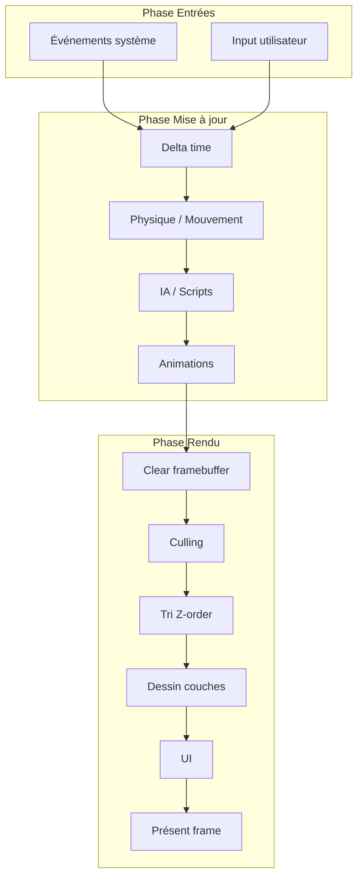
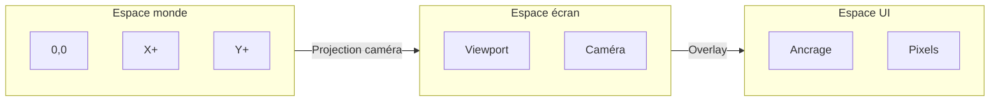
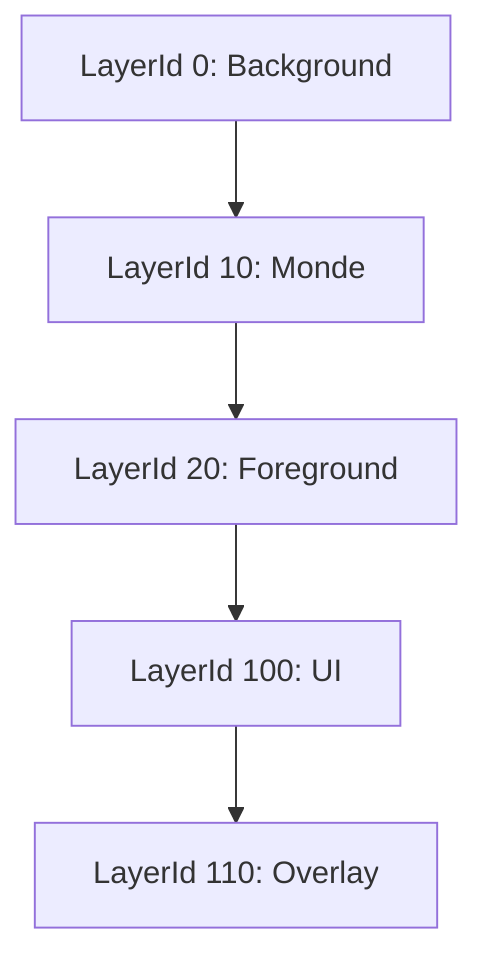
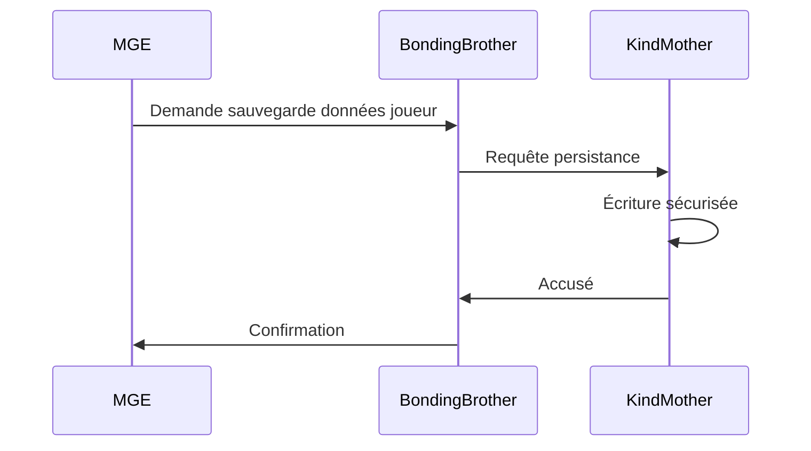

# MGE — Référence Commune

Document centralisant les définitions partagées du Miyukini Game Engine (MGE). Les ~270 points de la référence technique font référence à ce document pour éviter toute duplication.

## Contexte

- **Objectif :** Source de vérité unique pour les types, structures, systèmes de coordonnées, cycle de rendu et glossaire moteur.
- **Applicable à :** Développement MGE, jeux (Allumina, etc.).
- **Statut :** Référence normative — définitions canoniques uniquement ici.

## Portée / Scope

- Types et structures communs
- Systèmes de coordonnées (monde, écran, UI)
- Cycle de rendu (pipeline)
- Glossaire MGE (termes moteur)
- Conventions (nommage, unités, formats)

---

# 1. Types et structures communs

## 1.1 Vec2

Vecteur 2D représentant une position ou un déplacement dans l'espace.

```rust
/// Coordonnées en unités monde ou écran.
#[derive(Debug, Clone, Copy, PartialEq)]
pub struct Vec2 {
    pub x: f32,
    pub y: f32,
}

impl Vec2 {
    pub fn new(x: f32, y: f32) -> Self { ... }
    pub fn zero() -> Self { ... }
    pub fn magnitude(&self) -> f32 { ... }
    pub fn normalized(&self) -> Self { ... }
    pub fn dot(&self, other: &Self) -> f32 { ... }
    pub fn distance_to(&self, other: &Self) -> f32 { ... }
}
```

**Unités :** Dépend du contexte :
- **Monde :** tiles ou px selon le mode (voir [§2 Coordonnées](#2-coordonnees))
- **Écran :** pixels physiques
- **UI :** pixels logiques ou normalisés

**Convention :** `Vec2` utilise toujours `f32` pour les calculs de physique et de position fluides. Les coordonnées entières (grille) utilisent `IVec2` (i32, i32) quand nécessaire.

---

## 1.2 IVec2

Vecteur 2D à coordonnées entières pour la grille (chunks, tuiles, indices).

```rust
#[derive(Debug, Clone, Copy, PartialEq, Eq, Hash)]
pub struct IVec2 {
    pub x: i32,
    pub y: i32,
}
```

**Usage typique :** Index de chunk, coordonnée de tuile, position discrète.

---

## 1.3 Resolution

Résolution de la fenêtre ou de la surface de rendu.

```rust
#[derive(Debug, Clone, Copy, PartialEq)]
pub struct Resolution {
    /// Largeur en pixels physiques
    pub width: u32,
    /// Hauteur en pixels physiques
    pub height: u32,
}

impl Resolution {
    pub fn aspect_ratio(&self) -> f32 { self.width as f32 / self.height as f32 }
    pub fn pixel_count(&self) -> u32 { self.width * self.height }
}
```

**Distinction importante :**
- **Résolution logique** : Espace de coordonnées du jeu (ex. 1280×720) — détermine le viewport virtuel.
- **Résolution physique** : Pixels réels sur l'écran (ex. 3840×2160) — peut différer en cas de scale.

**Référence :** [points/01-affichage-rendu/affichage-resolution](points/01-affichage-rendu/affichage-resolution.md)

---

## 1.4 Rect

Rectangle axis-aligned (AABB) pour hitbox, zones, viewport.

```rust
#[derive(Debug, Clone, Copy, PartialEq)]
pub struct Rect {
    /// Coin supérieur gauche X
    pub x: f32,
    /// Coin supérieur gauche Y
    pub y: f32,
    pub width: f32,
    pub height: f32,
}

impl Rect {
    pub fn new(x: f32, y: f32, width: f32, height: f32) -> Self { ... }
    pub fn from_min_max(min_x: f32, min_y: f32, max_x: f32, max_y: f32) -> Self { ... }
    pub fn center(&self) -> Vec2 { ... }
    pub fn min(&self) -> Vec2 { ... }
    pub fn max(&self) -> Vec2 { ... }
    pub fn contains_point(&self, point: Vec2) -> bool { ... }
    pub fn intersects(&self, other: &Rect) -> bool { ... }
}
```

**Convention :** Origine (x, y) au coin **supérieur gauche**. Y croît vers le **bas** (système écran standard).

**Référence :** [points/02-physique-collisions/hitbox](points/02-physique-collisions/hitbox.md), [points/02-physique-collisions/collision](points/02-physique-collisions/collision.md)

---

## 1.5 ScaleFactor

Facteur de mise à l'échelle entre résolution logique et physique.

```rust
#[derive(Debug, Clone, Copy, PartialEq)]
pub struct ScaleFactor {
    /// Facteur horizontal (physique / logique)
    pub x: f32,
    /// Facteur vertical (physique / logique)
    pub y: f32,
}

impl ScaleFactor {
    pub fn uniform(s: f32) -> Self { Self { x: s, y: s } }
    pub fn from_resolutions(logical: Resolution, physical: Resolution) -> Self { ... }
}
```

**Usage :** Conversion coordonnées logiques ↔ physiques ; mise à l'échelle des assets selon DPI ou fenêtre.

**Contraintes :** 
- `ScaleFactor` > 0
- En mode scale uniforme : `x == y` pour éviter la distorsion

---

## 1.6 LayerId

Identifiant de calque pour l'ordre d'affichage (Z-order) et les masques de collision.

```rust
/// ID de couche de rendu ou de collision
#[derive(Debug, Clone, Copy, PartialEq, Eq, Hash)]
pub struct LayerId(pub u8);

/// Couches prédéfinies (valeurs recommandées)
pub mod default_layers {
    pub const BACKGROUND: LayerId = LayerId(0);   // Arrière-plan
    pub const WORLD: LayerId = LayerId(10);       // Monde, entités
    pub const FOREGROUND: LayerId = LayerId(20); // Avant-plan
    pub const UI: LayerId = LayerId(100);         // Interface
    pub const OVERLAY: LayerId = LayerId(110);    // Overlays, debug
}
```

**Convention :** Plus la valeur est élevée, plus l'élément est dessiné au-dessus. Les layers 0–99 pour le monde, 100+ pour l'UI.

**Référence :** [points/01-affichage-rendu/z-order-couches](points/01-affichage-rendu/z-order-couches.md), [points/02-physique-collisions/collision-layers](points/02-physique-collisions/collision-layers.md)

---

## 1.7 Autres types numériques courants

| Type | Usage |
|------|-------|
| `f32` | Positions, vitesses, timers, pourcentages |
| `u32` | IDs, compteurs, résolutions |
| `i32` | Coordonnées de grille, décalages |
| `Duration` | Délais, cooldowns, durées |
| `Instant` | Timestamps, comparaisons temporelles |

---

# 2. Coordonnées

Les points [coordonnees](points/01-affichage-rendu/coordonnees.md), [camera](points/01-affichage-rendu/camera.md) et [hitbox](points/02-physique-collisions/hitbox.md) utilisent ces définitions.

## 2.1 Système monde (World space)

Coordonnées absolues du jeu. Origine et orientation définies par le monde (carte, zone).

- **Origine :** Souvent coin supérieur gauche de la carte (0, 0) ou centre selon la convention du jeu.
- **Axe X :** Vers la droite
- **Axe Y :** Vers le bas (convention écran) ou vers le haut (convention mathématique) — à définir par jeu
- **Unité :** 
  - **Mode tile-based :** 1 unité = 1 tuile (taille fixe, ex. 32×32 px)
  - **Mode pixel :** 1 unité = 1 pixel logique

**Convention MGE :** En mode tile-based isométrique, Y croît vers le bas-écran (sud visuel).

---

## 2.2 Système écran (Screen space)

Coordonnées relatives à la fenêtre visible. Dépend de la caméra et du viewport.

- **Origine :** Coin supérieur gauche du viewport
- **Unité :** Pixels logiques (avant scale) ou physiques selon l'étape du pipeline
- **Plage :** Typiquement (0, 0) à (viewport_width, viewport_height)

**Transformation :** `monde → écran` = projection de la caméra (position, zoom, parallax).

---

## 2.3 Système UI (UI space)

Coordonnées de l'interface utilisateur.

- **Mode 1 — Pixels :** Coordonnées en pixels logiques, ancrage par coin ou centre
- **Mode 2 — Normalisées :** (0, 0) à (1, 1) pour position relative à l'écran
- **Mode 3 — Ancres :** Pourcentages (ex. 50% largeur, 10% du bas)

**Référence :** [points/20-interface/gui](points/20-interface/gui.md)

---

## 2.4 Conversions principales

| Conversion | Formule (pseudo) |
|------------|-------------------|
| Monde → Écran | `screen = (world - camera_pos) * zoom + viewport_center` |
| Écran → Monde | `world = (screen - viewport_center) / zoom + camera_pos` |
| Écran logique → Physique | `physical = logical * scale_factor` |
| Tiles → Monde | `world = tile * tile_size` (avec offset selon pivot) |

---

## 2.5 Unité tile

- **Définition :** Taille d'une tuile en pixels logiques. Ex. 32×32 ou 64×64.
- **Convention :** Tuile carrée par défaut ; tuiles rectangulaires supportées (largeur × hauteur).
- **Grille :** Coordonnées entières (tile_x, tile_y) ; position monde = `(tile_x * tw, tile_y * th)`.

**Référence :** [points/01-affichage-rendu/monde-tile-based](points/01-affichage-rendu/monde-tile-based.md)

---

## 2.6 Orientation et angle

L'**orientation** (facing) d'une entité est la direction dans laquelle elle « regarde ». Utilisée pour le rendu du sprite, les attaques, le ciblage.

- **Convention MGE :** Angle en radians ; 0 = Est (X+), π/2 = Sud (Y+)
- **Formule :** `angle = atan2(direction.y, direction.x)`
- **Vitesse de rotation :** °/s (degrés par seconde) — voir [points/03-deplacement-locomotion/orientation-rotation](points/03-deplacement-locomotion/orientation-rotation.md)
- **Axe de rotation :** Perpendiculaire au plan 2D (axe Z implicite)

---

# 3. Cycle de rendu

Les points [affichage-resolution](points/01-affichage-rendu/affichage-resolution.md), [boucle-jeu](points/23-systeme/boucle-jeu.md) et les points d'affichage référencent ce pipeline.

## 3.1 Pipeline simplifié



---

## 3.2 Séquence détaillée

| Étape | Description |
|-------|-------------|
| 1. Input | Polling clavier, souris, manette ; événements fenêtre |
| 2. Delta time | Calcul du temps écoulé depuis la dernière frame |
| 3. Update | Logique de jeu, physique, IA, animations (basé sur delta) |
| 4. Culling | Exclure entités hors écran ou hors distance |
| 5. Tri | Trier les entités visibles par LayerId puis Y (sprite sorting) |
| 6. Draw | Dessiner couche par couche (background → world → foreground) |
| 7. UI | Dessiner l'interface par-dessus |
| 8. Présent | Swap buffers, VSync si activé |

**Référence :** [points/23-systeme/boucle-jeu](points/23-systeme/boucle-jeu.md)

---

## 3.3 Frame rate et VSync

- **Frame rate :** Nombre d'images par seconde (FPS). Cible typique : 60 ou 120.
- **Delta time :** Temps en secondes entre deux frames. Utilisé pour des mouvements indépendants du frame rate.
- **VSync :** Synchronisation verticale — limite le FPS au rafraîchissement du moniteur pour éviter le tearing.

---

## 3.4 Pause et time scale

- **Pause :** Delta time = 0 pour la logique de jeu ; l'UI peut rester active.
- **Time scale :** Facteur multiplicatif sur le delta (ex. 0.5 = ralenti, 2.0 = accéléré).

---

# 4. Glossaire MGE

Termes moteur avec liens vers le glossaire Miyukini quand pertinent.

## 4.1 Rendu et affichage

| Terme | Définition |
|-------|------------|
| **Sprite** | Image 2D affichée à une position (texture, sous-rectangle, pivot) |
| **Sprite sheet** | Texture contenant plusieurs frames ou variantes d'un sprite |
| **Atlas** | Texture regroupant plusieurs sprites pour réduire les draw calls |
| **Pivot / anchor** | Point d'ancrage du sprite (centre, bas-centre, etc.) pour positionnement et rotation |
| **Parallax** | Déplacement des couches à des vitesses différentes pour l'effet de profondeur |
| **Z-order** | Ordre d'affichage des éléments ; les plus hauts sont dessinés par-dessus |
| **Layer** | Calque de rendu (arrière-plan, monde, avant-plan, UI) |
| **Viewport** | Zone de l'écran où le monde est rendu |
| **Culling** | Exclusion des entités hors champ de vue pour optimiser le rendu |

---

## 4.2 Monde et entités

| Terme | Définition |
|-------|------------|
| **Entity** | Objet unique dans le monde (joueur, PNJ, objet, projectile) |
| **EntityId** | Identifiant unique persistant pour une entité |
| **Chunk** | Unité de découpage du monde ; chargement/déchargement par chunk |
| **Prefab** | Modèle réutilisable pour créer des entités (template) |
| **Spawn** | Création d'une entité à une position |
| **Despawn** | Destruction d'une entité et nettoyage des références |
| **Instance** | Zone isolée (donjon, raid) avec son propre état |
| **Monde persistant** | Zone partagée entre tous les joueurs |
| **Tile** | Tuile de la grille (terrain, décor, mur) |

---

## 4.3 Physique et collisions

| Terme | Définition |
|-------|------------|
| **Hitbox** | Zone de détection de collision d'une entité (forme, taille, alignement) |
| **AABB** | Axis-Aligned Bounding Box — rectangle aligné aux axes |
| **Collision layer** | Groupe logique pour définir quelles entités peuvent se collisionner |
| **Collision mask** | Masque définissant avec quels layers une entité collisionne |
| **Rebond** | Réponse à une collision (déplacement, vitesse inversée) |
| **Blocage** | Empêcher le chevauchement (résolution de collision) |

---

## 4.4 Données et persistance

| Terme | Définition |
|-------|------------|
| **KindMother** | Core Miyukini pour la persistance des données. Toute sauvegarde/chargement du MGE utilise KindMother. Voir [glossaire Miyukini](../reference/Miyukini%20Conceptual%20References%20-%20Glossaire.md) |
| **Données joueur** | État du personnage, inventaire, progression — persisté via KindMother |
| **Slot de sauvegarde** | Emplacement de sauvegarde (plusieurs parties possibles) |

---

## 4.5 Réseau et MWS

| Terme | Définition |
|-------|------------|
| **MWS** | Miyukini Webway System — couche de présence, découverte et transport des COGs. Voir [docs miyukini-webway-system](../miyukini-webway-system/) |
| **Lobby** | Espace de rencontre multijoueur exposé via le MWS |
| **COG** | Unité d'exécution Miyukini (ordinateur, instance) |
| **Origin** | Point central du MWS (relay + tracker) |

---

## 4.6 Système et boucle

| Terme | Définition |
|-------|------------|
| **Game loop** | Boucle principale : input → update → render |
| **Delta time** | Temps écoulé depuis la dernière frame (en secondes) |
| **Frame rate** | Nombre de frames par seconde (FPS) |
| **Asset** | Ressource chargée (texture, son, font, donnée) |
| **Pool** | Réserve d'objets réutilisables (ex. projectiles) pour éviter les allocations |

---

# 5. Conventions

## 5.1 Nommage

| Élément | Convention | Exemple |
|---------|------------|---------|
| Fichiers | kebab-case, pas d'accents | `affichage-resolution.md` |
| Dossiers | kebab-case, préfixe numéro catégorie | `01-affichage-rendu` |
| Types Rust | PascalCase | `Vec2`, `Resolution`, `LayerId` |
| Variables/fonctions | snake_case | `entity_id`, `get_screen_pos` |
| Constantes | SCREAMING_SNAKE ou PascalCase | `MAX_ENTITIES`, `DefaultLayers` |
| Enums | PascalCase, variants PascalCase | `enum EntityType { Player, Npc }` |

---

## 5.2 Unités

| Unité | Usage |
|-------|-------|
| **px** | Pixels (logiques ou physiques selon contexte) |
| **tiles** | Unités de grille (coordonnées entières) |
| **s** | Secondes (durées, cooldowns, timers) |
| **u/s** | Unités par seconde (vitesse) |
| **°/s** | Degrés par seconde (rotation) |

---

## 5.3 Formats de coordonnées

- **Position :** `(x, y)` — Vec2 ou tuple
- **Rectangle :** `(x, y, width, height)` — origine haut-gauche
- **Tile :** `(tile_x, tile_y)` — IVec2
- **Chunk :** `(chunk_x, chunk_y)` — IVec2, index de chunk

---

## 5.4 Formats de fichiers

| Type | Format préféré |
|------|----------------|
| Textures | PNG (avec transparence), WebP si supporté |
| Sprite sheets | PNG + métadonnées JSON ou intégrées |
| Données | JSON pour config, binaire pour sauvegardes |
| Cartes | Format propriétaire ou Tiled JSON |

---

## 5.5 Anglicismes acceptés

Termes techniques couramment utilisés en anglais dans la doc et le code :

- frame rate, FPS, VSync
- hitbox, culling, sprite, prefab
- pool, spawn, despawn
- delta time, game loop
- click-to-attack, pathfinding, navmesh
- loot, drop, respawn
- buff, debuff, crowd control (CC)
- DPS, aggro, AOE

---

## 5.6 Chemins relatifs des documents

Depuis un fichier dans `points/01-affichage-rendu/` :

```
../MGE%20-%20Reference%20Commune.md
```

Depuis un fichier dans `points/23-systeme/` :

```
../MGE%20-%20Reference%20Commune.md
```

Depuis la racine `docs/Miyukini_Game_Engine/` :

```
MGE%20-%20Reference%20Commune.md
```

---

# 6. Diagrammes complémentaires

## 6.1 Systèmes de coordonnées



---

## 6.2 Hiérarchie des calques



---

## 6.3 Flux de données KindMother



**Note :** Le MGE ne parle jamais directement à KindMother. Toute persistance passe par BondingBrother (Strate 5) qui traduit les intentions. Voir [glossaire Miyukini](../reference/Miyukini%20Conceptual%20References%20-%20Glossaire.md).

---

# 7. Cas limites et précisions

## 7.1 Rect et hitbox

- **Rect vide :** `width <= 0` ou `height <= 0` — `contains_point` et `intersects` retournent toujours `false`.
- **Rect négatif :** `width < 0` ou `height < 0` — comportement non garanti ; normaliser avec `from_min_max` si nécessaire.
- **Hitbox hors sprite :** La hitbox peut dépasser les bords du sprite (ex. zone d'attaque au sol).

## 7.2 Conversions de coordonnées

- **Hors viewport :** Un point monde peut projeter en coordonnées écran négatives ou au-delà de la résolution — valide pour le culling.
- **Division par zéro :** Si `zoom == 0`, la projection monde→écran doit gérer le cas (clamp ou erreur).
- **Tile partielle :** Position monde (12.7, 8.3) → tile (12, 8) par troncature ; arrondi selon le pivot pour l'affichage.

## 7.3 Scale factor

- **Scale non uniforme :** En `ScaleFactor { x: 2.0, y: 1.5 }`, les cercles deviennent des ellipses — à éviter pour le gameplay sauf effet volontaire.
- **Scale très petit/grand :** Limiter entre 0.25 et 4.0 typiquement pour éviter les artefacts.

## 7.4 LayerId

- **Collision vs rendu :** Un même `LayerId` peut servir pour les deux (rendu et collision) ou être séparé selon l'implémentation. Les points [collision-layers](points/02-physique-collisions/collision-layers.md) et [z-order-couches](points/01-affichage-rendu/z-order-couches.md) détaillent.

---

# 8. Exemples de code

## 8.1 Conversion monde → écran

```rust
fn world_to_screen(
    world_pos: Vec2,
    camera_pos: Vec2,
    zoom: f32,
    viewport_center: Vec2,
) -> Vec2 {
    let offset = world_pos - camera_pos;
    offset * zoom + viewport_center
}
```

## 8.2 Test d'intersection AABB

```rust
fn rects_intersect(a: &Rect, b: &Rect) -> bool {
    a.x < b.x + b.width
        && a.x + a.width > b.x
        && a.y < b.y + b.height
        && a.y + a.height > b.y
}
```

## 8.3 Tile vers position monde (centre de tuile)

```rust
fn tile_to_world_center(tile: IVec2, tile_size: u32) -> Vec2 {
    let ts = tile_size as f32;
    Vec2::new(
        tile.x as f32 * ts + ts / 2.0,
        tile.y as f32 * ts + ts / 2.0,
    )
}
```

---

# 9. Liens vers les points

Ce document est référencé depuis chaque point. Lien relatif depuis un point :

```markdown
Voir [MGE - Reference Commune](../MGE%20-%20Reference%20Commune.md) pour les définitions de Vec2, Rect, etc.
```

---

# 10. Références externes

| Document | Rôle |
|----------|------|
| [MGE - Miyukini Game Engine - Reference Technique](MGE%20-%20Miyukini%20Game%20Engine%20-%20Reference%20Technique.md) | Index des capacités MGE |
| [MGE - Hitbox et collisions - Référence](MGE%20-%20Hitbox%20et%20Collisions%20-%20Reference.md) | Hitbox, collision, formules, MTV |
| [MGE - Pathfinding Collisions - Guide Entités Groupes](MGE%20-%20Pathfinding%20Collisions%20-%20Guide%20Entites%20Groupes.md) | Pathfinding, coût, hitbox, collisions — spectre entités à groupes |
| [Miyukini Conceptual References - Glossaire](../reference/Miyukini%20Conceptual%20References%20-%20Glossaire.md) | Glossaire officiel Miyukini |
| [Index des points](points/_index.md) | Liste des points de développement |
| [Allumina - Document Fondateur](../services/Allumina/Allumina%20-%20Document%20Fondateur.md) | Cas d'usage MGE |

---

**Document** : MGE — Référence Commune  
**Version** : 1.0  
**Date** : 2026-02-18
