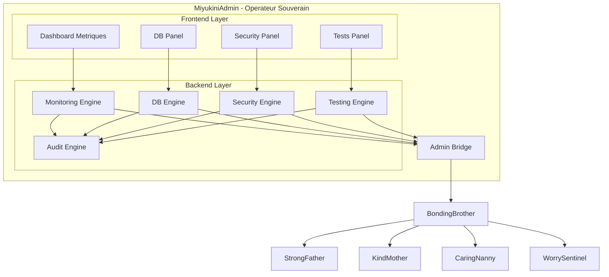

# MiyukiniAdmin — Architecture & Flows

## 1. Contexte

Ce document decrit l'architecture conceptuelle de MiyukiniAdmin et les flux d'administration qui le traversent. Il definit les composants internes, les interactions avec l'ecosysteme Miyukini, et les patterns architecturaux.

MiyukiniAdmin est un **Operateur Souverain** (Strate 9) qui fonctionne comme une console root autonome, avec son propre backend, frontend et logique metier administrative.

## 2. Portee / Scope

Ce document definit :
- L'architecture interne de MiyukiniAdmin
- Les composants fonctionnels
- Les flux d'administration
- Les patterns d'interaction avec les cores

Ce document **ne couvre pas** :
- Les details d'implementation technique
- Les specifications UI/UX detaillees
- Les protocoles de securite (voir Security contracts)

---

## 3. Architecture Globale

### 3.1 Vue d'Ensemble

```
┌─────────────────────────────────────────────────────────────────┐
│                      MiyukiniAdmin                              │
│  ┌───────────────────────────────────────────────────────────┐  │
│  │                    Frontend (UI)                          │  │
│  │  ┌─────────┐ ┌─────────┐ ┌─────────┐ ┌─────────┐         │  │
│  │  │Dashboard│ │DB Panel │ │Security │ │  Tests  │         │  │
│  │  │Metriques│ │   UI    │ │ Panel   │ │  Panel  │         │  │
│  │  └─────────┘ └─────────┘ └─────────┘ └─────────┘         │  │
│  └───────────────────────────────────────────────────────────┘  │
│                              │                                   │
│  ┌───────────────────────────▼───────────────────────────────┐  │
│  │                  Backend (Logique Admin)                  │  │
│  │  ┌─────────┐ ┌─────────┐ ┌─────────┐ ┌─────────┐         │  │
│  │  │Monitoring│ │   DB    │ │Security │ │Testing  │         │  │
│  │  │ Engine  │ │ Engine  │ │ Engine  │ │ Engine  │         │  │
│  │  └─────────┘ └─────────┘ └─────────┘ └─────────┘         │  │
│  └───────────────────────────────────────────────────────────┘  │
│                              │                                   │
│  ┌───────────────────────────▼───────────────────────────────┐  │
│  │                  Admin Bridge                              │  │
│  │           (Interface vers BondingBrother)                  │  │
│  └───────────────────────────────────────────────────────────┘  │
└─────────────────────────────────────────────────────────────────┘
                               │
                               ▼
┌─────────────────────────────────────────────────────────────────┐
│                      BondingBrother                             │
│                   (Point d'acces exclusif)                      │
└─────────────────────────────────────────────────────────────────┘
                               │
          ┌────────────────────┼────────────────────┐
          ▼                    ▼                    ▼
    ┌───────────┐        ┌───────────┐        ┌───────────┐
    │StrongFather│        │KindMother │        │CaringNanny│
    │ (Decision) │        │(Persistance)│       │  (Etat)   │
    └───────────┘        └───────────┘        └───────────┘
```

### 3.2 Principes Architecturaux

| Principe | Description |
|----------|-------------|
| **Isolation complete** | Aucun composant partage avec d'autres Operateurs |
| **Auto-suffisance** | Backend + Frontend + Logique admin internes |
| **Mediation obligatoire** | Toute interaction passe par BondingBrother |
| **Tracabilite** | Toutes les actions sont journalisees |
| **Explicite** | Aucune action implicite ou silencieuse |

---

## 4. Composants Internes

### 4.1 Frontend (UI Layer)

**Role :** Interface utilisateur de la console d'administration.

| Composant | Responsabilite |
|-----------|----------------|
| **Dashboard Metriques** | Affichage temps reel des metriques systeme |
| **DB Panel** | Interface de gestion base de donnees |
| **Security Panel** | Panneau de controle securite |
| **Tests Panel** | Lancement et suivi des tests |
| **Audit Log Viewer** | Visualisation des journaux d'audit |

**Caracteristiques :**
- Design system propre (inspiration PHPMyAdmin)
- Pas de framework UI partage
- Navigation independante
- Etats UI isoles

### 4.2 Backend (Admin Logic Layer)

**Role :** Logique metier administrative.

| Engine | Responsabilite |
|--------|----------------|
| **Monitoring Engine** | Collecte et agregation des metriques |
| **DB Engine** | Operations sur base de donnees |
| **Security Engine** | Gestion niveaux securite et arbitrage |
| **Testing Engine** | Execution et rapport de tests |
| **Audit Engine** | Journalisation et tracabilite |

**Caracteristiques :**
- Logique administrative uniquement
- Pas de logique metier applicative
- Toutes les operations sont tracees

### 4.3 Admin Bridge

**Role :** Interface unique vers BondingBrother.

**Responsabilites :**
- Traduction des requetes admin en requetes BondingBrother
- Gestion des sessions administratives
- Validation des permissions admin
- Serialisation/deserialisation des donnees

---

## 5. Flux d'Administration

### 5.1 Flux Monitoring (Lecture Metriques)

```
┌──────────────┐    ┌──────────────┐    ┌──────────────┐
│  Dashboard   │───▶│  Monitoring  │───▶│ Admin Bridge │
│   Metriques  │    │    Engine    │    │              │
└──────────────┘    └──────────────┘    └──────────────┘
                                               │
                                               ▼
                                        ┌──────────────┐
                                        │BondingBrother│
                                        └──────────────┘
                                               │
                    ┌──────────────────────────┤
                    ▼                          ▼
             ┌──────────────┐          ┌──────────────┐
             │ CaringNanny  │          │  KindMother  │
             │  (metriques  │          │ (stats DB)   │
             │   systeme)   │          │              │
             └──────────────┘          └──────────────┘
```

**Etapes :**
1. Dashboard demande les metriques
2. Monitoring Engine formule la requete
3. Admin Bridge transmet a BondingBrother
4. BondingBrother interroge CaringNanny (metriques systeme) et KindMother (stats DB)
5. Reponse remonte vers Dashboard
6. Action journalisee dans Audit Engine

### 5.2 Flux Changement Niveau Securite

```
┌──────────────┐    ┌──────────────┐    ┌──────────────┐
│  Security    │───▶│   Security   │───▶│ Admin Bridge │
│    Panel     │    │    Engine    │    │              │
└──────────────┘    └──────────────┘    └──────────────┘
                           │                   │
                           ▼                   ▼
                    ┌──────────────┐    ┌──────────────┐
                    │ Validation   │    │BondingBrother│
                    │ Justification│    └──────────────┘
                    └──────────────┘           │
                                               ▼
                                        ┌──────────────┐
                                        │ StrongFather │
                                        │ (validation) │
                                        └──────────────┘
                                               │
                                               ▼
                                        ┌──────────────┐
                                        │WorrySentinel │
                                        │ (changement) │
                                        └──────────────┘
```

**Etapes :**
1. Operateur humain demande changement de niveau
2. Security Engine exige justification
3. Admin Bridge transmet a BondingBrother
4. StrongFather valide l'action administrative
5. WorrySentinel applique le changement
6. Action journalisee avec justification

**Donnees tracees :**
- Horodatage
- Identite operateur
- Niveau avant/apres
- Justification
- Validation StrongFather

### 5.3 Flux Test de Cycle

```
┌──────────────┐    ┌──────────────┐    ┌──────────────┐
│    Tests     │───▶│   Testing    │───▶│ Admin Bridge │
│    Panel     │    │    Engine    │    │              │
└──────────────┘    └──────────────┘    └──────────────┘
                           │                   │
                           ▼                   ▼
                    ┌──────────────┐    ┌──────────────┐
                    │    Test      │    │BondingBrother│
                    │  Executor    │    └──────────────┘
                    └──────────────┘           │
                           │         ┌────────┴────────┐
                           ▼         ▼                 ▼
                    ┌──────────────┐ ┌──────────────┐ ┌──────────────┐
                    │   Report     │ │ KindMother   │ │ StrongFather │
                    │  Generator   │ │ (tests DB)   │ │ (tests       │
                    └──────────────┘ └──────────────┘ │  decision)   │
                                                      └──────────────┘
```

**Types de tests :**
- Tests de performance (latence requetes)
- Tests de montee en charge
- Tests de coherence DB
- Tests de conformite contractuelle

### 5.4 Flux Operations DB (Mode Normal)

```
┌──────────────┐    ┌──────────────┐    ┌──────────────┐
│   DB Panel   │───▶│  DB Engine   │───▶│ Admin Bridge │
└──────────────┘    └──────────────┘    └──────────────┘
                                               │
                                               ▼
                                        ┌──────────────┐
                                        │BondingBrother│
                                        └──────────────┘
                                               │
                    ┌──────────────────────────┤
                    ▼                          ▼
             ┌──────────────┐          ┌──────────────┐
             │ StrongFather │          │  KindMother  │
             │ (validation) │          │ (execution)  │
             └──────────────┘          └──────────────┘
```

**Operations autorisees :**
- Lecture (exploration tables)
- Validation (coherence)
- Migration (controlee)
- Reparation (sous conditions)

**Toujours via KindMother, sous autorite StrongFather.**

### 5.5 Flux Emergency DB Access (Mode Recovery)

```
┌──────────────┐
│   DB Panel   │
│ (Mode Recovery)│
└──────────────┘
        │
        ▼ (Conditions cumulatives verifiees)
┌──────────────────────────────────────────────────┐
│  Verification Conditions:                         │
│  - Etat systeme >= Critique (T3/T4)              │
│  - Protocole securite renforce active            │
│  - Intervention humaine authentifiee             │
│  - Fenetre temporelle limitee                    │
└──────────────────────────────────────────────────┘
        │
        ▼
┌──────────────┐    ┌──────────────┐
│  DB Engine   │───▶│ Admin Bridge │
│ (Mode Direct)│    │              │
└──────────────┘    └──────────────┘
        │                  │
        │                  ▼
        │           ┌──────────────┐
        │           │BondingBrother│
        │           └──────────────┘
        │                  │
        │    ┌─────────────┴─────────────┐
        │    ▼                           ▼
        │ ┌──────────────┐        ┌──────────────┐
        │ │ StrongFather │        │ CaringNanny  │
        │ │(approbation) │        │  (blocage    │
        │ └──────────────┘        │  Operateurs) │
        │                         └──────────────┘
        │
        ▼ (Acces direct DB - temporaire)
┌──────────────┐
│   Database   │
│   (Direct)   │
└──────────────┘
        │
        ▼ (Apres intervention)
┌──────────────┐
│ Revalidation │
│via KindMother│
└──────────────┘
```

**Conditions cumulatives obligatoires :**
1. Etat systeme >= Critique (T3 ou T4)
2. Protocole de securite renforce active
3. Intervention humaine authentifiee
4. Fenetre temporelle limitee
5. Journalisation complete
6. Revalidation obligatoire apres intervention

---

## 6. Etats du Systeme

### 6.1 Etats MiyukiniAdmin

| Etat | Description | Actions possibles |
|------|-------------|-------------------|
| **IDLE** | En attente, monitoring passif | Toutes |
| **MONITORING** | Collecte active de metriques | Lecture seule |
| **TESTING** | Execution de tests en cours | Lecture + Tests |
| **MAINTENANCE** | Operations de maintenance | Lecture + Ecriture controlee |
| **RECOVERY** | Mode recovery active | Acces DB direct |

### 6.2 Transitions d'Etats

```
                    ┌──────────┐
                    │   IDLE   │
                    └──────────┘
                         │
        ┌────────────────┼────────────────┐
        ▼                ▼                ▼
┌──────────────┐  ┌──────────────┐  ┌──────────────┐
│  MONITORING  │  │   TESTING    │  │ MAINTENANCE  │
└──────────────┘  └──────────────┘  └──────────────┘
        │                │                │
        └────────────────┼────────────────┘
                         │
                         ▼ (conditions cumulatives)
                  ┌──────────────┐
                  │   RECOVERY   │
                  └──────────────┘
                         │
                         ▼ (revalidation)
                    ┌──────────┐
                    │   IDLE   │
                    └──────────┘
```

---

## 7. Securite Architecturale

### 7.1 Principes de Securite

| Principe | Implementation |
|----------|----------------|
| **Isolation** | MiyukiniAdmin est un bundle autonome |
| **Authentification** | Operateur humain authentifie obligatoirement |
| **Autorisation** | Validation StrongFather pour actions critiques |
| **Tracabilite** | Toute action journalisee avec contexte |
| **Non-exposition** | Aucune API publique |

### 7.2 Niveaux d'Acces

| Niveau | Description | Actions |
|--------|-------------|---------|
| **Viewer** | Lecture seule | Monitoring, consultation logs |
| **Operator** | Operations standard | + Tests, maintenance legere |
| **Admin** | Operations avancees | + Changement securite, migrations |
| **Recovery** | Mode recovery | + Acces DB direct (conditions cumulatives) |

---

## 8. Integration avec l'Ecosysteme

### 8.1 Point d'Entree Unique

MiyukiniAdmin accede a l'ecosysteme **exclusivement** via BondingBrother.

```
MiyukiniAdmin ──────▶ BondingBrother ──────▶ Cores
                           │
                           ├──▶ StrongFather (decisions)
                           ├──▶ KindMother (donnees)
                           ├──▶ CaringNanny (etat)
                           └──▶ WorrySentinel (securite)
```

### 8.2 Capacites Reservees

MiyukiniAdmin peut invoquer des capacites reservees via BondingBrother :

| Capacite | Description |
|----------|-------------|
| **admin.metrics.read** | Lecture metriques systeme |
| **admin.security.level.read** | Lecture niveau securite |
| **admin.security.level.write** | Changement niveau securite |
| **admin.db.read** | Lecture donnees DB |
| **admin.db.maintenance** | Operations maintenance |
| **admin.db.recovery** | Acces direct (mode recovery) |
| **admin.tests.execute** | Execution tests |

---

## 9. Diagramme de Composants



---

## 10. Documents Associes

- [MiyukiniAdmin - Documentation Fondatrice](../foundation/MiyukiniAdmin%20-%20Documentation%20Fondatrice.md)
- [MiyukiniAdmin - Core Interaction Contract](./MiyukiniAdmin%20-%20Core%20Interaction%20Contract.md)
- [Miyukini Conceptual References - MiyukiniAdmin Status](../../../reference/Miyukini%20Conceptual%20References%20-%20MiyukiniAdmin%20Status.md)
- [BondingBrother - Documentation Fondatrice](../../BondingBrother/foundation/BondingBrother%20-%20Documentation%20Fondatrice.md)

---

**Date de creation :** 2026-01-28  
**Version :** 1.0.0  
**Statut :** Document de reference
