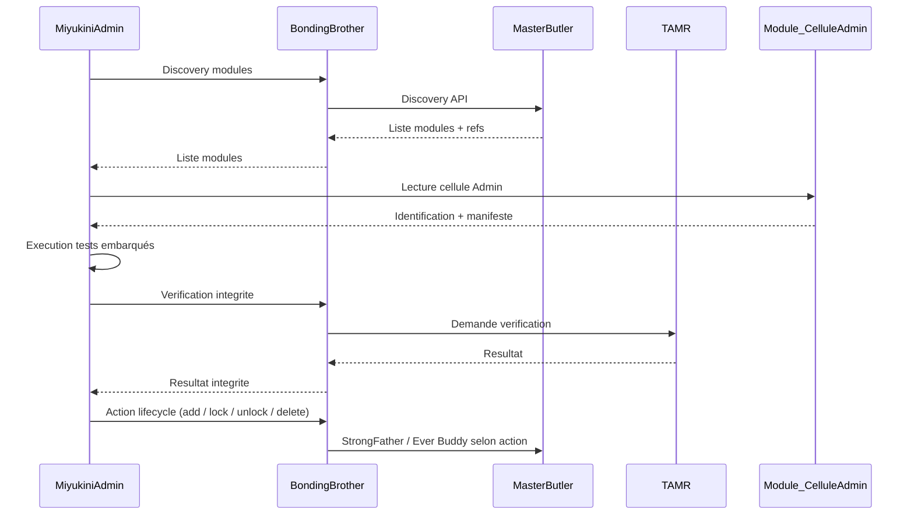

# MiyukiniAdmin — Module Testing and Lifecycle Contract

## 1. Contexte

Ce document definit le contrat pour les **tests des modules** (Kits d'outils, Operateurs, Equipes d'operateurs, Services) et le **cycle de vie des modules** dans MiyukiniAdmin. Chaque module embarque ses propres protocoles de tests dans une **cellule Admin** exposee uniquement a MiyukiniAdmin. Seul MiyukiniAdmin peut executer ces tests, interpreter le manifeste de test embarqué, verifier l'integrite des modules en collaboration avec les cores (notamment TAMR), et effectuer les actions de cycle de vie : ajout, verrouillage/deverrouillage, suppression d'un module.

**Principe fondamental :**

> **Seul MiyukiniAdmin peut lire la cellule Admin, executer les tests embarqués et agir sur le cycle de vie des modules. Les autres Operateurs ne consomment pas la cellule Admin.**

## 2. Portee / Scope

Ce document definit :
- La definition et le contenu de la **Cellule Admin** (cellule du module destinee a MiyukiniAdmin)
- L'identification des modules presents via Master Butler (via BondingBrother)
- Le **manifeste de test embarqué** : structure, protocole d'execution, criteres de succes/echec
- La **verification d'integrite** des modules en collaboration avec les cores (champ d'action TAMR)
- Le **cycle de vie des modules** : ajout, verrouillage/deverrouillage, suppression — exclusivement via MiyukiniAdmin
- Les invariants et interdictions associes

Ce document **ne couvre pas** :
- Les tests de cycle systeme (performance, charge) — voir [Cycle Tests Contract](./MiyukiniAdmin%20-%20Cycle%20Tests%20Contract.md)
- Les tests unitaires DB et conformite contractuelle — voir [Unit Tests Contract](./MiyukiniAdmin%20-%20Unit%20Tests%20Contract.md)
- L'implementation technique des tests embarqués dans chaque module
- L'interface utilisateur (voir UI documentation)

---

## 3. Principe Fondamental

### 3.1 Exclusivite MiyukiniAdmin

> **La cellule Admin est lue et utilisee uniquement par MiyukiniAdmin. Seul MiyukiniAdmin peut executer et interpreter les tests du manifeste embarqué et effectuer les actions de cycle de vie sur les modules.**

### 3.2 Invariants

| Code | Invariant |
|------|-----------|
| **INV-MTL-1** | Seul MiyukiniAdmin peut lire et utiliser la cellule Admin |
| **INV-MTL-2** | Seul MiyukiniAdmin peut executer les tests du manifeste embarqué |
| **INV-MTL-3** | Toute action de cycle de vie (add / lock / unlock / delete) passe par BondingBrother |
| **INV-MTL-4** | Aucun bypass des cores ; validation StrongFather pour les actions lifecycle |
| **INV-MTL-5** | Verification d'integrite en collaboration avec TAMR (champ d'action integrite) |
| **INV-MTL-6** | Tracabilite complete de chaque test et de chaque action lifecycle |
| **INV-MTL-7** | Les tests embarqués s'executent dans un environnement de diagnostic ; pas de modification des donnees metier |

---

## 4. Cellule Admin (cellule du module destinee a MiyukiniAdmin)

### 4.1 Definition

La **Cellule Admin** est la surface qu'un module (Kit d'outils, Operateur, Equipe d'operateurs, Service) expose **uniquement** a MiyukiniAdmin. Elle n'est pas consommee par les autres Operateurs. Elle contient l'identification du module, le manifeste de test embarqué et les metadonnees d'integrite.

### 4.2 Contenu obligatoire

| Element | Description | Obligatoire |
|---------|-------------|-------------|
| **Identification** | `id`, `version`, `type` (toolkit / operator / team / service), `module_origin` | Oui |
| **Manifeste de test** | Liste des tests declares, protocole d'execution, format des resultats | Oui |
| **Metadonnees d'integrite** | Empreinte, contrats references, versions — pour verification avec les cores (TAMR) | Oui |

### 4.3 Format declaratif

La cellule Admin peut etre declaree en YAML ou JSON. Exemple de structure minimale :

```yaml
admin_cell:
  identification:
    id: "spm.cms.content"
    version: "1.2.0"
    type: "operator"
    module_origin: "miyukini-spm-cms-content"
  test_manifest:
    tests:
      - id: "T-INT-001"
        name: "Integrite schema"
        protocol: "invoke"
        criteria: { pass: "zero_violations" }
      - id: "T-CONF-001"
        name: "Conformite contrats"
        protocol: "invoke"
        criteria: { pass: "all_checks_ok" }
    result_format: "json"
  integrity:
    fingerprint: "<hash>"
    contracts: ["KindMother-Adapter", "MasterButler-Declaration"]
    core_versions: { kindmother: "2.4", masterbutler: "2.4" }
```

### 4.4 Regles d'exclusivite

| Regle | Description |
|-------|-------------|
| **Lecture** | Seul MiyukiniAdmin peut lire la cellule Admin |
| **Usage** | Seul MiyukiniAdmin peut utiliser son contenu (tests, integrite) |
| **Execution tests** | Seul MiyukiniAdmin peut invoquer et interpreter l'execution des tests du manifeste |
| **Autres Operateurs** | Les Operateurs metier n'accedent pas a la cellule Admin ; ils consomment les capacites declarees via Master Butler |

---

## 5. Identification des modules

### 5.1 Source : Master Butler via BondingBrother

MiyukiniAdmin identifie les modules presents en interrogeant **Master Butler** via **BondingBrother** (mediation obligatoire — voir [Core Interaction Contract](../../architecture/MiyukiniAdmin%20-%20Core%20Interaction%20Contract.md)). La decouverte s'appuie sur le [Master Butler - Discovery API Contract](../../../MasterButler/contracts/api/Master%20Butler%20-%20Discovery%20API%20Contract.md).

| Type de module | Operation de decouverte | Remarque |
|----------------|-------------------------|----------|
| Kits d'outils | DiscoverByModule / discovery par type toolkit | Liste des toolkits enregistres |
| Operateurs | DiscoverByModule (operator_id / module_origin) | Liste des capacites par operateur |
| Equipes d'operateurs | Decouverte via registre StrongFather / Master Butler selon contrat | Equipes declarees |
| Services | Agregation (Service = capacite perçue ; portee par Operateur ou Equipe) | Vue metier |

### 5.2 Reference vers la cellule Admin

Pour chaque module retourne par la decouverte, MiyukiniAdmin obtient une **reference vers la cellule Admin** du module. Cette reference est fournie soit :

- dans les metadonnees de la reponse Master Butler (champ reserve `admin_cell_ref` ou equivalent contractuel), soit
- par resolution conventionnelle (chemin ou endpoint dedie expose par le module, selon contrat d'environnement).

MiyukiniAdmin utilise cette reference pour **lire la cellule Admin** (identification, manifeste de test, metadonnees d'integrite) sans passer par les autres Operateurs.

### 5.3 Flux d'identification

```
MiyukiniAdmin                BondingBrother              Master Butler
      |                             |                           |
      |── DiscoveryRequest (modules) ─▶|                           |
      |   (types: toolkit, operator, team, service)              |
      |                             |── DiscoverByModule / API ─▶|
      |                             |                           |
      |                             |◀── Liste modules + refs ───|
      |◀── Liste modules + admin_cell_ref ──────────────────────|
      |
      |── ReadAdminCell(admin_cell_ref) ──▶ (module / cellule)
      |◀── Identification + manifeste + integrity
```

---

## 6. Manifeste de test embarqué

### 6.1 Structure

| Champ | Description |
|-------|-------------|
| `tests` | Liste des tests declares (id, name, protocol, criteria) |
| `protocol` | Comment MiyukiniAdmin invoque les tests (ex. invoke, callback, script) |
| `result_format` | Format des resultats (json, yaml) |
| `criteria` | Criteres de succes/echec par test (ex. zero_violations, all_checks_ok) |

### 6.2 Execution par MiyukiniAdmin

- MiyukiniAdmin **execute** les tests en suivant le protocole declare dans le manifeste.
- MiyukiniAdmin **interprete** les resultats selon les criteres et produit un verdict (PASS / WARN / FAIL).
- L'execution se fait dans un **environnement de diagnostic** : pas de modification des donnees metier ; tracabilite complete.
- **Aucun autre composant** (Operateur, BondingBrother, cores) n'execute ni n'interprete les tests embarqués — seule MiyukiniAdmin le fait.

### 6.3 Verdicts et tracabilite

| Verdict | Description |
|---------|-------------|
| **PASS** | Tous les criteres du manifeste respectes |
| **WARN** | Criteres respectes avec alertes |
| **FAIL** | Un ou plusieurs criteres non respectes |
| **ERROR** | Erreur technique pendant l'execution (timeout, indisponibilite) |

Chaque execution est journalisee (module_id, test_ids, verdict, timestamp, details) pour audit.

---

## 7. Verification d'integrite

### 7.1 Collaboration avec les cores (champ d'action TAMR)

La verification d'integrite des modules releve du **champ d'action TAMR** (Trust & Authority Mediation Resolver) : integrite du systeme, limites infranchissables, interventions humaines si necessaire. Les invariants TAMR (integrite, limites INV-TAMR-3) sont respectes — voir [TAMR - Invariants & Guarantees](../../../TAMR/contracts/governance/TAMR%20-%20Invariants%20&%20Guarantees.md) et [TAMR - Inviolable Limits Contract](../../../TAMR/contracts/boundaries/TAMR%20-%20Inviolable%20Limits%20Contract.md).

### 7.2 Flux de verification

1. MiyukiniAdmin lit les **metadonnees d'integrite** de la cellule Admin (empreinte, contrats, versions).
2. MiyukiniAdmin envoie une demande de **verification d'integrite** au core concerne via BondingBrother (contexte TAMR).
3. TAMR (et autres cores selon regles) fournit un resultat de verification (conforme / non conforme / intervention requise).
4. MiyukiniAdmin enregistre le resultat et peut afficher ou alerter l'admin ; aucune modification des donnees metier n'est effectuee par la verification.

### 7.3 Invariants

| Code | Invariant |
|------|-----------|
| **INV-MTL-INT-1** | La verification d'integrite ne modifie pas les donnees metier |
| **INV-MTL-INT-2** | Toute demande de verification integrite passe par BondingBrother |
| **INV-MTL-INT-3** | Le resultat est trace et auditable |

---

## 8. Cycle de vie des modules

Les actions **ajouter**, **verrouiller/deverrouiller** et **supprimer** un module sont realisees **exclusivement via MiyukiniAdmin**, sous gouvernance des cores (StrongFather, Master Butler, Ever Buddy selon le cas).

### 8.1 Ajout d'un module

| Aspect | Description |
|--------|-------------|
| **Initiateur** | Admin via MiyukiniAdmin |
| **Validation** | StrongFather valide l'ajout ; Ever Buddy peut valider la compatibilité (versions, contrats) selon environnement |
| **Enregistrement** | Declaration a Master Butler (capacites, permissions) — voir [Master Butler - Operator Declaration Contract](../../../MasterButler/contracts/integration/Master%20Butler%20-%20Operator%20Declaration%20Contract.md) |
| **Traçabilite** | Action journalisee (qui, quand, module_id, justification) |
| **Cellule Admin** | Le module fournit sa cellule Admin ; MiyukiniAdmin peut ensuite lister et tester le module |

### 8.2 Verrouillage / Deverrouillage

| Aspect | Description |
|--------|-------------|
| **Semantique** | **Verrouillage** : blocage d'usage du module sans suppression (le module reste declare mais n'est pas utilisable par les Operateurs). **Deverrouillage** : levée du blocage. |
| **Autorite** | StrongFather valide l'action (lock/unlock) |
| **Notification** | CaringNanny et/ou WorrySentinel peuvent etre notifies pour etat systeme / degradation si pertinent |
| **Traçabilite** | Chaque lock/unlock est trace (module_id, timestamp, operateur admin) |

### 8.3 Suppression d'un module

| Aspect | Description |
|--------|-------------|
| **Conditions** | Validation StrongFather obligatoire ; TAMR peut etre sollicite si intervention humaine ou integrite est en jeu |
| **Retrait** | Retrait du registre Master Butler (capacites, permissions associees) ; nettoyage controle selon contrats KindMother/Ever Buddy si donnees liees |
| **Traçabilite** | Suppression journalisee ; historique conserve pour audit |
| **Irreversibilite** | La suppression est definitive ; re-ajout necessite un nouvel ajout (cycle de vie normal) |

### 8.4 Flux lifecycle (resume)

```
MiyukiniAdmin ──▶ BondingBrother ──▶ StrongFather (validation)
                        │
                        ├──▶ Master Butler (enregistrement / retrait / statut lock)
                        ├──▶ Ever Buddy (compatibilite si ajout)
                        └──▶ TAMR (si verification integrite ou intervention requise)
```

---

## 9. Invariants et interdictions consolides

### 9.1 Invariants

| Code | Invariant |
|------|-----------|
| **INV-MTL-1** | Seul MiyukiniAdmin peut lire et utiliser la cellule Admin |
| **INV-MTL-2** | Seul MiyukiniAdmin peut executer les tests du manifeste embarqué |
| **INV-MTL-3** | Toute action de cycle de vie passe par BondingBrother |
| **INV-MTL-4** | Aucun bypass des cores ; validation StrongFather pour les actions lifecycle |
| **INV-MTL-5** | Verification d'integrite en collaboration avec TAMR |
| **INV-MTL-6** | Tracabilite complete des tests et actions lifecycle |
| **INV-MTL-7** | Tests embarqués en environnement de diagnostic ; pas de modification donnees metier |
| **INV-MTL-INT-1** | Verification integrite ne modifie pas les donnees metier |
| **INV-MTL-INT-2** | Demande verification integrite via BondingBrother |
| **INV-MTL-INT-3** | Resultat verification integrite trace et auditable |

### 9.2 Interdictions

| Code | Interdiction |
|------|--------------|
| **INTERD-MTL-1** | Un autre Operateur ne peut pas lire ou utiliser la cellule Admin |
| **INTERD-MTL-2** | Un autre composant ne peut pas executer ou interpreter les tests du manifeste embarqué |
| **INTERD-MTL-3** | MiyukiniAdmin ne peut pas effectuer d'action lifecycle sans passer par BondingBrother |
| **INTERD-MTL-4** | MiyukiniAdmin ne peut pas contourner StrongFather pour add/lock/unlock/delete |
| **INTERD-MTL-5** | Les tests embarqués ne doivent pas modifier les donnees metier en production |

---

## 10. References croisees

| Document | Lien |
|----------|------|
| Master Butler - Discovery API Contract | [Discovery API Contract](../../../MasterButler/contracts/api/Master%20Butler%20-%20Discovery%20API%20Contract.md) |
| Master Butler - Operator Declaration Contract | [Operator Declaration Contract](../../../MasterButler/contracts/integration/Master%20Butler%20-%20Operator%20Declaration%20Contract.md) |
| TAMR - Intervention Types Contract | [Intervention Types Contract](../../../TAMR/contracts/intervention/TAMR%20-%20Intervention%20Types%20Contract.md) |
| TAMR - Invariants & Guarantees | [Invariants & Guarantees](../../../TAMR/contracts/governance/TAMR%20-%20Invariants%20&%20Guarantees.md) |
| TAMR - Inviolable Limits Contract | [Inviolable Limits Contract](../../../TAMR/contracts/boundaries/TAMR%20-%20Inviolable%20Limits%20Contract.md) |
| MiyukiniAdmin - Cycle Tests Contract | [Cycle Tests Contract](./MiyukiniAdmin%20-%20Cycle%20Tests%20Contract.md) |
| MiyukiniAdmin - Unit Tests Contract | [Unit Tests Contract](./MiyukiniAdmin%20-%20Unit%20Tests%20Contract.md) |
| MiyukiniAdmin - Core Interaction Contract | [Core Interaction Contract](../../architecture/MiyukiniAdmin%20-%20Core%20Interaction%20Contract.md) |
| MiyukiniAdmin - Documentation Fondatrice | [Documentation Fondatrice](../../foundation/MiyukiniAdmin%20-%20Documentation%20Fondatrice.md) |
| Miyukini Conceptual References - Glossaire | [Glossaire](../../../../reference/Miyukini%20Conceptual%20References%20-%20Glossaire.md) |

---

## 11. Diagramme de sequence (resume)



---

**Date de creation :** 2026-01-29  
**Version :** 1.0.0  
**Statut :** Contrat de reference
