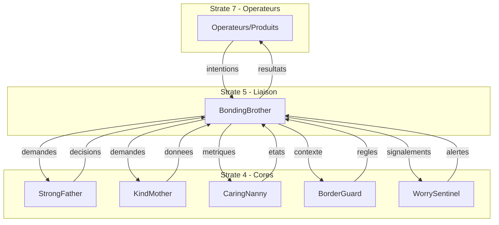

# BondingBrother — Index de Navigation

## Contexte

BondingBrother est la **strate de liaison gouvernée** (Strate 5) du Miyukini Core System. Il incarne la capacité conceptuelle du système à permettre aux entités hétérogènes de communiquer sans jamais se comprendre implicitement.

BondingBrother représente le **frère aîné** de la famille Miyukini : il ne détient aucune autorité, mais il connaît les règles de la famille, il traduit entre les langages des produits et des autorités, il garantit que chaque interaction respecte l'ordre familial.

**Strate :** 5 (Liaison)  
**Rôle :** Médiation, traduction, filtrage entre produits et autorités  
**Terminologie officielle :** [Miyukini Conceptual References - Glossaire](../../reference/Miyukini%20Conceptual%20References%20-%20Glossaire.md)

---

## Question fondamentale

> **"Comment deux entités qui n'ont pas le droit de se connaître peuvent-elles échanger ?"**

Cette question se décline en :
- Comment traduire les intentions des produits pour les autorités ?
- Comment filtrer les réponses des autorités pour les produits ?
- Comment garantir la traçabilité de chaque interaction ?
- Comment fonctionner même en mode offline ?

---

## Structure de la documentation

### Foundation

Documents fondateurs définissant l'identité et le rôle de BondingBrother.

| Document | Description |
|----------|-------------|
| [Documentation Fondatrice](./foundation/BondingBrother%20-%20Documentation%20Fondatrice.md) | Définition conceptuelle, rôle, positionnement, invariants fondamentaux |

---

### Architecture

Documentation architecturale.

| Document | Description |
|----------|-------------|
| [Architecture & Flows](./architecture/BondingBrother%20-%20Architecture%20&%20Flows.md) | Architecture en couches, composants, flux de données, rôles internes |
| [Core Interaction Contract](./architecture/BondingBrother%20-%20Core%20Interaction%20Contract.md) | Modèle d'interaction avec les autres cores |

---

### Contracts

Contrats FONDATION normatifs et non négociables.

#### Intent

| Document | Description |
|----------|-------------|
| [Intent Model Contract](./contracts/intent/BondingBrother%20-%20Intent%20Model%20Contract.md) | Structure, types et cycle de vie des intentions |
| [Translation Contract](./contracts/intent/BondingBrother%20-%20Translation%20Contract.md) | Règles de traduction intention ↔ demande |
| [Filtering & Projection Contract](./contracts/intent/BondingBrother%20-%20Filtering%20&%20Projection%20Contract.md) | Règles de filtrage et projection des données |

#### Flows

| Document | Description |
|----------|-------------|
| [Bilateral Flow Contract](./contracts/flows/BondingBrother%20-%20Bilateral%20Flow%20Contract.md) | Vue d'ensemble des flux bidirectionnels |
| [Product-to-Ecosystem Flow](./contracts/flows/BondingBrother%20-%20Product-to-Ecosystem%20Flow.md) | Flux détaillé Produit → Écosystème |
| [Ecosystem-to-Product Flow](./contracts/flows/BondingBrother%20-%20Ecosystem-to-Product%20Flow.md) | Flux détaillé Écosystème → Produit |

#### Authority

| Document | Description |
|----------|-------------|
| [Authority Delegation Contract](./contracts/authority/BondingBrother%20-%20Authority%20Delegation%20Contract.md) | Règles de délégation aux autorités |

#### Integration

| Document | Description |
|----------|-------------|
| [KindMother Integration Contract](./contracts/integration/BondingBrother%20-%20KindMother%20Integration%20Contract.md) | Interface et protocole avec KindMother |
| [StrongFather Integration Contract](./contracts/integration/BondingBrother%20-%20StrongFather%20Integration%20Contract.md) | Interface et protocole avec StrongFather |

#### Product

| Document | Description |
|----------|-------------|
| [Product Interface Contract](./contracts/product/BondingBrother%20-%20Product%20Interface%20Contract.md) | Contrat d'interface stable pour les produits |
| [Product Adaptation Rules](./contracts/product/BondingBrother%20-%20Product%20Adaptation%20Rules.md) | Règles d'adaptation des produits à BB |
| [Extension & Specialization Contract](./contracts/product/BondingBrother%20-%20Extension%20&%20Specialization%20Contract.md) | Mécanisme d'extension par spécialisation |

#### Offline

| Document | Description |
|----------|-------------|
| [Offline & Deferred Authority Contract](./contracts/offline/BondingBrother%20-%20Offline%20&%20Deferred%20Authority%20Contract.md) | Mode déconnecté et autorité différée |
| [Journaling Contract](./contracts/offline/BondingBrother%20-%20Journaling%20Contract.md) | Journalisation systématique des intentions |
| [Sync & Reconnection Contract](./contracts/offline/BondingBrother%20-%20Sync%20&%20Reconnection%20Contract.md) | Synchronisation à la reconnexion |

#### Governance

| Document | Description |
|----------|-------------|
| [Audit & Traceability Contract](./contracts/governance/BondingBrother%20-%20Audit%20&%20Traceability%20Contract.md) | Auditabilité complète des interactions |
| [Responsibility Model Contract](./contracts/governance/BondingBrother%20-%20Responsibility%20Model%20Contract.md) | Attribution des responsabilités |
| [Invariants & Guarantees](./contracts/governance/BondingBrother%20-%20Invariants%20&%20Guarantees.md) | Invariants techniques non négociables |
| [Violations & Anti-Patterns](./contracts/governance/BondingBrother%20-%20Violations%20&%20Anti-Patterns.md) | Ce que BB ne doit JAMAIS faire |

#### Error

| Document | Description |
|----------|-------------|
| [Error & Rejection Model](./contracts/error/BondingBrother%20-%20Error%20&%20Rejection%20Model.md) | Modèle de gestion des erreurs et rejets |

#### Security

| Document | Description |
|----------|-------------|
| [Security & Threat Model Contract](./contracts/security/BondingBrother%20-%20Security%20&%20Threat%20Model%20Contract.md) | Modèle de menace et contre-mesures |

#### Performance

| Document | Description |
|----------|-------------|
| [Performance & Scalability Contract](./contracts/performance/BondingBrother%20-%20Performance%20&%20Scalability%20Contract.md) | Contraintes de performance |

#### Evolution

| Document | Description |
|----------|-------------|
| [Versioning & Evolution Contract](./contracts/evolution/BondingBrother%20-%20Versioning%20&%20Evolution%20Contract.md) | Règles de versionnement |
| [Migration & Compatibility Contract](./contracts/evolution/BondingBrother%20-%20Migration%20&%20Compatibility%20Contract.md) | Règles de migration et rétrocompatibilité |

#### Testing

| Document | Description |
|----------|-------------|
| [Testing & Validation Contract](./contracts/testing/BondingBrother%20-%20Testing%20&%20Validation%20Contract.md) | Contrat de test et validation |

---

### Implementation

Guides d'implémentation.

| Document | Description |
|----------|-------------|
| [Reference Implementation Guidelines](./implementation/BondingBrother%20-%20Reference%20Implementation%20Guidelines.md) | Guidelines d'implémentation de référence |

---

### Reference

Documentation de référence et exemples.

| Document | Description |
|----------|-------------|
| [Vocabulary & Glossary](./reference/BondingBrother%20-%20Vocabulary%20&%20Glossary.md) | Vocabulaire canonique de BondingBrother |
| [FAQ & Common Questions](./reference/BondingBrother%20-%20FAQ%20&%20Common%20Questions.md) | Questions fréquentes |
| [Examples & Use Cases](./reference/BondingBrother%20-%20Examples%20&%20Use%20Cases.md) | Exemples et cas d'usage |

---

## Invariants clés

| Invariant | Description |
|-----------|-------------|
| **INV-BB-1** | BondingBrother ne devient jamais une autorité |
| **INV-BB-2** | BondingBrother n'exécute jamais |
| **INV-BB-3** | BondingBrother ne stocke jamais la vérité |
| **INV-BB-4** | BondingBrother ne permet jamais de contourner les autorités |
| **INV-BB-5** | BondingBrother ne modifie jamais les décisions |
| **INV-BB-6** | BondingBrother ne cache jamais l'origine |
| **INV-BB-7** | BondingBrother traduit, filtre, transmet — jamais plus |

---

## Interdictions

| Code | Interdiction |
|------|--------------|
| **INTERD-BB-1** | BondingBrother ne peut pas décider à la place d'une autorité |
| **INTERD-BB-2** | BondingBrother ne peut pas persister d'état métier |
| **INTERD-BB-3** | BondingBrother ne peut pas enrichir les intentions avec de la logique métier |
| **INTERD-BB-4** | BondingBrother ne peut pas modifier les décisions des autorités |
| **INTERD-BB-5** | BondingBrother ne peut pas exposer les détails internes des autorités |
| **INTERD-BB-6** | BondingBrother ne peut pas cacher l'origine des intentions |

---

## Relations avec les autres Cores

| Core | Relation |
|------|----------|
| **StrongFather** | Délégation — BB transmet les demandes de décision, reçoit les mandats |
| **KindMother** | Délégation — BB transmet les demandes de données, reçoit les résultats |
| **CaringNanny** | Observation — BB expose ses métriques, reçoit les alertes d'état |
| **MasterButler** | Découverte — BB interroge le registre des capacités |
| **BorderGuard** | Contexte — BB reçoit les règles de frontière à appliquer |
| **WorrySentinel** | Sécurité — BB signale les anomalies, adapte son filtrage |

### Diagramme de relations

---

## Conformité aux Lois d'Autonomie Système

BondingBrother est **stratégique pour la fédération** selon les [Lois d'Autonomie Système](../../reference/Miyukini%20Conceptual%20References%20-%20Lois%20Autonomie%20Systeme.md) :

| Loi | Conformité | Note |
|-----|------------|------|
| **LOI-1** | ✅ | Mode offline avec buffer des intentions |
| **LOI-2** | ✅ | Isolement accepté comme état normal |
| **LOI-3** | ✅ | Intentions buffées localement souveraines |
| **LOI-4** | ✅ | Horloges logiques pour échanges fédérés |
| **LOI-5** | ✅ | Médiateur léger sans état massif |
| **LOI-6** | ✅ Rôle stratégique | Pont de synchronisation fédération |

---

## Concepts clés

| Concept | Description |
|---------|-------------|
| **Intention** | Déclaration de volonté d'un produit, pas une instruction |
| **Demande** | Intention traduite dans le vocabulaire de l'autorité |
| **Résultat** | Réponse de l'autorité traduite pour le produit |
| **Traduction** | Transformation préservant la sémantique |
| **Filtrage** | Suppression des informations non autorisées |
| **Délégation** | Transmission à une autorité pour décision |
| **Journalisation** | Enregistrement traçable de toute interaction |

---

## Phrase fondatrice

> **BondingBrother est l'interface fraternelle standard qui relie les produits autonomes à l'écosystème autoritaire, traduisant les intentions en demandes et les réponses en résultats, sans jamais devenir une autorité lui-même.**

---

## Documents de référence

- [Miyukini Conceptual References - Glossaire](../../reference/Miyukini%20Conceptual%20References%20-%20Glossaire.md)
- [Miyukini Conceptual References - Lois Autonomie Systeme](../../reference/Miyukini%20Conceptual%20References%20-%20Lois%20Autonomie%20Systeme.md)
- [Miyukini Conceptual References - Pyramide Architecture Complete](../../reference/Miyukini%20Conceptual%20References%20-%20Pyramide%20Architecture%20Complete.md)
- [Miyukini Conceptual References - Connexion Inter-COG](../../reference/Miyukini%20Conceptual%20References%20-%20Connexion%20Inter-COG.md)

---

## Gel et Versionnement

| Document | Description |
|----------|-------------|
| [Gel et Versionnement v2.0.0](./BondingBrother%20-%20Gel%20et%20Versionnement%20v2.0.0.md) | Acte de gel officiel de la documentation v2.0.0 |
| [Audit Phase 3 Verification](./BondingBrother%20-%20Audit%20Phase%203%20Verification.md) | Audit de vérification Phase 3 v2.0.0 |

---

**Date de création :** 2026-01-28  
**Version :** 2.0.0  
**Statut :** GELÉ — Documentation de référence
