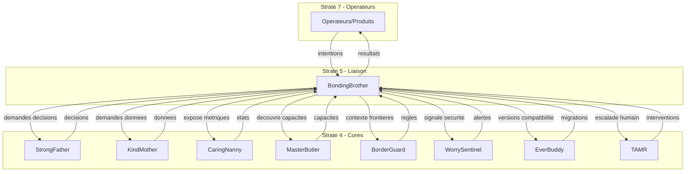

# BondingBrother — Core Interaction Contract

**Version :** 2.0  
**Date :** 2026-01-28  
**Statut :** CONTRAT — Normatif

---

## 1. Contexte

Ce document définit le **modèle d'interaction** entre Bonding Brother et les autres cores de l'écosystème Miyukini. Il spécifie comment Bonding Brother communique avec chaque core, les protocoles utilisés, et les garanties contractuelles de ces interactions.

**Dépendances :**
- [Documentation Fondatrice](../foundation/BondingBrother%20-%20Documentation%20Fondatrice.md)
- [Architecture & Flows](./BondingBrother%20-%20Architecture%20&%20Flows.md)
- [Miyukini Conceptual References - Connexion Inter-COG](../../../reference/Miyukini%20Conceptual%20References%20-%20Connexion%20Inter-COG.md)

## 2. Portée / Scope

Ce document couvre :
- Le modèle d'interaction avec chaque core
- Les protocoles de communication
- Les garanties contractuelles
- Les flux d'information entre cores
- Les règles de priorité et de routage

Ce document **ne couvre pas** :
- Les détails d'implémentation des adaptateurs (voir Architecture & Flows)
- Les contrats d'intégration spécifiques (voir `contracts/integration/`)
- Les règles métier des cores individuels

---

## 3. Principe fondamental

> **Bonding Brother est le seul point de passage autorisé entre les produits et les cores.**

Aucun produit, aucun opérateur, aucune interface ne peut accéder directement aux cores. Toute interaction passe obligatoirement par Bonding Brother, qui traduit, filtre, journalise et transmet.

---

## 4. Cartographie des interactions

### 4.1 Diagramme de relations



### 4.2 Matrice des interactions

| Core | Direction | Type d'échange | Fréquence |
|------|-----------|----------------|-----------|
| **StrongFather** | BB → SF | Demandes de décision | Haute |
| **StrongFather** | SF → BB | Décisions, mandats | Haute |
| **KindMother** | BB → KM | Demandes données | Haute |
| **KindMother** | KM → BB | Données, confirmations | Haute |
| **CaringNanny** | BB → CN | Métriques, états | Moyenne |
| **CaringNanny** | CN → BB | Alertes d'état | Basse |
| **MasterButler** | BB → MB | Découverte capacités | Basse |
| **MasterButler** | MB → BB | Catalogue capacités | Basse |
| **BorderGuard** | BB → BG | Contexte frontière | Moyenne |
| **BorderGuard** | BG → BB | Règles franchissement | Moyenne |
| **WorrySentinel** | BB → WS | Signalements sécurité | Basse |
| **WorrySentinel** | WS → BB | Alertes, niveaux | Moyenne |
| **EverBuddy** | BB → EB | Vérification version | Basse |
| **EverBuddy** | EB → BB | Compatibilité, migrations | Basse |
| **TAMR** | BB → TAMR | Escalade humain | Rare |
| **TAMR** | TAMR → BB | Décisions humaines | Rare |

---

## 5. Interaction avec StrongFather

### 5.1 Rôle de l'interaction

StrongFather est l'**autorité de décision stratégique**. Bonding Brother lui transmet les demandes nécessitant une décision d'autorisation, de validation, ou de politique.

### 5.2 Types de demandes

| Type | Description | Exemple |
|------|-------------|---------|
| **Demande d'autorisation** | Vérifier si une action est permise | "L'opérateur X peut-il accéder à Y ?" |
| **Demande de mandat** | Obtenir un mandat de permission | "Mandat pour équipe d'opérateurs" |
| **Demande de validation** | Valider une intention complexe | "Cette intention respecte-t-elle les règles ?" |
| **Notification de contexte** | Informer d'un contexte de décision | "Contexte de sécurité pour décision" |

### 5.3 Protocole

```
BB → SF : IntentionDécision {
    intention_id: string,
    operateur_source: string,
    type_decision: enum,
    contexte: ContexteComplet,
    timestamp: LogicalClock
}

SF → BB : DécisionRésultat {
    intention_id: string,
    decision: enum (AUTORISÉ | REFUSÉ | CONDITIONNEL),
    mandat?: Mandat,
    justification: string,
    validité: Duration
}
```

### 5.4 Garanties

| Garantie | Description |
|----------|-------------|
| **INTER-SF-1** | Toute décision SF est transmise fidèlement sans modification |
| **INTER-SF-2** | Le contexte transmis est complet et non altéré |
| **INTER-SF-3** | Les mandats sont stockés temporairement mais jamais interprétés |
| **INTER-SF-4** | Les refus sont journalisés avec justification |

---

## 6. Interaction avec KindMother

### 6.1 Rôle de l'interaction

KindMother est l'**autorité des données**. Bonding Brother lui transmet les demandes de lecture, d'écriture, et de synchronisation de données.

### 6.2 Types de demandes

| Type | Description | Exemple |
|------|-------------|---------|
| **Lecture** | Récupérer des données | "Lire le contenu X" |
| **Écriture** | Persister des données | "Créer le contenu Y" |
| **Synchronisation** | Synchroniser des états | "Sync après reconnexion" |
| **Validation** | Vérifier cohérence données | "Ces données sont-elles valides ?" |

### 6.3 Protocole

```
BB → KM : IntentionDonnées {
    intention_id: string,
    type_operation: enum (READ | WRITE | SYNC),
    cible: ResourceIdentifier,
    données?: Payload,
    contexte: ContexteComplet
}

KM → BB : RésultatDonnées {
    intention_id: string,
    statut: enum (SUCCESS | FAILURE | PARTIAL),
    données?: Payload,
    erreur?: Erreur,
    metadata: MetadataRésultat
}
```

### 6.4 Garanties

| Garantie | Description |
|----------|-------------|
| **INTER-KM-1** | Les données retournées sont filtrées selon les permissions |
| **INTER-KM-2** | Les écritures sont validées par SF avant transmission |
| **INTER-KM-3** | Les erreurs KM sont traduites en erreurs produit |
| **INTER-KM-4** | Les métadonnées internes KM ne sont jamais exposées |

---

## 7. Interaction avec CaringNanny

### 7.1 Rôle de l'interaction

CaringNanny est l'**observateur d'état**. Bonding Brother lui expose ses métriques et reçoit les alertes d'état système.

### 7.2 Types d'échanges

| Type | Direction | Description |
|------|-----------|-------------|
| **Métriques BB** | BB → CN | Statistiques de fonctionnement |
| **État de santé** | BB → CN | Santé des connexions aux autorités |
| **Alertes système** | CN → BB | Changements d'état global |
| **Dégradation** | CN → BB | Notification de mode dégradé |

### 7.3 Garanties

| Garantie | Description |
|----------|-------------|
| **INTER-CN-1** | Les métriques sont exposées en lecture seule |
| **INTER-CN-2** | Les alertes CN sont propagées aux produits concernés |
| **INTER-CN-3** | BB adapte son comportement selon l'état CN |

---

## 8. Interaction avec BorderGuard

### 8.1 Rôle de l'interaction

BorderGuard **définit les frontières et les règles de franchissement**. Bonding Brother l'interroge pour connaître le contexte de frontière et les règles applicables.

### 8.2 Types d'échanges

| Type | Direction | Description |
|------|-----------|-------------|
| **Contexte frontière** | BB → BG | "Quelle est la frontière pour cette source ?" |
| **Règles franchissement** | BG → BB | Règles à appliquer pour le franchissement |
| **Classification confiance** | BG → BB | Niveau de confiance de la source |

### 8.3 Garanties

| Garantie | Description |
|----------|-------------|
| **INTER-BG-1** | BB applique les règles BG sans les modifier |
| **INTER-BG-2** | BG ne filtre pas — il définit les règles, BB les applique |
| **INTER-BG-3** | Le contexte de frontière accompagne toute demande aux autorités |

---

## 9. Interaction avec WorrySentinel

### 9.1 Rôle de l'interaction

WorrySentinel **gouverne la sécurité**. Bonding Brother lui signale les anomalies et reçoit les alertes de sécurité.

### 9.2 Types d'échanges

| Type | Direction | Description |
|------|-----------|-------------|
| **Signalement** | BB → WS | Anomalie détectée (pattern suspect, etc.) |
| **Niveau sécurité** | WS → BB | Niveau de sécurité actuel |
| **Alerte** | WS → BB | Alerte de sécurité active |
| **Mode dégradé** | WS → BB | Activation/désactivation mode dégradé |

### 9.3 Garanties

| Garantie | Description |
|----------|-------------|
| **INTER-WS-1** | BB signale tout pattern suspect à WS |
| **INTER-WS-2** | BB adapte son filtrage selon le niveau WS |
| **INTER-WS-3** | Les alertes WS sont prioritaires |

---

## 10. Interaction avec MasterButler

### 10.1 Rôle de l'interaction

MasterButler est le **registre des capacités**. Bonding Brother l'interroge pour découvrir les capacités disponibles.

### 10.2 Types d'échanges

| Type | Direction | Description |
|------|-----------|-------------|
| **Découverte** | BB → MB | "Quelles capacités existent ?" |
| **Catalogue** | MB → BB | Liste des capacités et permissions |
| **Résolution** | BB → MB | "Cette capacité est-elle disponible ?" |

### 10.3 Garanties

| Garantie | Description |
|----------|-------------|
| **INTER-MB-1** | BB ne cache pas les capacités MB |
| **INTER-MB-2** | La découverte est toujours à jour |

---

## 11. Interaction avec EverBuddy

### 11.1 Rôle de l'interaction

EverBuddy **gouverne le cycle de vie et l'évolution**. Bonding Brother l'interroge pour vérifier la compatibilité des versions.

### 11.2 Types d'échanges

| Type | Direction | Description |
|------|-----------|-------------|
| **Vérification version** | BB → EB | "Cette version est-elle compatible ?" |
| **Migration** | EB → BB | Instructions de migration |
| **Dépréciation** | EB → BB | Notification de dépréciation |

### 11.3 Garanties

| Garantie | Description |
|----------|-------------|
| **INTER-EB-1** | BB respecte les règles de compatibilité EB |
| **INTER-EB-2** | Les migrations sont propagées aux produits |

---

## 12. Interaction avec TAMR

### 12.1 Rôle de l'interaction

TAMR **définit les points d'intervention humaine**. Bonding Brother l'utilise pour escalader vers un humain quand nécessaire.

### 12.2 Types d'échanges

| Type | Direction | Description |
|------|-----------|-------------|
| **Escalade** | BB → TAMR | "Intervention humaine requise" |
| **Décision humaine** | TAMR → BB | Décision après intervention |
| **Timeout** | TAMR → BB | Timeout d'intervention |

### 12.3 Garanties

| Garantie | Description |
|----------|-------------|
| **INTER-TAMR-1** | Les escalades sont traçables et justifiées |
| **INTER-TAMR-2** | Les décisions humaines sont journalisées |
| **INTER-TAMR-3** | Un timeout déclenche un comportement par défaut |

---

## 13. Règles de routage

### 13.1 Ordre de consultation

Pour une intention typique, l'ordre de consultation des cores est :

1. **BorderGuard** — Contexte de frontière
2. **WorrySentinel** — Niveau de sécurité
3. **StrongFather** — Décision d'autorisation
4. **KindMother** — Accès aux données
5. **CaringNanny** — Notification de l'état

### 13.2 Règles de priorité

| Priorité | Core | Raison |
|----------|------|--------|
| 1 | WorrySentinel | Sécurité prime sur tout |
| 2 | StrongFather | Décision avant action |
| 3 | BorderGuard | Frontières avant données |
| 4 | KindMother | Données après autorisation |
| 5 | CaringNanny | Observation passive |
| 6 | MasterButler | Découverte à la demande |
| 7 | EverBuddy | Vérification rare |
| 8 | TAMR | Escalade exceptionnelle |

### 13.3 Court-circuits

| Condition | Court-circuit |
|-----------|---------------|
| WorrySentinel en alerte critique | Rejet immédiat, pas de consultation SF/KM |
| BorderGuard refuse le franchissement | Rejet immédiat, pas de consultation SF |
| StrongFather refuse | Rejet, pas de consultation KM |
| Mode offline | Buffer local, pas de consultation distante |

---

## 14. Gestion des erreurs inter-cores

### 14.1 Types d'erreurs

| Type | Description | Action |
|------|-------------|--------|
| **Timeout** | Core ne répond pas | Retry puis dégradation |
| **Rejet** | Core refuse la demande | Propagation au produit |
| **Incohérence** | Réponse incohérente | Journalisation + escalade |
| **Indisponibilité** | Core indisponible | Mode offline ou dégradé |

### 14.2 Stratégie de retry

| Core | Retry max | Délai entre retry |
|------|-----------|-------------------|
| StrongFather | 3 | 100ms, 500ms, 2s |
| KindMother | 3 | 100ms, 500ms, 2s |
| Autres | 1 | 500ms |

---

## 15. Statut contractuel

Ce document est **contractuel, normatif, et de statut CONTRAT**. Il établit les règles d'interaction entre Bonding Brother et les autres cores qui doivent être respectées par toute implémentation.

---

## Navigation

- [Index BondingBrother](../_index.md)
- [Documentation Fondatrice](../foundation/BondingBrother%20-%20Documentation%20Fondatrice.md)
- [Architecture & Flows](./BondingBrother%20-%20Architecture%20&%20Flows.md)
- [KindMother Integration Contract](../contracts/integration/BondingBrother%20-%20KindMother%20Integration%20Contract.md)
- [StrongFather Integration Contract](../contracts/integration/BondingBrother%20-%20StrongFather%20Integration%20Contract.md)

---

**Version :** 2.0  
**Date :** 2026-01-28  
**Statut :** CONTRAT — Normatif  
**Dépendances :** Documentation Fondatrice v2.0, Architecture & Flows v2.0
