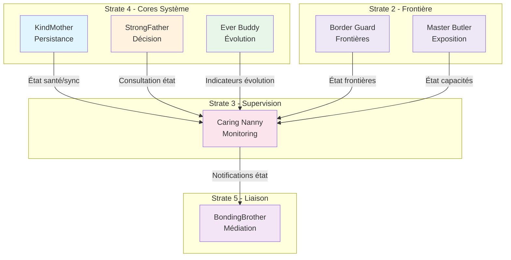

# Caring Nanny — Index de Navigation

## Contexte

Caring Nanny est le **core d'observation d'état** (Strate 4) du Miyukini Core System. Il incarne la capacité conceptuelle du système à observer, détecter, classer et propager les états du système, sans jamais modifier, décider ou exécuter.

Caring Nanny représente la **nounou attentive** du système : elle observe ce qui se passe, détecte les anomalies, et informe ceux qui ont l'autorité d'agir, garantissant que chaque composant dispose d'une vision cohérente et traçable de l'état du système.

**Strate :** 4 (Cores Système)  
**Rôle :** Observation d'état  
**Terminologie officielle :** [Miyukini Conceptual References - Glossaire](../../reference/Miyukini%20Conceptual%20References%20-%20Glossaire.md)

---

## Structure de la documentation

### Foundation

Documents fondateurs définissant l'identité et le rôle de Caring Nanny.

| Document | Description |
|----------|-------------|
| [Documentation Fondatrice](./foundation/Caring%20Nanny%20-%20Documentation%20Fondatrice.md) | Définition conceptuelle, rôle, positionnement, invariants fondamentaux |

---

### Architecture

Documentation architecturale.

| Document | Description |
|----------|-------------|
| [Architecture et Composants](./architecture/Caring%20Nanny%20-%20Architecture%20et%20Composants.md) | Architecture interne, composants, flux d'observation |

---

### Contracts

Contrats FONDATION normatifs et non négociables.

#### Integration

| Document | Description |
|----------|-------------|
| *KindMother Integration Contract* | Relation d'observation avec KindMother (à créer) |
| *StrongFather Integration Contract* | Relation d'information avec StrongFather (à créer) |
| *BondingBrother Integration Contract* | Collaboration pour la propagation des états (à créer) |

#### Observability

| Document | Description |
|----------|-------------|
| *State Model Contract* | Modèle formel des états (à créer) |
| *Observation Flow Contract* | Flux d'observation : détection → évaluation → agrégation → transition (à créer) |
| *Propagation Flow Contract* | Flux de propagation : changement → destinataires → message → dispatch (à créer) |

#### Governance

| Document | Description |
|----------|-------------|
| [Invariants et Garanties](./contracts/governance/Caring%20Nanny%20-%20Invariants%20et%20Garanties.md) | Catalogue consolidé des invariants INV-CN-1 à INV-CN-7 |
| *Violations & Anti-Patterns* | Violations cataloguées, anti-patterns (à créer) |
| *Error & Rejection Model* | Modèle d'erreur et de rejet (à créer) |

#### Lifecycle

| Document | Description |
|----------|-------------|
| *Performance & Scalability Contract* | Garanties de performance (à créer) |
| *Testing & Validation Contract* | Stratégie de test et validation (à créer) |
| *Versioning & Evolution Contract* | Règles d'évolution et compatibilité (à créer) |

---

### Implementation

Guides d'implémentation.

| Document | Description |
|----------|-------------|
| *Reference Implementation Guidelines* | Guidelines d'implémentation de référence (à créer) |

---

### Reference

Documentation de référence et exemples.

| Document | Description |
|----------|-------------|
| [Glossaire et Terminologie](./reference/Caring%20Nanny%20-%20Glossaire%20et%20Terminologie.md) | Vocabulaire canonique de Caring Nanny |
| *FAQ & Common Questions* | Questions fréquentes (à créer) |
| *Examples & Use Cases* | Exemples et cas d'usage (à créer) |

---

## Invariants clés

| Invariant | Description |
|-----------|-------------|
| **INV-CN-1** | Observateur pur — Caring Nanny observe et rapporte, elle ne modifie jamais |
| **INV-CN-2** | Aucune capacité d'exécution — Ne peut déclencher d'action, ni directement ni indirectement |
| **INV-CN-3** | Non-autoritaire — Ne détient aucune autorité sur aucun aspect du système |
| **INV-CN-4** | État cohérent — L'état rapporté est toujours cohérent, sans contradiction |
| **INV-CN-5** | Traçabilité complète — Chaque observation et transition est traçable |
| **INV-CN-6** | Non-bloquant — N'interfère jamais avec le fonctionnement normal du système |
| **INV-CN-7** | Propagation fidèle — Propage les changements d'état sans modification |

---

## Interdictions

| Code | Interdiction |
|------|--------------|
| **INTERD-CN-1** | Caring Nanny ne peut pas modifier de données |
| **INTERD-CN-2** | Caring Nanny ne peut pas prendre de décisions |
| **INTERD-CN-3** | Caring Nanny ne peut pas exécuter d'actions correctives |
| **INTERD-CN-4** | Caring Nanny ne peut pas médiatiser les intentions |
| **INTERD-CN-5** | Caring Nanny ne peut pas valider ou invalider des opérations |
| **INTERD-CN-6** | Caring Nanny ne peut pas définir de règles de classification |

---

## États système

| État | Description |
|------|-------------|
| **healthy** | Tous les composants fonctionnent normalement, aucune anomalie détectée |
| **degraded** | Certains composants fonctionnent en mode dégradé, le système reste opérationnel |
| **offline** | Le système fonctionne en mode déconnecté, sans accès aux autorités centrales |
| **syncing** | Une synchronisation est en cours, certaines opérations peuvent être différées |
| **error** | Une erreur critique a été détectée, certaines opérations ne sont pas possibles |

---

## Relations avec les autres Cores

| Core | Relation |
|------|----------|
| **KindMother** | Observation — Caring Nanny observe l'état de santé, de synchronisation et de disponibilité |
| **StrongFather** | Information — Caring Nanny informe StrongFather de l'état pour enrichir le contexte des décisions |
| **BondingBrother** | Collaboration — Caring Nanny fournit les notifications de changement d'état pour propagation |
| **Ever Buddy** | Réception — Caring Nanny reçoit les indicateurs d'évolution d'Ever Buddy |
| **Border Guard** | Observation — Caring Nanny observe l'état des frontières et des validations |
| **Master Butler** | Observation — Caring Nanny observe l'état des capacités exposées |

### Diagramme de relations

---

## Conformité aux Lois d'Autonomie Système

Caring Nanny est **entièrement conforme** aux [Lois d'Autonomie Système](../../reference/Miyukini%20Conceptual%20References%20-%20Lois%20Autonomie%20Systeme.md) :

| Loi | Conformité | Note |
|-----|------------|------|
| **LOI-1** | ✅ | Registre d'états local, règles de classification statiques |
| **LOI-2** | ✅ | Transitions observées localement sans dépendance externe |
| **LOI-3** | ✅ | Historique d'observations local immuable (INV-CN-5) |
| **LOI-4** | ✅ | États discrets, pas de temps global |
| **LOI-5** | ✅ | Observation pure, pas d'exécution — impact nul (INV-CN-6) |
| **LOI-6** | ✅ | Propagation via BondingBrother optionnelle |

---

## Concepts clés

| Concept | Description |
|---------|-------------|
| **État système** | Condition globale du MCS à un instant donné, agrégé des états partiels |
| **État applicatif** | Condition d'un module ou composant spécifique |
| **Transition** | Passage observable d'un état à un autre |
| **Condition** | Fait observable qui peut influencer l'état |
| **Propagation** | Communication d'un changement d'état aux composants concernés |
| **Observation** | Détection passive et enregistrement d'un fait |
| **Anomalie** | Condition qui s'écarte du comportement attendu |

---

## Phrase fondatrice

> **Caring Nanny est la nounou attentive qui observe, détecte, classe et propage les états du système, garantissant que chaque composant dispose d'une vision cohérente, traçable et non contradictoire de ce qui se passe, sans jamais modifier, décider ou exécuter.**

---

**Date de création :** 2026-01-27  
**Version :** 1.0  
**Statut :** Index de navigation
