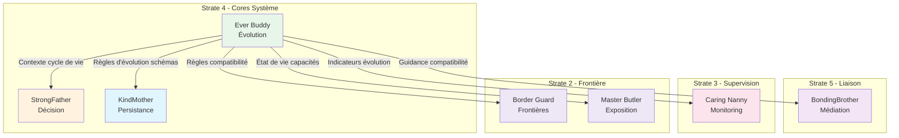

# Ever Buddy — Index de Navigation

## Contexte

Ever Buddy est le **core de cycle de vie et d'évolution** du Miyukini Core System. Il incarne la capacité conceptuelle du système à gouverner l'évolution des structures, des contrats, et des entités dans le temps, sans jamais exécuter de migration technique ou modifier directement les données.

Ever Buddy représente la **conscience temporelle** du système : il observe ce qui a été, ce qui est, et ce qui sera, garantissant que chaque évolution respecte les principes de continuité, de compatibilité, et de traçabilité.

**Strate :** 4 (Cores Système)  
**Rôle :** Cycle de vie et évolution  
**Terminologie officielle :** [Miyukini Conceptual References - Glossaire](../../reference/Miyukini%20Conceptual%20References%20-%20Glossaire.md)

---

## Structure de la documentation

### Foundation

Documents fondateurs définissant l'identité et le rôle d'Ever Buddy.

| Document | Description |
|----------|-------------|
| [Documentation Fondatrice](./foundation/Ever%20Buddy%20-%20Documentation%20Fondatrice.md) | Définition conceptuelle, rôle, positionnement, invariants fondamentaux |

---

### Contracts

Contrats FONDATION normatifs et non négociables.

#### Lifecycle

| Document | Description |
|----------|-------------|
| [Lifecycle States Contract](./contracts/lifecycle/Ever%20Buddy%20-%20Lifecycle%20States%20Contract.md) | États de cycle de vie : DRAFT, ACTIVE, DEPRECATED, RETIRED, ARCHIVED |
| [Transition Rules Contract](./contracts/lifecycle/Ever%20Buddy%20-%20Transition%20Rules%20Contract.md) | Matrice des transitions valides, périodes minimales |

#### Compatibility

| Document | Description |
|----------|-------------|
| [Compatibility Rules Contract](./contracts/compatibility/Ever%20Buddy%20-%20Compatibility%20Rules%20Contract.md) | Règles de rétrocompatibilité, compatibilité amont, ruptures |
| [Version Semantics Contract](./contracts/compatibility/Ever%20Buddy%20-%20Version%20Semantics%20Contract.md) | Versionnement sémantique : majeur, mineur, correctif |

#### Governance

| Document | Description |
|----------|-------------|
| [Invariants & Guarantees](./contracts/governance/Ever%20Buddy%20-%20Invariants%20&%20Guarantees.md) | Catalogue consolidé des invariants INV-EB-1 à INV-EB-12 |
| [Violations & Anti-Patterns](./contracts/governance/Ever%20Buddy%20-%20Violations%20&%20Anti-Patterns.md) | Violations cataloguées, anti-patterns |

#### Observability

| Document | Description |
|----------|-------------|
| [Debt Tracking Contract](./contracts/observability/Ever%20Buddy%20-%20Debt%20Tracking%20Contract.md) | Surveillance de la dette structurelle, debt ratio, alertes |
| [Metrics & Alerting Contract](./contracts/observability/Ever%20Buddy%20-%20Metrics%20&%20Alerting%20Contract.md) | Métriques d'état, de transition, et d'alerte |

#### Security

| Document | Description |
|----------|-------------|
| [Security Implications Contract](./contracts/security/Ever%20Buddy%20-%20Security%20Implications%20Contract.md) | Responsabilités sécuritaires, protocoles AS-SEC-3, NET-SEC-1, NET-SEC-2, adaptation T0-T4 |

---

### Architecture

Documentation architecturale.

| Document | Description |
|----------|-------------|
| [Core Interaction Contract](./architecture/Ever%20Buddy%20-%20Core%20Interaction%20Contract.md) | Relations avec les autres cores, flux de consultation |
| [Evolution Flows](./architecture/Ever%20Buddy%20-%20Evolution%20Flows.md) | Flux d'observation, de consultation, de planification, d'alerte |

---

### Implementation

Guides d'implémentation.

| Document | Description |
|----------|-------------|
| [Reference Implementation Guidelines](./implementation/Ever%20Buddy%20-%20Reference%20Implementation%20Guidelines.md) | Guidelines d'implémentation de référence |

---

### Reference

Documentation de référence et exemples.

| Document | Description |
|----------|-------------|
| [Evolution Scenarios](./reference/Ever%20Buddy%20-%20Evolution%20Scenarios.md) | Scénarios d'évolution types |
| [Vocabulary & Glossary](./reference/Ever%20Buddy%20-%20Vocabulary%20&%20Glossary.md) | Vocabulaire canonique d'Ever Buddy |
| [FAQ & Common Questions](./reference/Ever%20Buddy%20—%20FAQ%20&%20Common%20Questions.md) | Questions fréquentes |

---

## Invariants clés

| Invariant | Description |
|-----------|-------------|
| **INV-EB-1** | Aucune exécution de migration — Ever Buddy gouverne, il n'exécute pas |
| **INV-EB-2** | Traçabilité complète et immuable — Tout enregistrement est permanent |
| **INV-EB-3** | Aucun état ambigu — Un seul état de cycle de vie par élément |
| **INV-EB-4** | Période de dépréciation obligatoire — Pas de passage direct ACTIVE → RETIRED |
| **INV-EB-5** | Rétrocompatibilité par défaut — Les ruptures sont l'exception |
| **INV-EB-6** | Vision long terme obligatoire — Impact sur au moins deux générations |

---

## Interdictions

| Code | Interdiction |
|------|--------------|
| **INTERD-EB-1** | Ever Buddy ne peut pas exécuter de migrations |
| **INTERD-EB-2** | Ever Buddy ne peut pas modifier les données de KindMother |
| **INTERD-EB-3** | Ever Buddy ne peut pas décider des permissions (domaine de StrongFather) |
| **INTERD-EB-4** | Ever Buddy ne peut pas forcer une évolution sur un produit |

---

## États de cycle de vie

| État | Description |
|------|-------------|
| **DRAFT** | En cours de définition, non utilisable en production |
| **ACTIVE** | En usage normal, stable et supporté |
| **DEPRECATED** | Fonctionnel mais usage découragé, successeur identifié |
| **RETIRED** | Plus activement supporté, corrections critiques uniquement |
| **ARCHIVED** | Non fonctionnel, conservé pour référence historique |

---

## Relations avec les autres Cores

| Core | Relation |
|------|----------|
| **KindMother** | Complémentaire — KindMother gère les données, Ever Buddy gouverne leur évolution |
| **StrongFather** | Consultative — Ever Buddy fournit le contexte de cycle de vie pour les décisions |
| **BondingBrother** | Guidance — Ever Buddy guide les traductions selon les règles de compatibilité |
| **Caring Nanny** | Alimentation — Ever Buddy fournit les indicateurs d'évolution |
| **Border Guard** | Normative — Ever Buddy définit les règles de compatibilité aux frontières |
| **Master Butler** | Descriptive — Ever Buddy fournit l'état de vie des capacités exposées |

### Diagramme de relations

---

## Sécurité

Ever Buddy porte une **responsabilité sécuritaire spécifique** en tant que Gardien de la Continuité. Pour les détails complets, voir le [Security Implications Contract](./contracts/security/Ever%20Buddy%20-%20Security%20Implications%20Contract.md).

### Protocoles de sécurité concernés

| Protocole | Rôle | Description |
|-----------|------|-------------|
| **AS-SEC-3** | Responsable | Revalidation complète à la reconnexion |
| **NET-SEC-1** | Responsable | Handshake de conformité |
| **NET-SEC-2** | Responsable | Mise à jour sécurisée |

### Rôle dans la chaîne de confiance

Ever Buddy est responsable du maillon **STA → OSV** : certification des versions comme Official Secure Version.

### Documentation sécurité associée

| Document | Description |
|----------|-------------|
| [Security - Core Integration Map](../../security/architecture/Security%20-%20Core%20Integration%20Map.md) | Cartographie des responsabilités sécuritaires par Core |
| [Security - Documentation Fondatrice](../../security/foundation/Security%20-%20Documentation%20Fondatrice.md) | Vision opérationnelle de la sécurité |
| [Doctrine Securite Fondamentale](../../reference/Miyukini%20Conceptual%20References%20-%20Doctrine%20Securite%20Fondamentale.md) | Principes fondateurs |

---

## Conformité aux Lois d'Autonomie Système

Ever Buddy est **entièrement conforme** aux [Lois d'Autonomie Système](../../reference/Miyukini%20Conceptual%20References%20-%20Lois%20Autonomie%20Systeme.md) :

| Loi | Conformité | Note |
|-----|------------|------|
| **LOI-1** | ✅ | Registre d'états local, règles statiques |
| **LOI-2** | ✅ | Transitions validées localement sans dépendance externe |
| **LOI-3** | ✅ | Historique immuable local (INV-EB-2) |
| **LOI-4** | ✅ | États discrets et versionnement sémantique, pas de temps global |
| **LOI-5** | ✅ | Observation pure, pas d'exécution — moteur léger |
| **LOI-6** | ✅ | Fédération via BondingBrother optionnelle |

---

## Concepts clés

| Concept | Description |
|---------|-------------|
| **Cycle de vie** | Ensemble des états qu'un élément traverse de sa création à son archivage |
| **Transition** | Passage atomique d'un état de cycle de vie à un autre |
| **Génération** | Version majeure d'un élément ou groupe d'éléments |
| **Coexistence** | Période où plusieurs versions sont simultanément disponibles |
| **Sunset** | Processus planifié de fin de vie d'un élément |
| **Successeur** | Élément qui remplace un élément déprécié |
| **Debt ratio** | Rapport (DEPRECATED + RETIRED) / ACTIVE |
| **Breaking change** | Changement qui rompt la compatibilité |

---

## Phrase fondatrice

> **Ever Buddy est le compagnon de toujours qui observe, enregistre, et guide l'évolution du système, garantissant que chaque changement respecte la continuité, que chaque transition est traçable, et que l'avenir est préparé sans sacrifier le présent.**

---

**Date de création :** 2026-01-27  
**Version :** 1.0  
**Statut :** Index de navigation
