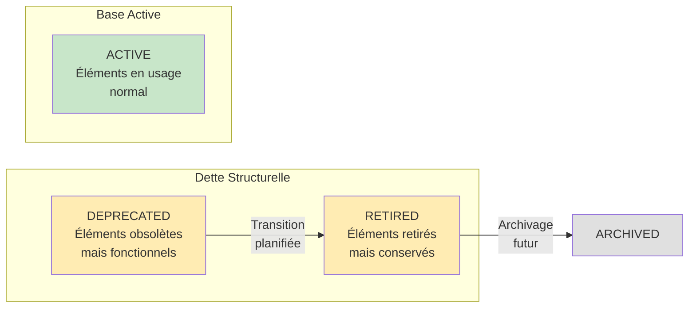
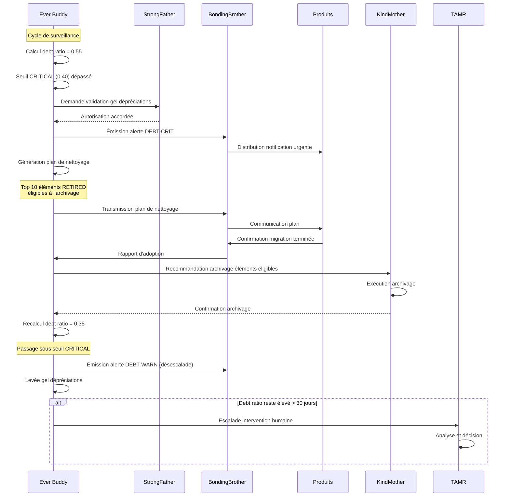

# Ever Buddy — Debt Tracking Contract

## 1. Contexte

Ce document définit le **contrat de surveillance de la dette structurelle** gouverné par Ever Buddy. La dette structurelle est une réalité inévitable de tout système qui évolue : elle représente l'ensemble des éléments obsolètes ou en fin de vie qui persistent pour assurer la continuité.

Ever Buddy est **exclusivement responsable** de la surveillance de cette dette. Il ne l'élimine pas, il ne la corrige pas — il l'observe, la mesure, et alerte quand elle devient excessive.

**Document de référence :** [Ever Buddy - Documentation Fondatrice](../../foundation/Ever%20Buddy%20-%20Documentation%20Fondatrice.md)  
**Terminologie officielle :** [Miyukini Conceptual References - Glossaire](../../../../reference/Miyukini%20Conceptual%20References%20-%20Glossaire.md)

---

## 2. Portée / Scope

### Ce que ce contrat couvre

- Définition de la dette structurelle
- Métriques de surveillance de la dette
- Seuils d'alerte et niveaux de gravité
- Processus de détection et d'alerte
- Actions de nettoyage recommandées
- Conformité aux invariants d'Ever Buddy

### Ce que ce contrat ne couvre PAS

- L'exécution des nettoyages (responsabilité des produits et de KindMother)
- Les stratégies de migration technique (hors périmètre Ever Buddy)
- Les décisions d'archivage forcé (Ever Buddy recommande, il ne force pas)
- Les métriques de performance technique (domaine de Caring Nanny)

---

## 3. Définition de la dette structurelle

### 3.1 Qu'est-ce que la dette structurelle ?

La **dette structurelle** est l'ensemble des éléments en état **DEPRECATED** ou **RETIRED** qui persistent dans le système. Cette dette n'est pas nécessairement négative — elle est le **prix de la continuité**.



### 3.2 Pourquoi la dette existe

La dette structurelle existe parce que :

| Raison | Explication |
|--------|-------------|
| **Continuité** | Les consommateurs existants ont besoin de temps pour migrer |
| **Compatibilité** | Les versions antérieures doivent rester accessibles pendant la transition |
| **Traçabilité** | L'historique des évolutions doit être conservé |
| **Prudence** | Les transitions brutales créent des ruptures inacceptables |

### 3.3 Quand la dette devient problématique

La dette devient problématique quand elle :

| Symptôme | Description |
|----------|-------------|
| **Accumulation** | Le ratio dette/actif dépasse les seuils acceptables |
| **Stagnation** | Les éléments DEPRECATED ne transitionnent pas vers RETIRED |
| **Blocage** | Les consommateurs ne migrent pas malgré les alertes |
| **Incompréhension** | La multiplication des versions crée de la confusion |
| **Coût** | La maintenance des éléments obsolètes consomme des ressources excessives |

---

## 4. Métriques de surveillance

### 4.1 Debt Ratio — Métrique principale

Le **debt ratio** est la métrique centrale de surveillance de la dette structurelle.

```
Debt Ratio = (Nombre d'éléments DEPRECATED + Nombre d'éléments RETIRED) / Nombre d'éléments ACTIVE
```

**Interprétation :**

| Debt Ratio | Interprétation | Action |
|------------|----------------|--------|
| **0.00 - 0.10** | Sain | Aucune action requise |
| **0.10 - 0.25** | Normal | Surveillance standard |
| **0.25 - 0.40** | Élevé | Alerte préventive, plan de nettoyage recommandé |
| **0.40 - 0.60** | Critique | Alerte urgente, nettoyage prioritaire |
| **> 0.60** | Excessif | Alerte bloquante, gel des nouvelles dépréciations |

### 4.2 Métriques complémentaires

#### 4.2.1 Distribution par état

| Métrique | Description | Formule |
|----------|-------------|---------|
| `count_draft` | Nombre d'éléments DRAFT | Comptage direct |
| `count_active` | Nombre d'éléments ACTIVE | Comptage direct |
| `count_deprecated` | Nombre d'éléments DEPRECATED | Comptage direct |
| `count_retired` | Nombre d'éléments RETIRED | Comptage direct |
| `count_archived` | Nombre d'éléments ARCHIVED | Comptage direct |

#### 4.2.2 Âge de la dette

| Métrique | Description | Seuil d'alerte |
|----------|-------------|----------------|
| `avg_deprecation_age` | Âge moyen des éléments DEPRECATED | > 3 cycles de release |
| `max_deprecation_age` | Âge maximum d'un élément DEPRECATED | > 6 cycles de release |
| `avg_retirement_age` | Âge moyen des éléments RETIRED | > 2 cycles de release |
| `max_retirement_age` | Âge maximum d'un élément RETIRED | > 4 cycles de release |

#### 4.2.3 Vélocité de transition

| Métrique | Description | Seuil d'alerte |
|----------|-------------|----------------|
| `transitions_per_cycle` | Nombre de transitions par cycle | < 1 (stagnation) |
| `blocked_transitions` | Transitions en attente au-delà de la période prévue | > 0 |
| `adoption_rate` | Taux d'adoption des successeurs | < 50% à mi-parcours |

#### 4.2.4 Santé par catégorie

| Catégorie | Debt Ratio Max | Période de dépréciation Min |
|-----------|----------------|----------------------------|
| **Contrats fondateurs** | 0.10 | 6 cycles de release |
| **Contrats opérationnels** | 0.25 | 3 cycles de release |
| **Interfaces techniques** | 0.40 | 2 cycles de release |
| **Éléments internes** | 0.60 | 1 cycle de release |

---

## 5. Processus de détection et d'alerte

### 5.1 Flux de détection

```mermaid
sequenceDiagram
    participant EB as Ever Buddy
    participant REG as Registre des États
    participant ALT as Système d'Alerte
    participant CONS as Consommateurs
    
    loop Cycle de surveillance
        EB->>REG: Collecte des états
        REG-->>EB: Comptages par état
        EB->>EB: Calcul du debt ratio
        EB->>EB: Calcul des métriques secondaires
        
        alt Debt ratio normal
            EB->>ALT: Enregistrement (pas d'alerte)
        else Debt ratio élevé
            EB->>ALT: Émission alerte préventive
            ALT->>CONS: Notification (niveau INFO)
        else Debt ratio critique
            EB->>ALT: Émission alerte urgente
            ALT->>CONS: Notification (niveau WARNING)
            EB->>EB: Génération plan de nettoyage
        else Debt ratio excessif
            EB->>ALT: Émission alerte bloquante
            ALT->>CONS: Notification (niveau CRITICAL)
            EB->>EB: Gel des nouvelles dépréciations
        end
    end
```

### 5.2 Niveaux d'alerte

| Niveau | Code | Condition | Action système |
|--------|------|-----------|----------------|
| **INFO** | `DEBT-INFO` | Debt ratio > 0.10 | Enregistrement, pas de notification |
| **NOTICE** | `DEBT-NOTICE` | Debt ratio > 0.25 | Notification aux administrateurs |
| **WARNING** | `DEBT-WARN` | Debt ratio > 0.40 | Notification + plan de nettoyage |
| **CRITICAL** | `DEBT-CRIT` | Debt ratio > 0.60 | Notification + gel des nouvelles dépréciations |

### 5.3 Contenu d'une alerte de dette

Chaque alerte de dette structurelle contient :

| Champ | Description | Obligatoire |
|-------|-------------|-------------|
| `alert_id` | Identifiant unique de l'alerte | ✅ |
| `alert_level` | Niveau d'alerte (INFO, NOTICE, WARNING, CRITICAL) | ✅ |
| `debt_ratio` | Valeur actuelle du debt ratio | ✅ |
| `threshold_exceeded` | Seuil dépassé | ✅ |
| `deprecated_count` | Nombre d'éléments DEPRECATED | ✅ |
| `retired_count` | Nombre d'éléments RETIRED | ✅ |
| `active_count` | Nombre d'éléments ACTIVE | ✅ |
| `top_contributors` | Liste des éléments contribuant le plus à la dette | ✅ |
| `recommended_actions` | Actions de nettoyage recommandées | ✅ |
| `timestamp` | Horodatage de l'alerte | ✅ |
| `previous_alert_id` | Référence à l'alerte précédente (si escalade) | ❌ |

---

## 6. Actions de nettoyage recommandées

### 6.1 Principes de nettoyage

Ever Buddy **recommande** des actions de nettoyage mais **ne les exécute jamais**. L'exécution est la responsabilité des produits et de KindMother.

| Principe | Description |
|----------|-------------|
| **Progressivité** | Nettoyage par étapes, pas de suppression massive |
| **Priorisation** | Éléments les plus anciens d'abord |
| **Vérification** | Confirmation de l'absence de consommateurs avant archivage |
| **Traçabilité** | Documentation de chaque action de nettoyage |
| **Réversibilité** | Possibilité de restaurer en cas d'erreur (jusqu'à ARCHIVED) |

### 6.2 Actions par niveau de dette

#### Debt ratio élevé (0.25 - 0.40)

| Action | Description | Responsable |
|--------|-------------|-------------|
| **Revue des RETIRED** | Identifier les éléments RETIRED éligibles à l'archivage | Administrateur |
| **Accélération des transitions** | Contacter les consommateurs retardataires | BondingBrother |
| **Communication** | Rappel des dates de fin de support | Ever Buddy |

#### Debt ratio critique (0.40 - 0.60)

| Action | Description | Responsable |
|--------|-------------|-------------|
| **Plan de nettoyage** | Établir un calendrier de nettoyage priorisé | Ever Buddy |
| **Archivage accéléré** | Archiver les éléments RETIRED sans consommateurs | KindMother |
| **Audit des blocages** | Identifier pourquoi les transitions sont bloquées | Administrateur |
| **Notification urgente** | Alerter tous les consommateurs concernés | BondingBrother |

#### Debt ratio excessif (> 0.60)

| Action | Description | Responsable |
|--------|-------------|-------------|
| **Gel des dépréciations** | Aucune nouvelle dépréciation tant que la dette n'est pas réduite | Ever Buddy |
| **Nettoyage forcé** | Archivage des éléments RETIRED les plus anciens | KindMother |
| **Escalade TAMR** | Intervention humaine requise pour débloquer la situation | TAMR |
| **Audit de crise** | Analyse des causes de l'accumulation | Administrateur |

### 6.3 Critères d'éligibilité à l'archivage

Un élément RETIRED est éligible à l'archivage quand :

| Critère | Condition | Vérification |
|---------|-----------|--------------|
| **Période de grâce** | Période de grâce écoulée | Automatique |
| **Absence de consommateurs** | Aucun consommateur actif | Audit |
| **Documentation complète** | Historique complet disponible | Automatique |
| **Successeur stable** | Successeur en état ACTIVE et stable | Automatique |

---

## 7. Surveillance par type d'élément

### 7.1 Éléments à surveiller

| Type d'élément | Gouverné par | Surveillance dette |
|----------------|--------------|-------------------|
| **Contrats de cores** | Ever Buddy | ✅ Critique |
| **Interfaces techniques** | Master Butler | ✅ Standard |
| **Schémas de données** | KindMother (évolution par Ever Buddy) | ✅ Critique |
| **Tools** | Ever Buddy | ✅ Standard |
| **Toolkits** | Ever Buddy | ✅ Standard |
| **Règles StrongFather** | StrongFather (évolution par Ever Buddy) | ✅ Critique |

### 7.2 Exclusions de la surveillance

| Type d'élément | Raison de l'exclusion |
|----------------|----------------------|
| **Données métier** | Pas de cycle de vie structurel, domaine de KindMother |
| **Sessions utilisateur** | Éphémères, pas de dette |
| **Caches** | Éphémères, pas de dette |
| **Logs** | Archivage séparé, pas de transition d'état |

---

## 8. Invariants applicables

Ce contrat respecte et applique les invariants suivants de la [Documentation Fondatrice](../../foundation/Ever%20Buddy%20-%20Documentation%20Fondatrice.md) :

### INV-EB-1 : Aucune exécution de migration

Ever Buddy surveille la dette mais **n'exécute jamais** de nettoyage ou d'archivage. Il recommande, il alerte, mais l'exécution est déléguée.

### INV-EB-4 : Période de dépréciation obligatoire

La dette structurelle existe **parce que** les périodes de dépréciation sont obligatoires. C'est le prix de la continuité et de la protection des consommateurs.

### INV-EB-6 : Vision long terme obligatoire

La surveillance de la dette garantit que les décisions d'évolution considèrent l'impact à long terme. Une dette excessive est le symptôme de décisions court-termistes.

### INV-EB-7 : Documentation obligatoire

Chaque alerte de dette est documentée avec les raisons, l'impact, et les recommandations. Cette documentation est immuable.

### INV-EB-12 : Responsabilité de l'annonce

Ever Buddy est responsable d'alerter sur la dette excessive. Les consommateurs et les administrateurs sont responsables d'agir sur ces alertes.

---

## 9. Conformité aux Lois d'Autonomie Système

Ce contrat est conforme aux [Lois d'Autonomie Système](../../../../reference/Miyukini%20Conceptual%20References%20-%20Lois%20Autonomie%20Systeme.md) :

| Loi | Conformité | Mécanisme |
|-----|------------|-----------|
| **LOI-1** | ✅ | La surveillance de dette est locale, aucune dépendance externe |
| **LOI-2** | ✅ | La surveillance fonctionne en mode isolé |
| **LOI-3** | ✅ | Les métriques de dette locales sont souveraines |
| **LOI-4** | ✅ | La dette est mesurée en cycles de release, pas en temps absolu |
| **LOI-5** | ✅ | La surveillance est légère, pas de workers permanents |
| **LOI-6** | ✅ | Les métriques de dette peuvent être fédérées via BondingBrother |

---

## 10. Relations avec les autres cores

### 10.1 Ever Buddy → Caring Nanny

Ever Buddy fournit les métriques de dette structurelle à Caring Nanny pour l'observation globale de la santé du système.

| Métrique fournie | Usage par Caring Nanny |
|-----------------|------------------------|
| `debt_ratio` | Indicateur de santé évolutive |
| `blocked_transitions` | Indicateur de stagnation |
| `alert_level` | Niveau de préoccupation |

### 10.2 Ever Buddy → StrongFather

Ever Buddy consulte StrongFather avant d'émettre des alertes bloquantes (gel des dépréciations).

| Consultation | Raison |
|--------------|--------|
| Gel des dépréciations | Décision stratégique nécessitant validation |
| Escalade TAMR | Intervention humaine nécessitant autorisation |

### 10.3 Ever Buddy → BondingBrother

BondingBrother relaie les alertes de dette aux produits concernés.

| Action | Rôle de BondingBrother |
|--------|------------------------|
| Notification | Traduction et distribution des alertes |
| Communication consommateurs | Relais des messages de migration |

### 10.4 Ever Buddy → KindMother

KindMother exécute les archivages recommandés par Ever Buddy.

| Action | Rôle de KindMother |
|--------|-------------------|
| Archivage | Exécution technique de l'archivage |
| Création de tombstones | Conservation des métadonnées minimales |

---

## 11. Anti-patterns et violations

### 11.1 Violations de ce contrat

| Violation | Description | Conséquence |
|-----------|-------------|-------------|
| **VIOL-DT-1** | Ignorer les alertes de dette | Accumulation incontrôlée |
| **VIOL-DT-2** | Archiver sans vérifier les consommateurs | Rupture de service |
| **VIOL-DT-3** | Contourner le gel des dépréciations | Aggravation de la dette |
| **VIOL-DT-4** | Manipulation des métriques | Perte de visibilité |
| **VIOL-DT-5** | Nettoyage massif sans progressivité | Risque de régression |

### 11.2 Anti-patterns

| Anti-pattern | Description | Correction |
|--------------|-------------|------------|
| **Déni de dette** | Considérer que la dette n'est pas un problème | Surveillance régulière, seuils stricts |
| **Nettoyage panique** | Archiver massivement sous la pression | Plan de nettoyage progressif |
| **Dette cachée** | Ne pas déclarer les éléments obsolètes | Audit régulier des états |
| **Éternelle dépréciation** | Maintenir des éléments DEPRECATED indéfiniment | Périodes de dépréciation maximales |
| **Archivage prématuré** | Archiver avant la fin de la période de grâce | Respect strict des périodes |

---

## 12. Scénario type : Dette excessive

Ce scénario illustre le processus complet de gestion d'une dette structurelle excessive.

### Contexte

Le système a accumulé une dette importante suite à plusieurs évolutions majeures. Le debt ratio atteint 0.55 (critique).

### Séquence



### Résultat attendu

- Le debt ratio passe de 0.55 à 0.35
- Les éléments RETIRED éligibles sont archivés
- Les consommateurs retardataires sont notifiés
- Le gel des dépréciations est levé
- La situation est documentée pour analyse future

---

## 13. Conclusion et statut contractuel

### Synthèse

La surveillance de la dette structurelle est une responsabilité exclusive d'Ever Buddy. Ce contrat garantit que :

- La dette est mesurée de manière cohérente et reproductible
- Les seuils d'alerte sont clairs et non négociables
- Les actions de nettoyage sont recommandées mais jamais forcées
- La traçabilité des alertes et des actions est complète
- La conformité aux Lois d'Autonomie Système est assurée

### Phrase fondatrice

> **La dette structurelle est le prix de la continuité. Ever Buddy la surveille pour qu'elle reste un investissement, pas un fardeau.**

### Statut

Ce document est de statut **CONTRAT NORMATIF**. Il complète la [Documentation Fondatrice](../../foundation/Ever%20Buddy%20-%20Documentation%20Fondatrice.md) et fait autorité pour tout ce qui concerne la surveillance de la dette structurelle.

---

**Version :** 1.0  
**Date :** 2026-01-27  
**Statut :** CONTRAT NORMATIF — Complément à la Documentation Fondatrice  
**Référence :** [Ever Buddy - Documentation Fondatrice](../../foundation/Ever%20Buddy%20-%20Documentation%20Fondatrice.md), [Miyukini Conceptual References - Glossaire](../../../../reference/Miyukini%20Conceptual%20References%20-%20Glossaire.md), [Miyukini Conceptual References - Lois Autonomie Systeme](../../../../reference/Miyukini%20Conceptual%20References%20-%20Lois%20Autonomie%20Systeme.md)
