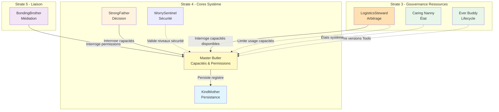

# Master Butler — Index de Navigation

## Contexte

Master Butler est le **Capability & Permission Core** du Miyukini Core System. Il incarne la connaissance de ce qui est possible : quelles capacités existent dans le système, quelles permissions sont définies, et quels droits peuvent être accordés.

Master Butler répond à une question fondamentale : **"Quelles sont les capacités du système, et quelles permissions existent pour y accéder ?"**

**Strate :** 4 (Cores Système)  
**Rôle :** Registre des capacités et permissions  
**Terminologie officielle :** [Miyukini Conceptual References - Glossaire](../../reference/Miyukini%20Conceptual%20References%20-%20Glossaire.md)

---

## Structure de la documentation

### Foundation

Documents fondateurs définissant l'identité et le rôle de Master Butler.

| Document | Description |
|----------|-------------|
| [Documentation Fondatrice](./foundation/Master%20Butler%20-%20Documentation%20Fondatrice.md) | Définition conceptuelle, rôle, positionnement, invariants fondamentaux |

---

### Contracts

Contrats FONDATION normatifs et non négociables.

#### API

| Document | Description |
|----------|-------------|
| [Capability API Contract](./contracts/api/Master%20Butler%20-%20Capability%20API%20Contract.md) | Déclaration et interrogation des capacités |
| [Permission API Contract](./contracts/api/Master%20Butler%20-%20Permission%20API%20Contract.md) | Définition et gestion des permissions |
| [Discovery API Contract](./contracts/api/Master%20Butler%20-%20Discovery%20API%20Contract.md) | API de découverte des capacités et permissions |

#### Registry

| Document | Description |
|----------|-------------|
| [Capability Registry Contract](./contracts/registry/Master%20Butler%20-%20Capability%20Registry%20Contract.md) | Structure et gestion du registre des capacités |
| [Permission Registry Contract](./contracts/registry/Master%20Butler%20-%20Permission%20Registry%20Contract.md) | Structure et gestion du registre des permissions |
| [Association Model Contract](./contracts/registry/Master%20Butler%20-%20Association%20Model%20Contract.md) | Modèle d'association capacités-permissions |

#### Tools

| Document | Description |
|----------|-------------|
| [Tool Governance Contract](./contracts/tools/Master%20Butler%20-%20Tool%20Governance%20Contract.md) | Gouvernance des Tools, déclaration et catalogue |
| [Toolkit Composition Contract](./contracts/tools/Master%20Butler%20-%20Toolkit%20Composition%20Contract.md) | Composition et validation des Toolkits |

#### Integration

| Document | Description |
|----------|-------------|
| [StrongFather Integration Contract](./contracts/integration/Master%20Butler%20-%20StrongFather%20Integration%20Contract.md) | Intégration avec StrongFather pour les décisions |
| [BondingBrother Integration Contract](./contracts/integration/Master%20Butler%20-%20BondingBrother%20Integration%20Contract.md) | Intégration avec BondingBrother pour la médiation |
| [LogisticsSteward Integration Contract](./contracts/integration/Master%20Butler%20-%20LogisticsSteward%20Integration%20Contract.md) | Intégration avec LogisticsSteward pour la gouvernance des ressources |
| [Operator Declaration Contract](./contracts/integration/Master%20Butler%20-%20Operator%20Declaration%20Contract.md) | Déclaration des capacités par les Opérateurs |

#### Boundaries

| Document | Description |
|----------|-------------|
| [Boundary & Scope Contract](./contracts/boundaries/Master%20Butler%20-%20Boundary%20&%20Scope%20Contract.md) | Frontières et périmètre de Master Butler |
| [Authority Limits Contract](./contracts/boundaries/Master%20Butler%20-%20Authority%20Limits%20Contract.md) | Limites d'autorité, ce que Master Butler ne fait pas |

#### Observability

| Document | Description |
|----------|-------------|
| [Audit & Traceability Contract](./contracts/observability/Master%20Butler%20-%20Audit%20&%20Traceability%20Contract.md) | Traçabilité des déclarations et modifications |
| [Observability Contract](./contracts/observability/Master%20Butler%20-%20Observability%20Contract.md) | Métriques et monitoring du registre |

#### Security

| Document | Description |
|----------|-------------|
| [Threat Model Contract](./contracts/security/Master%20Butler%20-%20Threat%20Model%20Contract.md) | Modèle de menaces pour le registre |
| [Access Control Contract](./contracts/security/Master%20Butler%20-%20Access%20Control%20Contract.md) | Contrôle d'accès au registre |

#### Governance

| Document | Description |
|----------|-------------|
| [Invariants & Guarantees](./contracts/governance/Master%20Butler%20-%20Invariants%20&%20Guarantees.md) | Catalogue consolidé des invariants et garanties |
| [Violations & Anti-Patterns](./contracts/governance/Master%20Butler%20-%20Violations%20&%20Anti-Patterns.md) | Violations cataloguées, anti-patterns |

---

### Architecture

Documentation architecturale.

| Document | Description |
|----------|-------------|
| [Architecture & Flows](./architecture/Master%20Butler%20-%20Architecture%20&%20Flows.md) | Architecture conceptuelle, composants, flux |
| [Internal State Machine](./architecture/Master%20Butler%20-%20Internal%20State%20Machine.md) | Machine à états interne du registre |

---

### Implementation

Guides d'implémentation.

| Document | Description |
|----------|-------------|
| [Reference Implementation Guidelines](./implementation/Master%20Butler%20-%20Reference%20Implementation%20Guidelines.md) | Guidelines d'implémentation de référence |
| [Implementation Patterns](./implementation/Master%20Butler%20-%20Implementation%20Patterns.md) | Patterns recommandés |
| [Implementation Prohibitions](./implementation/Master%20Butler%20-%20Implementation%20Prohibitions.md) | Patterns interdits, pièges |

---

### Reference

Documentation de référence et exemples.

| Document | Description |
|----------|-------------|
| [Examples Capabilities](./reference/Master%20Butler%20-%20Examples%20Capabilities.md) | Exemples de déclarations de capacités |
| [Examples Permissions](./reference/Master%20Butler%20-%20Examples%20Permissions.md) | Exemples de définitions de permissions |
| [FAQ & Common Questions](./reference/Master%20Butler%20-%20FAQ%20&%20Common%20Questions.md) | Questions fréquentes |

---

## Invariants clés

| Invariant | Description |
|-----------|-------------|
| **INV-MB-1** | Exhaustivité — Toute capacité existante est recensée dans Master Butler |
| **INV-MB-2** | Non-décision — Master Butler ne prend jamais de décision |
| **INV-MB-3** | Idempotence — Les déclarations de capacités sont idempotentes |
| **INV-MB-4** | Immutabilité des identifiants — Les identifiants de capacités ne changent jamais |
| **INV-MB-5** | Traçabilité complète — Toute modification du registre est tracée |
| **INV-MB-6** | Séparation capacité/permission — Capacités et permissions sont strictement séparées |
| **INV-MB-7** | Pas de logique métier — Master Butler ne contient aucune logique métier |
| **INV-MB-8** | Accessibilité universelle — Master Butler est accessible à tous les composants autorisés |

---

## Interdictions

| Code | Interdiction |
|------|--------------|
| **INTERD-MB-1** | Master Butler ne peut pas décider si une action est autorisée ou refusée |
| **INTERD-MB-2** | Master Butler ne peut pas vérifier les permissions en temps réel |
| **INTERD-MB-3** | Master Butler ne peut pas exécuter d'action fonctionnelle |
| **INTERD-MB-4** | Master Butler ne peut pas stocker de données métier |
| **INTERD-MB-5** | Master Butler ne peut pas gérer les identités |
| **INTERD-MB-6** | Master Butler ne peut pas définir de politiques de décision |
| **INTERD-MB-7** | Master Butler ne peut pas appliquer de contraintes métier |
| **INTERD-MB-8** | Master Butler ne peut pas persister directement |

---

## Relations avec les autres Cores

| Core | Relation |
|------|----------|
| **StrongFather** | Complémentaire — Master Butler expose, StrongFather décide |
| **KindMother** | Support — Master Butler utilise KindMother pour la persistance du registre |
| **BondingBrother** | Interface — Répond aux interrogations pour la traduction des intentions |
| **WorrySentinel** | Sécurité — Validation des niveaux de sécurité pour les Tools |
| **Caring Nanny** | État — Cohérence d'état pour l'utilisation des Tools |
| **Ever Buddy** | Lifecycle — Gestion du cycle de vie des Tools et versions |
| **LogisticsSteward** | Gouvernance — Master Butler expose les capacités, LogisticsSteward limite leur usage |

### Diagramme de relations

---

## Gouvernance des Tools et Toolkits

Master Butler est le **catalogue central** des Tools et Toolkits. Il est responsable de :

| Responsabilité | Description |
|----------------|-------------|
| **Déclarer** | Quels Tools existent dans l'environnement |
| **Lier** | Capability → Tool |
| **Définir les Toolkits** | Quels Tools composent chaque Toolkit |
| **Autoriser** | Qui peut appeler quel Tool/Toolkit |

**Documentation complète :** [Miyukini Conceptual References - Tools et Toolkits](../../reference/Miyukini%20Conceptual%20References%20-%20Tools%20et%20Toolkits.md)

---

## Conformité aux Lois d'Autonomie Système

Master Butler est **entièrement conforme** aux [Lois d'Autonomie Système](../../reference/Miyukini%20Conceptual%20References%20-%20Lois%20Autonomie%20Systeme.md) :

| Loi | Conformité | Note |
|-----|------------|------|
| **LOI-1** | ✅ | Registre local, interrogations locales, aucune dépendance externe |
| **LOI-5** | ✅ | Registre pur de métadonnées légères, pas de workers, consommation à la demande |

---

## Concepts clés

| Concept | Description |
|---------|-------------|
| **Capacité (Capability)** | Pouvoir technique intrinsèque à un composant |
| **Permission** | Droit accordé pour accéder à une capacité |
| **Registre** | Structure centrale contenant capacités et permissions |
| **Déclaration** | Acte d'informer Master Butler des capacités d'un composant |
| **Définition** | Acte de créer une permission dans Master Butler |
| **Contexte de capacité** | Ensemble des capacités/permissions dans une situation donnée |
| **Tool** | Capacité exécutable gouvernée |
| **Toolkit** | Composition officielle de Tools |

---

**Date de création :** 2026-01-27  
**Version :** 1.0  
**Statut :** Index de navigation
