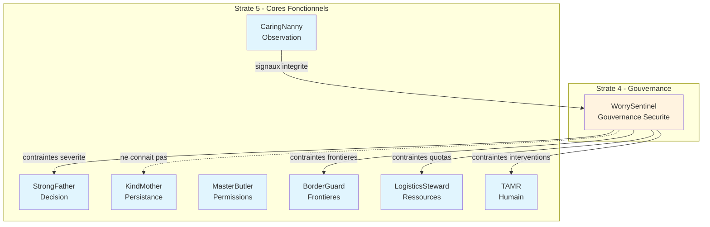

# WorrySentinel — Index de Navigation

## Contexte

WorrySentinel est le **core de gouvernance de sécurité transversale** du Miyukini Core System. Il incarne la capacité conceptuelle du système à définir, maintenir, et faire évoluer les niveaux de sécurité, les états de confiance, et les mécanismes de dégradation progressive.

WorrySentinel représente la **volonté sécuritaire** du système : il détermine quels niveaux de sécurité sont applicables, quels états de confiance sont acceptables, comment la dégradation doit progresser — sans jamais posséder d'autorité sur l'implémentation, l'exécution, ou la persistance.

**Strate :** 4 (Gouvernance de sécurité)  
**Rôle :** Gouvernance transversale des niveaux de sécurité et états de confiance  
**Terminologie officielle :** [Miyukini Conceptual References - Glossaire](../../reference/Miyukini%20Conceptual%20References%20-%20Glossaire.md)

---

## Question fondamentale

> **"Quel est le niveau de sécurité applicable et quel est l'état de confiance du système ?"**

Cette question se décline en :
- Quel niveau de sécurité (0-4) s'applique à ce produit ou composant ?
- Quel est l'état de confiance actuel du système (T0-T4) ?
- Comment le système doit-il dégrader ses capacités selon l'état de confiance ?
- Quelles contraintes les cores fonctionnels doivent-ils respecter ?

---

## Structure de la documentation

### Foundation

Documents fondateurs définissant l'identité et le rôle de WorrySentinel.

| Document | Description |
|----------|-------------|
| [Documentation Fondatrice](./foundation/WorrySentinel%20-%20Documentation%20Fondatrice.md) | Définition conceptuelle, rôle, positionnement, invariants fondamentaux |

---

### Architecture

Documentation architecturale.

| Document | Description |
|----------|-------------|
| [Architecture & Flows](./architecture/WorrySentinel%20-%20Architecture%20&%20Flows.md) | Architecture conceptuelle, composants, flux de gouvernance |
| [Core Interaction Contract](./architecture/WorrySentinel%20-%20Core%20Interaction%20Contract.md) | Modèle d'interaction avec les autres cores |

---

### Contracts

Contrats FONDATION normatifs et non négociables.

#### Governance

| Document | Description |
|----------|-------------|
| [Invariants & Guarantees](./contracts/governance/WorrySentinel%20-%20Invariants%20&%20Guarantees.md) | Catalogue consolidé des invariants INV-WS-1 à INV-WS-8 et INV-GOV-1 à INV-GOV-8 |
| [Violations & Anti-Patterns](./contracts/governance/WorrySentinel%20-%20Violations%20&%20Anti-Patterns.md) | Violations cataloguées, anti-patterns, comportements interdits |

#### Levels

| Document | Description |
|----------|-------------|
| [Security Levels Governance Contract](./contracts/levels/WorrySentinel%20-%20Security%20Levels%20Governance%20Contract.md) | Gouvernance des niveaux de sécurité (0-4), attribution, adaptation |
| [Trust States Governance Contract](./contracts/levels/WorrySentinel%20-%20Trust%20States%20Governance%20Contract.md) | Gouvernance des états de confiance (T0-T4), transitions, règles |

#### Degradation

| Document | Description |
|----------|-------------|
| [Progressive Degradation Contract](./contracts/degradation/WorrySentinel%20-%20Progressive%20Degradation%20Contract.md) | Règles de dégradation progressive, interaction niveaux/états |

#### Integration

| Document | Description |
|----------|-------------|
| [StrongFather Integration Contract](./contracts/integration/WorrySentinel%20-%20StrongFather%20Integration%20Contract.md) | Flux de gouvernance vers StrongFather, sévérité des décisions |
| [CaringNanny Integration Contract](./contracts/integration/WorrySentinel%20-%20CaringNanny%20Integration%20Contract.md) | Flux de signaux d'intégrité, consolidation des anomalies |
| [BorderGuard Integration Contract](./contracts/integration/WorrySentinel%20-%20BorderGuard%20Integration%20Contract.md) | Adaptation des frontières selon les niveaux de sécurité |
| [LogisticsSteward Integration Contract](./contracts/integration/WorrySentinel%20-%20LogisticsSteward%20Integration%20Contract.md) | Supervision des allocations, durcissement des quotas |
| [TAMR Integration Contract](./contracts/integration/WorrySentinel%20-%20TAMR%20Integration%20Contract.md) | Adaptation des interventions humaines selon les états |
| [MiyukiniAdmin Integration Contract](./contracts/integration/WorrySentinel%20-%20MiyukiniAdmin%20Integration%20Contract.md) | Consultation et configuration de la gouvernance |

#### Security

| Document | Description |
|----------|-------------|
| [Threat Model Contract](./contracts/security/WorrySentinel%20-%20Threat%20Model%20Contract.md) | Modèle de menaces pour la gouvernance de sécurité |

---

### Implementation

Guides d'implémentation.

| Document | Description |
|----------|-------------|
| [Reference Implementation Guidelines](./implementation/WorrySentinel%20-%20Reference%20Implementation%20Guidelines.md) | Guidelines d'implémentation de référence |

---

### Reference

Documentation de référence et exemples.

| Document | Description |
|----------|-------------|
| [Vocabulary & Glossary](./reference/WorrySentinel%20-%20Vocabulary%20&%20Glossary.md) | Vocabulaire canonique de WorrySentinel |
| [FAQ & Common Questions](./reference/WorrySentinel%20-%20FAQ%20&%20Common%20Questions.md) | Questions fréquentes |
| [Examples & Use Cases](./reference/WorrySentinel%20-%20Examples%20&%20Use%20Cases.md) | Exemples et cas d'usage |

---

## Position dans la Pyramide Miyukini

```
┌──────────────────────────────────────────┐
│ STRATE 5 — Cores fonctionnels             │
│ StrongFather · KindMother · MasterButler │
│ CaringNanny · EverBuddy · BorderGuard    │
│ TAMR · LogisticsSteward                   │
└──────────────────────────────────────────┘
┌──────────────────────────────────────────┐
│ STRATE 4 — WorrySentinel                  │
│ Gouvernance de sécurité                   │
│ Niveaux, états, dégradation               │
└──────────────────────────────────────────┘
┌──────────────────────────────────────────┐
│ STRATE 3 — Kernel Miyukini               │
│ Identité, Horloge, Logger, Sondes         │
└──────────────────────────────────────────┘
```

**Règle architecturale :** WorrySentinel gouverne les cores fonctionnels de la Strate 5, mais ne les remplace jamais. Il contraint leur comportement selon les niveaux de sécurité et les états de confiance.

---

## Invariants clés

| Invariant | Description |
|-----------|-------------|
| **INV-WS-1** | Aucune autorité sur l'implémentation — WorrySentinel ne code jamais de contrôle |
| **INV-WS-2** | Aucune autorité sur l'exécution — WorrySentinel ne lance jamais de vérification |
| **INV-WS-3** | Aucune autorité sur la persistance — WorrySentinel ne persiste jamais |
| **INV-WS-4** | Aucune modification d'état — WorrySentinel gouverne, ne modifie pas |
| **INV-WS-5** | Aucune logique temporelle technique — Pas de gestion du temps |
| **INV-WS-6** | Zero-trust — Aucune confiance présupposée |
| **INV-WS-7** | Gouvernance explicite — Toutes les règles sont déclaratives |
| **INV-WS-8** | Traçabilité complète — Toute décision est traçable |

---

## Interdictions

| Code | Interdiction |
|------|--------------|
| **INTERD-WS-1** | WorrySentinel ne peut pas implémenter de contrôle de sécurité |
| **INTERD-WS-2** | WorrySentinel ne peut pas exécuter de vérification |
| **INTERD-WS-3** | WorrySentinel ne peut pas persister de données |
| **INTERD-WS-4** | WorrySentinel ne peut pas modifier l'état du système |
| **INTERD-WS-5** | WorrySentinel ne peut pas gérer le temps technique |
| **INTERD-WS-6** | WorrySentinel ne peut pas prendre de décision spécifique |
| **INTERD-WS-7** | WorrySentinel ne peut pas définir de mécanisme cryptographique |
| **INTERD-WS-8** | WorrySentinel ne peut pas contourner les invariants FONDATION |

---

## Niveaux de sécurité

| Niveau | Description |
|--------|-------------|
| **0 — Public** | Données publiques, aucune contrainte de sécurité stricte |
| **1 — Standard** | Données standard, contraintes de sécurité de base |
| **2 — Sensitive** | Données sensibles, contraintes de sécurité renforcées |
| **3 — Critical** | Données critiques, contraintes de sécurité strictes |
| **4 — Hardened** | Sécurité maximale, contraintes de sécurité maximales |

---

## États de confiance

| État | Description |
|------|-------------|
| **T0 — Normal** | Système sain, toutes les capacités disponibles |
| **T1 — Instable** | Anomalie détectée, log renforcé, aucun blocage |
| **T2 — Dégradé** | Incohérence persistante, certaines capacités désactivées |
| **T3 — Restreint** | Suspicion forte, gel des produits non essentiels |
| **T4 — Bloqué** | Intégrité rompue, uniquement diagnostics |

---

## États globaux de l'écosystème

| État | Effet | Correspondance T0-T4 |
|------|-------|---------------------|
| Nominal | Fonctionnement normal | T0 |
| Doute | + contrôles, + traces | T1 |
| Suspect | Fonctions sensibles bridées | T2 |
| Critique | Lecture seule / blocage partiel | T3 |
| Compromis | Blocage total | T4 |

---

## Relations avec les autres Cores

| Core | Relation |
|------|----------|
| **StrongFather** | Complémentaire — WorrySentinel gouverne les niveaux, StrongFather applique les politiques |
| **KindMother** | Indépendante — WorrySentinel ne connaît pas KindMother, pas d'accès aux données |
| **CaringNanny** | Flux montant — CaringNanny consolide les signaux qui influencent les états de confiance |
| **BorderGuard** | Contrainte — WorrySentinel impose les niveaux de sécurité aux frontières |
| **LogisticsSteward** | Supervision — WorrySentinel peut durcir les règles d'arbitrage |
| **TAMR** | Complémentaire — WorrySentinel définit les niveaux, TAMR adapte les interventions humaines |
| **MiyukiniAdmin** | Configuration — MiyukiniAdmin consulte et configure la gouvernance |

### Diagramme de relations



---

## Flux de gouvernance

### Flux descendant (gouvernance)

WorrySentinel impose des contraintes verticales sur tous les cores fonctionnels :

```
WorrySentinel
   ↓ impose contraintes
StrongFather → sévérité des décisions
MasterButler → permissions actives
BorderGuard → durcissement I/O
LogisticsSteward → durcissement quotas et priorités
TAMR → droits humains
Kernel → fréquence sondes
```

### Flux montant (observation)

WorrySentinel observe et corrèle les signaux remontant des cores :

```
Kernel → signaux (clock, id, trace)
BorderGuard → anomalies I/O
StrongFather → décisions refusées
KindMother → incohérences détectées
BondingBrother → comportements produits
LogisticsSteward → dérives allocation ressources
   ↓
WorrySentinel observe, corrèle, déclare un état
```

---

## Conformité aux Lois d'Autonomie Système

WorrySentinel est **critique pour l'autonomie** selon les [Lois d'Autonomie Système](../../reference/Miyukini%20Conceptual%20References%20-%20Lois%20Autonomie%20Systeme.md) :

| Loi | Conformité | Note |
|-----|------------|------|
| **LOI-1** | Rôle critique | Gouvernance locale, chargée au démarrage |
| **LOI-2** | Conformité totale | États de confiance permettent de gérer l'isolement |
| **LOI-3** | Conformité totale | Niveaux de sécurité locaux et souverains |
| **LOI-5** | Conformité totale | Core conceptuel léger, sans exécution |
| **LOI-6** | Rôle critique | Contrôle des niveaux de sécurité pour échanges fédérés |

---

## Concepts clés

| Concept | Description |
|---------|-------------|
| **Niveau de sécurité** | Profil de risque (0-4) attribué à un produit ou composant |
| **État de confiance** | État d'intégrité du système (T0-T4) |
| **Dégradation progressive** | Réduction contrôlée des capacités selon l'état de confiance |
| **Gouvernance explicite** | Toutes les règles sont déclaratives et traçables |
| **Pression verticale** | WorrySentinel contraint sans remplacer les cores |
| **Transition d'état** | Changement d'état de confiance selon les signaux consolidés |

---

## Phrase fondatrice

> **WorrySentinel est l'autorité de gouvernance de sécurité qui définit les niveaux de sécurité, gouverne les états de confiance, et orchestre la dégradation progressive, sans jamais posséder d'autorité sur l'implémentation, l'exécution, ou la persistance.**

---

## Documents de référence

- [Miyukini Conceptual References - Security Levels](../../reference/Miyukini%20Conceptual%20References%20-%20Security%20Levels.md)
- [Miyukini Conceptual References - Integrity Degradation System](../../reference/Miyukini%20Conceptual%20References%20-%20Integrity%20Degradation%20System.md)
- [Miyukini Conceptual References - Pyramide Architecture Complete](../../reference/Miyukini%20Conceptual%20References%20-%20Pyramide%20Architecture%20Complete.md)
- [Miyukini Conceptual References - Lois Autonomie Systeme](../../reference/Miyukini%20Conceptual%20References%20-%20Lois%20Autonomie%20Systeme.md)
- [Miyukini Conceptual References - Doctrine Securite Fondamentale](../../reference/Miyukini%20Conceptual%20References%20-%20Doctrine%20Securite%20Fondamentale.md)

---

**Date de création :** 2026-01-28  
**Version :** 1.0.0  
**Statut :** Index de navigation
