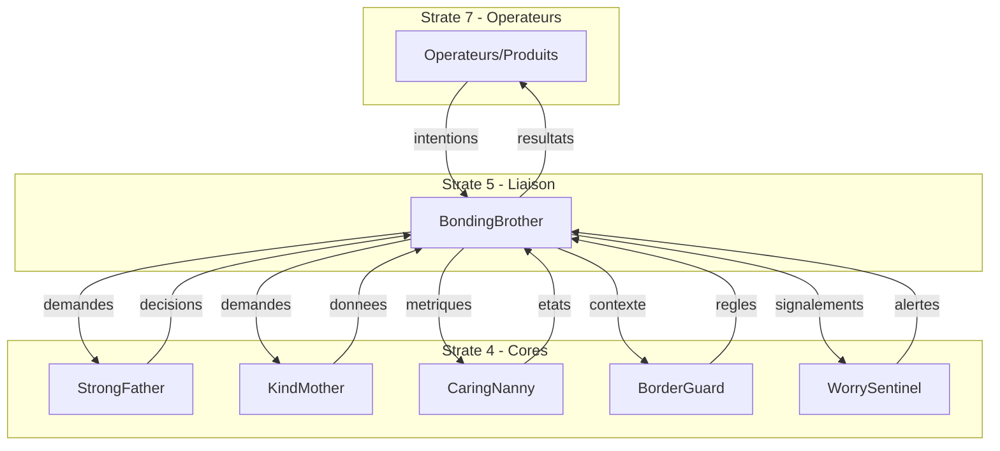

# BondingBrother — Index de Navigation

## Contexte

BondingBrother est la **strate de liaison gouvernée** du Miyukini Core System. Il incarne la capacité conceptuelle du système à permettre aux entités hétérogènes de communiquer sans jamais se comprendre implicitement.

**BondingBrother n'est pas un Core à proprement parler**, mais il détient le même niveau d'importance et de criticité que les Cores. Tous les Cores dépendent de lui pour communiquer avec les Toolkits et les Services. Il conserve sa fonction de passerelle (strate 5) tout en étant classé avec les Cores (strate 4) en raison de son rôle essentiel dans l'architecture.

BondingBrother représente le **frère aîné** de la famille Miyukini : il ne détient aucune autorité, mais il connaît les règles de la famille, il traduit entre les langages des produits et des autorités, il garantit que chaque interaction respecte l'ordre familial.

**Classification :** Core de niveau 4 (avec les autres Cores) / Fonction de strate 5 (passerelle)  
**Rôle :** Médiation, traduction, filtrage entre produits et autorités  
**Terminologie officielle :** [Miyukini Conceptual References - Glossaire](..//..//miyukini-webway-system//reference//_index.md)

---

## Question fondamentale

> **"Comment deux entités qui n'ont pas le droit de se connaître peuvent-elles échanger ?"**

Cette question se décline en :
- Comment traduire les intentions des produits pour les autorités ?
- Comment filtrer les réponses des autorités pour les produits ?
- Comment garantir la traçabilité de chaque interaction ?
- Comment fonctionner même en mode offline ?

---

## Structure de la documentation

### Foundation

Documents fondateurs définissant l'identité et le rôle de BondingBrother.

| Document | Description |
|----------|-------------|
| [Documentation Fondatrice](./foundation/BondingBrother%20-%20Documentation%20Fondatrice.md) | Définition conceptuelle, rôle, positionnement, invariants fondamentaux |

---

### Architecture

Documentation architecturale.

| Document | Description |
|----------|-------------|
| [Architecture & Flows](./architecture/BondingBrother%20-%20Architecture%20&%20Flows.md) | Architecture en couches, composants, flux de données, rôles internes |
| [Core Interaction Contract](./architecture/BondingBrother%20-%20Core%20Interaction%20Contract.md) | Modèle d'interaction avec les autres cores |

---

### Contracts

Contrats FONDATION normatifs et non négociables.

#### Intent

| Document | Description |
|----------|-------------|
| [Intent Model Contract](./contracts/intent/BondingBrother%20-%20Intent%20Model%20Contract.md) | Structure, types et cycle de vie des intentions |
| [Translation Contract](./contracts/intent/BondingBrother%20-%20Translation%20Contract.md) | Règles de traduction intention ↔ demande |
| [Filtering & Projection Contract](./contracts/intent/BondingBrother%20-%20Filtering%20&%20Projection%20Contract.md) | Règles de filtrage et projection des données |

#### Flows

| Document | Description |
|----------|-------------|
| [Bilateral Flow Contract](./contracts/flows/BondingBrother%20-%20Bilateral%20Flow%20Contract.md) | Vue d'ensemble des flux bidirectionnels |
| [Product-to-Ecosystem Flow](./contracts/flows/BondingBrother%20-%20Product-to-Ecosystem%20Flow.md) | Flux détaillé Produit → Écosystème |
| [Ecosystem-to-Product Flow](./contracts/flows/BondingBrother%20-%20Ecosystem-to-Product%20Flow.md) | Flux détaillé Écosystème → Produit |

#### Authority

| Document | Description |
|----------|-------------|
| [Authority Delegation Contract](./contracts/authority/BondingBrother%20-%20Authority%20Delegation%20Contract.md) | Règles de délégation aux autorités |

#### Integration

| Document | Description |
|----------|-------------|
| [KindMother Integration Contract](./contracts/integration/BondingBrother%20-%20KindMother%20Integration%20Contract.md) | Interface et protocole avec KindMother |
| [StrongFather Integration Contract](./contracts/integration/BondingBrother%20-%20StrongFather%20Integration%20Contract.md) | Interface et protocole avec StrongFather |

#### Product

| Document | Description |
|----------|-------------|
| [Product Interface Contract](./contracts/product/BondingBrother%20-%20Product%20Interface%20Contract.md) | Contrat d'interface stable pour les produits |
| [Product Adaptation Rules](./contracts/product/BondingBrother%20-%20Product%20Adaptation%20Rules.md) | Règles d'adaptation des produits à BB |
| [Extension & Specialization Contract](./contracts/product/BondingBrother%20-%20Extension%20&%20Specialization%20Contract.md) | Mécanisme d'extension par spécialisation |

#### Offline

| Document | Description |
|----------|-------------|
| [Offline & Deferred Authority Contract](./contracts/offline/BondingBrother%20-%20Offline%20&%20Deferred%20Authority%20Contract.md) | Mode déconnecté et autorité différée |
| [Journaling Contract](./contracts/offline/BondingBrother%20-%20Journaling%20Contract.md) | Journalisation systématique des intentions |
| [Sync & Reconnection Contract](./contracts/offline/BondingBrother%20-%20Sync%20&%20Reconnection%20Contract.md) | Synchronisation à la reconnexion |

#### Governance

| Document | Description |
|----------|-------------|
| [Audit & Traceability Contract](./contracts/governance/BondingBrother%20-%20Audit%20&%20Traceability%20Contract.md) | Auditabilité complète des interactions |
| [Responsibility Model Contract](./contracts/governance/BondingBrother%20-%20Responsibility%20Model%20Contract.md) | Attribution des responsabilités |
| [Invariants & Guarantees](./contracts/governance/BondingBrother%20-%20Invariants%20&%20Guarantees.md) | Invariants techniques non négociables |
| [Violations & Anti-Patterns](./contracts/governance/BondingBrother%20-%20Violations%20&%20Anti-Patterns.md) | Ce que BB ne doit JAMAIS faire |

#### Error

| Document | Description |
|----------|-------------|
| [Error & Rejection Model](./contracts/error/BondingBrother%20-%20Error%20&%20Rejection%20Model.md) | Modèle de gestion des erreurs et rejets |

#### Security

| Document | Description |
|----------|-------------|
| [Security & Threat Model Contract](./contracts/security/BondingBrother%20-%20Security%20&%20Threat%20Model%20Contract.md) | Modèle de menace et contre-mesures |

#### Performance

| Document | Description |
|----------|-------------|
| [Performance & Scalability Contract](./contracts/performance/BondingBrother%20-%20Performance%20&%20Scalability%20Contract.md) | Contraintes de performance |

#### Evolution

| Document | Description |
|----------|-------------|
| [Versioning & Evolution Contract](./contracts/evolution/BondingBrother%20-%20Versioning%20&%20Evolution%20Contract.md) | Règles de versionnement |
| [Migration & Compatibility Contract](./contracts/evolution/BondingBrother%20-%20Migration%20&%20Compatibility%20Contract.md) | Règles de migration et rétrocompatibilité |

#### Testing

| Document | Description |
|----------|-------------|
| [Testing & Validation Contract](./contracts/testing/BondingBrother%20-%20Testing%20&%20Validation%20Contract.md) | Contrat de test et validation |

---

### Implementation

Guides d'implémentation.

| Document | Description |
|----------|-------------|
| [Reference Implementation Guidelines](./implementation/BondingBrother%20-%20Reference%20Implementation%20Guidelines.md) | Guidelines d'implémentation de référence |

---

### Reference

Documentation de référence et exemples.

| Document | Description |
|----------|-------------|
| [Vocabulary & Glossary](./reference/BondingBrother%20-%20Vocabulary%20&%20Glossary.md) | Vocabulaire canonique de BondingBrother |
| [FAQ & Common Questions](./reference/BondingBrother%20-%20FAQ%20&%20Common%20Questions.md) | Questions fréquentes |
| [Examples & Use Cases](./reference/BondingBrother%20-%20Examples%20&%20Use%20Cases.md) | Exemples et cas d'usage |

---

## Invariants clés

| Invariant | Description |
|-----------|-------------|
| **INV-BB-1** | BondingBrother ne devient jamais une autorité |
| **INV-BB-2** | BondingBrother n'exécute jamais |
| **INV-BB-3** | BondingBrother ne stocke jamais la vérité |
| **INV-BB-4** | BondingBrother ne permet jamais de contourner les autorités |
| **INV-BB-5** | BondingBrother ne modifie jamais les décisions |
| **INV-BB-6** | BondingBrother ne cache jamais l'origine |
| **INV-BB-7** | BondingBrother traduit, filtre, transmet — jamais plus |

---

## Interdictions

| Code | Interdiction |
|------|--------------|
| **INTERD-BB-1** | BondingBrother ne peut pas décider à la place d'une autorité |
| **INTERD-BB-2** | BondingBrother ne peut pas persister d'état métier |
| **INTERD-BB-3** | BondingBrother ne peut pas enrichir les intentions avec de la logique métier |
| **INTERD-BB-4** | BondingBrother ne peut pas modifier les décisions des autorités |
| **INTERD-BB-5** | BondingBrother ne peut pas exposer les détails internes des autorités |
| **INTERD-BB-6** | BondingBrother ne peut pas cacher l'origine des intentions |

---

## Relations avec les autres Cores

| Core | Relation |
|------|----------|
| **StrongFather** | Délégation — BB transmet les demandes de décision, reçoit les mandats |
| **KindMother** | Délégation — BB transmet les demandes de données, reçoit les résultats |
| **CaringNanny** | Observation — BB expose ses métriques, reçoit les alertes d'état |
| **MasterButler** | Découverte — BB interroge le registre des capacités |
| **BorderGuard** | Contexte — BB reçoit les règles de frontière à appliquer |
| **WorrySentinel** | Sécurité — BB signale les anomalies, adapte son filtrage |

### Diagramme de relations

---

## Conformité aux Lois d'Autonomie Système

BondingBrother est **stratégique pour la fédération** selon les [Lois d'Autonomie Système](..//..//miyukini-webway-system//reference//_index.md) :

| Loi | Conformité | Note |
|-----|------------|------|
| **LOI-1** | ✅ | Mode offline avec buffer des intentions |
| **LOI-2** | ✅ | Isolement accepté comme état normal |
| **LOI-3** | ✅ | Intentions buffées localement souveraines |
| **LOI-4** | ✅ | Horloges logiques pour échanges fédérés |
| **LOI-5** | ✅ | Médiateur léger sans état massif |
| **LOI-6** | ✅ Rôle stratégique | Pont de synchronisation fédération |

---

## Concepts clés

| Concept | Description |
|---------|-------------|
| **Intention** | Déclaration de volonté d'un produit, pas une instruction |
| **Demande** | Intention traduite dans le vocabulaire de l'autorité |
| **Résultat** | Réponse de l'autorité traduite pour le produit |
| **Traduction** | Transformation préservant la sémantique |
| **Filtrage** | Suppression des informations non autorisées |
| **Délégation** | Transmission à une autorité pour décision |
| **Journalisation** | Enregistrement traçable de toute interaction |

---

## Phrase fondatrice

> **BondingBrother est l'interface fraternelle standard qui relie les produits autonomes à l'écosystème autoritaire, traduisant les intentions en demandes et les réponses en résultats, sans jamais devenir une autorité lui-même.**

---

## Documents de référence

- [Miyukini Conceptual References - Glossaire](..//..//miyukini-webway-system//reference//_index.md)
- [Miyukini Conceptual References - Lois Autonomie Systeme](..//..//miyukini-webway-system//reference//_index.md)
- [Miyukini Conceptual References - Pyramide Architecture Complete](..//..//miyukini-webway-system//reference//_index.md)
- [Miyukini Conceptual References - Connexion Inter-COG](..//..//miyukini-webway-system//reference//_index.md)

---

## Gel et Versionnement

| Document | Description |
|----------|-------------|
| [Gel et Versionnement v2.0.0](./BondingBrother%20-%20Gel%20et%20Versionnement%20v2.0.0.md) | Acte de gel officiel de la documentation v2.0.0 |
| [Audit Phase 3 Verification](_index.md) | Audit de vérification Phase 3 v2.0.0 |

---

**Date de création :** 2026-01-28  
**Version :** 2.0.0  
**Statut :** GELÉ — Documentation de référence

